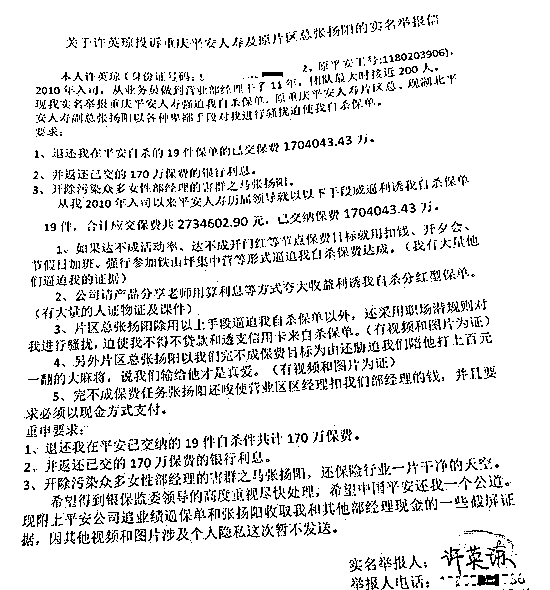
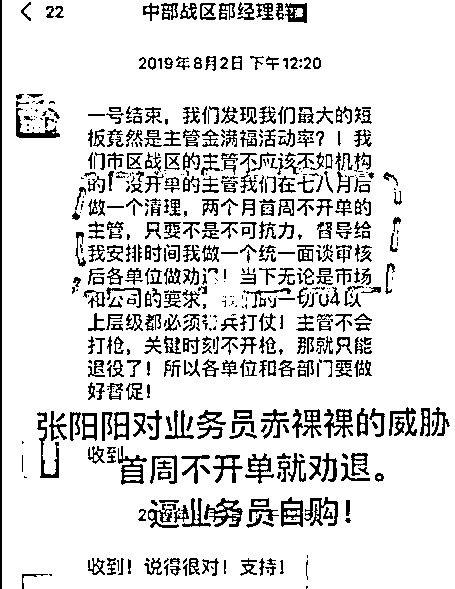
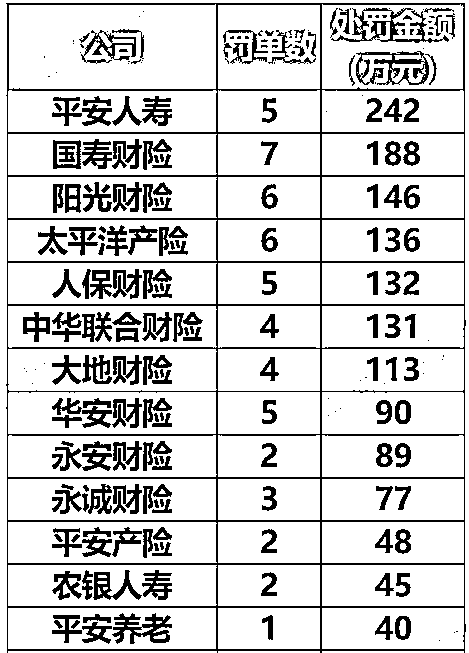

# 被员工实名举报，中国平安回应

> 原文：[`mp.weixin.qq.com/s?__biz=MzIyMDYwMTk0Mw==&mid=2247519506&idx=3&sn=fd28097fbb1e3ae563f6b7481d96af61&chksm=97cb462aa0bccf3c2934995f6a9a46bc74efc6c4ac9de0adfa6ad450b164b04db58d03c91ab7&scene=27#wechat_redirect`](http://mp.weixin.qq.com/s?__biz=MzIyMDYwMTk0Mw==&mid=2247519506&idx=3&sn=fd28097fbb1e3ae563f6b7481d96af61&chksm=97cb462aa0bccf3c2934995f6a9a46bc74efc6c4ac9de0adfa6ad450b164b04db58d03c91ab7&scene=27#wechat_redirect)

昨天，#中国平安员工实名举报公司业绩造假#登上微博热搜，一位自称许英琼的代理人举报重庆平安人寿片区总张扬阳迫使员工购买“自杀单”（注：指业务员为完成业绩自己购买保险，也叫“自保件”），且购买“自杀单”的资金部分来源于平安银行的“白领贷”。

23 日，中国平安人寿回应称，公司高度重视网传代理人举报内容，已第一时间成立专项工作小组，目前正在进行核查，并积极和当事人进行沟通。

但据许英琼本人回应，平安方面称调查已结束，仅核实了张扬阳打麻将的情况属实，其他事情存在证据不足的情况。 

[`v.qq.com/iframe/preview.html?width=500&height=375&auto=0&vid=b3270rhsmx7`](https://v.qq.com/iframe/preview.html?width=500&height=375&auto=0&vid=b3270rhsmx7)

视频来源：潇湘晨报

平安员工实名举报业绩造假

近日，一位自称许英琼，工号 1180203906 的平安人寿保险代理人在网络上发布视频实名举报重庆平安人寿存在违规行为，尤其是他们的片区总张扬阳。许女士称，重庆平安人寿迫使自己购买了 19 件“自杀单”，合计保费达 273 万元。她还称，在该片区像许女士这样被迫购买“自杀单”的员工不止她一个，像她的业务主管们更是购买了五六十件“自杀单”，最过分的时候一天会有四、五百件的“自杀单”业务。

观察者网注意到，这位许英琼女士从今年 5 月 24 日就在抖音以“某保险公司营业部经理”的身份上传了自己向银监会实名举报的视频，并称遭到公司威胁。根据这份文件，许女士于 2010 年入职平安人寿，历届领导无不要求她购买“自杀单”，目前自己交纳的保费已达 170 万。

而且，这些保单是许女士用贷款和透支信用卡的方式购买的，其中部分资金来源于平安银行的“白领贷”，甚至还有“循环贷”的方式，金额在 100 万元以上。不仅如此，部分高管为了购买“自杀单”不得不抵押房子、车子，最终落得资不抵债，许女士自己也负债上百万元。

举报信还称，公司会用扣钱、开夕会、节假日加班、强行参加铁山坪集中营等形式逼迫自己购买“自杀单”，除了强迫，还会用算利息夸大收益的方式利诱自己购买“自杀单”。

许英琼的举报信（上）和曝光重庆平安片区张总强迫她们买保险的证据视频截图

许女士在视频中称，举报后自己不断地收到各种奇怪的电话和信息，还有自称是平安领导的人打电话给她，要求她撤下视频，不过许英琼表示会把举报坚持到底。

中国平安：正在进行核查

8 月 23 日，许英琼的举报视频冲上微博热搜。截至发稿，话题#中国平安员工实名举报公司业绩造假#的阅读量已达 8500 万。

当晚，中国平安在其官方微博上回应了此事称：

关于近日网传重庆代理人举报事件，中国平安高度重视举报内容，旗下平安人寿已第一时间成立专项工作小组，目前正在进行核查，并积极和当事人进行沟通。公司在保险经营、业务营销、代理人管理、客户权益保护等方面，有严格的管理制度和规定，并始终把守法经营、合规经营放在首位，确保代理人的权益得到充分保障。公司欢迎社会各界监督，举报热线电话 0755-22625145，廉政信访举报邮箱：lzxfjb@pingan.com。

观察者网也就此事询问了中国平安，平安方面表示非常重视此事，已成为他们这一周来的重点工作内容。

另据许英琼个人抖音账号上的新视频，平安人寿总部方面已经完成了调查，表示许英琼举报的张某打麻将的事实属实，其他事情则存在证据不足的情况。 

平安人寿多次遭到处罚

观察者网在查阅许英琼发布的视频时注意到，平安人寿近期屡次遭到点名处罚。

据《中国银行保险报》公布的 7 月保险业处罚情况，当月有 41 家保险公司被处以罚款，共计 2036.5 万元。其中，最大的一张罚单由北京银保监局开出：**平安人寿因财务、业务数据不真实被处以 100 万元罚款**。

而在当月的统计中，平安人寿也是被处以罚款最多的企业，其一家的被处罚的金额占了总罚金额的 10%以上。

另据蓝鲸财经报道，今年 7 月 5 日，银保监会人身险部发布关于《关于加强规范管理促进人身保险公司年度业务平稳发展的通知》落实情况的通报。其中平安人寿全国投诉举报案件多发频发，销售误导引发的操作风险突出，案件风险有所抬头；中国人寿、平安人寿、太保寿险多地分公司出现虚列费用、虚构中介业务等违法违规问题。

除此之外，在福建银保监局公布的 2021 年二季度银行保险消费投诉情况和深圳银保监局公布的 2021 年上半年保险消费投诉情况中，平安人寿在人身保险公司投诉量里“高居榜首”。就在 8 月 23 日，上海银保监局还就平安人寿上海杨浦闸殷路营销服务部存在给予保险合同以外利益的行为，责令平安人寿上海杨浦闸殷路营销服务部改正，并处 10 万元罚款。

许英琼举报的“自保件”现象堪称行业顽疾，业内甚至有 “招代理人就是招客户”的说法。针对这种现象，银保监会在 4 月发布《关于深入开展人身保险市场乱象治理专项工作的通知》，其中便提到“是否存在强迫从业人员购买保险、通过即买即卖、即买即借、循环投保虚增保费并套取费用”，以及“对信访投诉、自保件、极短期退保率、营销员业务品质等是否持续跟踪分析、进行风险评估”。

北京市在 8 月 3 日印发《关于规范销售人员自保件和互保件管理的通知（征求意见稿）》，要求禁止保险机构以购买保险产品作为销售人员转正或入司的条件，禁止强迫或者诱使销售人员为达成业务考核指标而购买保险。保险机构不得允许自保件和互保件参与任何形式的业绩考核和业务竞赛。

来源：观察者网、@潇湘晨报

← 向右滑动与灰产圈互动交流 →

