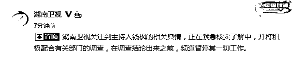
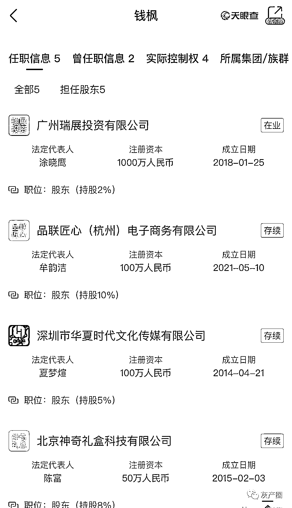

# 钱枫被曝性侵，商业版图涉投资、餐饮、经纪公司等

> 原文：[`mp.weixin.qq.com/s?__biz=MzIyMDYwMTk0Mw==&mid=2247519506&idx=4&sn=03cef318c4af87a9805840aed9703ee0&chksm=97cb462aa0bccf3c21e1fdd639b9ef6c66104a2daf3da35e3c2f8835b17ed00e7bdd3ec9ce8f&scene=27#wechat_redirect`](http://mp.weixin.qq.com/s?__biz=MzIyMDYwMTk0Mw==&mid=2247519506&idx=4&sn=03cef318c4af87a9805840aed9703ee0&chksm=97cb462aa0bccf3c21e1fdd639b9ef6c66104a2daf3da35e3c2f8835b17ed00e7bdd3ec9ce8f&scene=27#wechat_redirect)

三言财经 8 月 24 日消息，一名网名为“小艺”的网友自曝曾于两年前被湖南卫视主持人钱枫强奸。

小艺称，2018 年，自己受邀参加湖南卫视天天向上节目组一期录制工作。节目录制完后，收到钱枫想加好友的申请。于是此后双方开始在线上交流，并且钱枫曾多次约其出来见面。

2019 年 2 月 14 日，小艺与钱枫第一次在线下见面吃饭。当晚，钱枫劝小艺喝了很多酒，晚饭后小艺已经意识模糊，事后回忆称疑似酒中被下药。

第二天，小艺发现自己躺在钱枫住处，并被强奸。通过联系事发当晚的网约车司机以及查看钱枫小区监控发现，钱枫趁小艺意识不清，将其强行拖回家。 

此后，小艺称钱枫曾试图通过打钱以及谈恋爱等手段压下此事，但自己选择了直接报警。不过，警方传唤做笔录后，未予立案，此事没了下文。 

目前，湖南卫视官微发文称，已经注意到有关主持人钱枫的舆情，将积极配合调查，并且调查结果出来之前暂停频道一切工作。 

据天眼查显示，钱枫参股公司有深圳市华夏时代文化传媒有限公司、上海金宝廷餐饮管理有限公司等，涉及企业投资、零售、餐饮等多个行业。据悉，深圳市华夏时代文化传媒有限公司为钱枫经纪公司。

深圳市华夏时代文化传媒有限公司成立于 2014 年 4 月，注册资本 100 万人民币，法定代表人为夏梦煊，股东信息显示，钱枫持有该公司 5%股份为最小股东。深圳市华夏时代文化传媒有限公司 2019 年度报告显示，该公司参保人数为 10，2020 年度报告显示，参保人数为 0 人。

上海金宝廷餐饮管理有限公司成立于 2015 年 5 月，注册资本 10 万人民币，法定代表人为韩立，经营范围为餐饮企业管理（不得从事食品生产经营）。股东信息显示，钱枫持股 30%为第二大股东。该公司 2020 年度报告显示，企业经营状态为停业。

此外，钱枫间接持股公司 8 家，其中湖南爱豆有好货新媒体有限公司已于 2021 年 2 月被列入经营异常，此外，钱枫间接持股的爱豆优选（北京）供应链管理有限公司简易注销，公告期为 2021 年 07 月 26 日-2021 年 08 月 15 日 。

来源：三言财经

← 向右滑动与灰产圈互动交流 →

