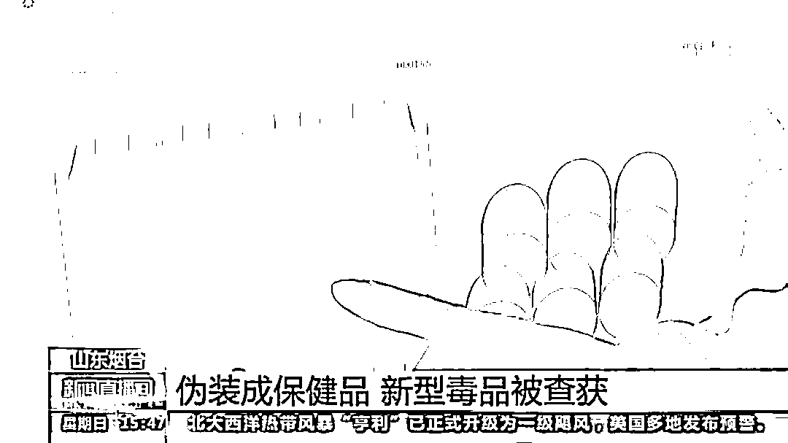
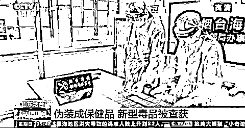
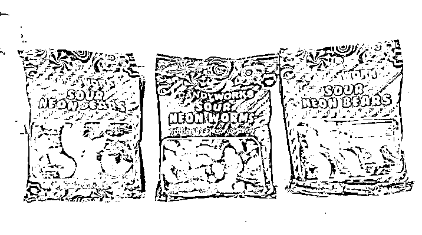
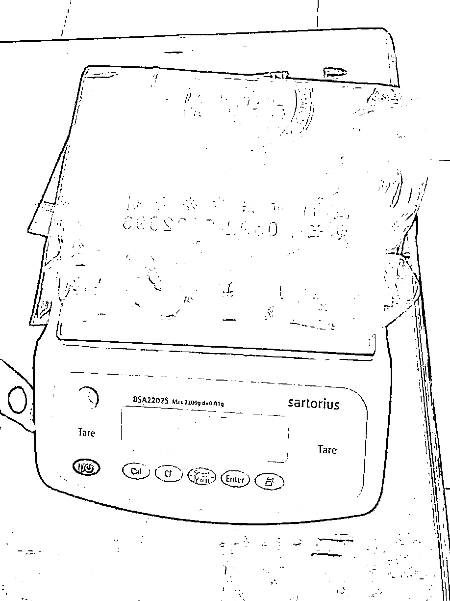
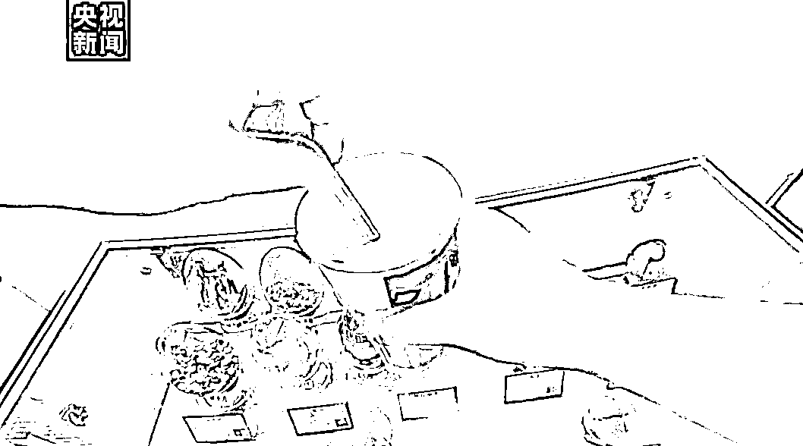
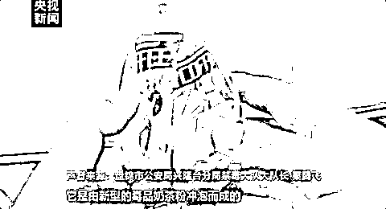
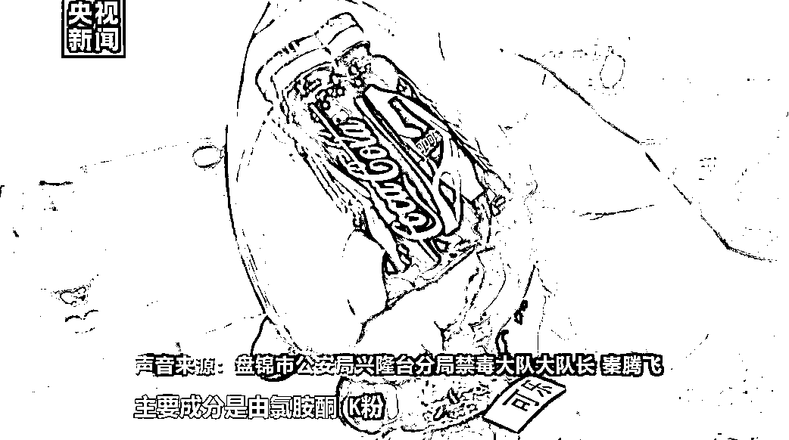

# 警惕！警惕！警惕！

> 原文：[`mp.weixin.qq.com/s?__biz=MzIyMDYwMTk0Mw==&mid=2247519506&idx=5&sn=fe93538b2722c31cbf37033d186326a7&chksm=97cb462aa0bccf3c66805a93dd0c7731bd8cbc07c913dff9461826f6270fba9105ae99f41cfd&scene=27#wechat_redirect`](http://mp.weixin.qq.com/s?__biz=MzIyMDYwMTk0Mw==&mid=2247519506&idx=5&sn=fe93538b2722c31cbf37033d186326a7&chksm=97cb462aa0bccf3c66805a93dd0c7731bd8cbc07c913dff9461826f6270fba9105ae99f41cfd&scene=27#wechat_redirect)

“跳跳糖”“保健品”“可乐” 

新型毒品变化多端 

让人防不胜防

近日，山东烟台海关 

就破获了一起

# 新型毒品伪报为“保健品”的案件

# **伪装成“保健品”**

# **新型毒品被海关查获**

今年 7 月 1 日起 

我国新列管了一批包括依替唑仑等

在内的第三代新型毒品

几天前，山东烟台就查获了

这类毒品 510 片

**这批药品入境时被伪报为“保健品”**

**海关对入境邮件进行现场监管查验时**

**发现其 CT 机检图像异常**

**显示邮包内装了很多整体排列的**

**颗粒状的物体**

随后海关人员检查发现 

包裹里没有保健品

反而有很多剥除外包装的药品

经清点，邮包内共有

依替唑仑 390 片、三唑仑 120 片

这些都是国家管制的精神药品 

长期服用可产生依赖性

相比于传统毒品和合成毒品 

这些新精神活性物质

又被称为第三代毒品

具有相似或更强的

兴奋、致幻及麻醉等效果

对身体的危害性也更大

目前，海关已暂扣这批新型毒品

并将依法进行下一步处理

[`v.qq.com/iframe/preview.html?width=500&height=375&auto=0&vid=a3270a44qrd`](https://v.qq.com/iframe/preview.html?width=500&height=375&auto=0&vid=a3270a44qrd)

**除了“保健品”外**

**如今的许多新型毒品**

**还添加了零食、饮料等“高级伪装”**

**↓↓↓**

**看着挺可爱的软糖**

**竟是毒品！**

看到这张图

你觉得这是什么？

普通糖果？小零食？ 

其实这是一种含四氢大麻酚的

“毒品软糖”

今年 2 月

厦门海关联合地方公安

破获一起寄递渠道

涉嫌走私毒品案

查获含大麻成分的“软糖”509 克

该进境包裹一开始被 

申报为“生活用品”

系犯罪嫌疑人陈某某

通过网络从境外购买

企图通过邮寄方式走私入境 

海关提醒：四氢大麻酚是大麻中的

主要精神活性物质

具有成瘾性，一旦食用相当于吸毒

携带或邮寄含有该物质的食品

均属违法行为

# **伪装成奶茶、可乐等饮料的****毒品**

下面这个奶茶 

看着跟平时喝的奶茶

似乎没什么两样

但它是由新型毒品“奶茶粉”

冲泡而成 

其主要成分是氯胺酮和摇头丸

‍下面这款“可乐”看上去很精致 

却无比危险

它跟平时喝的可乐完全不一样

其主要成分是

氯胺酮、K 粉、冰毒等 

吸食微量就会致人产生幻觉

**提高警惕，拒绝毒品！**

来源：人民日报,巴蜀反诈

← 向右滑动与灰产圈互动交流 →

