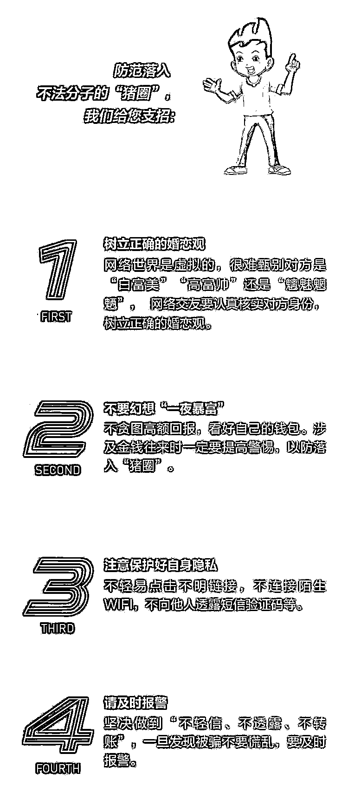

# 冒充美女引诱投资，多人上当！鲁湘两地警方联手打掉“杀猪盘”诈骗团伙

> 原文：[`mp.weixin.qq.com/s?__biz=MzIyMDYwMTk0Mw==&mid=2247519573&idx=4&sn=35f985ab5a8fab723c4be50945e84e59&chksm=97cb466da0bccf7bad1fdfebf525c72475601a7dde09b7be88187bf3f60a0b681b494cddffb0&scene=27#wechat_redirect`](http://mp.weixin.qq.com/s?__biz=MzIyMDYwMTk0Mw==&mid=2247519573&idx=4&sn=35f985ab5a8fab723c4be50945e84e59&chksm=97cb466da0bccf7bad1fdfebf525c72475601a7dde09b7be88187bf3f60a0b681b494cddffb0&scene=27#wechat_redirect)

近日，山东淄博警方在湖南湘潭警方的配合下，摧毁了一个专做“杀猪盘”的电信网络诈骗团伙，**抓获犯罪嫌疑人 34 人，缴获作案用电脑 105 台、手机 72 部。**

**经初步梳理，**该案涉及各地受害人 80 余人。**2021 年 8 月 23 日，中央电视台新闻频道《新闻直播间》栏目对此案进行报道。**

**淄博张店警方日前在对今年 4 月收网的一起电信网络诈骗案深入研判时，发现了犯罪嫌疑人李某在湖南湘潭的活动轨迹。**

****据办案民警**介绍******

****李某专门为犯罪集团提供四件套——银行卡、手机卡、微信账号、支付宝账号等。根据警方最新的线索发现，**李某**已经不在原户籍地，逃到了湖南的湘潭。****

**于是，张店警方立即派出专案组民警赶往湘潭，对李某实施抓捕。在湘潭警方的配合下，专案组民警经过一周的分析摸排，发现了李某的行踪，并发现他的行为有些异常。** 

**民警调查发现李某白天在家睡觉，但是每天晚上他都会来到湘潭市中心的万达广场 A 座写字楼的 16 楼，跟一些人聚集。并且，与他交往的人同样也是昼伏夜出，跟写字楼内其他人的作息时间完全相反。**

****

**民警根据李某的活动情况，和湘潭当地的警方进行配合，通过大数据分析发现，李某等人很有可能是在这里面搞电信诈骗活动。**

**专案组民警在侦查中发现，李某除了去万达广场的 A 座写字楼 16 楼，还经常去 B 座写字楼的 23 楼，经过分析研判，警方确认，李某出现的这两个地方，是同一个电信网络诈骗团伙的两个作案窝点。**

**为掩人耳目，诈骗团伙将这两个窝点伪装成正规企业。**A 座的窝点注册为旅游公司，B 座窝点注册为贸易公司。**民警对贸易公司进行查询后发现，这家公司实际上没有任何的业务来往。**

**经过前期摸排、后期侦查，民警发现 A 座、B 座两个地方，每个地方成员大约都在 15 人左右。这些团伙成员大都是娄底市双峰县人，而双峰县是公安部挂牌的电信网络诈骗重点整治地区。团伙成员之间均为亲戚或朋友关系，有的还是夫妻。**

****

**7 月 23 号，警方决定对诈骗团伙的两个窝点进行收网。傍晚 6 点多，在写字楼监控室值守的民警发现，犯罪嫌疑人陆续进入写字楼。晚上 11 时，收网行动正式开始。根据行动预案，两组民警分别对写字楼内两个窝点的犯罪嫌疑人开展抓捕行动。**

**警方通过现场勘验和物证提取发现，A 座、B 坐这两个窝点犯罪嫌疑人都是利用杀猪盘方式进行诈骗。嫌疑人利用一个虚假的数字货币投资平台在网上寻找作案目标。**

**在这起“杀猪盘”类诈骗案中，**犯罪嫌疑人冒充美女在网上与受害人聊天，**培养所谓的感情，然后虚构高额回报，引诱其在诈骗团伙构建的平台投资，骗取钱财。**

**犯罪嫌疑人冒充银行、金融行业的女职员，他们作案的时候，在聊天软件中用美女的头像寻找受害人。感情升温达到一定程度之后，嫌疑人就开始引诱受害人进行投资，最后实施诈骗。**

**诈骗团伙引诱受害人登陆的是一个被叫做 MAT 的虚拟货币投资平台，在这个平台上，让受害人对他们的虚拟货币进行投资，而这种虚拟货币是诈骗团伙虚构的，在现实中并不存在。**

**由于后台由诈骗团伙所操控，开始时，**他们也会让受害人有些收益，引诱受害人逐渐增加投入，**直到诈骗团伙认为他们骗取的钱款数额达到了预期，然后将受害人拉黑。**

****

**杀猪盘诈骗是目前高发的诈骗手段之一**

****嫌疑人往往是利用这种高额回报****

****骗取信任的方式****

**让受害人逐步踏入陷阱**

****“杀猪盘”套路剖析****

**01**

****寻找目标****

**诈骗分子会通过婚恋平台、交友软件寻找年龄在 30 岁以上的成功单身人士，这个年龄段的人士一般都有经济基础，成功人士对感情有一定需求，是理想的目标。**

**02**

****取得信托****

**诈骗分子会在添加好友之后，频繁与你聊天，让你对其产生信任。有些骗子甚至会对你关怀备至，与你确定恋爱关系，让你对他(她)的信任更深。**

**03**

****怂恿投资****

**等到关系稳定，诈骗分子便开始怂恿你在他(她)们自制的平台购买股票或网络彩票，大多数人就会试着小额投入几笔，骗子会通过后台操作，让你小赚几笔。**

**04**

****大量投入****

**当你尝到甜头之后，诈骗分子会声称自己已经掌握了这个平台的规律，只要跟着他(她)投资稳赚不赔。这时，你已经深信不疑，便往平台里面大量投入资金。**

**05**

****销声匿迹****

**等到受害人投入大量金额之后，看到平台金额并未增加，准备将里面的金额提现，发现提不出来。当你再想与对方交涉时，诈骗分子已经消失得无影无踪。**

**在这里提醒大家****对这种高额回报一定******不信、不听、不转账******防止自己的财产受到损失** **↓↓↓**

****

**来源：淄博公安 央视新闻 公安部刑侦局，利箭在行动**

****

**← 向右滑动与灰产圈互动交流 →**

****