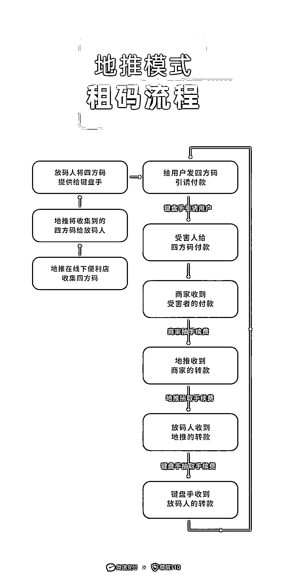

# 租码，真的只是借个收款码这么简单？

> 原文：[`mp.weixin.qq.com/s?__biz=MzIyMDYwMTk0Mw==&mid=2247519573&idx=5&sn=61a01fac1143d3434821392ac2fbd162&chksm=97cb466da0bccf7b9596b19d7e944f97463e3a1ea598a4b51e6ec290e0fa853c1f7e952e2884&scene=27#wechat_redirect`](http://mp.weixin.qq.com/s?__biz=MzIyMDYwMTk0Mw==&mid=2247519573&idx=5&sn=61a01fac1143d3434821392ac2fbd162&chksm=97cb466da0bccf7b9596b19d7e944f97463e3a1ea598a4b51e6ec290e0fa853c1f7e952e2884&scene=27#wechat_redirect)

假如有人跟你说
要借你的收款码去**诈骗**或者**洗钱**你会同意吗？肯定不会同意吧那如果，有人用各种借口说服你**只是借你的收款码套个现呢？**对方还说会支付你一定的报酬这忙，你还帮不帮？

[`mp.weixin.qq.com/mp/readtemplate?t=pages/video_player_tmpl&action=mpvideo&auto=0&vid=wxv_2016847934100766722`](https://mp.weixin.qq.com/mp/readtemplate?t=pages/video_player_tmpl&action=mpvideo&auto=0&vid=wxv_2016847934100766722)

大家可能觉得，将自己的收款码借给有需要的人兑换现金，既能给人方便，又能收取一点报酬，是件双赢的事情。但实际上，轻易将收款码租借出去，可是暗藏了不小的风险，甚至一不小心就会成为犯罪分子的帮凶。因为出租的收款码一旦落入黑产团伙的手中，很可能会被用于线上赌博的**赃款转移、网络诈骗中的引诱付款、违禁品的交易**……找你租借收款码的人，也许就是**黑产团伙**里的地推人员。没错，黑产团伙也会做地推，经过研究发现这种新的地推租码模式大致流程如下：首先，团伙中的**“地推人员”**，会在线下挨家挨户**向各位商户收集收款码**，他们会声称只是简单无害的套现，并约定每转一笔钱向商户支付一定手续费。随后“地推人员”再把收集来的收款码交给**“放码人”**，由“放码人”将收款码**分发**给在网上实施诈骗的人员，也就是俗称的“键盘手”。**“键盘手”**在网上设下各种骗局，**诱骗受害者扫码付款**，被骗的钱款就转入商户的账户中。此时商户在不知情的情况下，扣除约定的手续费后，将钱转给“地推人员”，地推再抽取部分手续费，将钱转给“放码人”。同样地，放码人再转给键盘手，一来一回，一个赃款转移链条就合上了。近年来，电信诈骗犯罪发案率仍居高位，而诈骗款项难以追回的其中一个原因，就是犯罪分子能在短时间内通过洗钱链条“洗”一遍，将钱款拆分流向不同的账户，大大增加了警方的追踪难度。所以我们千万不能误以为只是套现这么简单，轻易就出借或出租自己的微信收款码。若在租借收款码之后无意中参与了犯罪行为，一经核实，轻则导致支付账户被限制交易，重则可能面临**账号交易功能被永久封禁、以及受到法律制裁。**租借收款码这个忙，千万不能帮！来源：微信安全中心

← 向右滑动与灰产圈互动交流 →

