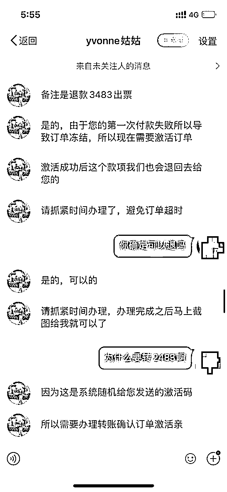

# 北京环球影城内测，黄牛骗子都来了，盗个图居然骗走游客 2000 元

> 原文：[`mp.weixin.qq.com/s?__biz=MzIyMDYwMTk0Mw==&mid=2247519611&idx=1&sn=1cd6aa8877a49712dc92cf9610fcfc10&chksm=97cb4643a0bccf55545782394296027426dac80bcdad68d1f0128672361388a8f54cd4fe4447&scene=27#wechat_redirect`](http://mp.weixin.qq.com/s?__biz=MzIyMDYwMTk0Mw==&mid=2247519611&idx=1&sn=1cd6aa8877a49712dc92cf9610fcfc10&chksm=97cb4643a0bccf55545782394296027426dac80bcdad68d1f0128672361388a8f54cd4fe4447&scene=27#wechat_redirect)

8 月 24 日，北京环球度假区宣布，随着为期 3 个月的内部压力测试工作临近尾声，将于 9 月 1 日正式开启试运行，但试运行期间，园区仅向受邀客人开放。

红星资本局了解到，北京环球影城项目自 2001 年企划起，至今已有 20 年建设时间。漫长的等待之后，游客们终于将要“一睹芳容”。

一票难求下，有黄牛做起了高达 5000 一张的内测票生意。据当地公安部门通报，已有多人因为倒卖环球影城内部测试体验资格，扰乱正常经营秩序被依法行政拘留。也有骗子盯上了游客们的钱包，利用验证码、小程序、官方 APP 渠道等借口，反复诈骗。

北京环球影城 图据 IC photo

**骗术一** 

**盗图内测票“空手套白狼”**

**借口订单备注有误，反复诈骗**

因为资格问题，北京环球影城“内测门票”一票难求。红星资本局注意到，盯上内测票生意的，除了黄牛，还有不少骗子。

8 月 25 日，张悦（化名）对红星资本局讲述了她购买北京环球影城内测门票被骗的过程。

“我是在微博上看到的这个人，他的微博发了环球影城景区和门票的照片，配文说还有余票，我就信了，私聊问他出不出余票。”张悦介绍称，该票贩子先以“有官网 APP 渠道，可以帮我下单”为名，让张悦填写个人信息，包括真实姓名、身份证号、手机号等。

然后张悦收到了一条“看上去很像官方”发来的，内容为“门票订单已生成，请于 15 分钟内完成单号”的短信。收到该短信后，票贩子要求张悦完成转账。

“一张门票 1000 元”，张悦先通过手机银行转了 1000 元后，票贩子却告诉她，“没有按照购票流程，在转账中备注个人信息，因此订单被官方拦截了，必须重新支付。”票贩子表示，重新支付并且成功出票后，此前的 1000 元会退回到原账户，让张悦“抓紧时间，防止再被拦截”。

于是，张悦又重新备注了个人信息，再次转账 1000 元。

第二次付款后，张悦问票贩子此前的 1000 元什么时候退款，票贩子称“由于第一次付款失败，系统需要激活验证码”。随后，票贩子给张悦的手机上发送了一串数字为 2483 的验证码，并要求张悦“抓紧时间打开手机银行，付款输入验证码 2483”。完成支付后，以验证码为金额的 2483 元和此前的 1000 元，共计 3483 元将一起退还给张悦。

此时，张悦意识到事情并不简单。于是开始追问票贩子，“为什么要转 2483，如果验证码是别的数字呢？”“我只需要给你验证码，为什么要我一直转钱？”但对这些问题，票贩子一概不回答，只是不断催促张悦抓紧时间转账。

最后张悦表示不买了，想把此前支付的 2000 元进行退款，票贩子却称官网渠道下午 6 点就要下班，退款需要明天才能办理。可到了次日，张悦微博已被票贩子拉黑。

红星资本局注意到，该票贩子微博@yvonne 姑姑 目前已经查无此人，此前其微博所示的景区照片和门票照片，其实来源于另一位博主@Yvonne-姑姑。两者 ID 十分相似，只有首字母大小写和连字符的区别。

**骗术二**

**发来小程序截图**

**游客转账 2600 元再无下文**

不只是张悦上当受骗，另一位受害人黄婷婷（化名）向红星资本局表示，自己甚至没有仔细追问过票贩子的凭证，就“一时冲动，相信了他”。

“他在别人求票的微博下留言，我看到的。”黄婷婷说，票贩子向她发来一张名为“北京环球影城内部压力测试指定单日门票兑换券”的小程序截图，告诉她“刚好剩最后两张”。但当黄婷婷完成转账后，票贩子再也没有回复过她。

一张内测票 1300 元，黄婷婷一共被骗了 2600 元。

红星资本局注意到，目前微博超话#北京环球影城#里，还有很多类似的被骗案例。但另一边，闲鱼等平台上，仍有不少“高价回收、求购内测票”的帖子。

据证券日报报道，**目前北京环球影城 8 月份的“内测票”已被炒至 5000 元以上，而 9 月份试运营期间的门票售价也在 3000 元上下。**

8 月 21 日午间，北京市通州区公安分局通报，警方查获违法行为人彭某（男，22 岁）、魏某斌（男，19 岁）、范某强（男、25 岁）、吴某虎（男、45 岁）。经查，4 人以 1000 元至 5000 元不等的价格，倒卖环球影城内部测试体验资格，扰乱正常经营秩序，被通州公安分局依法行政拘留。

**北京环球影城**

**未来门票到底有多贵**

北京环球影城的门票到底有多贵？已然成为热议话题之一。

红星资本局了解到，北京环球影城是世界上第五个、亚洲地区第三个环球影城。环球影城票价的制定，会因当地的经济和消费水平而异。**美国的两家环球影城单日票价都在千元人民币左右，亚洲另外两家环球影城的票价均在三四百元人民币左右。**

虽然之前流传的北京环球影城天价门票问题，在今年 2 月已得到官方辟谣，但不少分析仍认为，北京环球影城的单日门票价格至少会与上海迪士尼乐园持平，甚至更高。据经济观察报报道，**一位参与新加坡环球影城运营的人士表示，北京环球影城门票价格预计在 500-600 元。**

红星资本局注意到，7 月上旬，上海迪士尼乐园宣布门票将再涨价，从 2022 年 1 月 9 日起，最高票价将达 769 元，最低也要 435 元，涨幅为 39-104 元。这已经是上海迪士尼开业 5 年来的第三次涨价，其开园时票价为 370 元和 499 元。

北京环球影城 图据 IC photo

**20 年项目终于建成**

**与迪士尼和本土 IP 抢蛋糕**

高昂的黄牛票价、五花八门的诈骗手段、以及此前曝光的 2000 元一餐的园区消费，顶着种种压力依然火爆的北京环球影城，之所以话题热度始终不减，除了本身具有的巨大吸引力外，也是因为它让游客等了太久太久。

**公开资料显示，早在 2001 年，环球影城就曾宣布将在北京落地，但直至 2014 年，项目土地才在拍卖市场挂牌竞价，到 2016 年，才开始正式动工建设。而目前竣工的园区，仅仅是计划中的一期工程，二期三期工程建成进度尚未可知。山西证券研报称，北京环球影城主题公园总面积超过 4 平方公里，共计投资超过 500 亿美元。**

据工商信息，北京环球影城由北京国际度假区有限公司所有、开发、建设、运营，北京国际度假区有限公司则是由北京首寰文化旅游投资有限公司（持股 70%）和康卡斯特 NBC 环球（持股 30%）共同持股的合资公司。北京首寰文化旅游投资有限公司由 5 家国有企业共同设立，其中，首旅集团占股 52.92%。

这项建设时间长达 20 年、投资超过 500 亿美元的园区项目，前景如何呢？

商业方面，以上海迪士尼作为参考，红星资本局了解到，上海迪士尼度假区公布的数据显示，2018 至 2019 年期间，超过三分之二的外地游客表示，他们是为了上海迪士尼度假区才到上海观光游玩。

中国旅游研究院的数据显示，从 2016 年 6 月至 2019 年 6 月，上海迪士尼乐园固定资产投资对上海全市 GDP 年均拉动 0.13%，乐园消费对上海全市 GDP 年均拉动 0.21%。游玩迪士尼的游客在上海的逗留时间以 2 至 3 天为主，人均花费集中在 1000 元至 2000 元。2016 年上海迪士尼开业后，上海星级酒店入住率连续 6 季度保持 70%以上。

通州区发改委表示，**环球影城主题公园一期开园运营后，将带动一批酒店、餐饮、演出演艺等关联企业入驻通州，年产出规模预计达到 200 亿。**随着环球影城主题公园落地，通州区还计划引进 10 家跨国公司或特大型集团公司，100 家独角兽企业、文创上市企业和投资机构，1000 家文化内容和技术团队，重点发展高端创意创新、动漫设计产业，构建“文化科技融合”千亿级产业集群。

中信建投研报预计，**北京环球影城年接待游客数量约 1500 万至 2000 万人次，客单价超 1500 元，成熟后每年营业额约 250 亿元至 300 亿元。**

文化 IP 方面，红星资本局注意到，目前中国内地的主题公园多聚集在南方，北方数量较少，且以欢乐谷和华强方特等本土主题公园品牌为主。沙利文研究院统计，即将和已经落地的世界知名主题公园品牌中，迪士尼、时代华纳梦工厂、乐高乐园、六旗乐园都择址南方，只有环球影城在北京。

这意味着，**环球影城落地北京后，除了和上海迪士尼形成南北竞争外，也将对北方的本土 IP 主题乐园造成冲击。**

以成功打造熊出没 IP 的华强方特为例，根据华强方特 2020 年财报，公司报告期内总营收为 40.22 亿元，其中文化科技主题公园业务收入达到 33.48 亿元。

但即便已是领域内的龙头，但华强方特的主题公园业务仍然是一项投资回报周期长、盈利模式单一且重资产的生意。2020 年 12 月 18 日，华强方特第三次冲刺 IPO。根据此前招股书显示，2018 年，华强方特控股的 77 家子公司中有 40 多家上年处于亏损状态。而随着“熊出没”IP 价值的下滑，《俑之城》《奇迹少女》等新内容的失利也让华强方特开始面临内容青黄不接的困扰。

北京环球影城正式开园后，将为通州带来多少经济效应？国内主题乐园的市场格局将产生什么变化？我们将持续关注。

← 向右滑动与灰产圈互动交流 →

