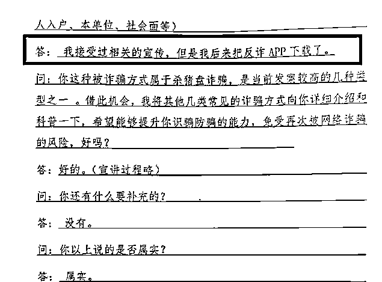
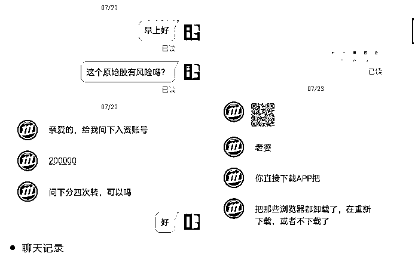
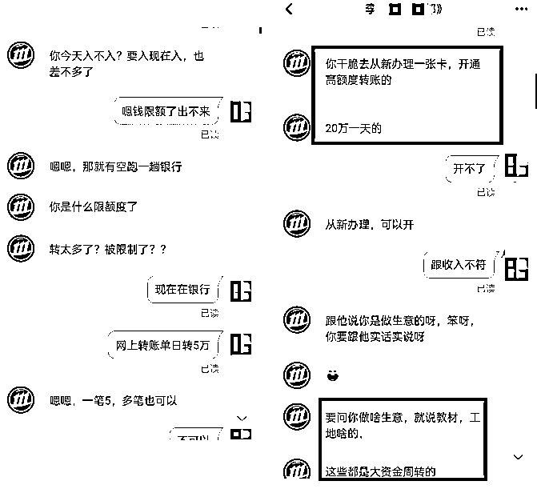
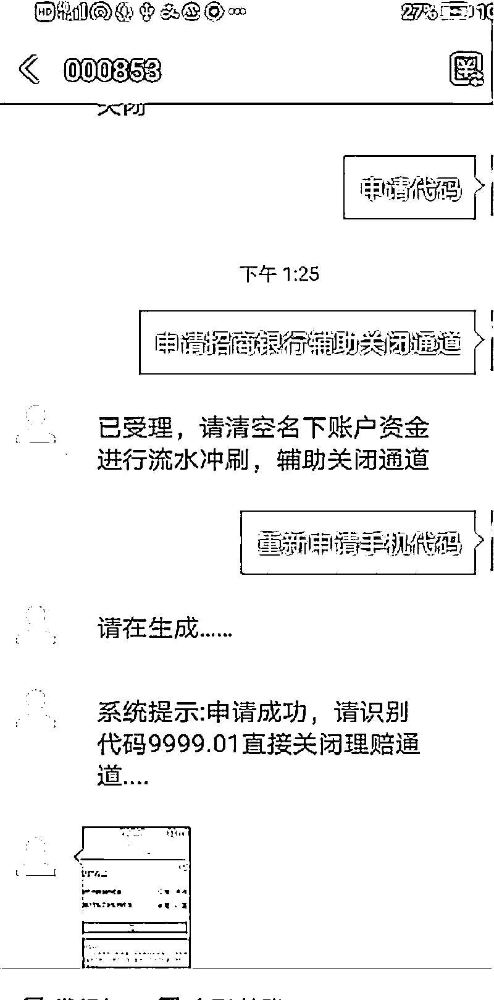

# 90 万！都是任性惹的祸...

> 原文：[`mp.weixin.qq.com/s?__biz=MzIyMDYwMTk0Mw==&mid=2247519611&idx=2&sn=08f9108188dca3d2331c59d94ee2f097&chksm=97cb4643a0bccf557aa05bce867513ba343b352418ff6ea1b759760c3dda86d7e92a5e49f14e&scene=27#wechat_redirect`](http://mp.weixin.qq.com/s?__biz=MzIyMDYwMTk0Mw==&mid=2247519611&idx=2&sn=08f9108188dca3d2331c59d94ee2f097&chksm=97cb4643a0bccf557aa05bce867513ba343b352418ff6ea1b759760c3dda86d7e92a5e49f14e&scene=27#wechat_redirect)

当下，电信网络诈骗类型众多 

稍不留神就可能“中招” 

现整理十堰发生的几起典型案例 

希望市民朋友

提高警惕，注意防骗！ 

**十堰女子深陷“杀猪盘”**

**一个月被骗 90 万**

8 月 20 日，张湾杨女士来到张湾公安分局向民警哭诉，悔不当初无视警方的反诈防骗教育，**将民警相劝安装的反诈 APP 不屑一顾地给卸载了，结果被诈骗 90 万元。**

一个月前，杨女士添加了一位自称李某的好友。之后，李某声称发现一个稳赚不赔的投资平台，**邀请杨女士一起投资赚钱。**杨女士点击了李某推送的陌生链接，下载了一款“CMS”APP，并通过向指定的银行账号转账完成了所谓的“投资”。

最初，杨女士只进行了几笔小额转账，很快连本带利有一定收益，此后杨女士对李某深信不疑，在对方的诱导下，**半个月内杨女士向转账共计 90 万元，涉及银行账户数十个。**

直至 8 月 4 日，按要求进行数次转账后，依然无法从平台提现，杨女士还心存侥幸，对李某抱有期待。**8 月 19 日，一直很“热情”的李某突然失联，杨女士这才意识到被****骗。**

**警方提醒**

**请选择正规交友软件进行注册交友，对方身份需多方验证，同时提高警惕性，以避免经济损失及其他风险；****不要轻信网友口中的“投资”“挣钱”，切莫被对方的挣大钱、掌握操作规律的说法所迷惑，只要谈及金钱问题，一定要提高警惕，切记天上不会掉馅饼。**

**冒充客服**

**十堰一女子被骗 3 万**

8 月 10 日，家住北京路的张女士接到一个电话，对方自称“抖音”客服，告知张女士在抖音买的化妆品质量有问题，可以给张女士办理退款。张女士按照对方提示，安装了“好视通云会议”APP，根据对方提供的会议号张女士跟对方开启了屏幕共享，**对方告诉张女士必须要先向对方提供的银行卡内刷流水才能拿到退款。**

张女士按照对方提示，分别转账 9999 元、24350 元。最后，对方还添加了张女士的支付宝好友“提醒”张女士，把所有转账信息删除、并且让张女士不要出门，不要接电话。

当天下午张女士接到公安反诈电话，告知张女士可能已经被骗，张女士立即赶到人民路派出所报案。目前，案件正在进一步侦办中。

**警方提醒**

**客服来电，称商品有质量问题，主动进行退款或赔偿的都是诈骗。诈骗分子诱导受害人共享手机屏幕从而套取身份证、银行卡等个人隐私信息；诱骗受害人转账，最终掏空受害人的钱袋子。****各种新平台皆是老骗局，大家一定不能为蝇头小利而蒙蔽了双眼！**

**十堰一男子贷款不成**

**反被骗 1 万**

十堰的田先生去年 5 月，接到一通电话，对方自称是某金融公司工作人员，可提供免抵押贷款。田先生因资金周转困难立即添加了对方 QQ，咨询贷款流程。

按照对方的要求，田先生下载了某金融 App，填写信息后却无法放款。询问客服后，对方告之：要将贷款提现必须是 App 会员才可以。于是，田先生缴纳 1000 元会费，但还是无法放贷，**客服又以贷款押金、报名费等名义向其索要费用。**

之后，田先生陆续缴纳各种费用共计 1 万余元，但一直没有收到 “贷款”。随后，田先生发现自己被对方拉黑，这才意识到被骗，立即报警。

今年 8 月，警方得到此案重要线索，犯罪嫌疑人曹某可能藏匿在江西省上饶市的老家。**8 月 17 日，民警立即赶赴江西省上饶市，当晚，在两地警方的密切配合下，成功将犯罪嫌疑人曹某抓获。**经审讯，曹某对其实施的犯罪事实供认不讳。

**警方提醒**

**办理贷款，一定要前往正规金融机构，切勿相信“无抵押无审核”等小广告，正规贷款在放贷前不会收取任何费用，凡是放贷前以各种名目要求缴费、刷流水等，都是诈骗。其次，凡是向你推荐非官方正规金融平台的，务必提高警惕，切勿轻易下载使用其 App。**

**诈骗花样多** 

**提高防骗意识是关键！**

**如有疑问想咨询**

**电信网络诈骗可拨打 96110**

**如遭遇诈骗**

**请立即拨打 110 报警！**

来源：十堰反电信网络诈骗中心，反诈骗先锋

← 向右滑动与灰产圈互动交流 →

