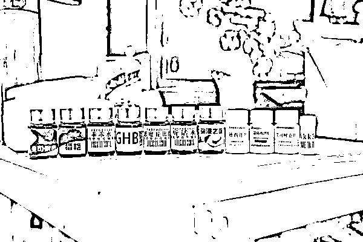

# 怀疑自己得了绝症被瞒，丈夫买了“听话水”给妻子喝

> 原文：[`mp.weixin.qq.com/s?__biz=MzIyMDYwMTk0Mw==&mid=2247519611&idx=3&sn=fefb503d458ef13f3c2e1caeb27713e3&chksm=97cb4643a0bccf553bf9189871ace3130dc844774c52de035dfafdb1a97f4f6680a76387351f&scene=27#wechat_redirect`](http://mp.weixin.qq.com/s?__biz=MzIyMDYwMTk0Mw==&mid=2247519611&idx=3&sn=fefb503d458ef13f3c2e1caeb27713e3&chksm=97cb4643a0bccf553bf9189871ace3130dc844774c52de035dfafdb1a97f4f6680a76387351f&scene=27#wechat_redirect)

日前，遂昌县公安局破获一起销售假药诈骗案，抓获犯罪嫌疑人 10 名，涉案价值 1200 余万元。

遂昌人郑某某 2020 年年初因身体不舒服，先后到省内一些大医院检查治疗，但始终没有康复。他怀疑自己得了不治之症，且妻子向他隐瞒了病情。

2020 年 11 月，郑某某在网上看到广告，称有一种“听话水”效果好，喝了能让人听话。心动的郑某某通过 QQ 号联系上“业务员”，经讨价还价，花 400 元买到了一小瓶“听话水”。三天后，**郑某某收到了“听话水”，悄悄给妻子喝下，却发现一点效果都没有**。犹豫许久后，郑某某向遂昌县公安局报了警。

警方随即开展立案侦查，发现这是一起利用网上销售假药实施诈骗案件。通过网上巡查、侦查等，并对海量数据进行分析研判后，民警掌握了案件人员分工及犯罪团伙整体框架，一个以李某某为首的网上贩卖假药实施诈骗团伙浮出水面。

1990 年出生的李某某曾做过手机销售员、服务员，收入不高。2017 年 12 月，他在网上买了“听话水”，结果被骗，但李某某却因此受到“启发”，自己何不卖迷幻药和催情类药品赚钱？

由于这类药品国家严格管控，李某某很难拿到货，于是**他通过网上购买维生素 C 后，贴上标签冒充三唑仑、艾司唑仑等药品，而前文提到的郑某某购买的所谓“听话水”“乖乖水”，则索性直接用自来水冒充**。

让他意外的是，自己的生意竟越来越好。眼看忙不过来，李某某在广西南宁成立两个工作室，还叫来亲戚朋友做业务员，帮忙网上接单、销售假药，业务量也从原来的每天接单七八件到每天八十余件。

李某某说，想买这种药的都是一些心怀不轨的人或者是吸毒人员等，一般发现是假药也不会去报案。因此，这项“生意”零成本、高利润。网上他们一般以每瓶 300 元至 600 元的价格出售，业务员的提成是 25%－50%，剩余的就是他自己的了，“卖假药一天的收入相当于自己以前一个月的工资”。

2021 年 3 月，遂昌县公安局组织 30 余名警力赴广西南宁、柳州、合山，在当地警方配合下展开集中收网，抓获犯罪嫌疑人 10 名，现场查获三唑仑、阿普唑仑、地西泮、艾司唑仑等假冒药品 1000 余瓶，扣押手机 18 部、电脑 9 台。经侦查，案件被害人遍及除港澳台外的全国各省、市、自治区，其中浙江省就达 1000 余人，涉案价值 1200 余万元。

来源：浙江法制报

← 向右滑动与灰产圈互动交流 →

