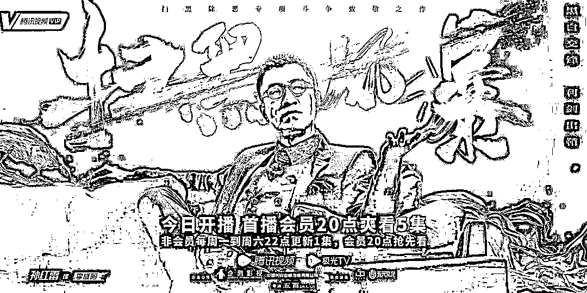
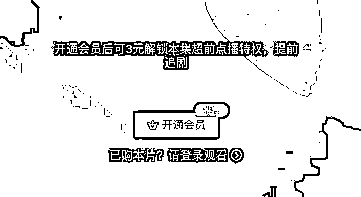
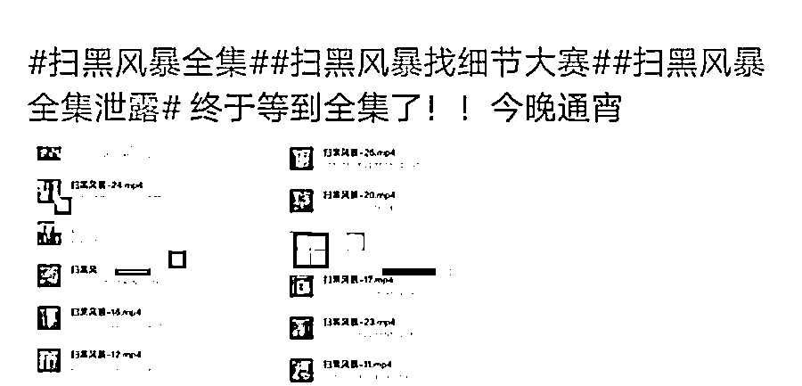
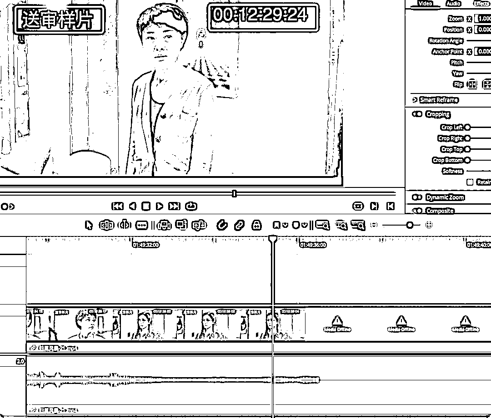
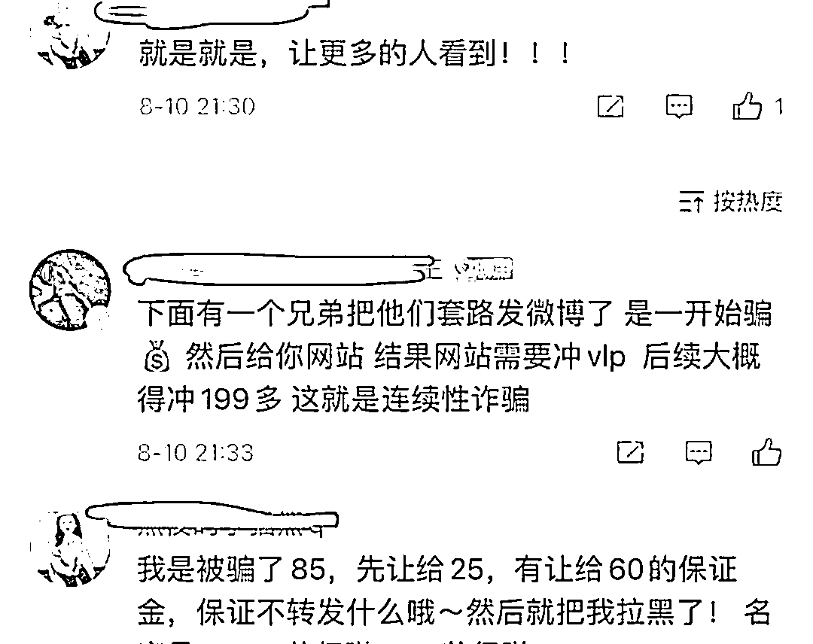
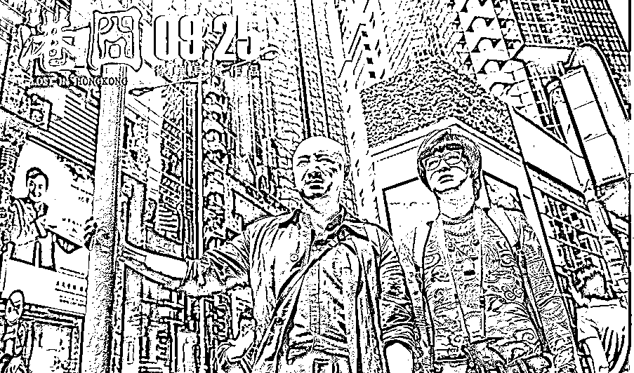
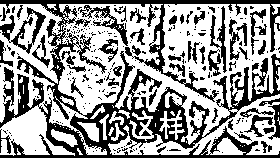

# 《扫黑风暴》全集，只要 6 元？！

> 原文：[`mp.weixin.qq.com/s?__biz=MzIyMDYwMTk0Mw==&mid=2247519675&idx=1&sn=06fab9a947649452fd2c708bff4331af&chksm=97cb4683a0bccf95110bc66992ccc7bc044d02587327825926bb1d003e2c3cd9e1e1afb4d411&scene=27#wechat_redirect`](http://mp.weixin.qq.com/s?__biz=MzIyMDYwMTk0Mw==&mid=2247519675&idx=1&sn=06fab9a947649452fd2c708bff4331af&chksm=97cb4683a0bccf95110bc66992ccc7bc044d02587327825926bb1d003e2c3cd9e1e1afb4d411&scene=27#wechat_redirect)

“林浩的父亲是怎么死的？”

“救命，麦自立失踪真相是什么？”

“绿藤市幕后大 Boss 究竟是谁？”

“你有《扫黑风暴》全集的资源吗？”

说起近期最火的剧，那一定非**《扫黑风暴》**莫属。

以扫黑除恶为题材的电视剧《扫黑风暴》，播出不到 20 天，便迎来了收视口碑的双丰收。

多少人都像小珊一样，一追就上头，**一边暗搓搓等更新，一边吐槽超前点播的收费机制。**

这时候如果有人说：**“我有全集资源，只要 6 块 6”**，你会不会心动。 

小珊在这里负责任地说，**心动，你就危险了......**

### **热播剧《扫黑风暴》全集泄露**

每当一部热门剧需要付费观看的的时候，**盗版资源**就成了香饽饽。

像《人民的名义》、《庆余年》、《亲爱的热爱的》、《三十而已》等热剧，在热播时都难逃被盗版坑的经历。

电视剧《扫黑风暴》自开播以来，持续走红，不少观众看得津津有味，直呼催更，会员抢先看和超前点播相继开启。

然而，一天更新一集的节奏也让不少用户有些“急不可耐”，外加超前点播这一准入门槛的设定，也让不少用户加速追剧的心受阻。

**很多人不愿意花这个钱，所以这就被一些盗版商贩抓住了“机遇”。**

在某些网站上，出现了**盗版热播剧全集链接**。不用等更新、不用看广告，有的甚至还没有删减。

8 月 21 日，在视频网站凭借付费超前点播才能看到前 19 集的《扫黑风暴》，突然流出**全集版本**，并迅速传遍全网。微博、豆瓣乃至微信朋友圈，纷纷被“留资源”、“求分享”和各类剧透的动态刷屏。

△图片来源于网络据悉，泄露的全集并非目前视频网站和卫视播出的版本，而是标有“**送审样片**”字样的版本。
△图片来源于网络泄露发生后，中央政法委新闻网站官方微博“中国长安网”转发并强调：《扫黑风暴》电视剧由中央政法委宣教局、政法综治信息中心、湖南省委政法委指导。请支持正版。 @最高人民检察院 也发文提醒：在互联网上有人未经许可擅自非法传播、销售电视剧《扫黑风暴》的盗版内容，严重扰乱了电视剧《扫黑风暴》的正常播放秩序，侵犯了出品方以及播出平台的合法权益，也对创作者以及观众造成了极大的伤害，**涉嫌构成刑事****犯罪**。

**全集只卖 6 元？**

**网友为看《扫黑风暴》被网络诈骗**网络上多个贩卖资源的用户声称自己手握 27 集《扫黑风暴》资源，并以 6 元左右价格售卖。截至 8 月 21 日 15 时，在某电商平台搜索“扫黑风暴”，可以检索到 120 个卖家提供该剧的全集下载，其中部分“商品”还被转移到**某二手交易平台**。 泄露的全集与目前视频网站和卫视播出的版本略有差别，但视频内容与预告片几乎一样。另一方面，也有网友揭露称，他们去购买“被泄露的送审版”时遭遇了**网络诈骗**，**有人被骗了几十元到数百元不等**。△图片来源于网络骗子先**谎称自己有资源**，让用户**“先款”转账**，并要求几十元至上百元不等的**“不外传”保证金**，等到用户刚交好保证金，或者有所质疑的时候，就会被拉黑。还有的骗子则通过**APP 行骗**，让用户下载软件后，**支付“入门费”**。如果你以为交费就能看了，不好意思，后面仍需要继续交费，**高至 199 元**。不续费就看不了，不想看了也不能退款。**最后用户钱也花了，扫黑风暴也没看了。****盗版问题为何总是屡禁不止？**
为什么“盗版问题”就是屡禁不止呢？这里面门道可多了。**第一是互联网的特性，让信息传播成本降低到了极致。**在信息媒介主要靠实体传播的时代，盗版就已经是一个庞大的黑色产业链。那个时候要把盗版的影视剧印在光盘里，成本不低，最少要有一个小型的压盘厂。但现在时代变了。在互联网时代，信息传播的成本变得非常低，因为数据可以无限复制，只要形成基础传播，就很难阻止一份数据通过网线在地球上不停扩散。你永远不知道到底谁的硬盘上还有一份绝版备份，又会在什么时候突然兴起再次上传到网上。**第二则是因为需求市场一直存在，永远有人追求低价。**
人是有娱乐需求的，大众对“免费”、对低价永远有趋向性。当一边有需求，一边没供给的时候，就留下了牟利的灰色地带。也就是说，只要有人还想看《扫黑风暴》全集，就很难不点开那个写着（扫黑风暴 1-27 集）的资源链接；只要有人还想要低价或者白嫖热门影视剧，就会有人提供这些资源。这是人性。**第三是维权的费用高，索赔低。**
影响盗版猖獗还有一个重要因素，那就是**制造盗版的成本低，而追责盗版的成本高。**
徐峥导演的电影《港囧》上映第二天，就有高清的盗版网络连接，徐峥还为此发声“盗版是行业内的灾难。”**有时维权所花费的经费可能比对方需要赔偿的损失费还要高，所以很多人放弃维权，这就造成了恶性循环，盗版越来越多，对正版造成的伤害也与之俱增。** **这也是为什么很多剧集在遭到泄露之后，大多数剧方除了呼吁和一纸声明之外，没有其他降低负面影响的动作的原因。******看盗版电视也会购成侵权********大众需要建立保护影视版权的意识******我们知道卖盗版资源违法，那么看盗版电视侵权吗？****其实**也会构成侵权**。****盗版侵犯法律，并且购买者无法得到法律的保护。****所以，买盗版资源，买不到会白白被骗钱，买到也是侵犯版权的行为。****盗版的危害也会波及各方，最受影响的就是**剧方**，其次是**平台**。****去年《悟空传》未加特效版本的泄露，虽然未能极大影响到影片的票房，但使得影片的口碑提前被透支，《人民的名义》泄露版本使得当时首播的卫视频道损失巨大的广告费。********盗版的影响已经不仅仅是简单的**带走观众和丢掉票房**，在某处程度上，更像是对**行业的腐蚀**，对**从业者的信心**也是极大的打击。****前面说了有需求就会有市场。盗版猖獗的原因，还跟**大众尚未建立起保护影视版权的意识**有关。****大众在口头上虽然都声称要抵制盗版，但身体却很诚实。****比如，在当前各大社交平台有关《扫黑风暴》的内容评论下方，还有**“****已经看完了”“需要资源的私”**等引诱性评论，不少迫不及待看全集的用户则在评论下方求链接。****甚至还有**“我已经看完了，请大家支持正版”**、**“哎 含恨看完全集 抵制盗版 支持正版”**等阴阳怪气的评论，形成了看盗版还洋洋自得的舆论氛围。****可以看到，这场与网络盗版的游击战依旧漫长。****我们需要从自身做起，尊重版权支持正版。毕竟，每一部用心的制作的作品都应该得到相应的尊重。******

**← 向右滑动与灰产圈互动交流 →**

****