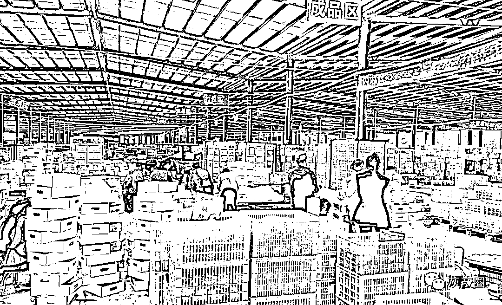
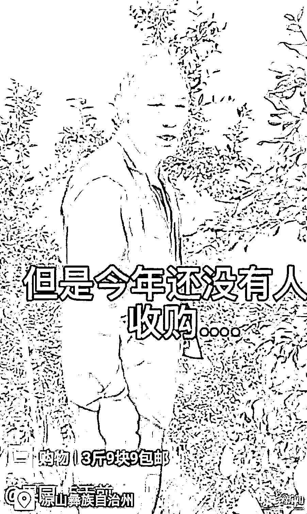
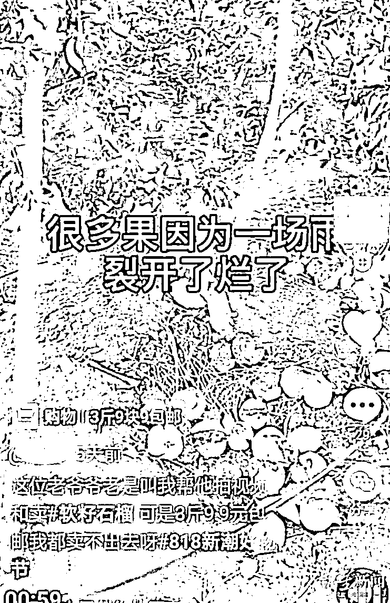
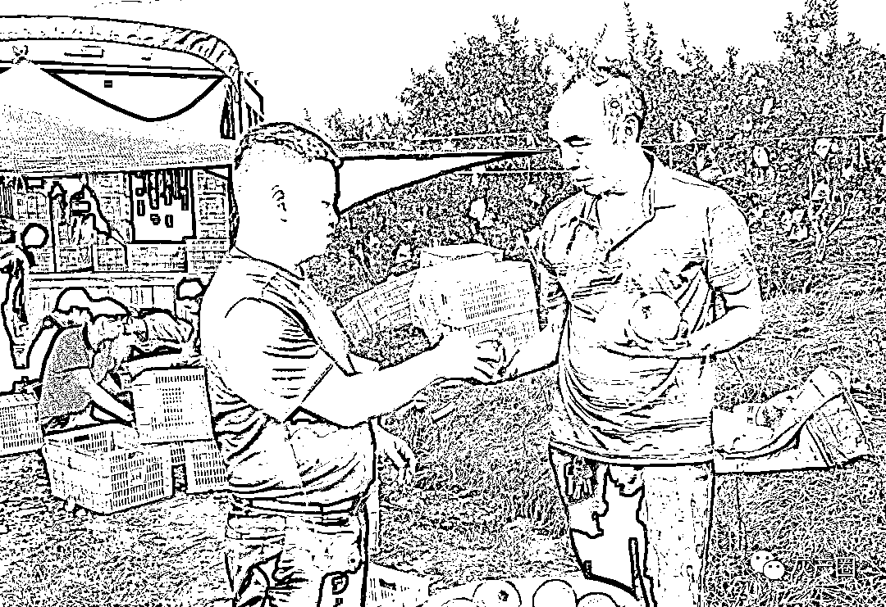
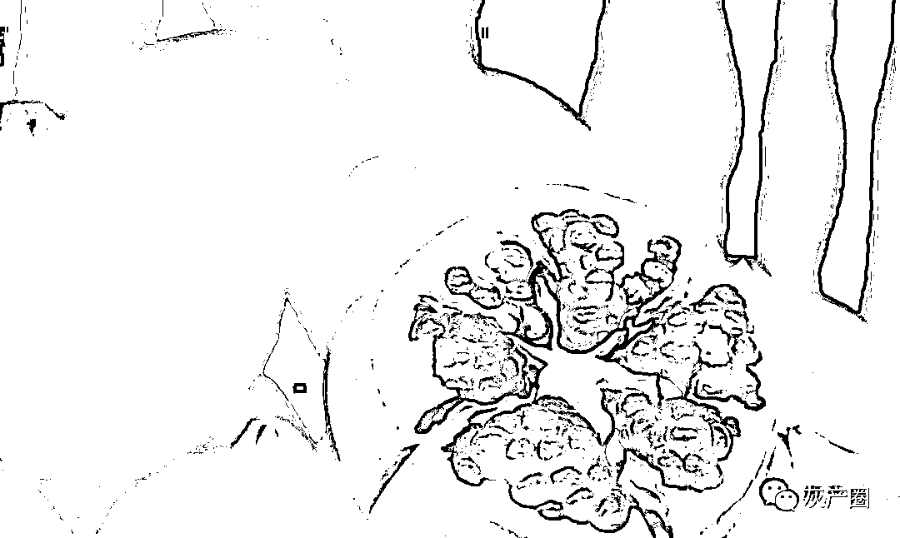
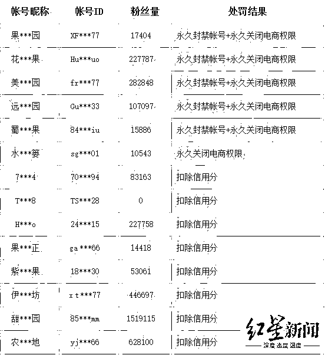
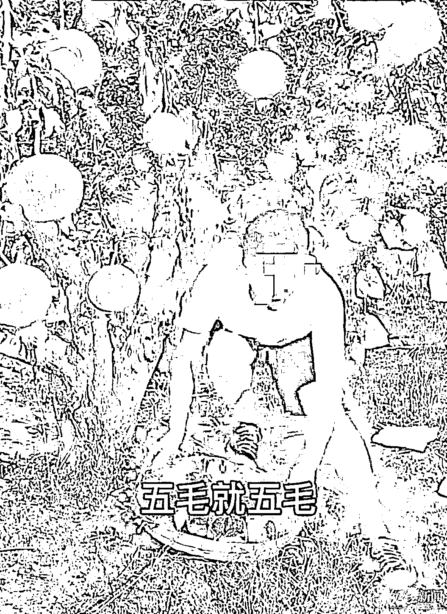

# 卖惨带货！主播谎称会理石榴滞销，官方介入多号被封

> 原文：[`mp.weixin.qq.com/s?__biz=MzIyMDYwMTk0Mw==&mid=2247519675&idx=3&sn=59fda1b38ce51fd24c38571a4558b060&chksm=97cb4683a0bccf951ea88ab84e99ffdd9d357d19ab3e2ed49a65e6da690a65e81dc1be4ee928&scene=27#wechat_redirect`](http://mp.weixin.qq.com/s?__biz=MzIyMDYwMTk0Mw==&mid=2247519675&idx=3&sn=59fda1b38ce51fd24c38571a4558b060&chksm=97cb4683a0bccf951ea88ab84e99ffdd9d357d19ab3e2ed49a65e6da690a65e81dc1be4ee928&scene=27#wechat_redirect)

“会理软籽几毛钱一斤，一块钱一斤都没人要。”“今年一点都没卖出去……”近日，四川凉山州会理县的石榴上市了，但一些主播、网红在直播或者短视频中，声称会理石榴滞销、卖不出去……

那么，真实情况是否如此呢？

红星新闻记者调查采访发现， 由于疫情等因素，今年会理石榴的销售确实受到了一定影响，但是价格只是比往年低一些，大多在几元一斤。会理县商务经济合作和外事局相关负责人表示，**会理石榴在 8 月底 9 月初才大规模进入成熟采摘期，并不存在滞销。**

针对部分网红、主播的卖惨带货行为，会理县电子商务协会已发出《倡议书》，呼吁大家遇到这种情况请积极举报，同时会理县多个部门组成联合执法组，对这类行为进行核查处理。**目前，已有短视频平台对 5 个账号进行永久封禁账号+永久关闭电商权限的处理，对接到的其余 18 个举报账号进行了扣除信用分处理，这其中的账号有的粉丝量超过了一百万。**

一位短视频作者在接受采访时表示，**发布这样的视频只为博取网友同情、吸引眼球，因为直播时，有的网友看到视频后会因为同情进来下单。**红星新闻记者了解到，实际上，这类“悲情营销”模式早已屡见不鲜。满目沧桑的老人、残疾人士手持低保证，年幼孩子手举苹果等形象出现在一些平台的促销图片中，特别是“滞销大爷”已遭滥用，通过“卖惨”来博取公众同情，从而实现销售商品的目的。

↑会理石榴上市

【卖惨营销】

**网络视频带着哭腔**

**声称“老大爷家的石榴烂在地里”**

> ——真相：一老人家中没有种石榴，另一老人家中的石榴早就卖完了

网络上，在一段短视频中，一名 80 多岁的老大爷头发花白，步履蹒跚地挑着两桶水，在石榴地里面慢慢地行走，写着“这位老爷爷叫我帮他卖石榴，可是 3 斤 9.9 包邮我都卖不出去”“很多石榴都烂了，不如烂在地里当肥料了”，画面中，地上有一些裂开的石榴，同时配上了一段悲伤带着哭腔的声音。通过评论，可以看出这则视频引发不少网友同情。

红星新闻记者采访获悉，视频中的老人叫王富贵，是会理县彰冠镇的村民。

王富贵表示，他家根本没有种石榴，他在帮别人看守果园。**“那天，我在挑水浇园子的时候，有个年轻人拿着手机拍我，可能是那个时候拍的，我也不知道他拍来做什么，视频中的声音也不是我说的，我也没有哭。”**

↑视频中，老人称会理石榴今年无人收购，该老人叫李先荣

而在另一段也带着哭腔的配音视频中，也有一位老人在石榴地里说，石榴卖不出去，视频配以的文字则是：“老大爷说他家的石榴又大又甜……但是今年还没有人收购”。

据了解，视频中的老人叫李先荣，是会理彰冠镇打吉塘村的果农，**不过他表示，自家的石榴早就卖完了，不存在卖不出去的情况。**“我又不会耍视频，视频他叫我拍的。”李先荣表示，之前村里来了一个年轻小伙子，说帮着宣传会理石榴，让他拿着石榴站在地里，于是配合拍了一段视频，他并不知道拍摄用途，“那个话也不是我说的。”

↑李先荣讲述当天视频拍摄的过程，“那个话不是我说的”

【官方调查】

**会理多部门成立联合执法组**

**卖惨短视频涉嫌发布虚假信息**

> ——真相：卖惨短视频中的画面、声音系拼凑制作，与事实不符

会理县被誉为“中国石榴之乡”，现在全县石榴种植面积已达 40 万亩，其种植面积、产量和产值都稳居全国八大石榴主产区之首。据了解，去年产量达 72 万吨，产值 52 亿元。近期，会理石榴开始成熟，网络平台上出现了不少直播带货卖石榴的主播、网红。不过，一些主播、网红声称会理石榴卖不出去。 

这些主播在视频中称会理石榴销售十分困难，“帮帮果农，温度太高了，很多石榴熟烂在地里，卖不了钱了……你看，真的是太可惜了”“五毛，就五毛，卖了总比烂在地里强”“十几块就可以发满满的一箱，帮帮我吧”……对此，有当地的网友及果农看到视频后，向会理县相关部门进行了举报。

↑短视频主播平台发布的会理石榴烂了

红星新闻记者从会理县获悉，为了整顿规范会理石榴市场，会理县综合农业农村局、市场监管局、公安局、商务经济合作和外事局、供销社几个部门的石榴市场联合执法组，第一时间对网友的投诉举报进行了核查，对市场上的违法行为进行严厉打击。另外，会理县电子商务协会还发出《倡议书》，呼吁大家遇到这种情况请积极举报。

**“他们通过这个悲情营销的方式发布一些不实的消息，损害了果农和消费者的利益，我们接到举报后立即进行了调查走访。**”据执法组的工作人员介绍，通过核查发现，视频中的老人确实存在，但是短视频中的画面、声音是拼凑制作的，老人也没有说过视频中的话，文字上的表述与事实不符，涉嫌发布一些虚假信息，扰乱了正常石榴市场的销售秩序。

【真实市场】

**会理石榴受疫情等影响**

**价格略降 但远远谈不上销售难**

> ——真相：价格比往年稍低一些，收购价 2.5 元至 5 元一斤不等

会理县商务经济合作和外事局副局长王银国介绍，**会理石榴在 8 月底 9 月初才大规模进入成熟采摘期，并不存在滞销。**他说，主播发布的“会理软籽石榴几毛钱一斤”为不实消息，目的是为了获取利益或流量，传递会理石榴销售困难，打压会理石榴的价格，引起果农恐慌，低价抛售石榴。

多位种植户和销售商表示，今年会理石榴的价格格比往年低一些，大多在几元钱一斤，并不存在卖不出去的情况。

↑果农销售会理石榴

会理县的一家大型农业开发有限公司负责人在接受红星新闻记者采访表示，相比前两年，受疫情等因素影响，外地的收购商相对减少，今年会理石榴的价格确实比往年低一些，但是并没有卖不出去的情况。

**“由于疫情等因素，今年会理石榴销售确实受到影响，但是远远谈不上销售难。”王**银国告诉红星新闻记者表示，目前，会理石榴统货收购价格都在 2.5 元至 3 元一斤，精品果子价格在 4 元至 5 元一斤。

↑会理石榴

红星新闻记者从会理县有关部门获悉，目前，会理县各部门通力协作，采取了线上、线下，县内、县外多方式加大会理石榴的营销力度。从 8 月 12 日起，组织开展百名网红进凉山带货活动，并组织开展万商云集会理好物石榴网上带货活动；8 月 22 日至 9 月 30 日还将联合相关平台联动平台同商家及达人在线上线下推广会理石榴，举办会理石榴电商节。在线下，相关部门正积极地进行产销对接，除县内的系列活动，还将赶赴全国各大城市如北京、深圳、上海和宁波等，举办会理资源推介暨会理石榴营销系列活动。

【涉事主播】

**卖惨是为博取网友同情而下单**

**已有 5 个账号永久封号 还有 18 个作违规处理**

> ——真相：悲情营销不仅不会带给果农好处，反而带来一定的坏处

8 月 17 日，会理县石榴联合执法组人员在彰冠镇找到了正在进行直播的邱某某。据了解，邱某某来自江西，他经常在广西、四川一带进行农产品直播带货。**“套路就是我感觉还是善良好心的人多，发布这样的视频也是博取同情，吸引网友下单。”** 

**之后，邱某某删除了自己的视频，并公开道歉，“我已经认识到了这个错误，再也不发布相关视频，感谢大家的监督。”**与此同时，他还提醒做电商的主播达人不要发布类似的视频，“这种悲情营销不仅不会给果农带来好处，反而会带来一定的坏处。”

↑短视频主播邱某某

8 月 19 日，执法组人员在会理县城找到了直播达人刘某，并对其进行了教育。

刘某坦言，在发布的视频中，除了价格不实之外，为了让网友看到品相更好的石榴，视频中拍摄的软籽石榴其实是酸石榴，卖惨主要引起网友同情而下单，以此获利。“之前发布的视频对会理石榴和果农造成了特别不好的影响，我深表愧疚，也非常抱歉，希望大家引以为戒，不要再这样子卖惨。”刘某说。

**“这种行为不仅坑害果农利益，还影响了会理石榴的品牌形象。”**8 月 25 日， 会理县商务经济合作和外事局副局长王银国告诉红星新闻记者，通过核查，会理县石榴联合执法组将涉嫌卖惨带货的视频账户和 ID 发送给抖音短视频平台，对相关卖惨视频做出处理。

截至 8 月 23 日，短视频平台已对 5 个严重违规账号进行永久封禁账号+永久关闭电商权限的处理，对 18 个违规账号进行了扣除信用分处理。“通过整治，悲情营销行为已在各平台销声匿迹。”会理县市场监督管理局工作人员表示，通过前期的整治，达到了预期的效果，目前没有接到一个投诉电话。

↑被处理的违规账号

【幕后起底】

**悲情营销涉及多个农特产品**

**有人滴眼药水、掐孩子等人为造惨卖货被罚**

实际上，会理石榴的遭遇只是“悲情营销”的一个缩影。今年 7 月，网络上有一些攀枝花芒果的视频或文章引发关注，声称攀枝花芒果滞销、卖不出去。对此，攀枝花市农业农村局也表示，消息不实，攀枝花芒果从 9 月大量上市，一直持续到 12 月，不存在所谓“滞销”问题。

如今，网上菠萝滞销、红枣滞销、蜜橘滞销、洋葱滞销之类的视频呼吁大家爱心购买，可以说是不胜枚举。此前，一位大爷的肖像被商家广泛使用，被网友称为“滞销大爷”，但他家中并没有滞销水果，这不过是电商“悲情营销”的套路。此事经媒体曝光后，各大电商平台撤下了“滞销大爷”的图片，但是一些电商及微信公众号又换上了别的悲情图片：手举农产品的年幼孩子、拭泪的老农、望果兴叹的大妈、请求帮忙的残疾人士，是否滞销，真假难辨。

↑短视频主播称会理石榴五毛钱一斤

红星新闻调查了解到，在农特产品销售中，“悲情营销”比较普遍，不管是不是真的存在农产品滞销，先打“悲情牌”，“卖惨式”带货、编造离奇剧情博关注带货、利用同情心“套路”带货，而背后的目的是从中赚取差价获取利益。2018 年，凉山盐源苹果也遭遇悲情营销，凉山州盐源县政府紧急发布声明称，帖文内容严重不实。 

针对“悲情营销”行为，会理县市场监督管理局相关工作人员表示，主播、网红为了谋取自身的利益，发布一些不实信息扰乱正常，其行为可能违反《中华人民共和国广告法》《消费者权益保护法》等一些法律规定，“如果情节严重的情况下，可能构成《中华人民共和国治安处罚法》的一些处罚条件，如果说出现了一些严重的情况，还可能涉及《刑法》。”

今年 3 月，“韩文团队”以扶贫捐助、帮扶困难群众为名，从事网络直播带货。后经查，抖音号“韩文团队”由赵某某组织谢某某等多人组成团队，由赵某某策划、指导在凉山昭觉、盐源、会理等地通过摆拍、渲染凉山贫困，发布不实视频博眼球、吸粉，从事网络直播带货牟利。

近日，红星新闻记者从凉山州公安局获悉，“韩文团队”采用滴眼药水、掐孩子等手段，人为制造女孩流泪场面。还谎称帮助哑巴母子销售家产苹果，实际销售的却是市场上的苹果。真实情况是，“韩文团队”只在这户人家买了几千斤苹果，但通过直播销售了几十万斤苹果，获利达 29 万元，赵某某个人分得 12 万元。目前，赵某某被依法行政拘留 7 日，谢某某等 3 人分别被依法行政罚款 500 元。

经济学博士祝启明在接受红星新闻记者采访时表示：“悲情营销”从来就不是一个创新，比如“老板疯了，老板娘跑了”。但近年来，无底线地消费消费者的“爱心”与“同情”，几乎已成社会公害。只会割裂与消费者之间的信任纽带，从全局和长远来看，损害的是整体品牌形象和全体果农的整体利益。

来源：成都商报，利箭在行动

← 向右滑动与灰产圈互动交流 →

