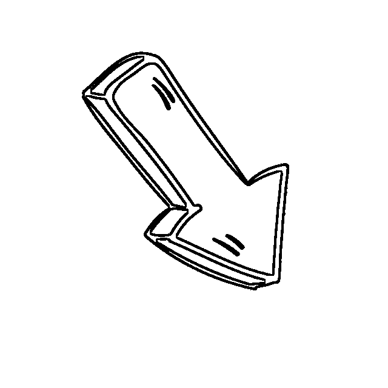
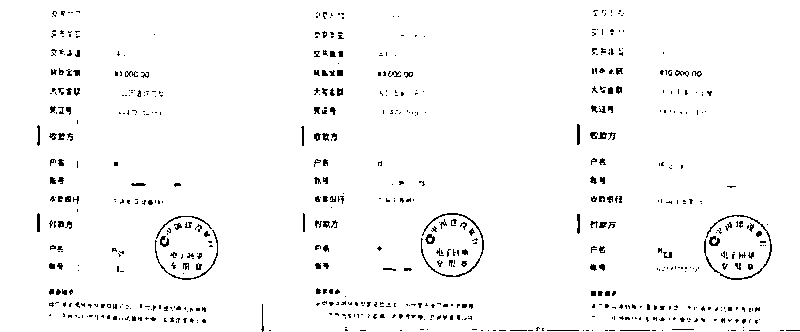
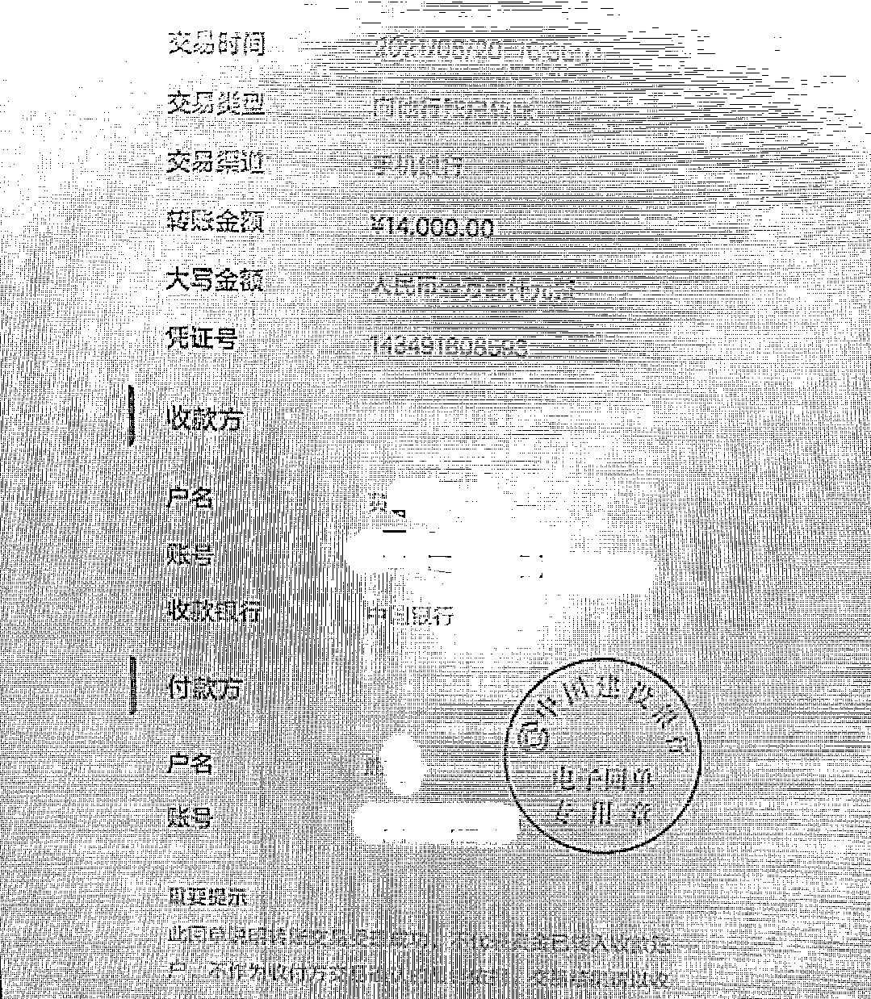

# 太惨了！太惨了！只领了 6.6 元红包，却被骗 2.8 万……

> 原文：[`mp.weixin.qq.com/s?__biz=MzIyMDYwMTk0Mw==&mid=2247519675&idx=4&sn=ff31ef8560fc8ff6da225bb143753477&chksm=97cb4683a0bccf957b6d1bbaeabf1f227bbe32c83d929c33c71292f12c9fa55b75ffedb8c918&scene=27#wechat_redirect`](http://mp.weixin.qq.com/s?__biz=MzIyMDYwMTk0Mw==&mid=2247519675&idx=4&sn=ff31ef8560fc8ff6da225bb143753477&chksm=97cb4683a0bccf957b6d1bbaeabf1f227bbe32c83d929c33c71292f12c9fa55b75ffedb8c918&scene=27#wechat_redirect)

**做手工→领红包→刷单→投资**

昆明市呈贡区 24 岁的熊某

本来想凭本事赚钱

没想到却遭遇连环诈骗

**6.5 小时**

下载了**3 个 APP**

加了**4 个聊天群**

只领到**6.6 元红包**

却**被骗 2.8 万**

****这到底是肿么回事****据呈贡公安分局反诈中心负责人刘文贤介绍，8 月 20 日 10:00 左右，家住呈贡某一小区的熊某在一个做手工活的微信群看到一个二维码。她心想可以做手工赚点钱，便扫码加了对方好友并主动联系了对方。对方声称可以做串珠的手工费是 7 角钱每串，做笔芯的手工费是 3 角钱每根，并询问了熊某具体的个人信息以及想做多少数量的手工活。熊某选择做手工费较高的串珠，并告诉对方自己先做 400 串试试。**对方让她扫码下载了一个企业 App 并用手机号注册。**此后，对方把她拉进了**福利群和结算群**。群里的福利员告诉她，**在福利群进行签到后将自己的支付宝收款码发进结算群，就可以领取 6.6 元红包。**每签到一次就可以领取 6.6 元，如此轻松？岂不是可以领取很多红包。可刚签到一次，领了 6.6 元红包后。对方就给她发来了任务，让她关注公众号，并称先垫付 58 元，此后连返利一起发还给她。按照对方要求，她通过微信转账支付给对方 58 元。关注了几个微信公众号后，对方称可返还 88 元，但只能下载**一个叫“某信”的 App 并绑定银行卡才能领取。**根据客服的指示，熊某下载了该 App 并成功绑定了自己的银行卡。此后，对方将其拉近了一个名为**“高级 VIP 的福利群”**，群里的福利总监提供了一个网址让熊某下载“某成投资”的 App。下载注册后，熊某收到一个三连单的任务，并按照指示连续充值 3 次。第一次充值 1000 元，第二次充值 3000 元，第三次充值 10000 元。

充值结束后，对方又称她操作失误导致账号被封，需要再次充值 14000 元。为把之前充值的钱连本带利都拿回来，8 月 20 日 16:30 左右，熊某听信按照对方的要求，再次充值 14000 元。

但充值结束后，她就发现平台再也无法登录。

熊某这才意识自己被骗了，赶紧报警，**共计被骗 28000 元。**

**反诈民警提示：**

1.找兼职一定要从正规渠道，凡是让你先垫付的都是诈骗，信不得！

2.刷单违法！刷不得！收到书单信息请自动屏蔽！（此前视频里专门讲过的哦，这次一定得记住了！）

<mpvideosnap class="js_uneditable custom_select_card" data-pluginname="videosnap" data-id="export/UzFfAgtgekIEAQAAAAAARXAuZTc3JwAAAAstQy6ubaLX4KHWvLEZgBPEqoMUcBMtOpn4zNPgMIt1PWrFHFPB7fkmvm8C1vsX" data-url="https://findermp.video.qq.com/251/20350/stodownload?encfilekey=XGocBFxVWK5dcyOOqpEU4yZ0ia4qlCRBB5DNQuG5uhzWdxQiabIanYYPdBlwS1J2Z6yxtYBxsXnYGaPYaALY861SGZFAVmObk1EafF4LMGRIMKWBC0NlxQoIIPicM3lC8H8nQZn3wn3O54Em4tPyKq8icguVTF9r2BibwsY8A8oQu0fayHONibgbV3ibg&amp;adaptivelytrans=0&amp;bizid=1023&amp;dotrans=0&amp;hy=SZ&amp;idx=1&amp;m=7c8acce881d90c4dc824ef3eb10a46ea&amp;token=cztXnd9GyrG1eicOkm1m67bCNPNIwKbVdpMSj8Un9g14ejGqwSJSAGVKGjGdHAcspGKWGS110UZo" data-headimgurl="http://wx.qlogo.cn/finderhead/04LrpEqAf4uwdAQV0VAibiaibIhTTibibd1f9nRDgHb8YfO62s9bT1OUH4A/0" data-username="v2_060000231003b20faec8c6e58c10c7d6c905eb35b077d7944bfb5d108bee76b70915a1d46ec6@finder" data-nickname="昆明反诈中心" data-desc="刷刷就被骗！你了解刷单骗局吗？#防骗" data-nonceid="16414855956300175902" data-type="video" data-filtered="filtered"></mpvideosnap>

3.不要贪图小便宜，免费领红包、刷单分红利、投资有回报等多半是骗子的圈套，千万别中招！

**来源：昆明市反电信网络诈骗中心，反诈骗先锋**

****

**← 向右滑动与灰产圈互动交流 →**

****