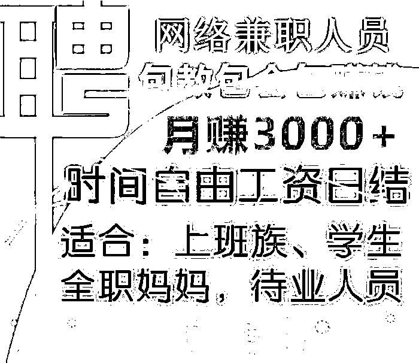

# 警惕！大量学生参与跑分洗钱成电诈帮凶！

> 原文：[`mp.weixin.qq.com/s?__biz=MzIyMDYwMTk0Mw==&mid=2247519675&idx=5&sn=6092a84a3805bf206789456746ff9433&chksm=97cb4683a0bccf95450286c6c950aa22f8377582fbee258217e23afd950ba268c6407e7cc791&scene=27#wechat_redirect`](http://mp.weixin.qq.com/s?__biz=MzIyMDYwMTk0Mw==&mid=2247519675&idx=5&sn=6092a84a3805bf206789456746ff9433&chksm=97cb4683a0bccf95450286c6c950aa22f8377582fbee258217e23afd950ba268c6407e7cc791&scene=27#wechat_redirect)

空闲时间找一份**“兼职”**，已成为许多年轻人的赚钱方式，但这也成了诈骗分子眼中的“肥肉”，**会让你在不经意间掉入犯罪的深渊**。 

去年 10 月，自国家决定开展“断卡动动”以来，严厉打击出租、出借、出售银行卡和支付账户行为，贩卖银行和支付账户这一黑灰产产业链条一定程度得到有效遏制，但近期，**不法分子却将目标瞄准了以学生为主的年轻群体**，以兼职、游戏客户充值、跑分（转账交易流水）等为由，引诱这些群体持自己身份证办理银行卡绑定微信或支付宝账户，提供给犯罪团伙使用换取所谓的“兼职工作”报酬。**这些银行卡被用于洗钱等犯罪活动后，不少年轻人因此被追究刑事责任！令人惋惜。**

********

2021 年 8 月 18 日，宜宾市公安局叙州区分局在叙州区南岸街道一民宿内，成功捣毁一个以王某（男，26 岁）为首的洗钱窝点，**当场抓获涉嫌帮助信息网络犯罪活动罪的犯罪嫌疑人 15 人，缴获涉案银行卡 32 张**。据初步统计，**该案洗钱过账流水上亿元**。

[`v.qq.com/iframe/preview.html?width=500&height=375&auto=0&vid=wxv_2017808413174349827`](https://v.qq.com/iframe/preview.html?width=500&height=375&auto=0&vid=wxv_2017808413174349827)

**（点击右下角全屏观看效果更佳）**

**“两卡”线索骤增，犯罪团伙浮出水面**

2021 年 7 月下旬以来，宜宾市公安局叙州区分局相继接到“两卡”核查**线索****多达 50 余条**。线索中所涉及的人员大多为 18 岁至 23 年的年轻人，且经常出入酒店、网吧等场所。

此类人员的银行卡涉案骤增，引起了分局反诈中心的重点关注。民警对其中几个重点新开卡人员实施抓捕并审讯后发现，涉案嫌疑人多为**“游戏充值”**、**“兼职刷单”**、**“找快钱”**、**“客服招聘”**等原因被诱骗到民宿、茶坊、酒店等地，**将自己的银行卡、手机微信交予他人****帮助电信网络诈骗、网络赌博转账洗钱**。

为有效扼制辖区“两卡”犯罪攀升态势，分局立即组织刑侦反诈、网安及派出所等部门警力成立专案组。随后，通过进一步综合分析，一个以王某为首专门帮助境外电信诈骗、网络赌博团伙洗钱的犯罪团伙很快浮出水面。

**循线深挖，嫌疑人悉数落网**

通过对几个重点“卡农”的审讯和组织辨认，专案民警发现部分嫌疑人已经外逃，便**即刻对外逃嫌疑人进行网上追逃**。

**8 月 14 日**，犯罪嫌疑人毛某（男，23 岁）、徐某（男，19 岁）、张某（男，20 岁）等 3 人**在上海市嘉定区落网**。

**8 月 16 日**，犯罪嫌疑人陈某（男，24 岁）**在厦门市集美区落网**。

**8 月 17 日**，犯罪嫌疑人姜某（男，34 岁）**在成都市高新区落网**。

**直捣洗钱窝点，****打掉犯罪团伙**

**8 月 18 日**，民警乔装成“卡农”向“串串”刘某应聘，随后顺利进入洗钱窝点，成功抓获王某、刘某（男，37 岁）、谭某（男，22 岁）、武某（女，28 岁）等团伙重点人物。

民警为将此窝点彻底捣毁，**就地开展突击审讯**。在公安机关的强大攻势下，王某积极交代了自己与境外电诈集团联系获取洗钱资源，并组织人员洗钱的犯罪事实。随后，民警在王某的配合下，将其发展的下线肖某（男，24 岁）抓获，并将带领“卡农”前来洗钱的尹某（男，20 岁）、叶某（男，19 岁）、朱某（男，18 岁）抓获，并**现场挡获 6 名准备参与洗钱跑分的嫌疑人**。

经查，**2021 年 7 月以来**，犯罪嫌疑人王某伙同武某等人由外省窜至宜宾，通过与境外电诈窝点老板联系获取洗钱跑分“资源”，随后组织人员先后在宜宾市翠屏区、叙州区、高县网约民宿、电竞酒店、农家乐等地**以招聘兼职（游戏客户充值）为名诱骗****近****百名****学生及无业人员****提供银行卡或者支付账户帮助境外诈骗团伙洗钱**。

据办案民警介绍，该团伙分工明确。有人负责帮助各团伙组织招募“卡农”，有人维护作案现场秩序并接送“卡农”取现，还有专人负责日常杂务。

目前，该案已**依法****刑事拘留 16 人，监视居住 5 人**，案件正在进一步深挖细查中。

**小编通过搜索发现，该案数十名在校学生的经历****并不是个例。**

**江西南昌某高校 4 名大学生“****跑分****”被刑拘**↓****

**在校大学生帮助他人跑分洗钱，流水金额高达 3000 万，6 人均获刑↓**

**12 名大学生帮助转账洗钱，6 人被采取刑事强制措施↓**

**单日银行账户流水高达 157 万，00 后大学生因涉嫌帮助信息网络犯罪活动罪被警方依法刑事拘留↓**

  **   所谓“跑分”**就是利用绑定好个人银行卡的微信或支付宝的收款码，为别人进行代收款，随后赚取佣金。一般来说，佣金的比例在 1%到 2%之间，也就是说，接一个 10000 元的“跑分”项目，可以赚取 100 元到 200 元。由于招募者宣称来钱快、回报高，**不少年轻人特别是在校职高学生、大学生参与其中。**

　　“跑分”平台打着兼职招聘的旗号，招揽找工作群体或兼职人员出借自己的支付账户，通过搭建平台网站，以类似网约车“抢单”的模式进行运作。近年来，公安机关加大对搭建平台进行跑分行为的打击力度，不法分子则直接转移至线下，组织他人前往茶坊、民宿、酒店现场“跑分”。

　　这些被利用的支付账户被大量用于**电信网络诈骗、赌博、色情等违法犯罪活动**进行收款，**其实就是洗钱**。

　　一些不明就里的年轻人参与此类“兼职”，在承担经济损失风险的同时，还将可能按帮助信息网络犯罪活动罪的定罪量刑标准，负相应法律责任。

**     划重点**

1**.所谓“跑分”兼职**，实为帮助违法犯罪团伙进行洗钱活动，涉嫌帮助信息网络犯罪活动罪，参与者需承担刑事法律责任。 

2.“跑分”过程中**帮助洗钱**最后涉案的第三方账户将被公安机关司法冻结，将直接影响个人征信，并受到法律惩处。

**3.警惕“跑分”陷阱**，注意保护个人隐私信息，不要轻易被网络上不切实际的高额利润所诱惑，更不要随意出租出借自己的身份信息、支付账号等，以免沦为犯罪分子实施违法犯罪的帮凶。

**什么是帮助信息网络犯罪活动罪？**

《刑法修正案(九)》增设帮助信息网络犯罪活动罪 ，针对明知他人利用信息网络实施犯罪，为其犯罪提供互联网接入、服务器托管、网络存储、通讯传输等技术支持，或者提供广告推广、**支付结算等帮助**的行为独立入罪。

要妥善保管好自己的身份证、银行卡、网银 U 盾等账户存款工具，保护好登录账号和密码等个人信息，不要出租、出借、出售个人银行卡、身份证和网银 U 盾等账户存取工具。侥幸心理不可有，法律红线不要碰，别为蝇头小利毁了大好前程。

**找兼职让你提供银行卡或者支付账户“跑分”的一定是在帮助诈骗或网络赌博团伙洗钱，都是犯罪。**

来源：宜宾市反诈中心、天下有诈、熊猫反诈、反诈骗先锋

← 向右滑动与灰产圈互动交流 →

