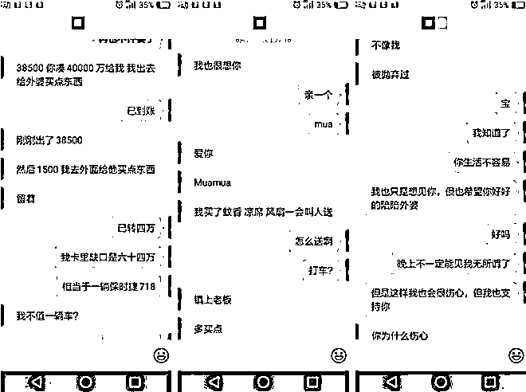
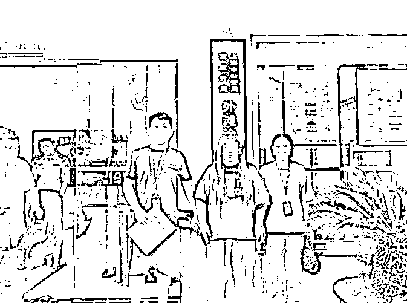

# 大学生“网恋”一个半月被骗 318 万！“女神”聊天话术曝光……

> 原文：[`mp.weixin.qq.com/s?__biz=MzIyMDYwMTk0Mw==&mid=2247519675&idx=6&sn=5d5061ebfee7c541203ac7a4004639e4&chksm=97cb4683a0bccf959bba56a631ce9430998da87c1250766df6feb3c2c9ee6cc1f055d7599fe5&scene=27#wechat_redirect`](http://mp.weixin.qq.com/s?__biz=MzIyMDYwMTk0Mw==&mid=2247519675&idx=6&sn=5d5061ebfee7c541203ac7a4004639e4&chksm=97cb4683a0bccf959bba56a631ce9430998da87c1250766df6feb3c2c9ee6cc1f055d7599fe5&scene=27#wechat_redirect)

浙江义乌的小傅（化名）在杭州某大学上学，今年 6 月中旬，他在网上结交了一名游戏主播。陪聊陪玩之后，双方很快发展成恋人关系。之后，主播提出的任何要求，小傅都尽量满足。据了解，从 6 月中旬起至 8 月，小傅总共向主播刷礼物、转账共 300 多万元。

可令小傅万万没想到的是，自己那“娇俏可人”的网恋对象并不是想象中的样子，“女神”的身份、照片居然都是假的。

黄某因涉嫌诈骗罪已被义乌警方依法刑事拘留。义乌市公安局供图

小傅今年 19 岁，家境殷实。今年 6 月中旬，因为刚和女友分手，小傅心情很低落，想找一个女孩子聊聊天，便下载了一个语音聊天软件，寻找一名女主播陪玩游戏。

在这个语音聊天平台上，小傅很快就结识了一名语音主播。这名主播气质极佳，声音甜美，还陪玩游戏，让小傅非常心动，立刻添加了对方微信。

聊天中，主播给小傅发来自己的生活照片。这位漂亮的“女神”让小傅不由心生爱恋，她温柔甜美的声音深深印在小傅脑海里。他们一边在网上玩游戏，一边语音聊天，很是默契，小傅也不断刷礼物给她。随着交往的深入，彼此感情迅速升温，很快就发展成恋爱关系。

**“她告诉我因为缺钱才来当主播的，如果我给她刷礼物到一定数额后，她就可以不用在里面当主播了，还可以按照一定比例从平台里提现，再返还给我。”**主播不断怂恿小傅给她刷礼物，一会儿说房子要装修，一会儿说生病，让小傅借钱给她。

小傅与女主播的聊天记录。义乌市公安局供图

小傅从未与对方见过面，也没有视频聊天，仅仅是语音聊天。其间，小傅也有因为无法见面删除语音聊天软件、不给主播刷礼物的时候，但他总经不起对方的甜言蜜语，沦陷在对方制造的甜蜜漩涡中，刷送礼物、给她转账的钱也越来越多。

据了解，**从 6 月中旬至 8 月 1 日，短短 1 个半月时间，小傅共转账 94 次，除去对方返还的 285400 元，一共被骗 318 万元。**其中小傅通过语音平台刷了价值几十万元的礼物给对方，这些钱都是小傅的父母给他在杭州买房子准备的。

8 月 1 日晚，小傅转给主播 200 元后，再次要求与她视频见面，主播推三阻四，小傅这才意识到自己可能被骗了。在他再三追问下，主播承认自己骗了他，要求小傅不要报警，答应退还借的钱。

这场甜蜜中带着苦涩的网恋，小傅起初没有告诉父母，钱都是背着家人转出去的，他也不敢说出实情。

但纸包不住火。8 月 2 日上午，在父母多次询问下，小傅说出了被骗 300 多万元的事情，父母随即带着他向义乌市公安局稠城派出所报案。

接警后，稠城派出所立即立案侦查。在该局涉网犯罪研判中心的协助下，民警通过对小傅提供给嫌疑人的资金流和通讯流进行缜密分析和研判后，最终锁定上海籍嫌疑人黄某。

8 月 21 日上午，在上海警方的协助下，民警在一宾馆房间内将黄某抓获。

民警将黄某抓获。义乌市公安局供图

经查，黄某今年 24 岁，家庭条件一般，平时在某语音聊天平台上做语音主播。为了更好地吸引男子聊天打赏，她从网上购买“美照”，作为自己的主播头像和照片资料。

**“刚开始我不知道他这么有钱，只当是普通的打赏客户，没想到他短短两三天刷了 20 多万礼物给我，我就暗示和他处对象，他也对我动了感情……”**黄某说。

**“当时我正沉迷于某平台内的抽奖游戏，这个抽奖分为 2 元一次、20 元一次、200 元一次，可以 10 连抽、100 连抽，抽中礼物可以买卖，我就一直在玩这个抽奖……”**之后，黄某不断编造理由找小傅借钱，好让她继续玩抽奖游戏。

黄某沉迷于抽奖游戏，总想着可以抽奖赢回来，最终自己深陷其中不能自拔。办案民警介绍，**黄某在和小傅“谈恋爱”的同时，还与其他几名男子保持着“恋爱”关系，累计涉案金额估计超 500 万元。**

目前，**黄某因涉嫌诈骗罪已被义乌警方依法刑事拘留，**案件还在进一步办理中。

民警提醒大家，如今网络发达，修图技术高超，不要轻易相信网络上的照片，以免落入犯罪分子设下的圈套。更不能在未知对方面貌及情况时就轻易转账，这将带来非常大的安全隐患，还可能使自己人财两空。请广大群众牢记：不轻信、不转账、不透露个人信息，时刻注意保护自己的财产安全，远离网恋诈骗。

来源：人民网，利箭在出击

← 向右滑动与灰产圈互动交流 →

