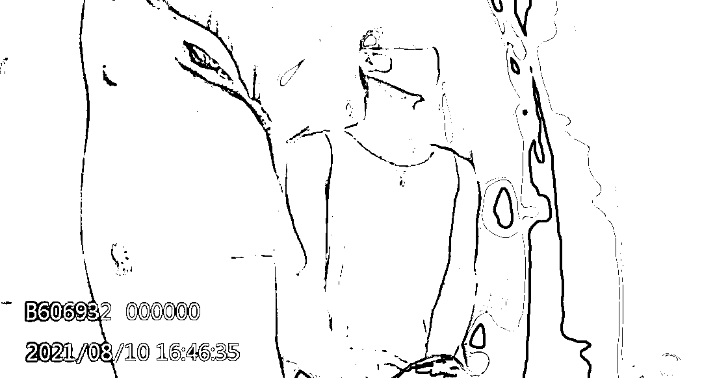

# 成功“反杀”！女子被骗 17 万元后，骗子却真爱上了她...

> 原文：[`mp.weixin.qq.com/s?__biz=MzIyMDYwMTk0Mw==&mid=2247519725&idx=1&sn=a7f183da842a892ede2e28b1d5c1401b&chksm=97cb46d5a0bccfc371a9c5b0887f620520f5b467ef06b6cfe1619d19f6d4dd275a80cf525e11&scene=27#wechat_redirect`](http://mp.weixin.qq.com/s?__biz=MzIyMDYwMTk0Mw==&mid=2247519725&idx=1&sn=a7f183da842a892ede2e28b1d5c1401b&chksm=97cb46d5a0bccfc371a9c5b0887f620520f5b467ef06b6cfe1619d19f6d4dd275a80cf525e11&scene=27#wechat_redirect)

两个素未谋面的人

在网上通过嘘寒问暖

产生一段“虚无缥缈”的感情

一旦陷入其中便不能自拔

当心！！！

你可能掉入“杀猪盘”陷阱

近日

江苏省江阴市公安局根据报警人线索

对一起“杀猪盘”电信网络诈骗案件

境外嫌疑人进行持续跟进

最终成功将其抓获

**     杀猪盘被骗 17 万**

2021 年 1 月

江阴姑娘小佳（化名）在微信上

结识了名叫“老土文化”的男子

双方很快发展成男女朋友

随着恋人关系渐入佳境

对方开始怂恿小佳进行“投资”

于是小佳在其推荐的平台上

按照指示开户进行美元和英镑炒汇

**前后共计投入 17 万元** 

直至 1 月 31 日发现平台无法提现

**此时的小佳才恍然醒悟**

**自己是被“杀猪”了！**

民警接到小佳的报警后

立即固定好相关证据

经查证这是一起由境外诈骗团伙实施的

典型“杀猪盘”诈骗案件

**骗子动了真感情**

2 月上旬

民警在与小佳定期联系的过程中

小佳反映有个“张一川”的微信号加她好友

自称就是那个曾经骗她的人

民警立即跟进

全程指导小佳与其聊天

防止发生二次诈骗

经过一段时间的交流

民警从“张一川”口中了解到

他目前人在土耳其

是诈骗团伙的业务员

该诈骗团伙结构复杂、缜密

团伙头目要求业务员诈骗得手后

就注销微信账号不留痕迹

但自己对小佳产生了感情

才自发与其进行微信联系

“张一川”微信账号注销后

又先后使用其它多个微信与小佳继续联系

**为爱奔赴被“反杀”**

民警发现嫌疑人对小佳的感情

越来越强烈

并自曝已经回国

称其真实姓名为张某（化名）

想与小佳成为真正的男女朋友

办案民警将计就计

指导小佳以疫情防控

不方便离开本地为由

要求张某到江阴见面

8 月 10 日

在获悉张某已来澄后

办案民警随即通过小佳微信

要求其进行核酸检测

并在他返回居住旅馆时

将其一举抓获

经审查

张某交代了境外诈骗团伙作案流程

**“只骗中国境内的中国女性，我们不骗外国人”**

2020 年 9 月，张某应网游好友邀约一起去土耳其从事诈骗活动，与土耳其团伙在虚拟社交平台取得联络，由对方安排机票、住宿、接应等事宜，对方规定成员之间禁止过问个人隐私，更不允许留取联系方式。

“我们在广州汇合，老板给我们每人都取了小名，我叫“凤凰”，有一个来自广西的“阿诺”，后来在土耳其跟我在一组，其他的人也都到了土耳其从事电信诈骗。在酒店待了几天有人送我们到机场，我们坐上了飞往伊斯坦布尔的飞机，下了飞机在机场等了另外一批人，之后就有车来接我们到公司。”

诈骗公司距离机场一个多小时车程，张某等人生地不熟，根本不清楚自己身处何地。看上去有些偏僻的乡下，一幢三层居民楼就是他口中的“公司”，一楼是食堂，二楼是办公室，三楼是宿舍。“第一天到的时候，主管“阿洋”给我们开会，意思是不管之前有没有干过电信诈骗，只要三个月不开单就罚款。把来土耳其的机票以及在所有生活开销全部赔出来，拿不出钱就不让走。”

主管“阿洋”说完之后就开始分组，约四人一组，共三组，之后由组长开始进行“入职培训”。

诈骗公司养了很多微信账号，包装成各行各业的优秀男士，设定角色，包括名字、年龄、籍贯、工作以及照片和视频，让“业务员”持续更新朋友圈来维护账号。

诈骗公司搭建虚假投资平台，被害人在该平台的所有交易均由公司客服操控，组长根据具体情况指令客服进账之后要不要杀猪，或是以小盈利返现给被害人之后吸引更大的资金。

**揭露“引粉”“养猪”“杀猪”全过程**

**1**

**“引粉”：**由组长们在陌陌等聊天软件上去寻找一些中国境内的单身或者离异女性，**年龄通常在 30 多岁，有一定经济基础。**

**2**

**“养猪”：**业务员以高富帅的角色跟女性加微信聊天，慢慢建立感情、博取信任。时机成熟后，**通过让被害人帮忙登陆“光大证券”等平台试探被害人。**

**3**

**“杀猪”：**教被害人注册平台账号，然后先以小金额充值进去之后**产生小额的盈利**，在被害人尝到甜头之后，慢慢的诱骗被害人投入大额资金。在被害人要求出金的时候，再以**收取个人所得税、保证金等名义再杀一刀**，直到被害人发现被骗为止。

**警方提醒**

**一切爱意都是在“养猪”**

**一切目的都只为“杀猪”**

**以为遇到了真命天子**

**对方却是受人指示的“刽子手”**

**最后，各位听张某一句劝吧：**

来源：平安无锡

← 向右滑动与灰产圈互动交流 →

