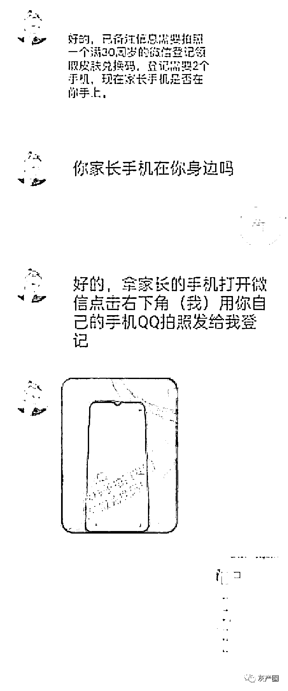
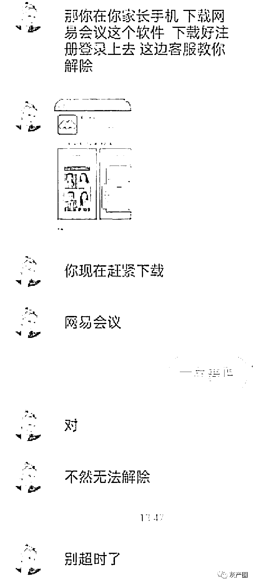
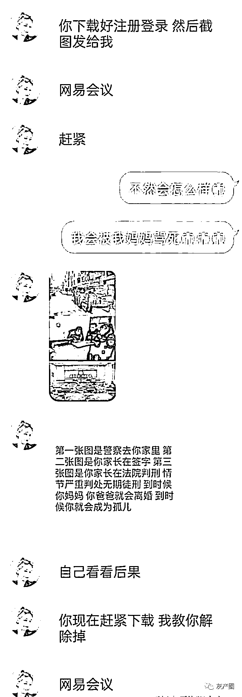
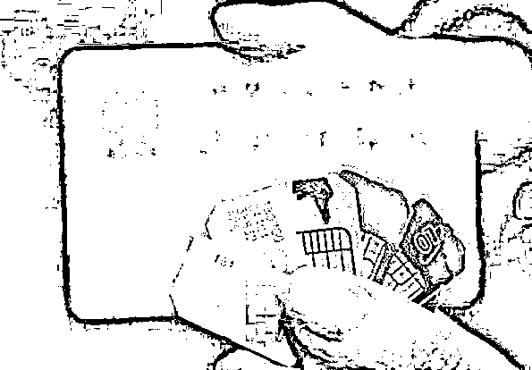

# QQ 群里领“福利”？小心遇骗局！骗子的这些“把戏”要牢记→

> 原文：[`mp.weixin.qq.com/s?__biz=MzIyMDYwMTk0Mw==&mid=2247519725&idx=2&sn=30da7b850c88e57c1cc7861809fcef3a&chksm=97cb46d5a0bccfc384066fca8473b1e594bc913d812cf941d35ffa24802d5c3c766bde64fdad&scene=27#wechat_redirect`](http://mp.weixin.qq.com/s?__biz=MzIyMDYwMTk0Mw==&mid=2247519725&idx=2&sn=30da7b850c88e57c1cc7861809fcef3a&chksm=97cb46d5a0bccfc384066fca8473b1e594bc913d812cf941d35ffa24802d5c3c766bde64fdad&scene=27#wechat_redirect)

下周，中小学生们陆续开学

在刚刚过去的暑假里

这群小朋友过得如何呢？

蜀黍收到消息

**有小部分人好像不小心“掉坑”里了**

这是怎么回事呢？

我们一起来看看

**QQ 粉丝群里的“领福利”？别信！**

8 月 20 日，林同学被拉进了“时代少年团直播互动”QQ 群，随后群里跳出了一则关于领福利的内容。抱着试试看的心态，林同学添加了该 QQ 号，对方告诉她**只要把自己微信的余额全部支付就可获得双倍奖励**。于是，林同学通过对方提供的二维码，支付了全部的余额 120 元。

付款成功后，林同学却未收到“双倍奖励”的返利，再次通过 QQ 联系对方，对方称**需要她添加财务工作人员的 QQ 才能处理**。添加“财务人员”后，对方以林同学“年纪太小，福利领取通道未打开”，需要林同学拿自己父母的手机进行操作。

可当林同学拿着自己妈妈的手机扫描对方发来的二维码后，**对方却称由于林同学在付款时操作延时，导致返利失败**。如不及时处理，后台将一直扣其妈妈银行卡里的钱。 

这可把林同学急坏了

生怕被妈妈责备

她赶紧问对方这种情况该如何处理

于是，林同学进入了

对方设下的又一个“圈套”中

**不按要求操作会成为孤儿？别怕！**

在对方的要求，林同学下载并注册了“网易会议”。**期间，对方还向林同学发来了一张图片，称如果林同学不按要求操作，之后会有警察到她家对她妈妈进行处理**，之后法院会判刑，最终林同学甚至会成为孤儿。

在进入视频会议后，**对方让林同学开启“屏幕共享”功能**，并让林同学报出了妈妈的银行卡卡号并查看了手机收到的短信验证码。**不一会，林同学手里的妈妈手机就收到了一条扣款 9999 元的短信通知**，财务工作人员告诉林同学这些钱只是作为“保证金”，之后会通过支付宝退回。可林同学等了好几个小时一直未收到，这时林同学联系对方时发现对方已将她拉黑，林同学才发现自己被骗了，在妈妈的帮助下拨打了 110 进行报警。

如此看来

林同学遭遇的是

**常见的返利骗术的“升级版”**

在林同学遭遇的骗术中，一开始骗子**诱导受害者支付了自己微信里的余额**，之后**以“年纪太小”为由**要求受害者拿自己父母的手机进行后续操作；随后又**以“操作超时”为由**要求受害者下载指定的软件，并**利用“视频会议”和“屏幕共享”等功能**获取到受害者父母的银行卡信息和短信验证码，从而最终获取钱款，达到诈骗的目的。

厦门警方梳理暑假期间的警情发现

学生朋友最容易上当受骗的

三类骗术分别是：

**返利、网络游****戏、****冒充 QQ 好友**

**↓↓↓**

其中网络游戏骗术中，骗子往往以出售游戏外挂、游戏代练、解除游戏账号冻结、解除游戏防沉迷限制等为事由，诱骗受害者汇款实施诈骗；而冒充 QQ 好友骗术中，骗子往往以“遇交通事故需救治或赔偿”、“病重需手术”、“支付受限帮忙付款”等急危情况等事由，诱骗受害者转账汇款。

**警方提醒广大学生和家长**

不要随意轻信“扫码送福利”、“扫码返利”等活动信息，对于来历不明的二维码不要随意扫描，避免将个人资金转入非法支付平台，谨防上当受骗或个人财产损失。此外，家长多和孩子交流沟通，让孩子适度参与娱乐性活动，但不要过分沉迷于网络游戏。最后，家长要管理好自己的手机和银行卡，保护好自己的资金安全。

**反诈小链接**

开学后，学生及家长们

又该注意哪些诈骗套路呢？

**一**

冒充老师、校方行骗家长：

1、骗子假借老师的名义致电家长，在电话中谎称孩子在学校里发生意外或突发急病被送往医院，催促家长通过转账缴纳手术费用的方式对受害人实施诈骗。

2、假借学校名义给家长群发“学生品德操行评定表”等诈骗短信，实际上在短信中带有木马病毒的网址链接。家长在点击链接之后，不法分子就将木马植入到家长的手机中，并借此获取银行账号、密码等关键信息。

**【提醒】**

接到此类电话、短信，家长应第一时间主动与校方取得联系，校方一旦发现有此类情况，也应及时通过相应渠道发布预警信息。‍

**二**

网上购物

以低价、二手等虚假信息诱惑买家，并借助知名电商平台、二手交易平台进行诈骗，以各种理由让买家先付款。

**【提醒】**

学生朋友在网购过程中，尽量选择正规大平台购物，不建议通过线下交易。‍

**三**

买卖手机卡、银行卡

用自己的身份证办个手机卡、银行卡，转手“卖”给别人，就能拿到一笔可观的钱，这似乎是个无本万利的买卖。

可是，一般人根本不会有用他人身份证注册手机卡、银行卡的需要，凡是需要这么做的，往往意味着其行为具有一定的法律风险。对出借“两卡”的人来说，很有可能给个人征信带来麻烦，甚至还要因此承担法律责任。

**【提醒】**

对涉世未深的学生来说，在警惕这类电信诈骗的同时也需要明白，获得合法收入有许多合理路径，可是违法的事情坚决不能做。‍

来源：厦门市反诈骗中心 厦门日报社新媒体中心联合出品  

← 向右滑动与灰产圈互动交流 →

