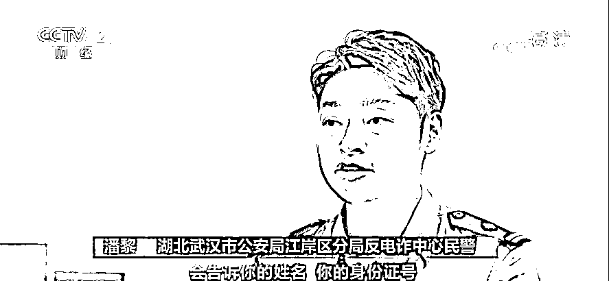

# 千万别信！“注销支付宝学生账户”骗局曝光！能说出你的身份信息、毕业学校…有人已“中招”！

> 原文：[`mp.weixin.qq.com/s?__biz=MzIyMDYwMTk0Mw==&mid=2247519725&idx=3&sn=e2622149ae96fd409e29db6db9a4705d&chksm=97cb46d5a0bccfc33adee66724ff70f91e33cb77bc05dc2f191a007baedd41309ad0e4f94369&scene=27#wechat_redirect`](http://mp.weixin.qq.com/s?__biz=MzIyMDYwMTk0Mw==&mid=2247519725&idx=3&sn=e2622149ae96fd409e29db6db9a4705d&chksm=97cb46d5a0bccfc33adee66724ff70f91e33cb77bc05dc2f191a007baedd41309ad0e4f94369&scene=27#wechat_redirect)

今年三月，银保监会等五部委联合发布通知，明确“小额贷款公司不得向大学生发放互联网消费贷款，未经监管部门批准设立的机构一律不得为大学生提供信贷服务”。

大学生网贷政策收紧，支付宝、微信等用户量庞大的金融服务机构也纷纷下调了相应的大学生群体消费、贷款额度。而没有想到的是，诈骗分子居然紧随其后，以注销、更改支付宝学生账户为由，实施诈骗。

警惕“注销支付宝学生账户”诈骗

[`mp.weixin.qq.com/mp/readtemplate?t=pages/video_player_tmpl&action=mpvideo&auto=0&vid=wxv_2022188554973413382`](https://mp.weixin.qq.com/mp/readtemplate?t=pages/video_player_tmpl&action=mpvideo&auto=0&vid=wxv_2022188554973413382)

△央视财经《经济信息联播》栏目视频

**诈骗电话录音：**您之前在大学期间，我们支付宝平台给您开通“花呗”与“借呗”，那边有没有在正常使用？因为国家明令禁止学生信息还有校园信息，不允许存在各大金融平台上，那您当时开通支付宝的时候填写的是学生账户信息，现在需要把它撤销关闭，并且把它改换成您现在的社会人士身份信息再继续使用。 

电话里，正在上演的就是一出“角色扮演”。西藏林芝的 90 后年轻人小王，前不久就接到了自称金融服务机构客服的电话。

**西藏林芝市民 小王：**接到电话之后，他能够准确地讲出我的姓名、我上的大学、我什么时候毕业，以及我现在的年龄，然后他就以国家在 3 月份的时候出台规定，要把学生账户规范起来。学生账户是不能在比如“花呗”“借呗”这上面进行借贷的行为。

湖北的小刘，刚刚研究生毕业不久，今年 7 月底她也接到了相似的电话。

**湖北武汉市公安局江岸分局反电诈中心民警 潘黎：**他们给学生拨打电话，会告诉你的姓名、你的身份证号以及你学校的相关信息，目的就是为了能够跟你建立信任感。

能够准确地说出自己的身份信息和毕业院校，小王和小刘都对电话另一端放下了心防。

**诈骗电话录音：**我这边先教你查询一下是否存在学生账户，稍后你自己在支付宝里面更改就可以了，好吗？打开支付宝点击右下角“我的”，再点击总资产进去，查看一下你的“借呗”额度。 

前面还是说是教用户查询所谓的“学生账户”，怎么立马又变成了查询“借呗”额度？事实上，**诈骗分子以此为障眼法，为的是掌握电话一端的用户，到底能借贷多少钱**。

清空“学生账户” 实为骗取用户贷款

所谓把“支付宝学生账户”清零，是将“借呗”里的贷款额度借贷出去，转成现金。**诈骗分子盯上的就是受害者贷出来的真金白银**，接下来，他们会诱骗受害者把借贷出来的钱转到他们的账户上，这个过程又是怎样一步步实施的？

[`mp.weixin.qq.com/mp/readtemplate?t=pages/video_player_tmpl&action=mpvideo&auto=0&vid=wxv_2022189179236843524`](https://mp.weixin.qq.com/mp/readtemplate?t=pages/video_player_tmpl&action=mpvideo&auto=0&vid=wxv_2022189179236843524)

△央视财经《经济信息联播》栏目视频

**西藏林芝市民 小王：**我去把“借呗”的钱借出来，放到我的银行卡，**转到他提供的自称银保监会的人的账号里面**，他说“借呗”清零了之后，自称银保监会的人会马上就把钱返回我的支付宝“借呗”里面。 

小王告诉记者，自己对诈骗分子要求银行卡转账的操作也产生过怀疑，但诈骗分子一番话，让自己信以为真。

**西藏林芝市民 小王：**他说我的钱从“借呗”里面提现转出来之后，会收到中国银联给我下发的一个短信，钱再从银行卡转到他提供的账号里面的时候，他就会让我要发这样一条短信给中国银联，说本人向中国银联申请。 

根据小王提供的短信记录截图，**他在今年 7 月 24 日，先后 7 次向诈骗分子提供的账户转账，每确认转出一笔款之前，都会相应地收到了一条来自中国银联 95516 的转账验证码短信**，而在每次收到验证码短信并转账成功后，小王都给中国银联 95516 这个号码发送了短信，短信的内容是按照诈骗分子的要求，写上的所谓自愿取消学生账户，并要求中国银联把转账退回“借呗”账户的字样，以此作为给中国银联备案。

这让小王误以为是他每回复一条短信中国银联就会发一个验证码短信，事实上却是诈骗分子精心设计的骗局。记者向中国银联 95516 进行核实，得到的回复是：**来自 95516 号码的短信，均为中国银联系统自动发送验证码信息，而用户自己给 95516 号码回复短信，为无效操作**。

诈骗分子之所以让受害者回复这种无效短信，就是让他们设计的骗局听起来更真实。同样遭遇如此骗局的还有江西赣州的小张，据办案人员介绍，小张也是在诈骗分子的蛊惑下，被骗取 82000 元的贷款。

*   **任何要求注销贷款账户为由的转账均违法**

[`mp.weixin.qq.com/mp/readtemplate?t=pages/video_player_tmpl&action=mpvideo&auto=0&vid=wxv_2022190736783245315`](https://mp.weixin.qq.com/mp/readtemplate?t=pages/video_player_tmpl&action=mpvideo&auto=0&vid=wxv_2022190736783245315)

△央视财经《经济信息联播》栏目视频

记者咨询支付宝客服了解到：支付宝是通过身份证实名认证，不存在所谓学生账户更改为工作账户的问题。警方同时提醒：任何要求用户注销贷款账户为由的转账行为，均系违法行为。 

来源：央视财经（ID：cctvyscj）

← 向右滑动与灰产圈互动交流 →

