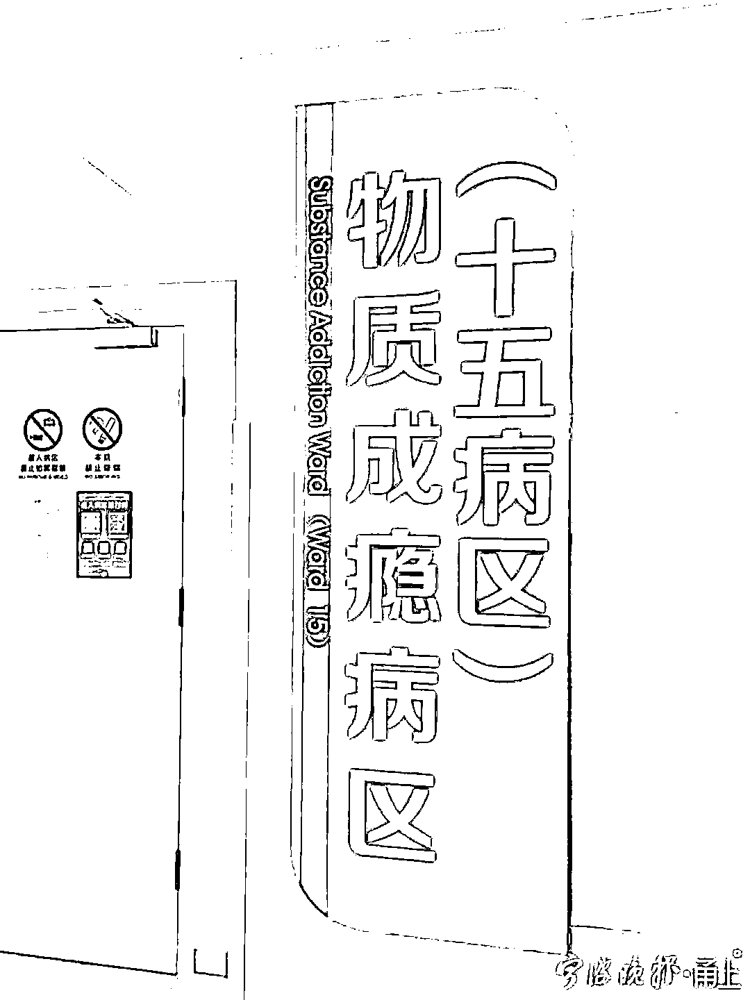

# “对钱没感觉”？男子 10 个月败掉 600 多万元，连房都卖了！医生：这是病，得治！

> 原文：[`mp.weixin.qq.com/s?__biz=MzIyMDYwMTk0Mw==&mid=2247519725&idx=4&sn=7c1c5690cd8bba7efc2be7745317d421&chksm=97cb46d5a0bccfc3f713d99f264426930dc9eb638ed2350bb1b43b521a29e06bd0bd9bd9d782&scene=27#wechat_redirect`](http://mp.weixin.qq.com/s?__biz=MzIyMDYwMTk0Mw==&mid=2247519725&idx=4&sn=7c1c5690cd8bba7efc2be7745317d421&chksm=97cb46d5a0bccfc3f713d99f264426930dc9eb638ed2350bb1b43b521a29e06bd0bd9bd9d782&scene=27#wechat_redirect)

如今，各种致瘾源可谓五花八门，除了常见的烟酒等物质成瘾，还有各种行为上瘾。近日，宁波市康宁医院物质成瘾病区收治了一位**网络赌博上瘾**的患者，这位男子因为沉迷赌博无法自拔，**在不到 1 年时间里输掉了 600 万元**。等家人发现的时候，他已经负债累累，无奈只能把他送到医院治疗。

**因为赌博他债台高筑**

**30 岁的小李（化名）有一份稳定、体面的工作，还有一个幸福的家庭。去年疫情期间，小李因为不能外出，长时间呆在家里，开始尝试网上赌球打发时间，当时小试了几把，有赚有赢，不过投入不大。疫情过后，小李恢复正常的工作状态，就没有再赌。** 

**从去年 9 月开始，小李因为生活和工作上的不如意，又开始网上赌球，刚开始只是因为工作压力大、想放松一下，偶尔会在周末的时候下注几百元。刚开始，小李的手气不错，好几次投入几百元都能赢到几千元，这让他觉得与工作相比，还是赌博来钱快，有点兴奋。**

**尝到甜头后，小李赌球越来越频繁，下班回家赌，有时候上班空闲赌，只要一有球赛就必赌无疑。他投入的赌博金额也越来越大，从最初的几百元发展到一次下注几万元。小李想着，投入大，赚得也大，只要再让他赢了一两次，自己就可以少奋斗很多年了。可这以后，好运气再也没有降临到他头上。**

** "在赌球的时候，我感觉钱就是个数字，**像玩游戏一样对钱没感觉。**”小李说，因为输多赢少，他已经出现了亏空，**家里的积蓄用光了，就找亲友借、信用卡套现。**亲友借的钱也亏了，他就更想翻本，他总抱着下次总会赢回来的心态，结果越陷越深。发展到后来他**甚至卖掉房产以换取赌球的本金**。等家人察觉到小李在赌球，他已经陷得太深、难以回头了。每次输光了他总是会后悔，也尝试自己控制不去赌球，但坚持不了几天又旧疾复发。**

**就这样，**短短 10 个月时间，小李已经输掉了 600 多万元。****

**因为债台高筑，债主经常找上门来，小李所在的单位也知道了他总是借钱不还的事情。父母焦躁、不解，爱人伤心欲绝，赌博已经对小李的家庭关系、工作等造成很大的影响，家庭处于破碎边缘，以往和谐温暖的家庭氛围被小李亲手毁了。**

****

**无奈之下，小李的家人求助心理医生，医生告诉他，像这种情况**属于行为成瘾，需要专业的干预。****

****赌博成瘾是一种精神行为障碍****

****“像小李这种情况属于行为成瘾的一种，专业的疾病名称叫**‘赌博障碍’**，是一种**以持续或反复发作的赌博行为为特征的精神行为障碍**。”市康宁医院物质成瘾科主任桂冬辉介绍，赌博障碍与易冲动的个性特点密切相关，患者明知赌博等行为有害，但仍有完成该行为的冲动。赌博障碍不仅对个人的生活、社交、工作等方面造成影响，还给家庭及社会带来沉重的负担。**** 

************“赌博障碍患者存在多巴胺、去甲肾上腺素等多种神经递质系统的失调，**由于大多数患者认为无法治疗，仅有极少数、研究提示不到 10%的患者会寻求正规治疗。**”桂冬辉说，赌博障碍患者的赌博行为具有持续性、发作性或反复性的特点；在起始、频率、强度、持续时间、终止及场合方面失去控制。在这类患者的生活中，相较于其他生活兴趣及日常活动，赌博行为的优先程度不断提高，尽管赌博导致了不良后果，但是仍然继续甚至增加赌博。****

****赌博成瘾患者的治疗是一个复杂的问题，必须针对患者具体病情，制定系统性个体化的治疗方案。****

****桂冬辉介绍，经过一个月多的药物治疗、心理治疗配合家庭治疗等综合治疗手段，医生不断帮助小李强化戒赌动机，控制其赌博欲望和冲动，修复家庭关系和支持。如今小李已经康复出院，随访时情绪稳定。小李对戒除赌瘾充满了信心，他还表态要努力赚钱还债，好好过日子。****

****来源：宁波晚报**** 

********

****← 向右滑动与灰产圈互动交流 →****

********