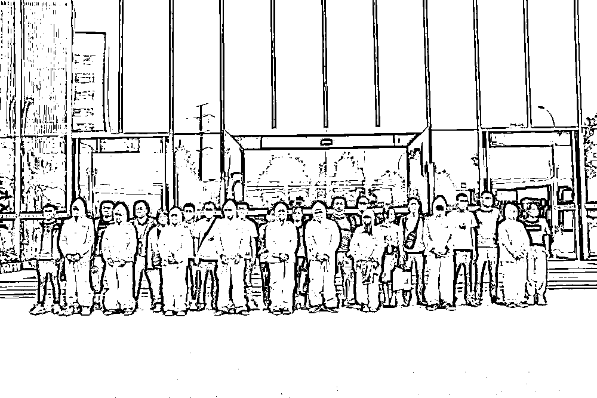

# 两年圈钱 1.2 个亿！揭穿“神话币”电诈骗局

> 原文：[`mp.weixin.qq.com/s?__biz=MzIyMDYwMTk0Mw==&mid=2247519725&idx=6&sn=5617318acdfb7611291d90fc61b63ccf&chksm=97cb46d5a0bccfc30901bdd937af81a769f8b735beae18734575e52c04ef66ea6424c4cd4fd5&scene=27#wechat_redirect`](http://mp.weixin.qq.com/s?__biz=MzIyMDYwMTk0Mw==&mid=2247519725&idx=6&sn=5617318acdfb7611291d90fc61b63ccf&chksm=97cb46d5a0bccfc30901bdd937af81a769f8b735beae18734575e52c04ef66ea6424c4cd4fd5&scene=27#wechat_redirect)

[`mp.weixin.qq.com/mp/readtemplate?t=pages/video_player_tmpl&action=mpvideo&auto=0&vid=wxv_2022377244781789184`](https://mp.weixin.qq.com/mp/readtemplate?t=pages/video_player_tmpl&action=mpvideo&auto=0&vid=wxv_2022377244781789184)

犯罪团伙紧盯有资金实力的投资者，设定“人设”、制定“话术”，由引流团队带入群，“资深讲师”线上“秀实力”，“水军”一旁鼓动，一旦受害人上钩，便火力全开授课“洗脑”，诱使受害人通过虚假交易 App 注入资金炒比特币、“神话币”，最后毁灭证据，卷款走人。不到两年时间，一个上千人的诈骗团伙以这样的手段使全国 500 名受害者的 1.2 亿元迅速“蒸发”。变换手段的“杀猪盘”电信网络诈骗案再度为全社会敲响反诈警钟。

2020 年 5 月 11 日，专案组办案人员对犯罪嫌疑人进行审讯。（四川达州市公安局供图）

**（一）平台跑路，投资者血本无归**

2019 年 5 月，上海市民方杰（化名）收到一条微信好友申请。通过验证之后，对方将他拉入了一个投资群，随后他根据群里发的链接转入了一个网上聊天室。聊天室里一位只能听见声音不见模样的讲师正侃侃而谈。按照讲师推荐的股票，方杰小试牛刀，很快小赚了一笔。

一个月后，正在直播的聊天室里突然跳出一个交易页面。讲师带着几分不情愿，神秘地讲起了“神话币”，并称自己已挣了不少，还说“神话币”有位于国外的度假村项目托底，能够以币换房。

过了几天，群里有人称自己已经去专门考察过，并陆续发出度假村的照片，这一切都让方杰对“神话币”深信不疑。很快，他便根据对方提供的网站下载了交易 App，并注册了账户。

第一次充值，方杰只投了 698 元。第二天交易 App 显示，已经获利 100 多元。5 天后，方杰孤注一掷，再次投入资金近 15 万元，购买了 6.8 万多个“神话币”，看着“神话币”噌噌上涨，方杰心中暗喜，然而两个月后，却发现 App 不能再登录，客服也联系不上，才恍然大悟意识到被骗。

被“神话币”“下套”的不止方杰一人。四川省达州市民张丽（化名）也被以类似的方式骗走近 14 万元。2020 年 1 月至 5 月，四川省达州市公安机关经过缜密侦查，发现这些案件背后是一个以夏某、孙某光为首的特大跨境电信网络诈骗集团。

该集团先后在境外多地设立诈骗窝点，以投资比特币、“神话币”等方式诈骗境内中国公民，涉案流水资金高达 4 亿余元，涉案团伙成员近千人。

2020 年 5 月 12 日至 14 日，在公安部统一指挥下，四川省公安厅组织 3000 余名警力，奔赴全国 15 个省区市开展统一收网行动，共抓获犯罪嫌疑人 868 人，逮捕 492 人。经过一年多艰苦奋战，该案共制作证据卷宗 1687 卷，移送起诉人员 559 人，扣押涉案房产、资产等近亿元。

2020 年 5 月 13 日，专案组办案人员从成都押送犯罪嫌疑人回达州。（四川省达州市公安局供图）

**（二） 一人分饰多角，反向“喊单”、虚假“炒币”交易榨干投资人**

参与本案侦查的达州市公安局达川区分局刑侦大队民警告诉记者，本案中“导师”诱导投资人购买的虚拟货币其实都是虚假交易，“神话币”更是子虚乌有。

根据公安部有关平台查询受害人银行卡资金流向信息发现，这些资金全部流入了电信网络诈骗账户。

诈骗集团是如何一步步得逞的？办案民警向记者详述了作案过程：

该集团下设业务部、讲师部、行政部、客户部、技术团队、财务部，各司其职，管理严密。

集团首先对网上招募来的业务员进行分组，每组 10 人左右，通过统一的模板、话术对他们进行培训。每名业务员领取 5 部以上的手机进行“养号”：一部手机注册一个微信号，每个微信号分配不同角色，主要包括老师、群助理、“白富美”、股票“小白”、资深股民等。

客户进入群后，业务员便一人分饰多角，烘托讲师实力雄厚。待客户添加讲师或讲师助理好友后，便被拉进另一个大群。群内人员规模一般 100 至 200 人，但真实客户只有 20 至 50 人，其余全是业务员。

完成对客户的第一波“洗脑”后，第二阶段便是开通直播间进行授课。团伙人员继续按照既定的话术夸赞讲师，并透露跟着讲师炒股赚钱的信息。随后，讲师会推出比特币或“神话币”产品，宣扬目前正是虚拟货币的绝佳投资机会，团伙人员也一拥而上通过虚假话术跟风。

上钩的客户在犯罪团伙指定的交易平台登录后，选择入金通道。这些入金通道全部为私人账户，客服确认后，为客户在平台充值相应金额。

接下来的炒币过程由讲师“喊单”完成，即由讲师决定买卖的价位和时间。对于购买比特币的客户，受害人通过 App 看到的涨升曲线与比特币实盘有几秒钟的时间差，犯罪嫌疑人以反向“喊单”的方式让客户误以为是正常的投资亏损；对于购买“神话币”的客户，犯罪嫌疑人则任意操控数据，并以 180 天的“锁仓期”为由，限制客户出金。

待犯罪集团完成资金占有后便关闭交易平台，收回所有工作手机，毁灭所有手机数据，人间蒸发。

2020 年 5 月 16 日，“509”专案组办案人员押送犯罪嫌疑人回达州。（四川省达州市公安局供图）

**（三）打击黑灰产业链，全民参与构建反诈新格局**

近年来，电信网络诈骗手段不断翻新、技术手段升级，呈现周期长、环节多、多手段叠加、跨平台实施等特点。受害对象已逐渐从老年人向中青年群体转移。特别是以“区块链”“虚拟货币”等新兴概念为噱头的电信网络诈骗更是让许多人防不胜防。为了逃避打击，诈骗团伙将窝点设于境外，通过网络招募业务员，一些人不明就里，最终沦为共犯。

办案民警介绍，本案中有部分犯罪嫌疑人是初入社会的大学生，冲着没有门槛的入职条件和比同类型公司高几百元的底薪，误入歧途当起了“业务员”。

办案民警表示，治理电信网络诈骗，一方面应继续深入开展“断流行动”，严厉打击蛇头和偷越国（边）境人员，切断偷渡通道。另一方面，要继续加大对贩卖银行卡、电话卡、个人身份信息的黑灰产业链的治理，深入开展“断卡行动”，从源头上铲除电信诈骗的滋生土壤。同时，还要加大宣传力度，使反诈宣传更加深入人心，各地各部门应当切实履职，形成全民参与的反诈格局。

来源：新华社,央视网

← 向右滑动与灰产圈互动交流 →

