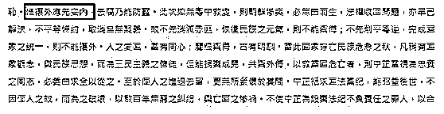
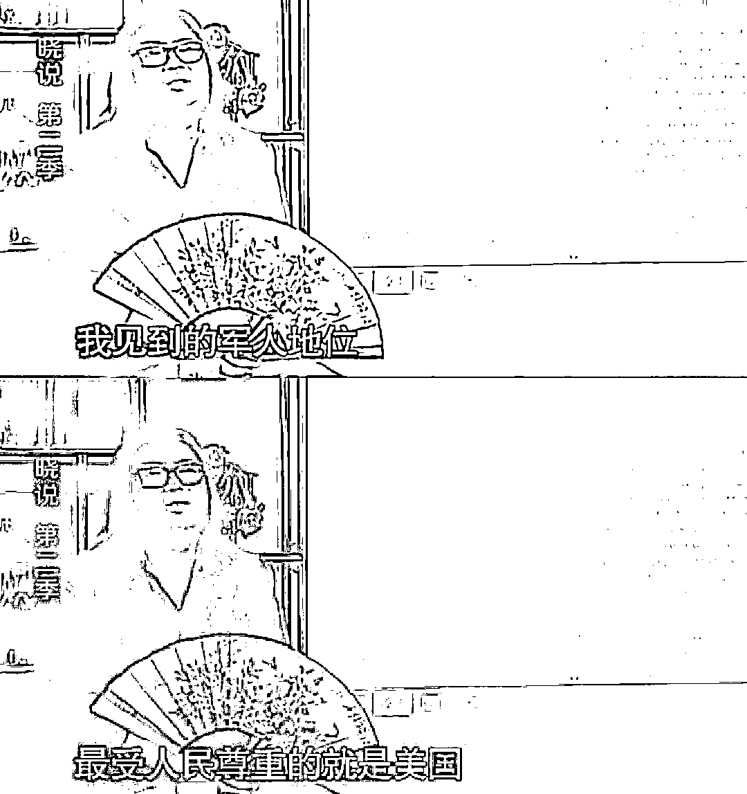

# 高晓松要凉了！被点名批评！美国国籍，参拜洗白靖国神社，精日舔美吹印度！

> 原文：[`mp.weixin.qq.com/s?__biz=MzIyMDYwMTk0Mw==&mid=2247519787&idx=1&sn=e495b7266ac1c32ec06bb91bd60d7445&chksm=97cb4513a0bccc05df2260fd30116324ede0c280f58baae05c4a5164c86aa71476f0da0ef20a&scene=27#wechat_redirect`](http://mp.weixin.qq.com/s?__biz=MzIyMDYwMTk0Mw==&mid=2247519787&idx=1&sn=e495b7266ac1c32ec06bb91bd60d7445&chksm=97cb4513a0bccc05df2260fd30116324ede0c280f58baae05c4a5164c86aa71476f0da0ef20a&scene=27#wechat_redirect)

这段时间娱乐圈整治的风头正紧，一些明人明星相继暴雷，网传高晓松也在其中
高晓松 2015 年 7 月入职阿里巴巴出任阿里音乐董事长。2016 年 9 月,阿里巴巴通过内部信的形式宣布高晓松卸任阿里音乐董事长,出任阿里娱乐战略委员会主席,并全面负责阿里大文娱的国际战略。”阿里这棵大树也遮不住高晓松了……因为高晓松被中国历史研究院点名 痛批！这回要凉了吧  全文有理有据，够高晓松喝一大壶的了

**昨日，某视频平台搜索《晓松奇谈》**

**无法正常显示，****疑似被下架，**

****引来众多网友关注和热议，**** 

**但截至目前搜索“高晓松”**

**视频源仍能正常播放。** 

**近年来，高晓松借《晓松奇谈》，**

**在网络上发表了一系列奇谈怪论，**

**属实称得上是“奇谈”。**

**但这里的“奇”并非“独特、新奇”，**

**而是移花接木、断章取义、**

**制造和传播谣言，**

**用历史虚无主义抹黑历史文化。**

**甚至力挺靖国神社、**

**为日本军国主义招魂。**

**作为公众人物，影响极其恶劣。**

**一、洗白****何应钦****、****蒋介石****，****称其为****坚定的抗日派，**

**否认****蒋介石****消极抗日与****积极****剿共之实**

在《晓松奇谈》的《风流少帅张学良》一集中，高晓松宣称：

“何应钦怎么会是亲日派呢?何应钦是相当激进的反日”。

而事实是，何应钦担任军政务部长时，是著名的亲日派。以下为《岗村宁次回忆录》对何应钦的描述：

何应钦：“我任军政部长以来，就**提倡中日合作**。”、“中日相战，两败俱伤，结果将使共党势力扩大”。

（日）冈村宁次 / （日）稻叶正夫：《冈村宁次回忆录》，中华书局版 1981 年版

后高晓松又意犹未尽地说到：“蒋介石本身就是反日的”，否认蒋介石消极抗日。

而事实是，1931 年夏以来，在东北，日本先后挑起万宝山事件和中村事件，在华北，挑动石友三叛乱，策动阎锡山回晋，迫使张学良抽调东北军精锐入关弹压局面。在这种情况下，蒋介石采用“以不抵抗为抵抗”。

“蒋中正电张学良，谓现非对日作战之时。”——《中华民国史事日志》1931 年 7 月 12 日如此记录。

《中华民国史事日志》1931 年 7 月 12 日如此记录。

蒋介石在 1931 年 7 月 23 日《告全国同胞一致安内攘外》中宣称：“攘外应先安内，去腐乃能防蠹……故不先消灭赤匪，恢复民族之元气，则不能御侮；不先削平粤逆，完成国家之统一，则不能攘外。”（见《先总统蒋公思想言论总集》30 卷 150 页）

《先总统蒋公思想言论总集》30 卷 150 页

“九一八事变”三天后，蒋介石致电国民革命军暂编第一军第 21 师师长刘珍年，要求“不抵抗”：

“烟台刘师长勋鉴。哿辰电悉。日军侵鲁，已提出国际联盟。此时我国应上下一致，严守纪律，确定步骤，勿为日人借口。故先劝告民中（众）守秩序，遵公法，勿作轨外行动，以待国际之公理与国内之团结，须为有计划之举动。如果其海军登岸，则我方划出一地，严阵固守，以待中央之命令，此时须忍耐坚定，静镇谨守之。中正，养午。”

同时，蒋介石还给张学良发出如下指示：瀛眷及尊府家属想均已安全离沈。遥深系念。请代慰问。再青岛海军，鄙意可迅予集合塘沽。因在青或恐与日舰发生万一意外，集合塘沽，则在各国军舰监视之下，较为安全。请即酌行。中正，养印。

二、**胡说九一八事变因****张学良****而起****，**

**否定西安事变的正义性**

在《风流少帅张学良》一集中，高晓松说张学良晚年承认自己是“罪人中的罪魁”(指西安事变)，并阴阳怪气地说到：“国家被你(指张)弄成那样子，你就是想出名而已”。

此处，高晓松的立场已经是不认同“西安事变”。随后，他又补充：“抗战可以不那么早开始。”

可见，高晓松是完全反对国共建立统一抗日战线、反对停止内战一致对外的“西安事变”的。

同时，高晓松把九一八日军侵华的原因，也归结为“张学良导致九一八事变”

中外对于九一八事变的史实早已探察清楚，日本的侵略行径早已定性，高晓松简单说“张学良导致九一八事变的、乃至中日战争爆发”,实为不妥。

事实是日本早已制订了“先吞并中国东北，再染指华北，最后侵略中国大陆”的野心策略。将九一八的爆发的原因归于张学良，或把注意力放在日方宣称的“不扩大方针”上，只会被带入美化日本侵略、为日本政府脱责、洗白日本当局侵略行径的路径上去。

同时，张学良未曾后悔发动西安事变：

1992 年，张学良对唐德刚说：“至于你们问我，为什么会有西安事变，我只能这么说，我相信中国一定要统一，要枪口对外，不要再打内战了。这是我的一贯信仰，从东北易帜到西安事变都如此，谈不上什么后悔不后悔。”(《张学良世纪传奇(口述实录)》P1194)

更进一步来说“九一八事变”中的不抵抗，到底谁负主要责任？

下图为 1933 年蒋介石手令原件：“侈言抗日，立斩无赦”。

当时国军很多将士抵触“剿匪”，欲北上抗日，蒋介石为此下达了此手令。

从“济南惨案”到“九一八事变”前夕，再到“九一八事变”后，蒋介石的“不抵抗”政策是贯穿始终的。蒋介石都是“九一八事变”中“不抵抗”的作俑者和决策人。

张学良的确执行了蒋介石下达的命令，但是洗白蒋介石，只批张学良，用心为何？

**评价张学良理应坚持历史的态度，“西安事变”是完全正义的，对全民族统一抗战具有重大历史意义。**

高晓松却对张学良持全面批判态度，其目的无非就是意欲颠覆西安事变的正义性与历史贡献，进而否定国共合作统一战线的重要性。

顺便指出，高晓松还随口编造，把卫立煌的下半生“发”到了台湾。

在《风流少帅张学良》一集里，高晓松还言之凿凿地说到，“在西安事变中被张学良抓起来的一批人啊，什么陈诚、卫立煌、蒋鼎文跟着蒋介石去了台湾以后，出了一本诗集骂张学良发动西安事变……”

然而事实是，卫立煌 1949 年 1 月从南京逃往香港，1955 年 3 月返回大陆，终生未去过台湾。这是基本的常识，高晓松的谈史态度不得不让人怀疑。

中央档案馆：《毛泽东欢迎卫立煌回国的电报》1955 年 3 月 17 日

**三、参拜靖国神社，为日本军国主义招魂**

今年 8 月 15 日，日本投降日当天，高晓松此前认同日本靖国神社的一系列言行也被扒出。

据悉，高晓松在某一年 8 月 15 日去参拜了日本靖国神社，并录制视频大谈特谈自己的“感想”。

据高晓松透露，当天神社中的人不少。在参拜靖国神社一事上，他认为这些人是在祭奠自己的亲人，并说道：“当然是可以纪念的，这些人是亲人，我爷爷、我爸爸，就是进去祭奠他爷爷、他爸爸的。那是为国战死的嘛，也不是战犯。”

但凡有一点常识的中国人，都知道靖国神社是什么所在。

高晓松为侵略者辩护、为日本军国主义招魂的用心，令人齿冷。

**四、给民族英雄****郑成功****扣上****“大倭寇”****的帽子**

在高晓松另一个节目《晓说》的第二季 43 期节目中，他竟诋毁郑成功为“大倭寇”。

用“倭寇”攻击民族英雄郑成功，这绝不是意识形态分歧，而是要从根本上挖断中华民族精神，以所谓“历史趣闻”来传播历史虚无主义，真正用意是在舆论上与“台独”势力去中国化运动互相呼应。

郑成功是一位名副其实、光照千古的民族英雄，无论是国共两党，还是北洋军阀，或更早一些的大清王朝，对他都是敬重有加，年年祭典。

他最大的历史功绩就是收复台湾，而且是从有“海上马车夫”之称的荷兰人手里夺回了台湾。1661 年（明永历十五年，清顺治十八年）3 月，郑成功率大军横渡台湾海峡，经 8 个多月的浴血奋战，终于迫使荷兰殖民者于 1662 年 2 月 1 日在投降书上签字，收复了被外国侵略者占领 38 年之久的台湾之后，台湾世代民众尊郑成功为“开山圣王”。

郑成功在台湾不仅具有文化历史概念的意义，更具有中原政权法统延续的强烈象征。

无独有偶，在郑成功的出生地日本平户，每年郑成功忌辰的那一天都要举行公祭。日本方面这一举动，隐藏着借炒作郑成功生于日本而暗指台湾归属未定的野心。

但是，连日本都不敢公然给郑成功什么“名分”，高晓松却用“倭寇”一词把郑成功推到了日本一方，也推到了中国人民的对立面。

其人贼胆之大，骇人听闻！

再结合他的“著名”言论：“台湾是中国的固有领土并不准确”——我们对高晓松的用心和立场，还不容易作出判断吗？

该视频大陆禁播

擦亮眼睛，细读一下，这里所有的标题都令人触目惊心。

**五、热心“歌颂”美国、吹捧印度，**

**因为据说它们“民主”**

高晓松还讲到：“我见过的军人地位，最受人们尊崇的就是美国。”

结果爆出了美国警察当街虐美军军官陆军中尉纳扎里奥的事件。打脸相当快！

高晓松这段话，被中央政法委官方微博给直接挂了出来，然后讽刺道：

懂了！在美国这叫“尊重”。

为什么高晓松这么热心地“歌颂”美国呢？

在《晓说》第一季中，高晓松称自己为“华裔”。我是拿了美国国籍的华人。

他还在视频中说：“对中国最好的就是美国。”

高晓松还热衷于吹印度。

在他看来，印度之所以那么美好，是因为印度是一个民主国家。

反观我们呢，“统一了思想口径，统一了口径”，没有那么快乐。

但高晓松可能想不到，就是印度这样一个民主国家，在疫情来临的时候会爆发如此大的危机。

在高晓松快要结束印度话题的时候，他真心地感慨：“印度整个社会的平和，到处见不到警察，贫民窟里那么大但是犯罪率很低。”

到处见不到警察是件好事吗？

根据统计，在印度——

每小时都会有 3000 名女童成为“新娘”；

每天都会有四位妇女死于家暴；

每年都会有 1000 多名女性被硫酸毁容；

成千上万的婴儿被流产，其中 99%都是女婴......

这些都是“印度吹”不说的真相，去印度的贫民窟看看，那里才是最真实的印度。

**六、用“党卫军”公然攻击、污蔑我人民军队**

更过分的是，高晓松曾经公然攻击、污蔑我人民军队。

高晓松非常狂妄地说“听党指挥的军队叫党卫军”，“军队永远是属于国家的、属于人民的，永远不能属于任何一个党，**军队如果属于党，这个国家就完了**”。

什么是党卫军？

这是德国纳粹党的法西斯特务组织和军事组织，1946 年被纽伦堡国际军事法庭宣判为犯罪组织。

用“党卫军”来蔑称我们的人民军队——其心何其毒也！

早在 2010 年，高晓松就曾发布过微博，抹黑党的古田会议，污蔑我们党“在这确立了打土豪、当土匪的革命方向”。 

**七、奇谈谬论不计其数**

高晓松的“奇谈”远远不止上述这些……

标题：汉人无音乐……而且全怪老祖宗；

标题：汉人无音乐 都怪老祖宗

明朝是一个“三无”朝代；

再看一下网友们整理的他在直播间的胡言乱语：

**高晓松披着一件解读历史的外衣，**

**然而，**

**在他肥大的脱口秀袍子里藏着的**

**尽是包藏祸心的私货，**

**这些私货有一个总名称——**

**历史虚无主义。**

**历史就是历史，**

**历史容不得“奇谈”。**

**“奇谈”怪论的结局只有一个，**

**就是——**

**被历史埋葬！**

**综合整理自：**

1、思想火炬公众号：《高晓松的历史虚无主义传播与危害》
2、中国历史研究院微博、工业和信息化部网络安全产业发展中心，理水：《“九一八事变”不抵抗，谁之过？！》

3、中国历史研究院微博，王希亮：《九一八背后——日本险恶的“侵华共识”》
4、（日）冈村宁次 / （日）稻叶正夫：《冈村宁次回忆录》，中华书局版 1981 年版
5、郭廷以：《中华民国史事日志》，“中研院”近代史研究所 1979 年版 

6、徐泓.卫立煌海外归来揭秘[J].江淮文史,2017(03):81-86.

* * *

2011 不可忘:赶紧让这个外国人回自己的国家！ 

无为李爷:高晓松是影响特别坏的搞历史虚无主义者之一，遗祸无穷啊！可叹前些年无人管，任其胡说八道。

以史为鉴 V:网上说晓松奇谈胡说八道已经很久了，但是官媒点名批评还是罕见，看看阿里什么时候做切割

来源：微博那些事儿

← 向右滑动与灰产圈互动交流 →

