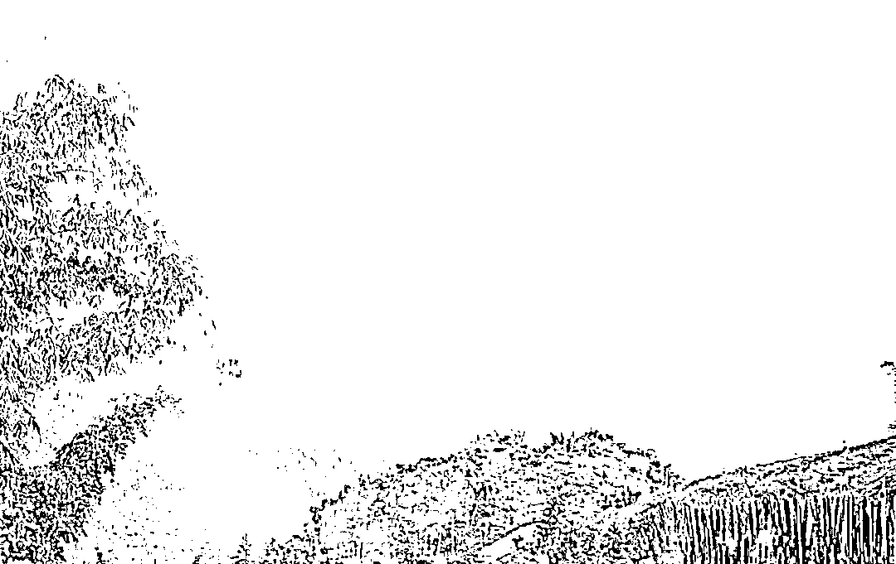
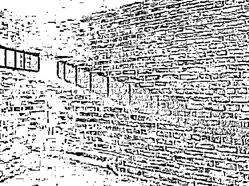
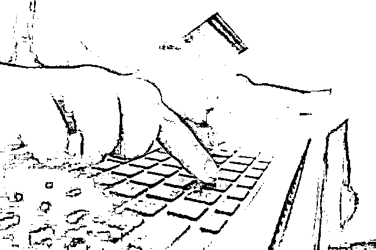
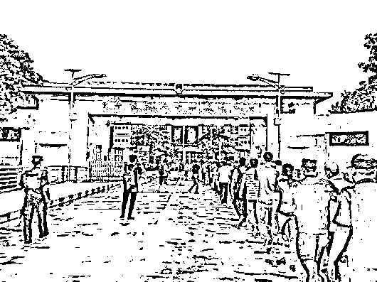
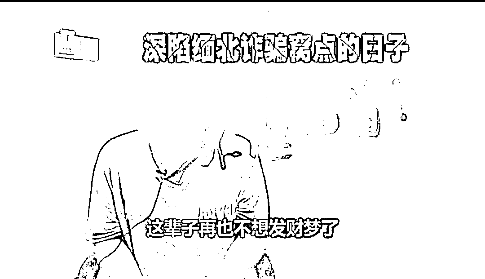

# “那里连自杀的机会都不会给你！”

> 原文：[`mp.weixin.qq.com/s?__biz=MzIyMDYwMTk0Mw==&mid=2247519787&idx=2&sn=0bd74546f3e28c1416122e69274d3d85&chksm=97cb4513a0bccc0517341606f268ab9d045409fd47e2b30537a178d9cb837dc0698cfe07f62d&scene=27#wechat_redirect`](http://mp.weixin.qq.com/s?__biz=MzIyMDYwMTk0Mw==&mid=2247519787&idx=2&sn=0bd74546f3e28c1416122e69274d3d85&chksm=97cb4513a0bccc0517341606f268ab9d045409fd47e2b30537a178d9cb837dc0698cfe07f62d&scene=27#wechat_redirect)

来到缅北的第一晚，阿贤就被关进了小黑屋。

枪托狠狠地砸到他脸上！

“我们花了这么多钱把你接到这，不干活怎么回本！”

接下来的一周，让阿贤毕生难忘：**每天只有三个馒头和两瓶自来水，不答应入伙就挨打。小黑屋，是专门为刚来不愿意干、捣乱、逃跑的人准备的。**

阿贤坐过牢，曾发誓再也不做违法犯罪的事情。

“这简直是一场噩梦。”要么是他被打到爬不起来，要么是对方累得实在打不动了。

被折磨了十多天，阿贤的身体跟精神都崩溃了。

**“给我的感觉就是监狱！”**

**黑暗中，他恍若隔世。仅仅一个多月前，阿贤还对缅北的高薪生活充满着无限遐想。**

2020 年，新冠疫情爆发，家住湖北孝感的阿贤几乎每天都宅在家，玩游戏成了他唯一的消遣。

“我的脚受过伤，有钢钉在里面，在工地里重活干不了。”4 月份复工复产以后，阿贤开始找工作，然而他本身文化程度不高，加上脚上有伤，一切并不顺利。

心灰意冷之下，阿贤再次回到游戏寻找慰藉。一个叫小军的人出现了，他们经常在一起聊天、打游戏，很快成了朋友。

**“你有没有想过去国外打工？有的国家博彩、娱乐业很多，做个保镖、酒保、司机都可以。”**阿贤听了眼前一亮，高薪吸引了他。

小军似乎很有能力，很快就帮阿贤介绍了每月工资 1 万多元的“工作”，还给了 1000 多元路费，让他到了云南后再联系具体的出境事宜。

但是毕竟是出国的大事情，阿贤多少是有疑虑。

**“工作绝对没问题，路费都包了。现在都是法治社会，你怕什么！”**

小军斩钉截铁的态度和阿贤对高薪工作的渴望，终于战胜了阿贤内心深处的不安。去年 8 月初，他来到昆明，准备出国捞金。

小军让人开车送阿贤到普洱，然后转乘面包车到孟连。十多个小时的行程，让阿贤感到有些疲惫，**可接下来的行程让他万万没想到。**

阿贤和其他 20 多人被拉到一座大山脚下。

山很高，阿贤和一起外出务工的 20 多个人一起，跟着向导，在深山密林中艰难行进。偏僻的小路荒无人烟，走了 15 个小时后，他终于意识到，他们是在偷渡！

**阿贤害怕了。**

想打退堂鼓，可都是山高林密、羊肠小道，离开向导，他根本找不到回去的路。20 多人懵懵懂懂，最后终于坐上橡皮艇，渡过河到了缅北。

阿贤被送到一栋民房，等待的过程中，陆陆续续又来了三四批偷渡者。第二天一早，民房里 60 多人被集中送去医院体检办暂住证。

阿贤心中越不安，他拿起手机，拨通了小军的电话。

“你别担心，只要你服从安排，办好手续，会有人来接你的。”阿贤没有想到的是，这是他和小军的最后一次通话。

暂住证办好以后，阿贤终于来到公司，眼前的一幕让阿贤震惊——**高墙、电网、枪兵站岗。**

**“我以前坐过牢，那地方给我的感觉就是监狱！”**

**“他们让我自己想办法回国”**

**后悔已经来不及了。**

“你们先休息，证件、手机都要上交登记！”

阿贤被安排到一楼的一间宿舍休息。宿舍里约有七八人，此外还有两名武装人员同住。武装人员负责看管他们，舍友彼此之间被禁止交谈，也不能外出。

**手机交了，自由也被限制，阿贤隐约明白，自己被骗了。**从一开始，这就是小军设下的圈套。

“杀猪盘”“刷单”……当天晚上，工作人员前来跟阿贤他们聊天，讲解公司所从事的这些业务。

**这不就是诈骗吗！不听话的阿贤被带进了小黑屋。**

“只有加入并做出业绩才可能被放走，否则被打死才能离开。”七天后，陆续来了几个有相同被打经历的人，他们劝阿贤放弃抵抗。

劝说过后，阿贤仍未点头同意加入。**折磨又继续了十多天，万般无奈与绝望之下，只得同意加入。**

“8 点起床吃早餐，8 点半一定要到二楼的办公区，9 点的时候组长会过来派发已经添加了一些客户的手机。”在跟班学习了十多天后，阿贤正式上岗。

他们被分为几个组，每组 8 至 10 人，被分在一个房间，每间房都有武装人员看守。每组配一个组长负责管理，一个“财务”负责打钱给点赞的客户，一个“客服”专门处理产生怀疑后要求退钱的客户，其他是工作人员。

“我们有一个‘话术本’，据此引导客户去短视频平台点赞，点赞会有 5 元的佣金。客户尝到甜头后，我们就以‘抢更多单赚更多钱’为由，诱导他们下载公司的 APP，告诉他们进行充值后才能优先抢单。客户充钱多了以后，公司就会冻结账号，把钱转走。”

**一个月下来，阿贤只做成了几个单子。**

其中最大的一单，是骗了广州增城一个 20 来岁的女孩子 1 万多元。他说自己“业务能力”不强，主要是比较抗拒行骗。

时间转眼到了年底，当地疫情加重，政府要求做诈骗的全部关停。

“公司”让每个人找家里要钱赎身，补偿路费和生活费。交不上钱的人，则又是每天一顿毒打。

2020 年 11 月底，阿贤他们的公司开始让每个人找家里要钱赎身，补偿路费和生活费。交不上钱的人，则又是每天一顿毒打。

阿贤被打了几天，看实在榨不出“油水”，2021 年元旦那天，公司的车把阿贤放在边境口岸附近的广场。

“他们把身份证还给我，手机没还，让我自己想办法回国。”

**“那里连自杀的机会都不会给你”**

不过此时的阿贤却没有心思考虑这些，他终于恢复自由了！

但是，当他排队前往边境的时候，当地政府武装人员却表示，**回中国需要缴纳报名费 9000 元，否则不予办理。**

“我当时就傻了，很无助，一个人在国外，身上没钱没有手机，不知道怎么办。”

在广场眼望国门却不能回去，阿贤抹着眼泪，不知道该何去何从。

一筹莫展之际，阿贤遇到一位好心人。听完阿贤的遭遇，他告诉阿贤，不仅是要交给当地武装 9000 元，回国还要缴纳偷渡罚款，前面有间湖北人开的理发店，是阿贤老乡，可以试试去寻求帮助。

**听到是湖北人，他感觉自己找到了家。**

但理发店老板没有直接出钱帮助他回国，而是建议阿贤靠自己的手艺或劳动找份活干，赚够路费再回国。

阿贤以前在酒店上过班，学过烹饪。于是，他拿着老乡借的 2000 元，买了个推车和煤气灶，开始卖炒饭。

摊子就在理发店门口，一份炒饭 20 元，加肉 40 元。可因为疫情的影响，其间还经历了封城，阿贤收入并不可观。还好有理发店老板的鼓励和支持，阿贤坚持了下来。

“真的很感谢他，不仅借钱给我做小生意，还让我住在他家里，房租都没要我的。”

春节过后，随着疫情形势的好转，阿贤的生意渐渐好起来。到 4 月份的时候，他已经攒了 4 万多元。

阿贤不仅把钱还给理发店老板，还重新买了部手机，跟家人取得了联系。他了解到，像自己这种在境外从事诈骗的人员，回国自首后会有从轻从宽处理的政策。

**反复权衡后，阿贤决定回国自首。**

5 月 4 日，他从孟连口岸回国，隔离 14 天后，于 5 月 18 日向公安部专案组自首，供述了自己在他国诈骗多人的事实。目前，阿贤因涉嫌诈骗已被依法逮捕。

在看守所里，阿贤流下了悔恨的泪水。

**“比坐牢还苦！我曾经想过自杀，可是那里连自杀的机会都不会给你。”**

短短的几个月，阿贤经历了无助、恐惧、绝望，甚至是生死。他才发现，最安心的一段时光，却是回国前卖炒饭的日子。

**“用自己的双手赚的钱，永远都是最踏实的。”**

来源：广州日报、中央政法委长安剑

← 向右滑动与灰产圈互动交流 →

