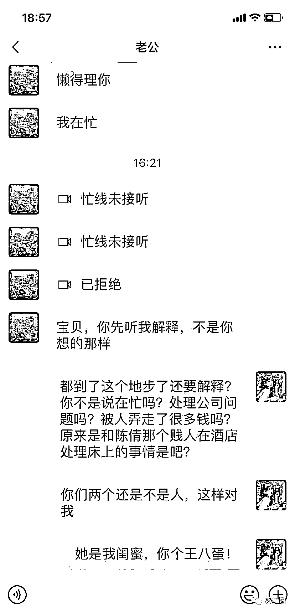

# 美女报复渣男？原想坐下“吃瓜”，没想到陷入“杀猪盘”！

> 原文：[`mp.weixin.qq.com/s?__biz=MzIyMDYwMTk0Mw==&mid=2247519787&idx=3&sn=83ae0528d0c6d2e3e90fa890a9c1dbce&chksm=97cb4513a0bccc056dabfeddd208ed63c7863b6bf66e5486228fb6c52b13c3ffaf01d0801b21&scene=27#wechat_redirect`](http://mp.weixin.qq.com/s?__biz=MzIyMDYwMTk0Mw==&mid=2247519787&idx=3&sn=83ae0528d0c6d2e3e90fa890a9c1dbce&chksm=97cb4513a0bccc056dabfeddd208ed63c7863b6bf66e5486228fb6c52b13c3ffaf01d0801b21&scene=27#wechat_redirect)

先来一组劲爆的 

直接上视频和聊天截图

[`mp.weixin.qq.com/mp/readtemplate?t=pages/video_player_tmpl&action=mpvideo&auto=0&vid=wxv_2022928875852267520`](https://mp.weixin.qq.com/mp/readtemplate?t=pages/video_player_tmpl&action=mpvideo&auto=0&vid=wxv_2022928875852267520)

一天，李先生一个微信好友发了个朋友圈

内容就是前面这些内容

这妥妥的渣男出轨闺蜜的大瓜啊

不过对这个备注了微信名叫“周某某”的美女

李先生实在是没什么印象了

美女直接发来了信息

称男友与闺蜜背叛了她 

请李先生帮个忙

整垮男友公司

因为同情“弱者”

李先生一次次投资

却换来了一次次无法提现

就这样上了“杀猪盘”诈骗的勾当

近期，文山辖区内“杀猪盘”投资诈骗案件高发。一些男男女女总被对方甜言蜜语所感动，很多人耳根子一软，听信骗子，就跳进了网络诈骗这个坑里。即使你身上没有多少钱，骗子不会嫌你少，大小通吃是他（她）们的一贯“工作”作风。只要你惹上骗子，你有多大的料，骗子就会做出多大的菜，总会想办法把你的钱财一点一点地抠出来。即使你怀疑，在对方轮番进攻下，不时的暧昧言语以及她们的创业故事、贴心问候等等，让你感动无比，于是你就会不知不觉掉进温柔的陷阱里，表面反抗，实则配合，最终把你身上的钱财一网打尽。下面就是文山辖区内发生的一个真实案例：

**钱多钱少没关系，只要你耳根子一软，骗子就有机会**

**从几千块钱开始下手**

一天，家住文山某一小区的李先生收到一个自称周某某的陌生女子添加微信的请求，李先生顺便就添加对方女子为微信好友。那个女子问:想在网上投资赚点钱吗？她自称可以带李先生投资赚钱。

网络上容易被骗，就是因为很多人拒绝不了对方的甜言蜜语。特别是那些孤男孤女最容易耳听爱情，若是对方属于他们喜欢的那类型人，他们更是无法拒绝，即使明知对方是虚情假意，他们一样会深陷进去。

当时李先生跟周某某谈到投资时，觉得自己本钱少,婉言回绝了。可李先生只是顺便问了一句：投资赚钱需要多少资金投入？对方回答：需要 3 万的本金。

投资 3 万对李先生来说，难度很大。网络上这样聊天，并与周某某长时间聊天，给对方留下了很大的思考空间。

当时李先生自称：自己没有那么多钱，只有千把块，之后双方就再也没有联系。

周某某清楚，男子身上只有千把块，在他头上一口吃出个胖子不可能。只有小打小闹，稳住对方，一点一点地掏，让对方心甘情愿掏出那几千块钱才是根本。

钱多钱少没关系，骗子都会把你做“大”。这回李先生就是耳根子软，对甜言蜜语的网络女子没有抵抗住，被骗子做“大”，自己一步步陷入被布好的圈套，就这样从几千元的投资开始，上了骗子的勾当。

**你有多大的料，骗子就会做出多大的菜**

**从 3 千到 7 千到 4 万再到 6 万**

既然你上钩了，网络上的诈骗分子都会惦记着你。哪怕你钱多钱少都不是问题，只要你愿意聊天，骗子都会爱着你，就像老鼠爱大米。

过了一段时间，周某某又跟李先生联系称，她的未婚夫和她的闺蜜背叛了她，自称她的心情很不好。李先生一看周某某的朋友圈，果然如此。

周某某自称整天愤愤郁闷，想不通自己闺蜜和男友为什么会厮混在一起？女子很想报复男子和闺蜜，自己不好过，别人也休想好过，称自己男友有公司，她想了个主意：整垮男友公司，让两个厮混在一起的人不得好过。整垮后，周某某跟李先生共同分财产。

为了报复男友，为了整垮公司，李先生答应了帮她这个忙。李先生就这样信以为真，就问周某某士：怎么帮你？李先生自称：假若需要 3 万块钱才能搞得定，才能搞垮她的男朋友公司的话，李先生称自己确实帮不上这个忙。

李先生称：自己只有几千块钱。可周某某这下松口了，称：只要李先生拿得出几千块钱，我们想办法也可以搞垮男朋友的公司。若真搞垮了，公司财产就是她和李先生的了。

李先生称：几千块可以拿得出来的。于是他们二人合谋整垮男友公司。

为了帮忙网络女子，李先生就这样干上了。

就在那一天，周某某就给李先生发来了一个“假日砖石”APP 下载平台。下载注册后，又把李先生拉进了这个“假日砖石”微信群里。

李先生口口声称，自己只有几千块钱，可周某某还是将李先生带进了这个“假日砖石”投资平台。

心想，既然答应了，李先生就只能这样爱屋及乌，自己就爽快答应投资 3 千元。大概过了 1 个小时左右，李先生去查看“假日砖石”投资平台，发现 APP 平台上有 10 多万元。李先生就问周某某：是否可以提现？周某某称：现在平台不稳定，暂时无法提现。叫李先生再充值 7 千元进去才可以提现。

为了提出那平台上的 10 多万现金，李先生再充值了 7 千元钱。大概过了 1 个小时，“假日砖石”平台显示金额有 40 多万元现金。李先生就问:是否可以提现？对方称：可以提现。李先生到 APP 平台上去提现，却发现提现不了。

当时李先生就问客服：为什么提现不了？客服称：你的银行卡账号填写有错误。客服称：要修改银行卡账号，需要交 42474 元，才能修改。

李先生半信半疑，自己没有那么多钱，亲自问了周某某。而周某某认真做了一番李先生的工作，并称要按照客服的安排行事。那女子也声称，他们的投资平台是合法的，让李先生放心大胆交钱就是了。还称，只要李先生交了 42474 元，修改了填错的卡号，平台是可以提现的。因为周某某一直称该平台是合法的，李先生就此放松了警惕。

在周某某的指点下，李先生想尽一切办法网贷、找人借钱，充了 42474 元。交了这么多钱，李先生觉得有点不高兴，自己本来没有钱，而且还找来这么多钱打进 APP 平台，百思不得其解。交了这个钱后，银行卡也更正过来了，李先生准备提现。而到平台里去提现，李先生发现照样提现不了。

这时，客服称，李先生绑定的是两张银行卡，称李先生交了一笔 42474 元，只改了一张银行卡的错误号码。客服称：李先生还要再交一笔 42474 元，才能修改另一张银行卡。两张银行卡修改好，才能提现。

这下，李先生犯难了，自己本来只有几千块钱，交了一笔 42474 元后，已元气大伤，再无力另交一笔了。

而周某某坚称：“假日砖石”APP 平台里的 40 多万元现金都属于李先生个人的。你不提走，谁也提不走，难道李先生白白想丢 40 多万现金在平台上吗？

李先生这下骑虎难下，40 多万现金到底能不能提出来是个问题？

想到 40 多万元现金，李先生又东拼西凑找来一笔 42474 元，并打款给了对方。

这下，交了两次银行卡修改费用后，客服也坚称这次一定给李先生成功提现。

听着这话，李先生高兴了一把。可等了一个小时后再去提现，李先生发现还是提现不了。

这时，客服谎称：因为李先生单笔转账和收入未达到 20 万元，无法提现。该系统提示需要再充值 66000 元，才可以达到系统要求，李先生才可以成功提现到账。

**你越是顽固，你就会粪坑里跳得越深，骗子就越喜欢**

**只有几千块的你，最终却被骗了 19 万**

为了一个 40 万元的提现成功，李先生本来只有几千块钱，可自己却交了这么多次款，自己难过了半天，真是欲哭无泪。

为了 40 万，李先生拼命借钱，又找来 66000 元充值到这个平台上。这一次交了 66000 元后，李先生自认为可以提现了。

想不到这回，骗子又声称：李先生本人的银行卡有问题，有风险隐患，需要交纳保证金，共需要交 31000 元。

李先生到处找钱凑钱，交了这 31000 元风险金后，这回客服称：李先生只要等 3—7 天后就会到账。

说的比唱的好听，久久苦等，可等了 7 天后，失望而归，李先生发现根本没有到账。

悔恨与懊恼交加，李先生的内心十分痛苦，深深意识到帮了不该帮的女人，爱了不该爱的人，心中满是伤痕。

提现遥遥无期，李先生只有放弃，最终自己也意识到被骗，并向警方报了案，共骗金额 191948 元。

**反诈民警提示：**

避免落入“杀猪盘”圈套，首先要提高自我防范意识，只要“网络友人”提到“投资平台”“系统漏洞”等关键词，都要提高警惕，保护好自己的个人信息，切忌财迷心窍、色令智昏。 

来源：文山州反电信网络诈骗中心,反诈骗先锋

← 向右滑动与灰产圈互动交流 →

