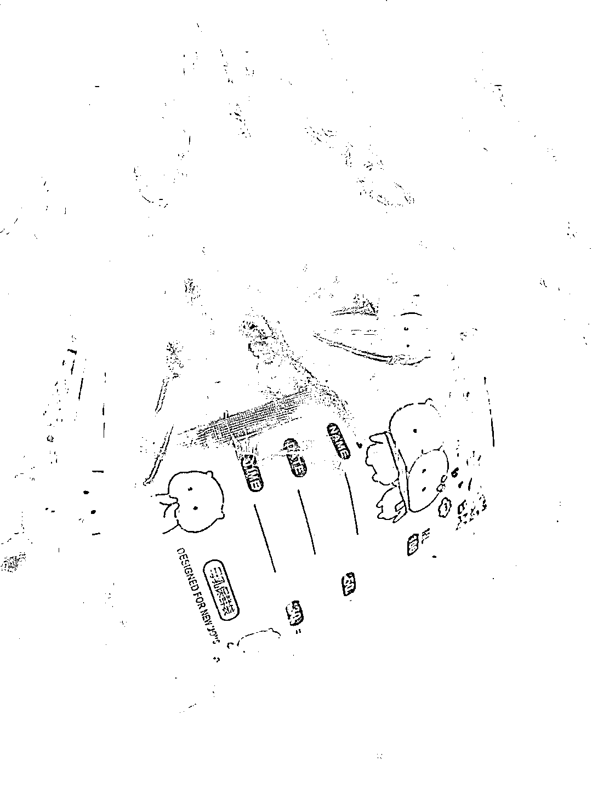
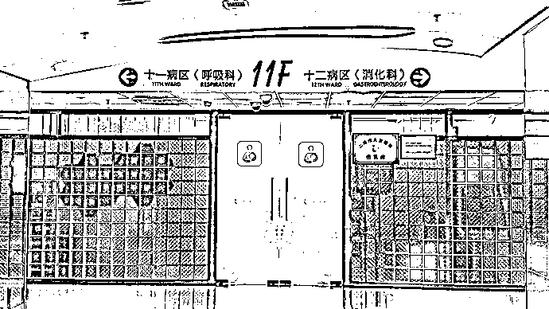

# 网上偷偷售卖、还有真人亲供母乳，记者暗访内幕惊人（附视频）

> 原文：[`mp.weixin.qq.com/s?__biz=MzIyMDYwMTk0Mw==&mid=2247519787&idx=4&sn=4e676ff5d48b9a6ccf6701189f1aff3f&chksm=97cb4513a0bccc05b595341183246e96fd3695413ae815ba54946aab1562c7e3a4a27ec0218e&scene=27#wechat_redirect`](http://mp.weixin.qq.com/s?__biz=MzIyMDYwMTk0Mw==&mid=2247519787&idx=4&sn=4e676ff5d48b9a6ccf6701189f1aff3f&chksm=97cb4513a0bccc05b595341183246e96fd3695413ae815ba54946aab1562c7e3a4a27ec0218e&scene=27#wechat_redirect)

[`mp.weixin.qq.com/mp/readtemplate?t=pages/video_player_tmpl&action=mpvideo&auto=0&vid=wxv_2023457720980291584`](https://mp.weixin.qq.com/mp/readtemplate?t=pages/video_player_tmpl&action=mpvideo&auto=0&vid=wxv_2023457720980291584)

人乳交易乱象：私下售卖存卫生隐患，有中介介绍“成人奶妈” 实习生 杨亚 视频编辑 吴佳颖(02:57)

记者收到的人乳包裹，泡沫箱中有 5 包各 100 毫升可能已变质的奶状物，箱中冰袋已融成水。

网上的人乳生意

“出（售）冻母乳。” 陈某在百度贴吧的“母乳喂养吧”、“闲置群吧”、“闲置吧”、“二手市场吧”等多个社区发布网帖，并附上多张储存在奶袋和奶瓶中的冷冻奶状物图片。 

陈某称，3 个月前生下孩子后，自己奶水比较多，每天会多出七八百毫升，于是便将多余的人乳装在 100 毫升的母乳储存袋中，以 15 元一包的价格在网上出售。客户不能指定“生产日期”，5 包起购，不退不换，还需支付邮费、泡沫箱费及冰袋费。 

陈某发来几张之前的客户订单截图，称自己每天有一两笔订单，根据身体情况还能供两三个月。 

记者以“母乳、冻奶、人乳”等关键词检索发现，在百度贴吧、知乎、小红书、豆瓣、微博等互联网社交平台上，有大量声称进行人乳交易的网帖。其中，聚集了 3.2 万名用户的百度“母乳喂养吧”，不时有卖家发帖称“有货”可售，配有疑似人乳的照片，底下不少买家留言咨询、“求货”。 

为躲避平台监管，一些卖家会利用社交平台联络买家，转手在电商平台售货。 

来源：澎湃新闻

← 向右滑动与灰产圈互动交流 →

