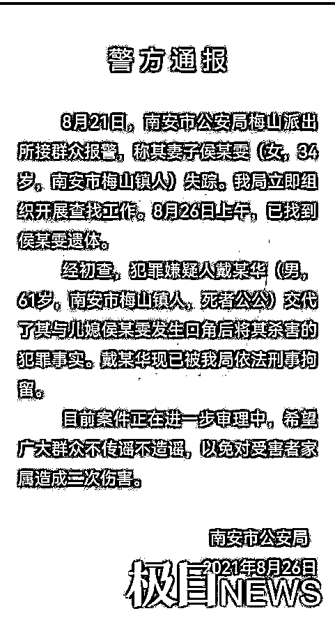
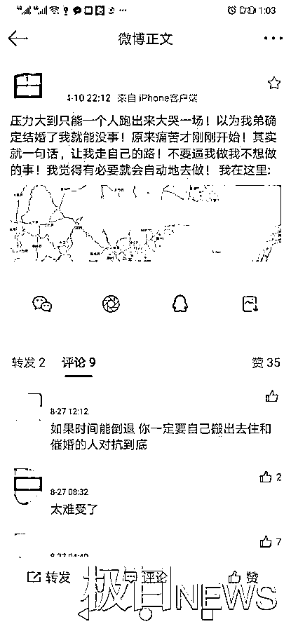
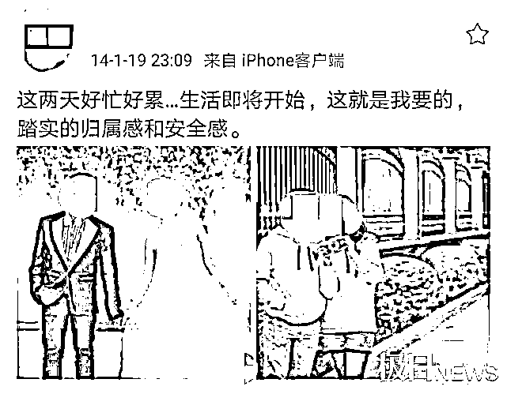
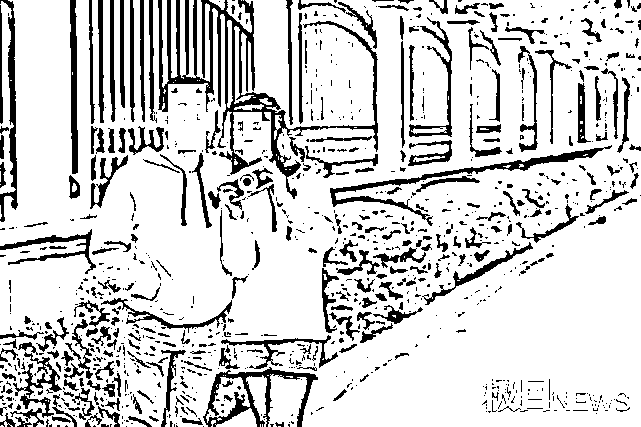
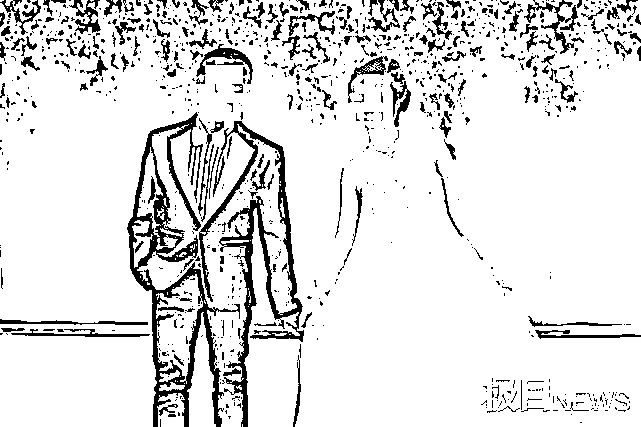
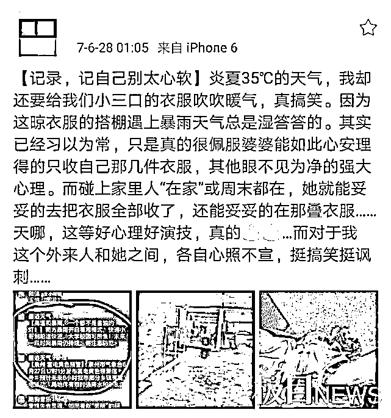
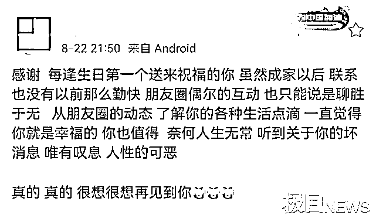

# 公公杀害儿媳案震惊全网！女方认识男方仅 4 个月闪婚，微博里透露了悲剧人生…

> 原文：[`mp.weixin.qq.com/s?__biz=MzIyMDYwMTk0Mw==&mid=2247519787&idx=5&sn=9fb772db98fd8d688e481f7a74966102&chksm=97cb4513a0bccc05f945c4ff67948a327437210334ea887e908648d78ba48e3543e9c56f3c9f&scene=27#wechat_redirect`](http://mp.weixin.qq.com/s?__biz=MzIyMDYwMTk0Mw==&mid=2247519787&idx=5&sn=9fb772db98fd8d688e481f7a74966102&chksm=97cb4513a0bccc05f945c4ff67948a327437210334ea887e908648d78ba48e3543e9c56f3c9f&scene=27#wechat_redirect)

**“****据媒体报道，就在小雯遇害前，小雯曾向丈夫强烈表达了离家的意愿。小雯称，如果他们继续在家里，婚姻只会加快破灭，甚至曾提出“只要不回家，或者你宿舍我宿舍都行。******我一直跟你说，我会死我会死，你不信吗？********”****

************

****短短几天，公公杀害儿媳的消息，传遍了整个网络。****

********

****8 月 26 日，福建省南安市公安局发布通报称，34 岁的福建南安梅山女子小雯失踪后，公公戴某华交代了其与小雯发生口角后将其杀害的犯罪事实，目前已被公安局依法刑事拘留。****

******这场惨剧，并非没有征兆。******

****早在多年前，小雯就养成了用微博记录生活的习惯，除了偶尔不满家人朋友对她情感问题的聚焦，小雯的微博内容有着和其他大多数女孩一样的日常。然而，**自 2014 年“闪婚”后仅一年的时间，小雯的博文便开始画风突变，字里行间透露出公婆对她的“不待见”**。****

****面对在夫家的糟糕生活状态，以“外来人”自居的小雯，也曾向丈夫提出过搬离的意愿。然而，小雯最终等来的却是公公的毒手。****

****从微博中可见，**阿雯结婚以后与公公、婆婆，特别是婆婆，矛盾颇深**，直至遇害都没有缓解。****

****曾经，几乎少有人看到，小雯遭到公婆区别对待后的“碎碎念”。如今，在小雯遇害之后，小雯的微博内涌进了大批网友，几乎每一条微博下，都留有大家的悼念与惋惜。****

********

******枷锁******

****小雯曾经是一个无忧无虑的人儿。****

****和大多数女孩一样，在和朋友一起聚餐时，小雯会晒出整桌的美食；在看完一场电影后，会“高谈阔论”给出独到的观影体验；在读到令人叫绝的字句时，会发出独属于自己的人生感悟。在小雯的日常分享里，常常能看到和朋友之间朝夕相处的甜蜜点滴，也有自己和小外甥“相爱相杀”的幸福片段。****

****只是，那时的小雯，在生活中还是会有怎么也甩脱不掉的烦忧：时常要面对来自父母家人对于她终身大事的聚焦。****

****2013 年 1 月，那是小雯第一次在微博中谈起婚姻的压力。小雯通过文字的形式无声回应父母家人，当自己真正想要结婚的时候，会光明正大地宣布，并恳请父母家人不要再向她提结婚的事，并称自己“并非假崩溃而是真崩溃，甚至看到别人结婚都感到悲凉”。****

****仅仅 9 天之后，小雯再次发博提及婚姻话题，这一次小雯写道：有篇散文叫离婚，我有一篇日记叫订婚，后来又出现退婚。跪求亲戚朋友等放过“深切慰问”。****

****对于小雯来说，弟弟订婚的消息本应是莫大的喜讯，小雯在为弟弟感到高兴之余，也憧憬着自己也能够因此暂时脱离婚姻的“枷锁”。****

****然而，小雯等来的还是失望。2013 年 4 月，小雯发博称自己压力大到一个人大哭了一场，“本以为弟弟确定结婚了，我就能没事。原来痛苦才刚刚开始，不要逼我做不想做的事。”****

****一夜痛哭过后，小雯得到的是这样一句话：在弟弟成婚前，必须带个男朋友回家，并确定下关系。在微博中小雯回应道：“晚婚了又怎样，再不行就租个（男朋友）回来。”****

********

****关于婚姻，那时的小雯始终有自己清晰的认识。在 2013 年 7 月的一篇博文中，小雯坚定写道，自己的婚姻与任何人无关，如果结婚没有单身状态来得好，宁可不结婚。此后，小雯再次发文称，从小到大，她几乎一直是被安排的，她只希望婚姻大事能让自己做主。****

******闪婚******

****直到 2013 年 9 月，小雯还处于“不找对象找不到对象”的状态。****

******在丝毫不加掩饰的文字里，小雯称找对象的事，绝对是阻碍她和父母和睦关系的最大障碍，因为找对象的话题，小雯感到委屈伤心，她希望能够回到 20 岁，再没有类似的烦恼。******

******仅仅 4 个月后，小雯结婚了。******

******2014 年初，经人介绍小雯嫁给了同镇埔仔村的戴某河。**2014 年 1 月 18 日，小雯分享了拍婚纱照当天，自己与小外甥的欢乐互动。次日，小雯将两张婚纱照晒出，照片中小雯和丈夫手拉手、肩靠肩，并以“这就是我要的，踏实的归属感和安全感”宣告新生活的开始。****

********

********

****很快，小雯怀上了小宝宝。在小宝宝 12 周的时候，小雯说小腹微隆的样子，让自己慢慢体会到快要当妈妈的感觉。那时的小雯无疑是幸福的，带娃晒娃几乎占据了小雯的全部。****

****在自己的个人微博中，小雯曾经这样写道：微博是自己的，这里没有人知道我是谁，可以尽情地发泄吐槽。****

****外人很难想象，婚后一年的时间内究竟发生了什么。2015 年 2 月，小雯发博诉称自己不被理解奔溃想哭。****

****“明知正是公公的无限服帖与迁就，才养成了婆婆那般矫情做作的个性，为何自己还要无形中在这条路上越走越远呢？”自 2016 年 8 月开始，小雯第一次在微博上倾诉，自己婚后与公公、婆婆的矛盾，并告诫自己生活需要互相理解，请勿恃宠而骄。****

******外来人******

****在这个熟悉又陌生的家庭里，小雯总是以“外来人”自居。****

****暴雨天婆婆收屋子外晾晒的衣服，却唯独遗留小三口的不收；夫家熬制的炖汤，往往没有小雯和儿子的份；被藏进罐子里，不让小雯发现的土鸡蛋……在外人看来难以想象的遭遇，都发生在了小雯身上，这让小雯愈发觉得自己与夫家似乎格格不入。****

****2017 年 6 月，小雯以“记自己别太心软”为题发发表博文。在她看来，婆婆是个“演员”，平时婆婆总是不收他们小三口的衣服。但每当碰上家里人都在的时候，婆婆不仅会把衣服全部收了，还会帮着把衣服叠了。****

********

****“当面一套背地一套”的游戏让小雯感到厌倦，小雯也因此心生了离开夫家的想法。****

****据媒体报道，就在小雯遇害前，小雯曾向丈夫强烈表达了离家的意愿。小雯称，如果他们继续在家里，婚姻只会加快破灭，甚至曾提出“只要不回家，或者你宿舍我宿舍都行。**我一直跟你说，我会死我会死，你不信吗？**”****

******与小雯共事多年的同事则称，小雯曾被老公打得脸都肿了，事后怕别人问起就戴着口罩遮掩。大家问小雯怎么回事，小雯也不怎么愿意说，只是哭得稀里哗啦。******

****想到小雯令人发指的悲惨遭遇，这位小雯曾经的同事，用两人之间的亲昵称呼发问悼念：我可怜的猴子，我想抱抱你。****

******悼念******

****小雯遇害的消息传出后，小雯多年的好友同事纷纷发文悼念，大批网友也涌进了小雯的个人微博，替小雯惋惜为小雯祈福。****

****“感谢每逢生日第一个送来祝福的你，真的真的很想再见到你。”一名好友得知小雯的遭遇后，在微博发文感叹，“虽然成家以后联系没有以前那么勤快，只能从朋友圈的动态，了解你的各种生活点滴。一直觉得你就是幸福的，你也值得。奈何人生无常，听到关于你的坏消息，唯有叹息，人性的可恶。”****

****还有好友说，小雯一直很贴心，她每年都记得身边朋友的生日，自己每年生日和每个节日，都能收到来自小雯的祝福。****

********

****就如同小雯好友所说，翻看小雯生前的微博，无论是陪着朋友挑选婚纱，还是在朋友生日时送上祝福，从字里行间就能看出，小雯是一个极重感情，把朋友放在重要位置的善良女生。****

****正因为如此，涌入小雯微博的网友们才会更加感到惋惜。****

****从一开始无忧无虑的生活，到后来对催婚的抗拒，之后“闪电”般结合的婚姻，再到遇害前的种种矛盾。有网友读完了小雯 9 年的微博，大家似乎感同身受，每一条微博下，都留有大家悼念的话语，和“多希望你当时能不心软”的惋惜。****

******疑点******

****无论是在小雯家属看来，还是在大众心中，小雯的死似乎还留有疑点。****

****在小雯的公公被警方抓捕前，他曾对小雯的娘家人说谎。****

****8 月 21 日凌晨 1 时许，小雯的父亲得知女儿于 20 日早晨在女婿家失踪。当日上午，他便和妻子赶到埔仔村了解情况。期间，小雯公公戴某华拿出手机，找出一张女子骑着女儿同款摩托车（无牌）的背影照片给他们看。****

****“小雯可能是离家出走了。”当天，戴某华陪同小雯的父母，到村里的溪边等地寻找了一圈，但未果。****

****在向警方报案后，谎言很快被揭穿，真相是小雯并没有离家出走，而是惨遭公公毒手。****

****8 月 27 日，小雯的家属通过其同事发声，称小雯的丈夫曾对小雯进行家暴。大概两个月前，小雯的丈夫还因抢夺电动车致小雯受伤。****

****小雯的家属还称，因为妹妹惨死，和小雯丈夫的威胁，小雯的姐姐精神几近崩溃，每天凌晨两三点才能入睡，闭眼都是小雯的样子。她不能接受至亲的人就这样没了，而且是死后还被凶手惨无人道折磨。****

****每天，面对孩子“小姨是不是真的没了”的疑问，小雯的姐夫都要装作若无其事安慰道，“小姨只是去另外一个地方，不是没了。”****

****来源 ：极目新闻****

********

****← 向右滑动与灰产圈互动交流 →****

********