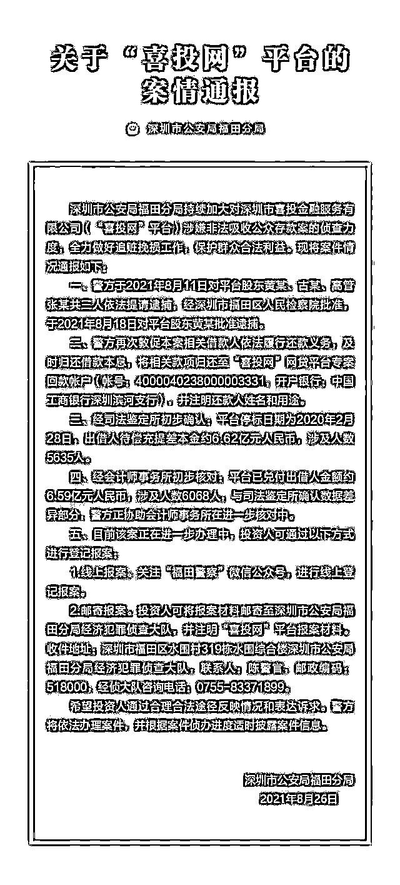
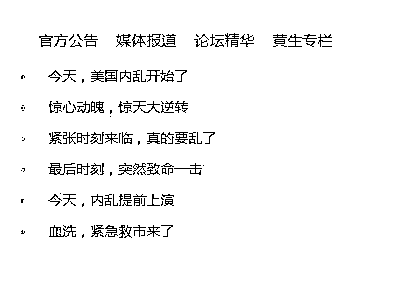
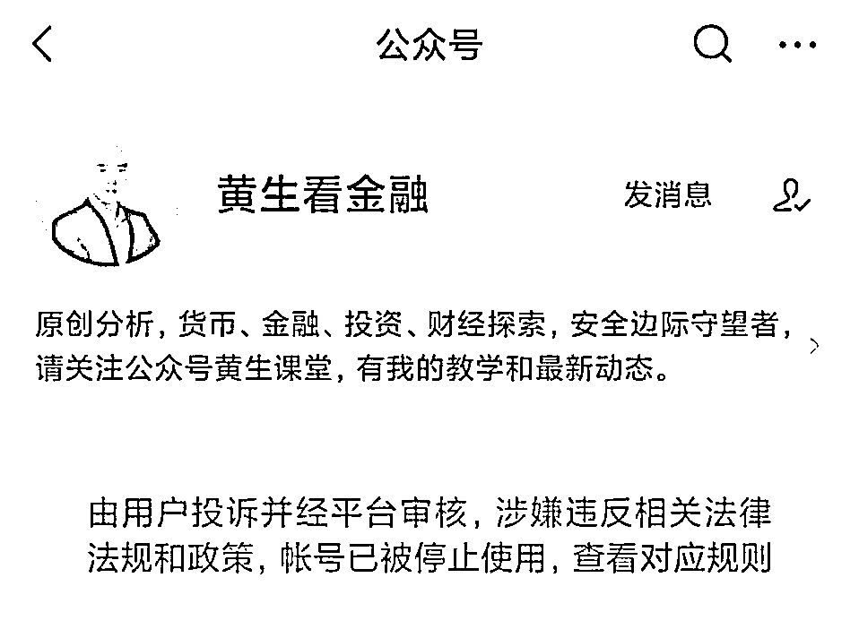
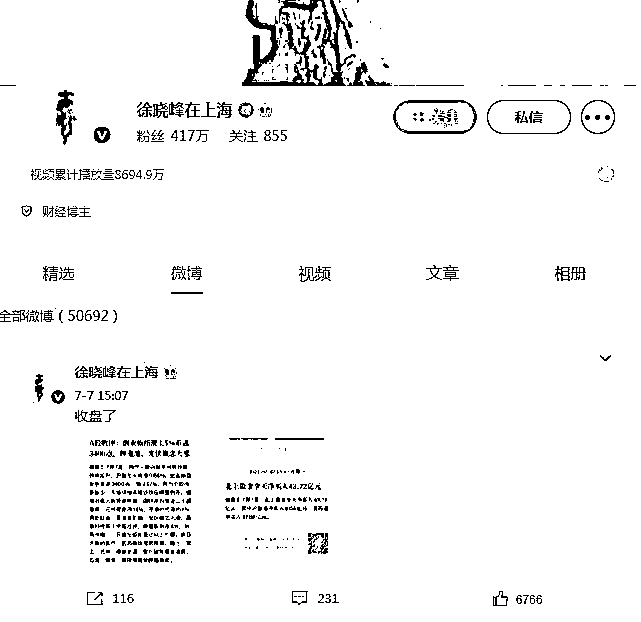
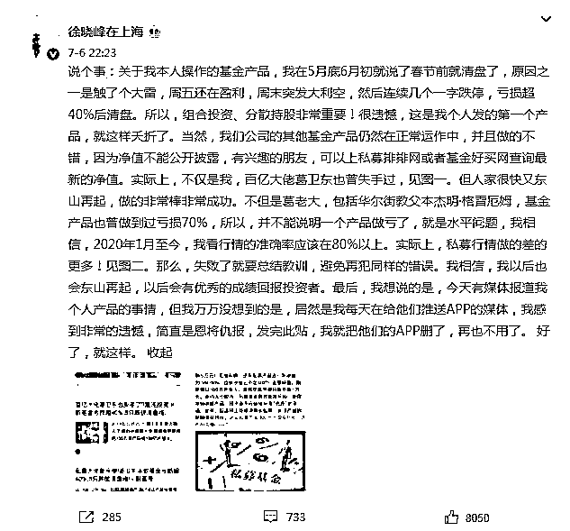
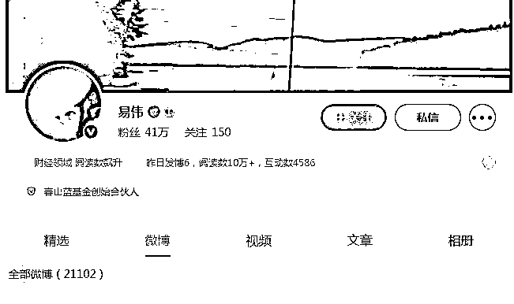

# 500 多万粉丝金融大 V 黄生，凉了

> 原文：[`mp.weixin.qq.com/s?__biz=MzIyMDYwMTk0Mw==&mid=2247519787&idx=6&sn=9f4cf6c5da973e659a0be171e5029086&chksm=97cb4513a0bccc05431d383592cd2cef3bddc67205b4d3f284d782f7ecbd27143332a60eac05&scene=27#wechat_redirect`](http://mp.weixin.qq.com/s?__biz=MzIyMDYwMTk0Mw==&mid=2247519787&idx=6&sn=9f4cf6c5da973e659a0be171e5029086&chksm=97cb4513a0bccc05431d383592cd2cef3bddc67205b4d3f284d782f7ecbd27143332a60eac05&scene=27#wechat_redirect)

在微博上他是北大毕业、坐拥 300 万粉丝的大 V；公众号上更是篇篇 10 万+，粉丝也超过 200 万；在现实中，他则是 P2P 平台喜投网的董事长，数亿元资金无法兑付。

8 月 27 日，深圳市公安局福田分局发布的通报显示，在各平台拥有粉丝超过 500 万的财经大 V 黄生被批准逮捕了！

根据通报，黄生控制的 P2P 平台喜投网目前仍有超过 6 亿元的资金无法偿还出借人，涉及人数高达 5635 人。

需要注意的是，目前监管已经注意到财经大 V 众出现的乱象。国家网信办官微“网信中国”8 月 27 日消息，国家网信办决定自 8 月 27 日起开展清朗·商业网站平台和“自媒体”违规采编发布财经类信息专项整治。国家网信办有关负责同志介绍，此次专项整治重点聚焦财经类“自媒体”账号、主要公众账号平台、主要商业网站平台财经版块、主要财经资讯平台等 4 类网上传播主体，重点打击 8 类违规问题。

微博公众号均被注销

针对喜投网董事长黄生的限制从今年 5 月以来就在不断提升，5 月被限制出境，7 月被采取强制刑事措施，8 月被正式批准逮捕。

深圳市公安局福田分局发布的通报显示，8 月 18 日，黄生被正式批准逮捕；喜投网目前待偿充提差本金高达 6.62 亿元，涉及人数达到 5635 人。同时，警方也再次敦促相关借款人履行还款义务，及时归还借款本息。

来源：深圳市公安局福田分局

从上述通报来看，目前待偿本金为 6.62 亿元，已兑付出借人 6.59 亿元，也就是说从喜投网 2014 年成立至今，其从出借人获得的资金可能超过 13 亿元，已兑付的金额仅约 50%。

事实上，黄生之所以引发如此众多的关注，并不是其喜投网董事长的身份，而是其在网络上的财经大 V 身份——“黄生看金融”。据了解，其此前在各大平台上拥有的粉丝数量超过 500 万，其公众号“黄生看金融”的文章更是篇篇 10 万+。

而其公众号的文章多数都是情绪化的文章，并没有任何实际意义，在喜投网官网的底部，仍有一栏是黄生专栏，均是其公众号的文章：

　　

　　来源：喜投网

事实上，“黄生看金融”的初衷就是为了给喜投网引流做推广。喜投网发布的一篇对黄生的专访中，黄生明确表示“初衷只是为了帮喜投网做推广，未想到文章篇篇爆红 10 万+。”“依靠着这样的影响力及每日笔耕不辍，喜投网多年来没有耗费任何营销及推广成本，便迅速收获了一大批忠实的用户。”

此外，中证君注意到，目前微博上已无法搜索到“黄生看金融”，微信公众号“黄生看金融”也由于用户投诉，涉嫌违反相关法律法规和政策，帐号已被停止使用：

  

来源：微信公众号

多个财经大 V“翻车”

除了“黄生看金融”外，另有多个财经大 V 都栽了！

比如在微博上，粉丝数量比“黄生看金融”还多了 100 万的徐晓峰，其微博粉丝数量超过 400 万。在 7 月 7 日以后，其微博就已不再更新。

来源：微博

据了解，徐晓峰作为财经大 V 遭遇“翻车惨案”，被爆出其管理的私募基金巨亏。对此，徐晓峰在微博上回应称：“我本人操作的基金产品，我在 5 月底 6 月初就说了春节前就清盘了，原因之一是触了个大雷，周五还在盈利，周末突发大利空，然后连续几个一字跌停，亏损超 40%后清盘。”

来源：微博

而近期另一个“翻车”的财经大 V 则是易伟，他在微博上拥有 41 万粉丝，目前其微博上已看不到任何内容。

　　

来源：微博

8 月 14 日，A 股上市公司三夫户外发布公告，董事易伟于 2021 年 8 月 13 日收到中国证监会出具的《立案告知书》，具体内容如下：“因你涉嫌操纵‘三夫户外’，非法从事证券投资咨询，根据《中华人民共和国证券法》、《中华人民共和国行政处罚法》等法律法规，2021 年 7 月 30 日，我会决定对你立案。”

来源：中国证券报，观察者网

← 向右滑动与灰产圈互动交流 →

