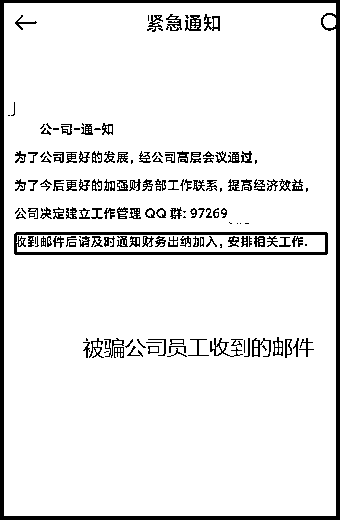

# 楼上、楼下两个老板，一个在赚钱，一个在骗赚钱的那个的钱！

> 原文：[`mp.weixin.qq.com/s?__biz=MzIyMDYwMTk0Mw==&mid=2247519875&idx=3&sn=da14832711f8506d24e74bb650ff72b1&chksm=97cb45bba0bcccad12e216cf6cd525ed331c59ab75ae12c6790c1e3918cd7853b7a2504480d4&scene=27#wechat_redirect`](http://mp.weixin.qq.com/s?__biz=MzIyMDYwMTk0Mw==&mid=2247519875&idx=3&sn=da14832711f8506d24e74bb650ff72b1&chksm=97cb45bba0bcccad12e216cf6cd525ed331c59ab75ae12c6790c1e3918cd7853b7a2504480d4&scene=27#wechat_redirect)

**导读：**近日，四川泸州发生一起电信网络诈骗案件，某公司财务人员被拉进诈骗分子建立的公司工作群，**被骗子以“公司老板”的名义诈骗 293 万元**，然而这一切发生的时候**真老板却正在相隔一层楼的办公室办公。**

       其实，骗子冒充公司老板诈骗财务人员的手段已是老套路。套路虽老，却屡屡有人中招。今天我们就结合泸州这个案例从几个方面给大家讲解一下这种诈骗方式的整个流程，请大家仔细阅读，切勿再掉入骗子们的陷阱之中。

冒充公司领导诈骗，首先要获取公司的基本信息或者老板的个人信息，骗子们第一步会注册企业查询平台会员，然后通过平台获取法人姓名、电话、邮箱、公司基本业务情况等信息。 

**（某企业查询平台截图）**

紧接着骗子会注册多个网络云邮箱，使用群发邮件冒充领导让公司人事整理公司员工信息给他。由于是撒网式群发邮件，并非所有公司都会中招，部份公司会当成垃圾邮件直接退回，或者直接回复“骗子”，但有些公司的人事不但给给骗子整理了员工信息，甚至连员工的姓名、身份证号、邮箱、手机、婚姻状态、生日等都有，可谓是非常详细。

**（群发邮件，发件人伪装成老总，收件人主要是公司人事）**

**（骗子收集到某公司的员工信息）**

在获取到员工信息后，骗子们就会随机抽取某员工的邮箱，将提前注册的邮箱昵称改成法人或者领导名称，冒充“领导”邮箱给员工发邮件，并通过 QQ 与员工确认邮件的真实性，以此获取该员工的信任。

** （某员工收到的邮件内容）**

**（假领导与员工的聊天信息）**

骗子提前注册了一堆 QQ，用于进 QQ 内部群，呢称伪装成部分员工，然后将公司财务或者出纳拉到群里，由于是公司员工告知的，加上几个骗子在里面演戏，所以大家都以为就是“真老板”。

接下来就是伪造项目和款项入账，骗子的用意就是让财务人员打开公司对公账户方便后续询问账户余额，另外一点就是以此来拖住财务，不给财务人员向领导验证的时间。

**（骗子伪造资金进项和转款截图）**

**（骗子使用的网银转账截图工具）**

下面才是骗子的重头戏，整个节奏分为三个部分：**第一步**获取对公账户可用余额；**第二步**编造支出项目，分阶段将公司账上余额进行汇出；**第三步**转移财务人员视线，给转移诈骗款赢得时间。

**（骗子获得对公账户金额  编造付款消息）**

**(在骗子的催促下，不给财务人员过多考虑）**

**（继续编造理由想再骗财务转账）**

在骗子骗得第一笔款项后，紧接着继续编造尾款或者其他项目款为理由，继续要求财务人员进行转款，实际上我们通过聊天记录有看到财务人员已经有些怀疑了，出于对领导的信任和敬畏心理，加之骗子不断地催促，会降低财务人员的判断能力。

**（骗子成功骗取第二笔钱）**

骗子成功骗取第二笔钱，编造事由拖住财务人员，让财务人员没时间去核实真假和反应，为转移诈骗款赢得时间差。从早上九点到中午十二点，不到四个小时的时间里，骗子就骗取了接近 300 万，这笔钱无疑给公司造成了重大的经济损失，然而让我们诧异的是，公司真正的老板就在楼上办公室办公，离财务室就相隔一层楼！

冒充公司老板诈骗专门针对企事业单位财务人员，其案发率高、涉案金额大、社会影响极坏。尤其是由骗子伪装的“公司工作群”诈骗方式迷惑性极强，当事人看见有众多公司内部人员在群内，加上这些伪装的“同事”正在一本正经地聊工作，让人一时无法辨别真伪，极易上当受骗。

因此，企业单位防范通讯网络诈骗应做到：健全制度、强化教育、提高意识、加强防范。此外，熊猫反诈专门为财务人员制作了防诈骗小贴士，请转发扩散，避免上当！

财务人员防范通讯网络诈骗小贴士

一、加强内控、遵守财务管理制度；

二、办理转账事项，必须取得或填制原始凭证，并经领导或领导指定人员签名或盖章手续后才能进行；

三、必须遵循“先签字后汇款”原则；

四、切勿接收老板在网络上发布汇款指令。

财务人员转账前四问

一、转账前反问自己是不是诈骗的陷阱？

二、转账书面手续是否齐全？领导是否确认签字？

三、网上转账是否设置双重认证？出纳汇款，会计是否审核确认？

四、是否向财务主管或相关领导进行当面确认？

最后，请广大群众积极下载国家反诈中心 APP，开启实时诈骗预警，织密反诈安全网，让诈骗分子无机可乘！

来源 ：泸州市反诈中心，熊猫反诈

← 向右滑动与灰产圈互动交流 →

