# 警惕“打针人”！给你美容、整形的人，可能只学了 4 天？行业黑幕曝光→

> 原文：[`mp.weixin.qq.com/s?__biz=MzIyMDYwMTk0Mw==&mid=2247519875&idx=4&sn=5a7454622081e24e36dd82dd5683437e&chksm=97cb45bba0bcccad2c433fad8f9e55afc8fed8a8b9456e9074d5f5d26c2572327bb3bf7d0661&scene=27#wechat_redirect`](http://mp.weixin.qq.com/s?__biz=MzIyMDYwMTk0Mw==&mid=2247519875&idx=4&sn=5a7454622081e24e36dd82dd5683437e&chksm=97cb45bba0bcccad2c433fad8f9e55afc8fed8a8b9456e9074d5f5d26c2572327bb3bf7d0661&scene=27#wechat_redirect)

故意制造“容貌焦虑”，现在已成为不少医美机构招揽顾客的手段。医疗美容行业如今发展迅速，但乱象也层出不穷，其中医美广告成“重灾区”。

为此，市场监管总局日前发布了《医疗美容广告执法指南（征求意见稿）》，明确指出要依法整治各类医疗美容广告乱象，重点打击 10 种情形，排在首位的就是：制造“容貌焦虑”。

[`mp.weixin.qq.com/mp/readtemplate?t=pages/video_player_tmpl&action=mpvideo&auto=0&vid=wxv_2025219102083973121`](https://mp.weixin.qq.com/mp/readtemplate?t=pages/video_player_tmpl&action=mpvideo&auto=0&vid=wxv_2025219102083973121)

△央视财经《第一时间》栏目视频

除皱又瘦身 肉毒素成“午餐式美容”新宠

[`mp.weixin.qq.com/mp/readtemplate?t=pages/video_player_tmpl&action=mpvideo&auto=0&vid=wxv_2025217813778333698`](https://mp.weixin.qq.com/mp/readtemplate?t=pages/video_player_tmpl&action=mpvideo&auto=0&vid=wxv_2025217813778333698)

△央视财经《第一时间》栏目视频

在医疗美容界，肉毒素一直被认为是“除皱神器”。肉毒素作为一种神经麻醉剂，能使肌肉暂时麻痹。起初，医学界用它治疗斜视、面部痉挛以及其它肌肉运动紊乱症。不过医生们发现，**肉毒素在消除皱纹方面具有更加显著的功效。很快，注射肉毒杆菌素的医美项目迅速风靡。** 

记者了解到，伴随肉毒素需求增长，研究机构数据预测：**未来五年肉毒素行业将延续高速增长态势，预计 2025 年市场规模可达 140 亿元。**加上肉毒素普遍需要多次注射，消费者需要多次返店治疗，医美机构也能借此实现锁客循环。 

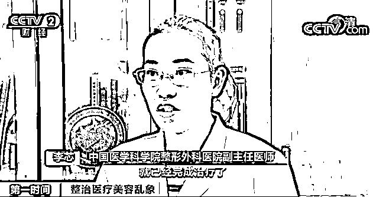

****中国医学科学院整形外科医院副主任医师 李芯：**肉毒素被称为午餐式美容，就是恨不得中午吃顿饭的工夫就已经完成治疗了，而且下午上班都看不出来。**

**部分商家售卖肉毒素水货假货 处方药竟能轻易购买******

 **[`mp.weixin.qq.com/mp/readtemplate?t=pages/video_player_tmpl&action=mpvideo&auto=0&vid=wxv_2025217346398650372`](https://mp.weixin.qq.com/mp/readtemplate?t=pages/video_player_tmpl&action=mpvideo&auto=0&vid=wxv_2025217346398650372)

△央视财经《第一时间》栏目视频**

**根据国家药品监督管理局发布的通知，**A 型肉毒毒素及其制剂被列入毒性药品管理，并且作为处方药，必须要由有处方权的执业医师开出处方，才能够购买**。但记者调查发现，**市场上肉毒素泛滥 ，其中不少还是“水货”，甚至是假货。**** 

**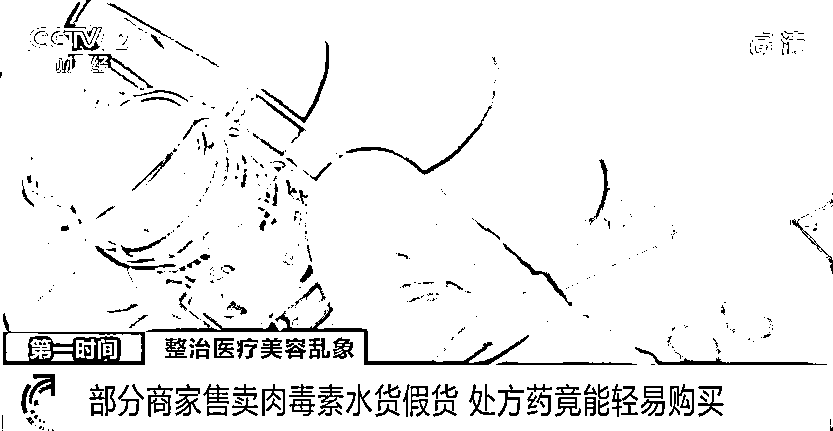**

**今年 6 月，韩国食品药品安全处表示，从 6 月 25 日开始，吊销韩国知名制药企业美得妥公司三款肉毒素产品的许可证。原因是美得妥公司在生产肉毒素的过程中，使用未经许可的原液，通过材料造假获得流通许可，违反了相关法律。**因为药品包装为粉红色，这家公司的肉毒素产品通常被称为“粉毒”。**记者发现，一些卖家在公开售卖粉毒。** 

**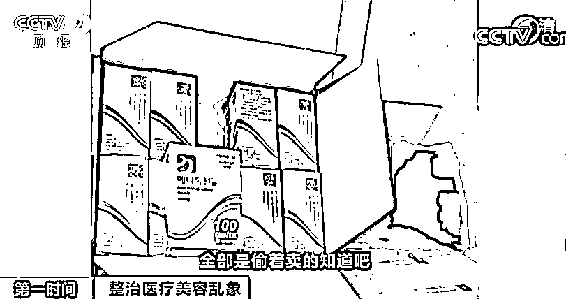**

**一些消费者向记者反映，**在一些医美机构，很可能被注射了所谓“水货”**。而除了售卖未经批准的国外水货，也有人在卖国产肉毒素的假货。** 

**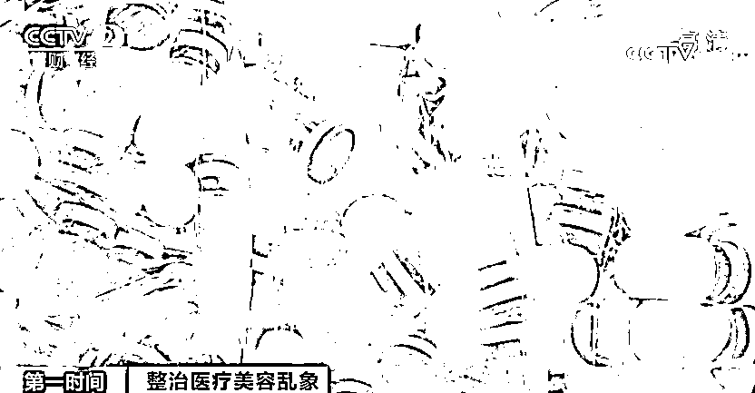**

**业内人士提醒，作为处方药，药品本身的真伪至关重要，而肉毒素的保存与运输同样关乎药品质量。** 

**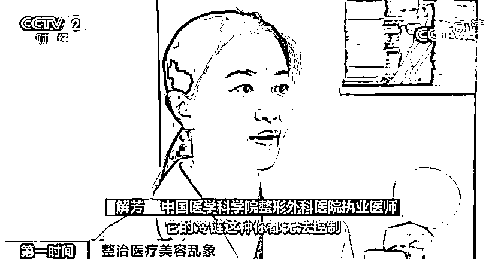**

**同时，注射剂量也直接关系到消费者的安全。**

**中国医学科学院整形外科医院副主任医师 李芯：小作坊合成的，不准确，大夫可能认为我打的是 100（单位），但实质上我可能打了 400（单位）。有可能就会造成很严重的并发症，叫呼吸肌麻痹，就不会呼吸了。球麻痹（延髓麻痹），你咽东西的肌肉麻痹了，这也是非常恐怖的。**

**专家提醒，国产肉毒素的包装盒与瓶身上均印有“国药准字”，进口肉毒素则印有“进口药品注册证号”，可以在国家药品监督管理局的官方网站上进行查询，鉴别药品的真伪。**

**零基础医美速成班仅四到六天 警惕“打针人”资质******

 **[`mp.weixin.qq.com/mp/readtemplate?t=pages/video_player_tmpl&action=mpvideo&auto=0&vid=wxv_2025218513774116867`](https://mp.weixin.qq.com/mp/readtemplate?t=pages/video_player_tmpl&action=mpvideo&auto=0&vid=wxv_2025218513774116867)

△央视财经《第一时间》栏目视频**

**注射肉毒素的美容项目，操作核心是注射的“位点”和“剂量”。假货、水货直接影响了注射的“剂量”，而一名不合格的操作人员，则极有可能对注射“位点”把握不准，给消费者带来巨大的风险。而这样一名不合格、不靠谱的打针人，可能只经过了短短四到六天的医美速成培训。**

**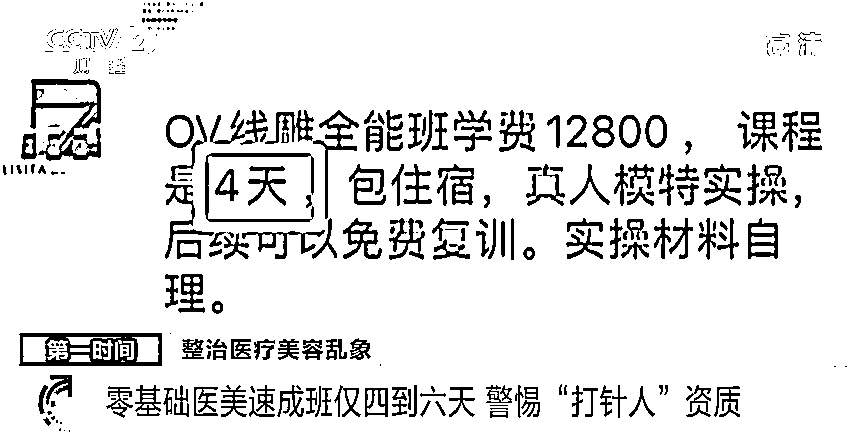**

**记者咨询一家医美培训学校后了解到，**一期微整全科班，学费 12800 元，课程时间是六天**。课程内容包含针剂注射类和线雕技术。不仅教授肉毒素的注射技巧，还包括各种注射项目的修复急救、注射美容常见并发症的预防处理。一期线雕全能班学费 12800 元，课程是 4 天，主要讲解医美营销、资源裂变、谈单技巧、朋友圈打造和线雕技术、并发症的预防和处理，此外赠送包括肉毒素在内的针剂注射类课程。**

**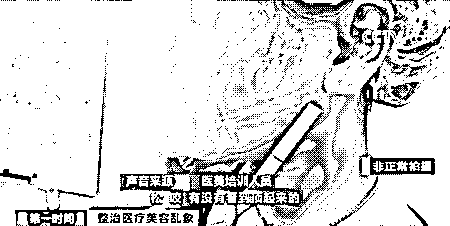**

**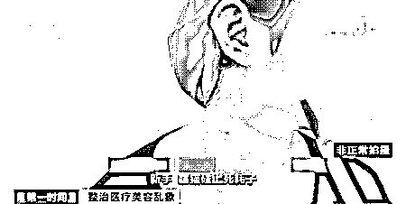**

**今年 6 月，国家卫健委、公安部、海关总署等八部委联合印发了《打击非法医疗美容服务专项整治工作方案》。然而，针对这一《整治工作方案》，医美培训班为此增加了如何规避的课程。**

**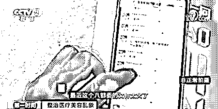**

**商家的非法违规操作，导致肉毒素注射的医美事故频发。**

**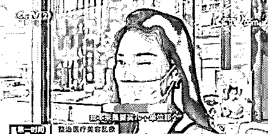**

**业内人士强调，注射肉毒素必须要到取得《医疗机构执业许可证》的机构，由具备《医师资格证书》《医师执业证书》和《医疗美容主诊医师资格证书》的人员进行操作。**

**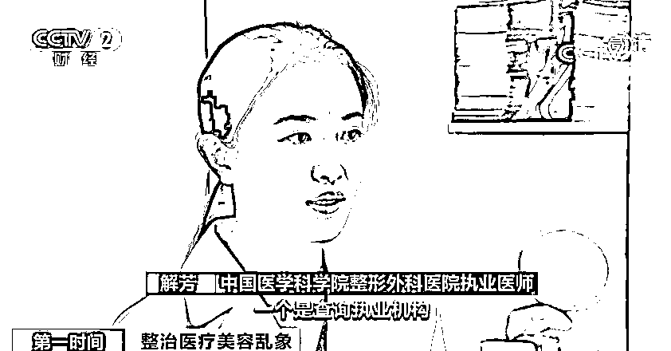**

****中国医学科学院整形外科医院执业医师 解芳：**国家卫健委的官网上面有一个查询的方法，一个是查询执业机构，能查到它是否在国家卫健委进行了官方的备案和审批，以及它是几级医院；一个是查询执业医生，这个医生的专业是什么，级别是主治还是副主任医师，以及在哪个医院执业。**

****梁婧：莫让“容貌焦虑”绑架“颜值经济”****

 **[`mp.weixin.qq.com/mp/readtemplate?t=pages/video_player_tmpl&action=mpvideo&auto=0&vid=wxv_2025220239277228035`](https://mp.weixin.qq.com/mp/readtemplate?t=pages/video_player_tmpl&action=mpvideo&auto=0&vid=wxv_2025220239277228035)

△央视财经《正点财经》栏目视频**

**这次“剑指”医美广告，并非打压医美行业，而是整顿医美乱象，这是给这个行业做“健康整形”。** 

**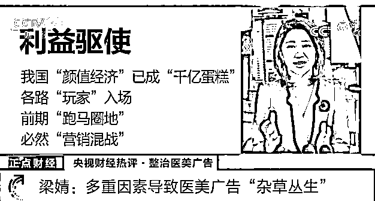**

****医美广告为何“杂草丛生” ？****

****首先是利益驱使。**作为全球第二大医疗美容市场，我国的“颜值经济”早已成就“千亿蛋糕”，强大的“吸金能力”和广阔的行业前景，招揽了各路资金和“玩家”入场，前期为了“跑马圈地”，必然要经历一番“营销混战”。**

** 
**二是拉新人套路。**虚构医疗资质、宣扬“容貌焦虑”等，都是切中消费者心理的“营销老套路”，虽然“观念有毒”，但“拉新有用”。商家为了快速拉新人、回笼资金，选择走“灰色捷径”。**

****三是缺少监管。**医美行业发展处在前期，之前缺乏相应的平台监管及法律震慑，让不法商家“钻了空子”。**

****此次重拳出击整治，首先可以助推理性消费**。过去，不少消费者因为错误的引导和引诱，主动或被动陷入“容貌焦虑”“冲动消费”，此次整治有利于“美丽消费”逐步回归理性。**

 ****第二可以促进行业“健康整形”。**此次重拳整治医美广告，打击的是“黑医美”，这能减少“劣币驱逐良币”，行业从“被迫瘦身”进入“主动健身”阶段。**

****最后，美是丰富且独特的**，绝不是复制粘贴后的“千篇一律”，真正的美丽是容颜背后的优雅才情、伟大理想和高尚灵魂，愿每个人都能珍视自己的独特、追求自己的美丽。**

**来源：央视财经（ID：cctvyscj）**

****

**← 向右滑动与灰产圈互动交流 →**

****