# 薇娅力荐的减肥热销货“翻车”，许多网红都推过！检测结果让人愤怒……

> 原文：[`mp.weixin.qq.com/s?__biz=MzIyMDYwMTk0Mw==&mid=2247519926&idx=3&sn=fd7ecc3b126a2ee0f322563043baf537&chksm=97cb458ea0bccc98069c038ab643e964c48ae038466772d664b538e11d9de6d82280f6c35060&scene=27#wechat_redirect`](http://mp.weixin.qq.com/s?__biz=MzIyMDYwMTk0Mw==&mid=2247519926&idx=3&sn=fd7ecc3b126a2ee0f322563043baf537&chksm=97cb458ea0bccc98069c038ab643e964c48ae038466772d664b538e11d9de6d82280f6c35060&scene=27#wechat_redirect)

今年 5 月份，“顶流”主播薇娅刚为“直播间被曝卖山寨 GUZI 联名挂脖小型风扇”道歉，不料近日其推荐的田园主义全麦面包又翻车了。

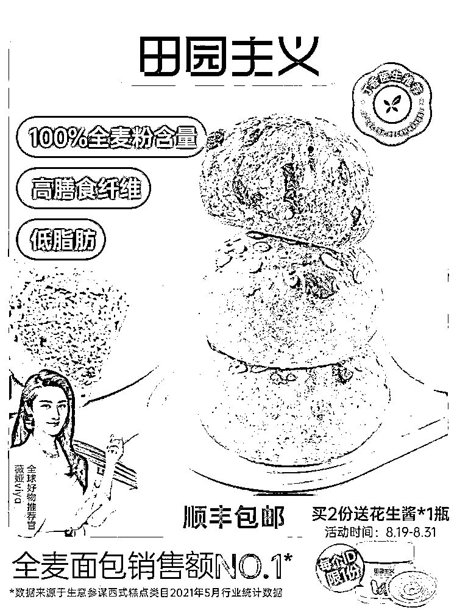

田园主义全麦面包

检测结果令人吃惊

8 月 30 日“上海市消保委”微信公众号发文：《号称销售第一、薇娅带货的田园主义全麦面包，实测能量高出宣传 40%》。

上海市消保委之所以对全麦面包感兴趣，源自消费者的求助。有希望减肥的消费者发现，不少减肥菜单都推荐全麦面包，而市场上全麦面包种类繁多，让人不知如何下手。消费者故此希望市消保委能指导科学选购全麦面包。 

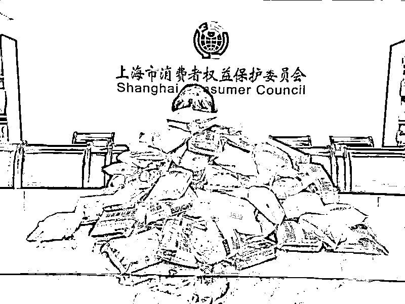
市消保委收集到的众多全麦面包

在众多标称“全麦”的面包中消保专家被一款名叫“田园主义 全麦面包”的产品所吸引。

在田园主义天猫旗舰店，这款产品的名称很长，还包括“无蔗糖”“低脂食品”“健康零食”“代餐饱腹”等标签。

根据田园主义店铺介绍，**该产品销量是今年 5 月的行业第一**，且在 2019 年 8 月 1 日至 2021 年 5 月 1 日期间，已总共卖出 3600 万袋。

同时，这款产品进入过**薇娅直播间，**也被**丁香医生所推荐，号称销量第一，****薇娅头像和“丁香医生推荐”****均出现在产品介绍页面上。**

**但消保专家发现****该产品的营养成分表有些奇怪：**原味面包的包装上明明白白写着蛋白质 6.4 克/100 克、脂肪 1.0 克/100 克、碳水化合物 33.5 克/100 克、膳食纤维 6.1 克/100 克、钠 107 毫克/100 克，**总和为 47.107 克/100 克，即占比约为 47.1%，不到总量一半。**

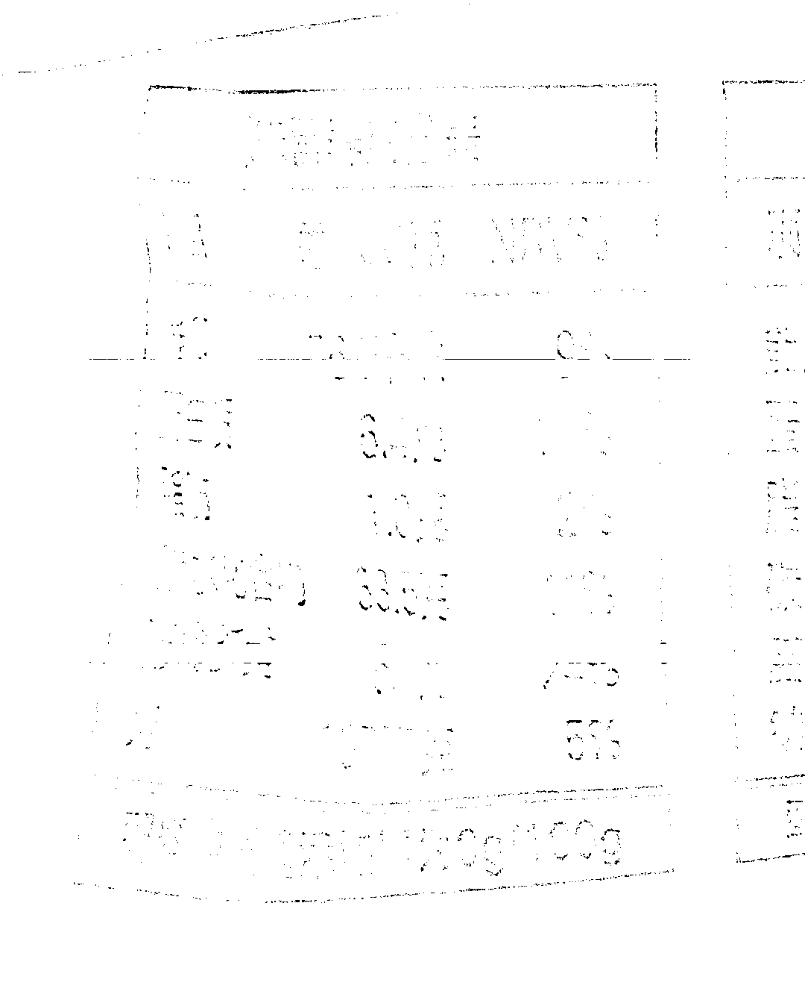

那么，面包中剩下的一半是什么呢？

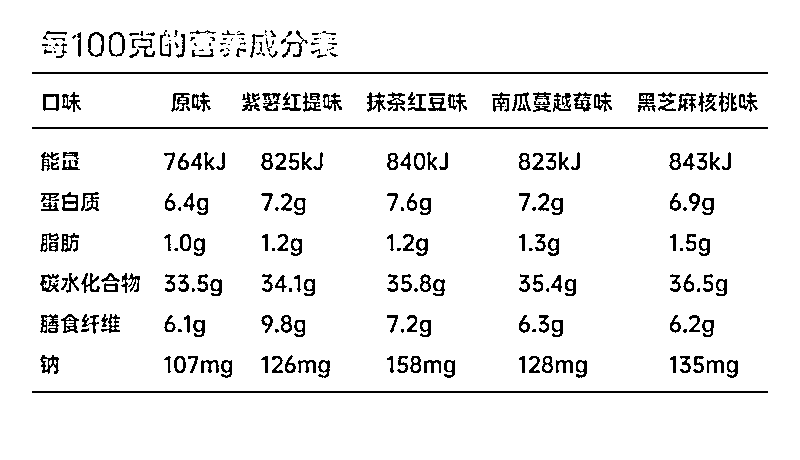
“田园主义”天猫旗舰店公布的产品营养成分表

**于是，市消保委将这款面包****送往专业机构检测****却惊讶发现，**该款产品碳水化合物实际含量为**45.7 克/100 克**比标称的**高出约 16%，**所含能量标称 764 千焦/100 克，实际检测为**1060 千焦/100 克**比标称的**高出 40%**

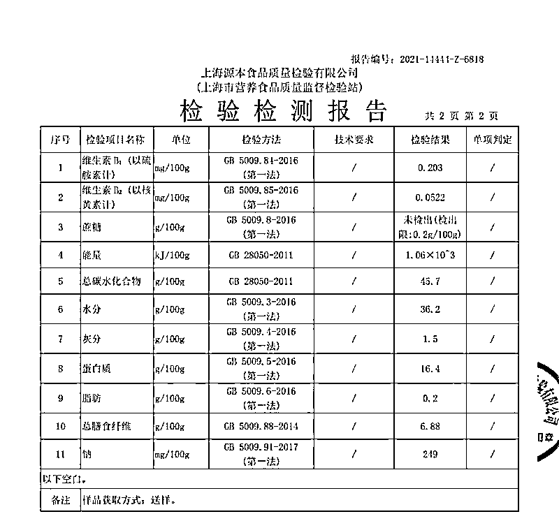
市消保委公布的第三方检测报告

该产品在网店宣传页面称，单个原味全麦面包的能量为 155 大卡。但根据检测结果 ，单个该款面包的实际能量为 901 千焦，按照 1 大卡=4.19 千焦换算，该面包实际能量约为 215 大卡，远高于企业标称。

**所以，如果消费者按照企业推荐的数量食用，那么不仅不能减肥反而会因为摄入过多热量而变成增肥******

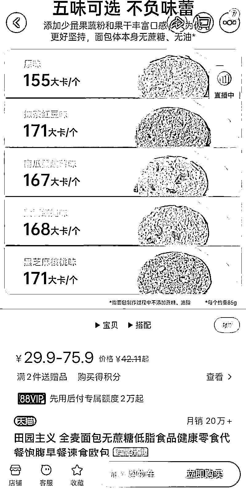
“田园主义”天猫旗舰店公布的产品能量值

对于检测发现的问题，上海市消保委指出，企业的产品宣传应当真实科学。**类似田园主义的低标行为不仅涉嫌虚假宣传，而且会误导消费者。**

对此，有网友表示： 

买了的人**可以退货吗？**

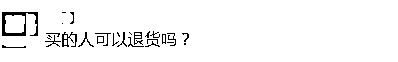

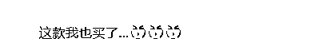

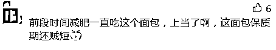

有人称：这种涉嫌虚假宣传的行为

一定要**重罚！**

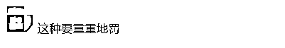

还有人感叹：

**我越减越肥的原因终于找到了**

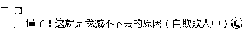

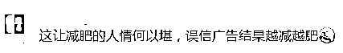

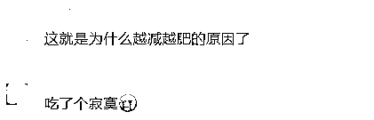

 眼花缭乱的“全麦”尚无标准可依 

其实，在电商平台上不少商家宣称全麦面包具有 “无蔗糖”“低脂”“健身”等功。记者看到全麦粉含量也是从 20%—50%不等，让人眼花缭乱。

此外，记者使用“全麦饼干”进行搜索，一款月销量过万标注着“代餐全麦饼干”的热销产品，配料表显示其主要成分只是小麦粉、荞麦和黄豆等。

据了解，目前国内尚未出台全麦面包标准，大多数产品中只要含有全麦成分都被称为“全麦面包”。但“部分添加全麦”显然与全麦面包的标称并不相符合，

**业内人士指出，****只******有含麦子的麸皮、胚芽以及胚乳部分的面粉才是真正的全麦粉，选择全**麦面包时排在配料表第一位的一定要是全麦粉。******

**此外还有业内人士建议尽快出台相关标准，对全麦面包含量进行规范标注，以保障消费者的知情权。**

那么，对于全麦面包的爱好者，

我们又该如何挑选

全麦粉含量较高的面包呢？

北京农学院食品科学与工程学院院长 仝其根：第一个就是看配料表里边，全麦粉是不是在配料表的最前边，如果前边的话，说明它的全麦粉含量比较高。第二个，看营养成分表里边的纤维素含量、膳食纤维的含量。膳食纤维高的，肯定是全麦粉的含量高。

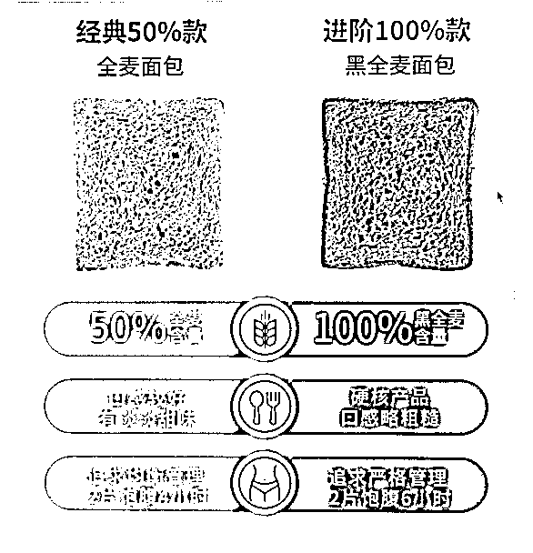

另外，全麦含量高的面包，切面呈浅褐色，组织粗糙，有很多孔隙，也能看到很多小的黄色颗粒的麦麸。口感越粗糙，那么全麦含量也就越高。

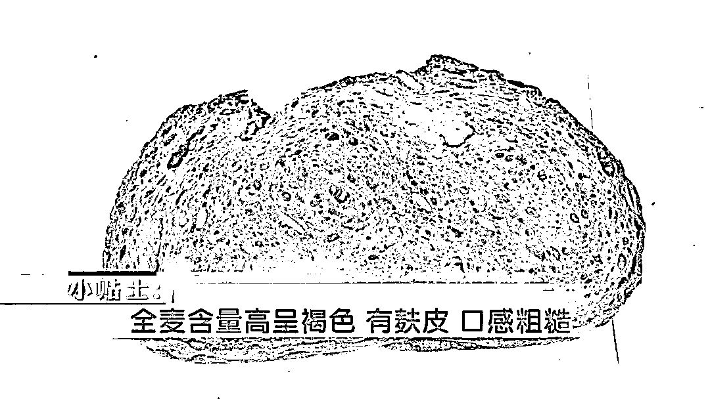

看到这里

你学会怎么选了吗？

来源 ： 潇湘晨报、上海消保委、上观新闻、央视财经、政法频道

← 向右滑动与灰产圈互动交流 →

