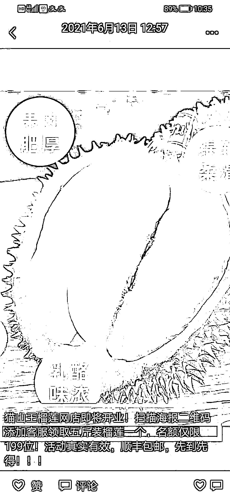
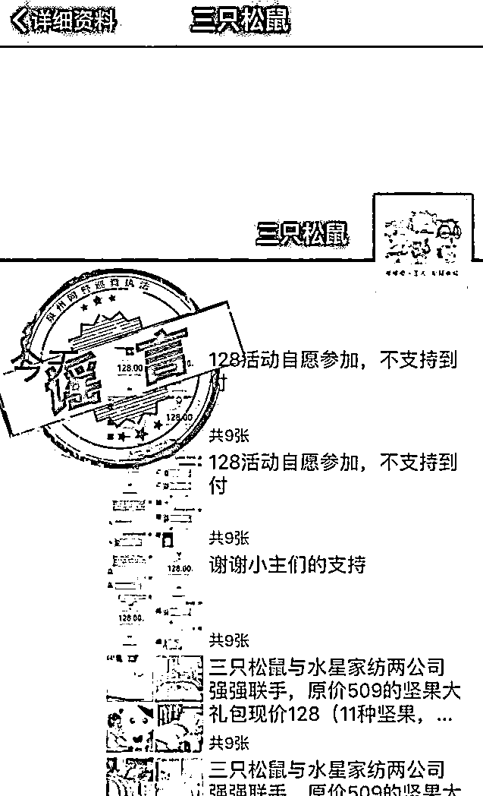

# 你的朋友圈有没有人在“免费领电风扇”，大声告诉他们这是骗局！

> 原文：[`mp.weixin.qq.com/s?__biz=MzIyMDYwMTk0Mw==&mid=2247519926&idx=4&sn=7e1269ee0dae1e898ebfd97961f56006&chksm=97cb458ea0bccc986933bb1f681a652da7e242610f3d18685db53df390b621100d7d3c2b9fe2&scene=27#wechat_redirect`](http://mp.weixin.qq.com/s?__biz=MzIyMDYwMTk0Mw==&mid=2247519926&idx=4&sn=7e1269ee0dae1e898ebfd97961f56006&chksm=97cb458ea0bccc986933bb1f681a652da7e242610f3d18685db53df390b621100d7d3c2b9fe2&scene=27#wechat_redirect)

最近在朋友圈看到很多“免费领"广告

就连很少发圈的老同志

也参与其中

小编不知道怎么劝才能顾全颜面

索性归纳总结了一下

然后

拜托大家广泛转发

希望那些发圈的能主动删除

毕竟这是考验防骗意识的第一关

**贪欲！！！**

显然他们第一关都没过去

扫一扫，免费领

榴莲、车厘子等各种贵价水果

应有尽有……

而今天最新的免费信息是电风扇

面对这些小广告，你是否也心动了呢

**今天就让我们一起** 

**扒掉免费送的神秘外衣**

**看看到底是个什么鬼东西**

**↓↓↓**

**看多么诱人的榴莲，仿佛隔着屏幕都能闻到那股清新又与众不同的味道。** 

不得不佩服骗子的敏锐嗅觉，你喜好什么需要什么，骗子都会送送送，这世上真有这样的好事吗？当然是没有的，送个榴莲、车厘子，你觉得是小店不可信，那么就给你整上市公司的名号送。

在 4 年前骗子们就用三只松鼠和水星家纺的名号组团诈骗，但那时候他们还只是为了套取公民的个人信息，然后进行黑灰产交易，并未直接造成损失，很多人只是没收到货咒骂一顿，然后就不了了之啦，因为没有造成实际经济损失，所以根本没记住这个教训，也就有了此类诈骗的最新升级版本，免费送美的电扇，这可是家电航母啊！送个电扇小意思，最关键的是客服极其正规哦！

**注意啦！注意啦！**

**高能的案件解析开始啦！**

*No.1* 

**第一个问题：免费送的产品为什么选电风扇？**

除了“秋老虎“持续高温的“刚需”之外。在产品的选择上，还包括价格因素：太便宜的产品，大多数人不愿意费时费力去“免费领取”；太贵的产品，“免费送”又不太可信，哪个商家会那么傻？

某宝上的同款风扇，价格在 100-400 元之间，这个价位刚好可以满足两个客户心理：**一是值得我去领；二是商家送的起。**

**▲某宝同款风扇售价截图**

既然“免费送电风扇”，那一定要是质量过关的牌子货。所以，不少知名品牌就地“躺枪”。估计是收到了不少受害人的投诉，官网不得不在首页第一条就设置了骗提醒。

**▲美的官网截图**

*No.2* 

**第二个问题，免费领取需要做些什么？**

首先当然是扫描广告图片中的二维码，一般情况下会跳转到一个“领取页面”，或是添加上一个客服人员。在填写提交个人资料以后，得到了下一步指引。最最关键的是这次采用了企业微信，显得更加的专业和逼真。 

**▲以上三张为骗子的引导图**

**请注意：**那些发布“免费送”朋友圈的朋友，他们并没有恶意，一方面“转发朋友圈”是商家规定的领取风扇的必要条件，另一方面他们也怀着想让更多的朋友一起来享受这个“免费的福利”的善意。请允许我只能用这么一个很人性很完美的理由来开脱。

*No.3* 

**第三个问题，免费领又不出钱，怎么会被骗？**

想领取风扇，当然没有“转发个广告”那么简单。我们看看一位被骗了 6 万多元的受害人怎么说？ 

**▲骗子使用的名称**

除了这个活动还有什么呢？**帮助风扇的赞助商增加订单、点赞，作为获得“免费风扇”的交换条件。**听起来很合情合理啊！

**▲真实案件中的对话截图** 

如果你还有疑虑，群里还有骗子的“托儿”（下图露露）来冒充客户，配合客服一问一答，全面解除你的所有防备。 

**▲骗子与“托儿”的对话截图**

至此，送电扇的套路谜底揭晓！没错，就是“刷单诈骗”。

**“刷单”**，是指一种制造虚假销量行为的简称。客户垫付资金下订单购物，帮店家增加人气、销量和曝光度。而店家并不发货，直接退回客户支付的购物款，额外附加一笔佣金作为酬劳。

这一系列过程是“黑产”行业的潜规则操作，只是从 4 年前的收集信息去贩卖，变成了前台获客，后面直接"屠宰"，形成了衔接更加紧密的诈骗产业链。

**▲刷单诈骗中常见的任务单** 

现实中的“刷单诈骗”（上图），只是被骗子利用了“刷单”流程里，最关键的一个步骤——**垫资**。 

这些“垫付”的资金，来自受害人的真金白银，是骗子的最终目标。为了骗到更大笔的资金，骗子会将“购物刷单”改为“高盈利”的博彩方式。这种免费领取只是引流手段，后面多种多样的诈骗在等着你，有人说领个榴莲、电风扇，骗不了多少的。那么我们就用事实来打脸好吧！ 

开始只是想占便宜，到最后已经忘了自己是来干什么的了。

可是领着领着变成了刷单，最后稀里糊涂的又成了猜单双，押大小，头乱了，钱没了，本着占便宜的初衷，却得到一个哭死的结局。

**▲博彩诈骗中的任务单**

一名受害人最终没有经受住**盈利 40%**的诱惑，他是怎样走到这一步的？看下面一张图片就知道了。

**▲受害人的提现流水单**

如上图，小额垫付的 145、390、1300、6500，都可以提现成功。而当大笔垫资达到 18 万，就提现不出来了。

**当人们尝到了甜头，贪念就会暴露的淋漓尽致，侥幸心理不断膨胀，面对巨额的盈利，尽管那只是账面数字，就已近乎失去理智。**

这就是人性，没有人可以例外！只有多看多学多转发，不断用反诈知识武装自己才是硬道理。在没有下载全民反诈 APP、不关注兴安反诈联盟、不知道 96110 是干啥的之前，还是别用电风扇了……

**反诈提示**

**1、骗子在夏季常以“免费领榴莲”、“免费领电扇”，冬天以“免费领车厘子”为诱饵，目的都是加客服微信后拉群，已经是惯用伎俩，不要相信这样的免费午餐。**

**2、刷单和博彩两种手段融合之后欺骗性较高，不要相信点赞、点关注等轻松赚钱的兼职广告。**

**3、网络博彩本就违法，不要相信只是做任务不是赌博的说辞。**

**4、即便你没有进行后面的操作，但是发朋友圈拉好友下水暴露了你的智商，而你填写的收货信息，已经把自己出卖。骗子获取到这些信息后会转手卖给其他黑产，接着成千上万个诈骗团伙拿到这些详细的个人信息，就会精心谋划准备实施精准诈骗。**

来源：终结诈骗，兴安反诈联盟，反诈骗先锋

← 向右滑动与灰产圈互动交流 →

