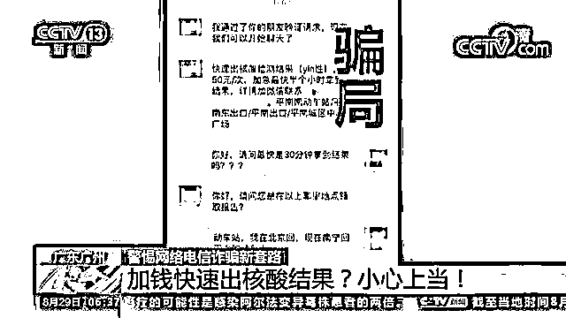
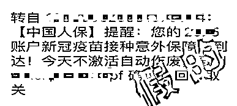
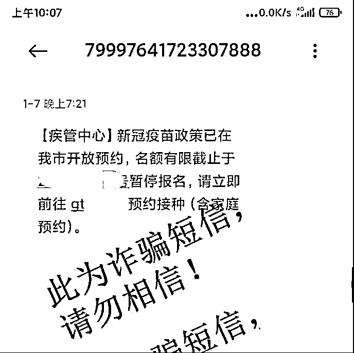
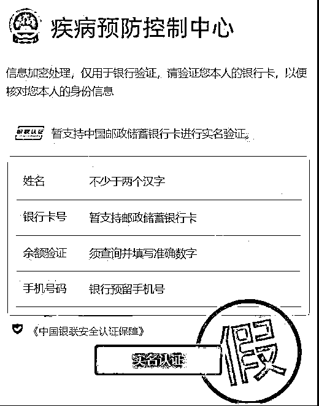
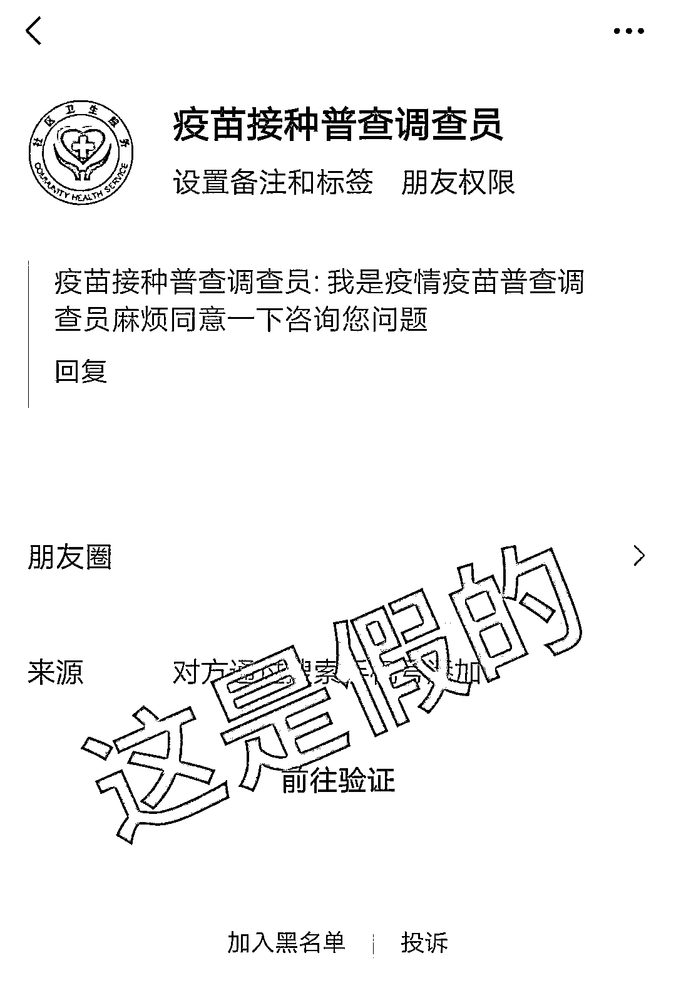
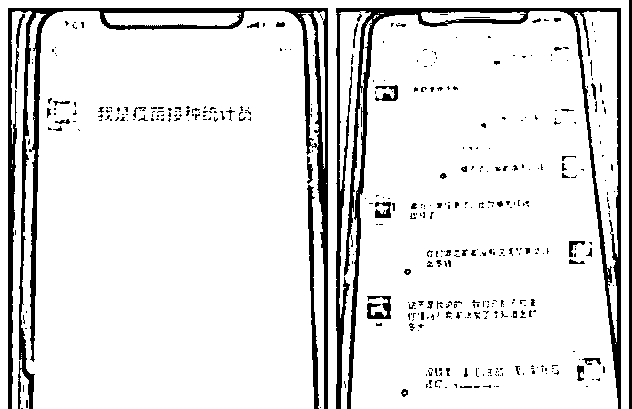
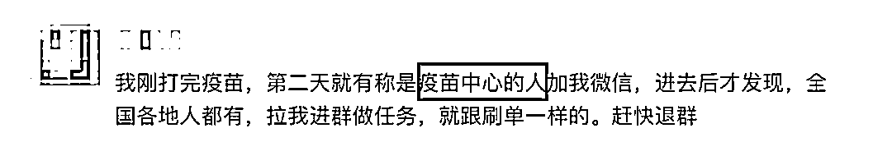

# 央视曝光，假的！

> 原文：[`mp.weixin.qq.com/s?__biz=MzIyMDYwMTk0Mw==&mid=2247519965&idx=3&sn=3a6671f9a98d2eea9a7a12ffed52ea4d&chksm=97cb45e5a0bcccf32029406f2316d2f869bdb31c3272ffe2fe6ec55de261b924f1e7b2cfc59b&scene=27#wechat_redirect`](http://mp.weixin.qq.com/s?__biz=MzIyMDYwMTk0Mw==&mid=2247519965&idx=3&sn=3a6671f9a98d2eea9a7a12ffed52ea4d&chksm=97cb45e5a0bcccf32029406f2316d2f869bdb31c3272ffe2fe6ec55de261b924f1e7b2cfc59b&scene=27#wechat_redirect)

因为疫情防控要求 

我们经常会遇到

需要去做核酸检测的情况

8 月 29 日，据央视新闻报道，

近期网络上有一些人声称可以

**“快速出核酸检测结果”**

**“加急最快半个小时就出结果”**

不过需要额外收费

这当中有没有猫腻呢？

[`v.qq.com/iframe/preview.html?width=500&height=375&auto=0&vid=a3271v31g0r`](https://v.qq.com/iframe/preview.html?width=500&height=375&auto=0&vid=a3271v31g0r)

据相关部门

**核酸结果一定要由**

**经卫健部门认证的具备资质的**

**医院或第三方检测机构出具**

**根本没有所谓的**

**私人渠道**

聊天群里出现“快速出核酸检测结果”“加急最快半个小时”“家里也能做核酸检测”的信息。记住一条：**只要额外付费便能办到，都是骗子的套路。**

**不要轻信网络不实信息和所谓“私人渠道”。这不仅可能影响自身正常出行，更有可能落入不法分子非法敛财的骗局。**

****警惕！警惕！警惕！**** 

****这些都是骗局！****

****骗局一****

****身份：**掌握特殊渠道的“神秘人”** 

****方法：宣称投资生产“新冠疫苗”可赚大钱****

****目的：**诱导你在虚假平台、APP 上投钱**

**骗子潜伏在社交软件、网络直播平台等，广撒网私信他人。冒充领导称有内部渠道可购买“新冠疫苗”。不断给受害者洗脑，灌输投资生产“新冠疫苗”可赚大钱，诱导受害人在其提供的平台、APP 上进行投资转账。**

**假的！说到底还是投资理财诈骗，一旦受害者信了骗子，只能是无法提现或者全部亏损。**

****骗局二****

****身份：**冒充“新冠肺炎疫情流调员”**

****方法：打你电话，恐吓得病****

****目的：**骗你买药**

****

**对方自称“防控中心某主任”，告知你健康码和检测报告上有异常，可能感染了新冠肺炎，不过还在潜伏期，情况不算太严重。**对方会在电话里透露，现在有一款特效药，只需 5800 元三个疗程，每天坚持服用就会恢复健康。****

****假的！目前新冠肺炎没有特效药，只要听到对方说类似的话，请立刻挂断电话并举报！****

****近期，为准确排查密接者、次密接者、重点人群及一般人群，有效控制疫情，确实有新冠肺炎疫情流调员正在对确诊病例的接触人员开展流调工作。流调人员表明身份后，不会询问财产、自称有特效药等，**需要核实内容只有以下这几种：******

****1\. 个人基本信息：包括姓名、身份证号码、联系方式（常用的手机号）、家庭住址、家庭成员等；****

****2\. 健康状况：包括近期是否有不适症状、核酸检测情况；****

****3\. 近期行程：包括 14 天内具体行程、交通工具、接触过谁（与谁共同生活、学习、工作、娱乐或其他近距离接触、是否采取了有效防护措施）；****

****4\. 其他对疾病防控有用的信息。****

******骗局三******

******身份：冒充“相关权威部门、机构”******

******方法：**以各种理由发短信****

******目的：**骗你点开病毒链接****

********

********

********

******这类短信统统都是假的！**不要点击陌生链接，不要填写个人信息，看到此类信息，请马上删除。****

****这是一种将诈骗短信包装成防疫提示的骗局，以往有预约疫苗接种的内容，现在又出现了 3 小时做核酸、意外保障到达等借口，**不管如何包装，其根本就是发送含有“钓鱼网站”链接的短信，诱导点击链接。******

********骗局四********

******身份：冒充“疫苗接种普查调查员”******

******方法：**申请微信好友，拉入各种群聊****

******目的：**骗你刷单****

********

********

********

****这当然是假的！疫苗接种和做任务有什么关系？这只是骗子接近你的一种方式。只要对方拉你入群，请马上退出！****

****随着防诈宣传的深入，群众安全意识越来越高，骗子只能绞尽脑汁寻找能让大家放松戒备的理由。拿大众的“配合”来骗取通过，再行骗人之举实在是可恶。****

******转发提醒更多人！******

****来源：央视新闻、广东发布、科普中国、长沙晚报****

********

****← 向右滑动与灰产圈互动交流 →****

********