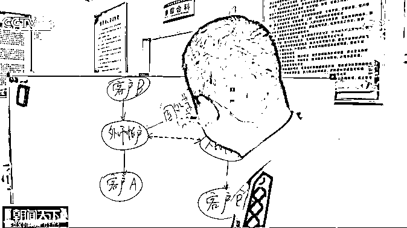
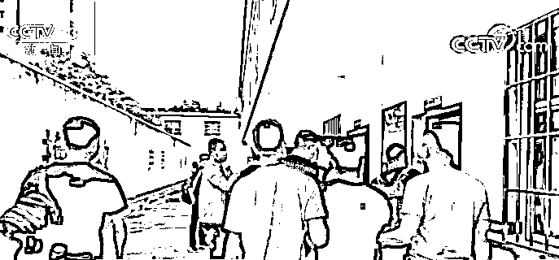

# 涉案金额 143 亿，涉案人员遍布 25 个省

> 原文：[`mp.weixin.qq.com/s?__biz=MzIyMDYwMTk0Mw==&mid=2247519965&idx=4&sn=1778e681c20ce3ef61e406a60337c0f0&chksm=97cb45e5a0bcccf3615f9c11181c39e275417a7374769c8e9414389d6e766f3465ca82fe76f6&scene=27#wechat_redirect`](http://mp.weixin.qq.com/s?__biz=MzIyMDYwMTk0Mw==&mid=2247519965&idx=4&sn=1778e681c20ce3ef61e406a60337c0f0&chksm=97cb45e5a0bcccf3615f9c11181c39e275417a7374769c8e9414389d6e766f3465ca82fe76f6&scene=27#wechat_redirect)

外汇管理部门与公安机关日前在湖北联合破获一起特大地下钱庄案件，**涉案金额达 143 亿元，涉案人员遍布全国 25 个省，**是一起集境内外勾结、地下钱庄及上游犯罪相互交织的复合型案件。 

**涉案金额大、范围广 外汇管理部门与公安机关联合破案>>**

2019 年 8 月，外汇管理部门移送给湖北麻城公安的有关线索显示，麻城某人力资源有限公司疑似为地下钱庄，涉嫌非法买卖外汇。在收到线索后，公安机关立即对相关公司开展排查。 

湖北省麻城市公安局经侦大队副大队长 陈包：我们接到国家外汇管理局（湖北省分局）的日常监测线索，发现湖北麻城本地有一家人力资源公司，名下的账户，包括公司负责人的相关个人账户，每天的业务量很大，银行流水上面的日均交易额达到了两百多万，总的账户里面的资金总额达到了四个多亿。

在排查中，民警发现，与公司账目每天的流水数额相比，该公司的实际办公地每天却很少有人出入，这与人力资源公司正常的业务模式存在很大反差。 

 经过一段时间的蹲守和摸排，民警发现该公司打着人力资源服务的幌子，背地里从事居中撮合外汇交易的业务，一条涉嫌非法买卖外汇的犯罪链条逐渐浮出水面。

 湖北省麻城市公安局经侦大队副大队长 陈包：它是由境外某公司实际控制，境内的多个网点实际操作，这个案件的主犯徐某是境外这个公司在国内的总代理人，他在国内聘请了他的亲属、朋友在国内组建了很多的网点，专门从事非法经营外汇的犯罪活动。

**分析账目等数据 抽丝剥茧锁定犯罪证据>>**

在初步锁定该公司存在重大犯罪嫌疑后，外汇管理部门与公安机关进行联合研判，锁定犯罪证据。

在研判中，办案人员综合运用外汇非现场检查分析等方式，对涉案公司和主要负责人的相关账目等数据进行归集、分析和研判，理清了资金的走向。

湖北省麻城市公安局经侦大队指导员 万刚：通过对资金的研判，发现有作案嫌疑的人员，这是通过这个人员的资金发散出来的涉案人员。我们通过这种研判发现关联的账户有一千余个，一千余个账户里面的流水信息量达到两千多万条。

在对海量数据进行分析后，办案人员从中锁定了犯罪证据。 

湖北省麻城市公安局经侦大队指导员 万刚：我们主要是通过交易金额的规律性和交易时间的规律性（判断），它不是那种正常时间的交易，或者说是交易金额累计，或者说单笔其中有数量上面的规律，所以我们通过这个规律，结合交易时间的规律，一起来综合研判这个人有非常大的作案嫌疑。

**攻坚克难，同时出动捣毁地下钱庄团伙>> **

经过研判，办案人员判断这是一起资金交易量大、团伙成员多、犯罪手法隐蔽的非法买卖外汇案件。

为了将犯罪分子一举抓获，警方成立了多警种联合作战的专案组。

湖北省麻城市副市长 公安局长 陈琪：我们立即抽调警力，成立以经侦为主，网安等多警种协同配合的专案组，制订了周密的侦查计划，发挥了各警种的优势，合成作战，网上网下联动排查，综合研判，勾画了（犯罪团伙的）组织架构。 

历经了数月的侦查研判，在摸清了该犯罪团伙的组织架构、身份信息及活动规律等信息后，麻城市公安局成立案件收网行动指挥部，调集多路警力同时出动，将本案的 14 名关键犯罪嫌疑人抓捕归案。 

民警在现场缴获了犯罪嫌疑人使用的手机、电脑、银行卡等一批作案工具，并及时固定了电脑服务器数据等电子证据。据统计，该案件涉案金额达 143 亿元，涉案人员遍布全国 25 个省。2021 年 6 月 16 日，麻城市人民法院开庭审理本案，犯罪嫌疑人当庭认罪悔过，法院将择日宣判。

**去年以来已查处地下钱庄案件 150 余起>> **

地下钱庄不仅实施非法买卖外汇违法犯罪，还为多类犯罪转移赃款，严重侵害人民群众财产安全。

近年来，外汇管理部门与公安机关连续开展打击地下钱庄专项行动，有效打击了外汇违法犯罪活动，维护国家金融秩序。

国家外汇管理局管理检查司副司长 肖胜：地下钱庄是一种非法的金融组织，助长贪腐、走私、贩毒、赌博、骗税、诈骗等多类犯罪，从我们以往检查的情况看，确实也成为各类犯罪分子跨境转移赃款、隐瞒违法所得、逃避监管和法律制裁的洗钱工具和资金通道、2020 年以来，外汇局配合公安机关破获地下钱庄案件 150 余起，查处交易对手案件 3000 余起，行政罚款超 8 亿元人民币。  

国家外汇管理局黄冈市中心支局副局长 兰志贤：提醒广大群众，一定要通过合法、正规的金融渠道进行跨境汇款、汇兑。通过地下钱庄转移资金，不但不受法律保护，而且可能面临财产损失和法律风险。

来源：澎湃新闻

← 向右滑动与灰产圈互动交流 →

