# 开 学 季 新 骗 局

> 原文：[`mp.weixin.qq.com/s?__biz=MzIyMDYwMTk0Mw==&mid=2247519965&idx=5&sn=0e90d32cc745f0e249e17cfdf1d80a00&chksm=97cb45e5a0bcccf3a499d4e06a1c3bab575aff7fe1514c60e3f973e9d2b9a4e85b2ee33120cf&scene=27#wechat_redirect`](http://mp.weixin.qq.com/s?__biz=MzIyMDYwMTk0Mw==&mid=2247519965&idx=5&sn=0e90d32cc745f0e249e17cfdf1d80a00&chksm=97cb45e5a0bcccf3a499d4e06a1c3bab575aff7fe1514c60e3f973e9d2b9a4e85b2ee33120cf&scene=27#wechat_redirect)

“如果不注销校园贷款账号

就会影响个人征信......”

这是大家所熟知的**注销贷款账号诈骗**

近期，不法分子略微修改了台词

变成↓

冒充支*宝“客服”实施该类诈骗

我市多名在校生或毕业生被骗

三角镇 X 女士因此被骗近**10 万元**

**“校园贷款账号注销”**

**再现“新骗局”**

** 支*宝“客服”来电**

毕业不久到三角某企业务工的 X 女士接到一个电话，对方自称是支*宝“客服”，并且详细地报出了谢女士的个人身份信息。

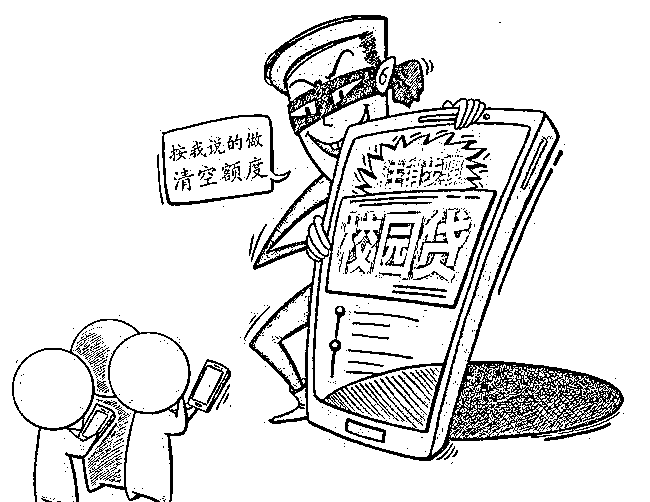

** 支*宝学生注册信息****需变更为成人信息**

“客服”表示 X 女士之前使用**“学生身份注册开通”**，现在需要用**“成年人身份重新设置”**，这样才不会影响征信。

** 进入指定“操作指导”群**

X 女士也没多想，毕竟影响征信确实不好，于是她听从“客服”要求添加对方好友，随后被拉进入了一个**“银联监听端口”**的群。

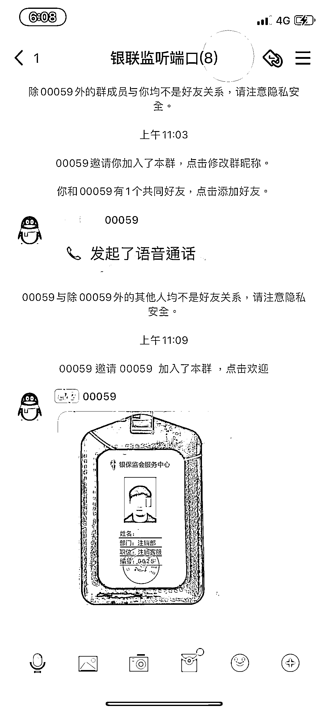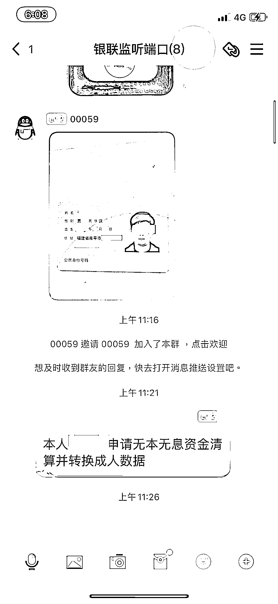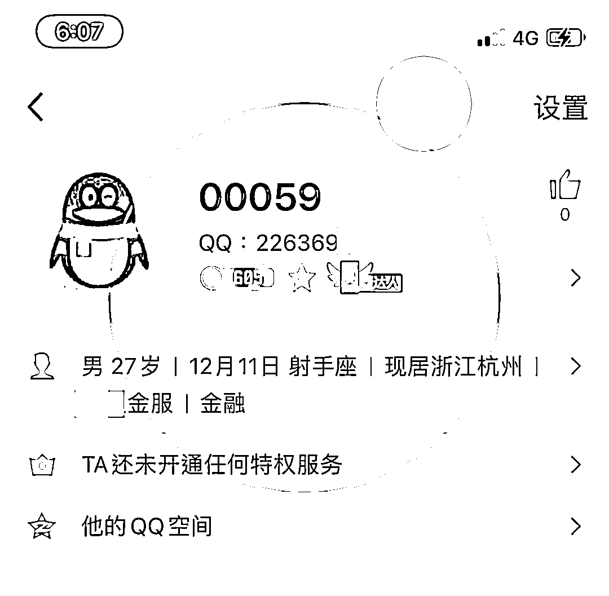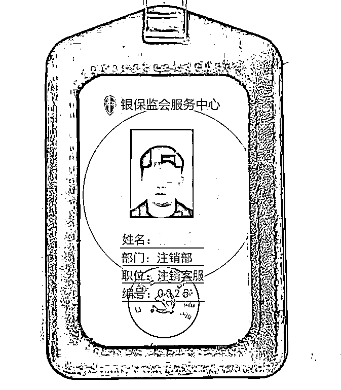

↔左右滑动查看图片

** 为“注销”贷款转账**

为不影响征信，X 女士听从“客服”指导申请了虚拟资金银行流水认证。随后“客服”要求 X 女士把支*宝里面的钱提现到银行卡内，再转到“客服”提供的账号，生成“流水”解除风控。X 女士听从操作后，“客服”表示流水不足，“指导”X 女士在花*贷款**19000 元**，并转到指定账号。X 女士转账之后，又有另外一名“客服”联系 X 女士，表示在银行卡里需存够**40000 元**才能返款，这时 X 女士终于醒悟，于是报警，被骗**96775 元**。

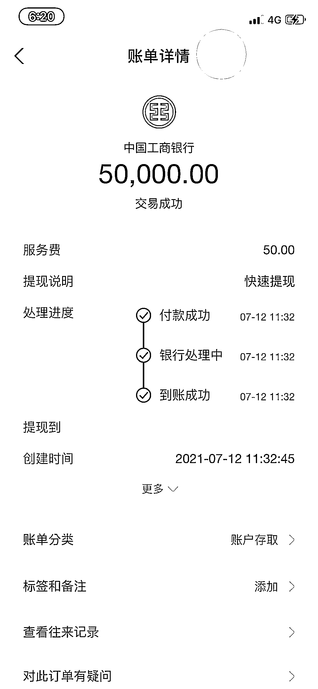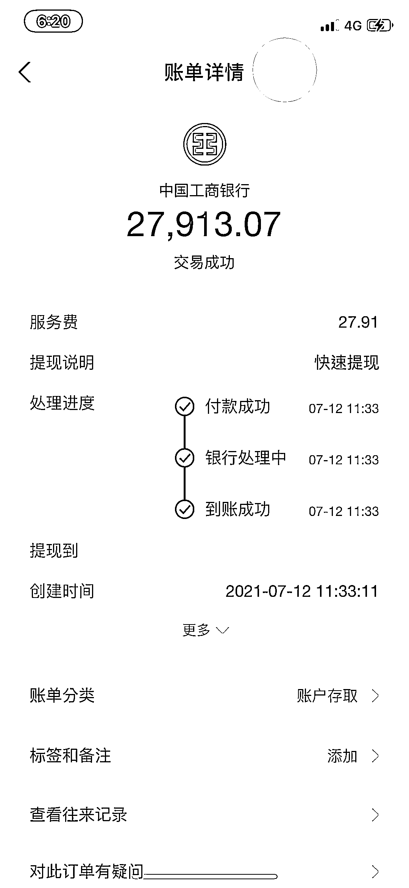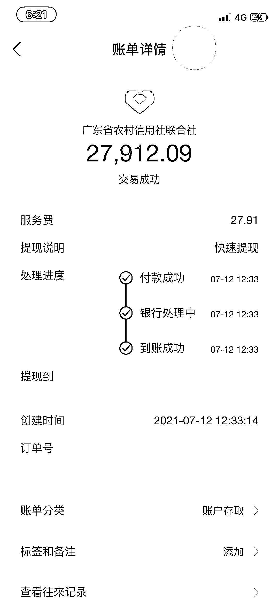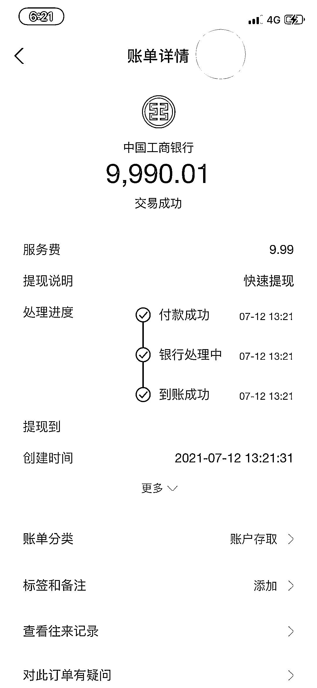

↔左右滑动查看部分提现截图

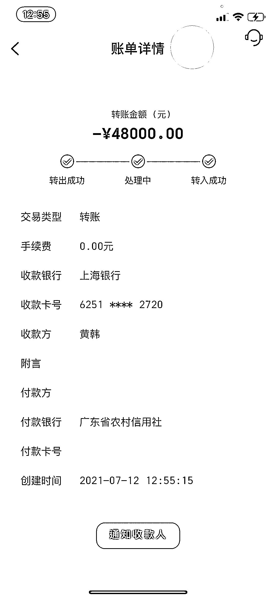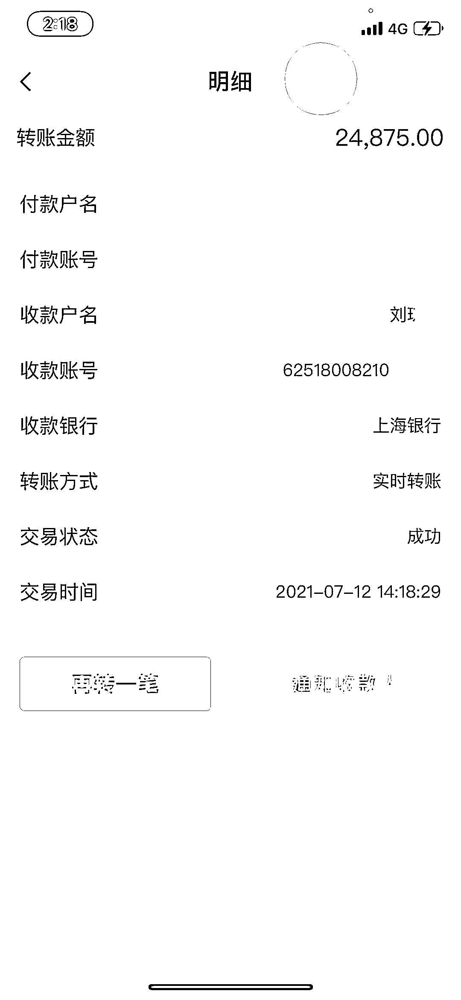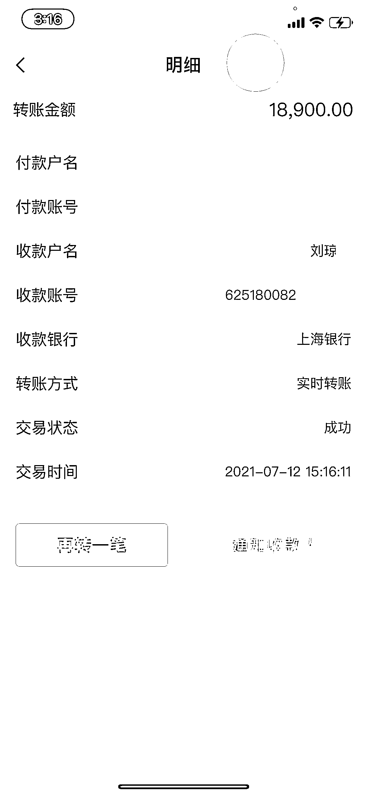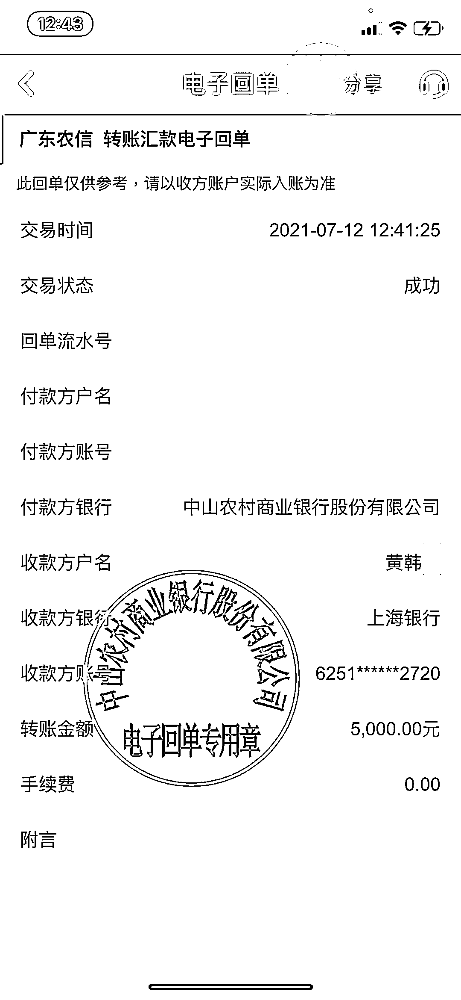

↔左右滑动查看图片

**注销贷款账号诈骗**

**诈骗套路剖析**

**第一步**

不法分子通过非法渠道获取被害人个人信息，主要选择在校大学生和刚毕业步入社会不久的目标群体。

**1**

**2**

**第二步**

冒充银行、网贷、互联网金融平台“客服”拨打目标对象电话，利用已掌握的信息骗取信任，降低疑虑。

**第三步**

以影响“征信”为由，主动要帮目标对象注销贷款账号，同时夸大后果严重程度，诱导目标对象配合“注销手续”。

**3**

**4**

**第四步**

利用“验证流水”、“清空额度”等话术，诱骗目标对象把现有存款、各正规借款平台的借款转账到不法分子指定的账户，从而成功骗走款项。

**鹏哥@广大在校生和毕业生**

凡是以影响征信为由主动为你

“注销贷款账号”“修改注册信息”的

一律是诈骗

**不注销贷款账号并不会影响征信**

**不按时还贷才会影响征信**

了解真实情况=不会被骗

来源：中山市反诈骗中心

← 向右滑动与灰产圈互动交流 →

