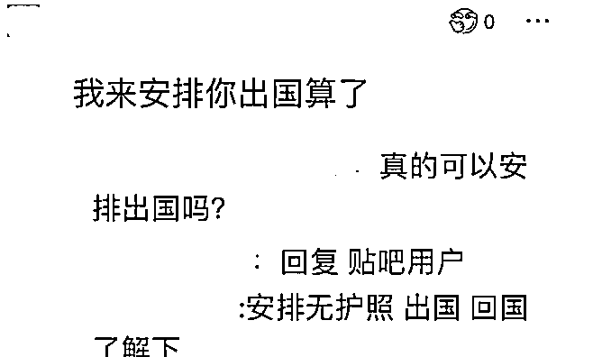
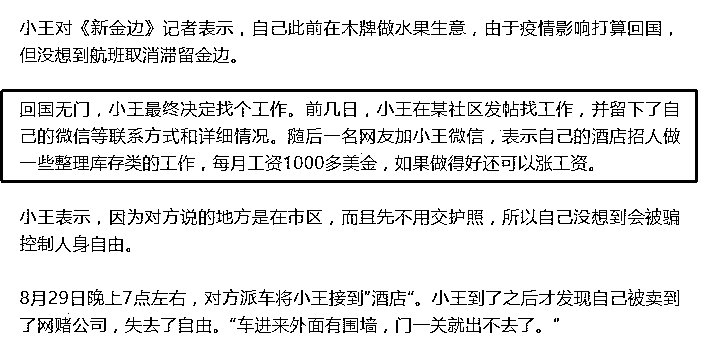
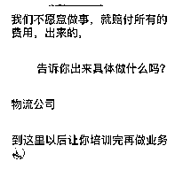

# 在柬同胞警惕！网投公司招聘话术又出新花招！

> 原文：[`mp.weixin.qq.com/s?__biz=MzIyMDYwMTk0Mw==&mid=2247520031&idx=1&sn=5e042e5555973c69a12b3534aff309b6&chksm=97cb4427a0bccd31775b0afb97903495c159d33cc3e556c323c85e0b20c3e77fafa06ae03679&scene=27#wechat_redirect`](http://mp.weixin.qq.com/s?__biz=MzIyMDYwMTk0Mw==&mid=2247520031&idx=1&sn=5e042e5555973c69a12b3534aff309b6&chksm=97cb4427a0bccd31775b0afb97903495c159d33cc3e556c323c85e0b20c3e77fafa06ae03679&scene=27#wechat_redirect)

该公众号已被封禁

随着国家对跨境网赌、诈骗的打压，柬埔寨网投公司为适应生存环境，招聘话术也随之“进化”，招聘信息越来越难以辨别，且已有不少人上当受骗。 

柬埔寨网投招聘话术 1.0 版本

 中国年轻人为心动付出沉痛代价

**“招聘客服，会打字就行，月薪 8000+提成，转正后不封顶**；工作地点柬埔寨，包机票签证、住酒店式公寓 2-4 人间，海景房，不用出门就能看见海带泳池健身房；全勤奖、提供 3 餐、每年至少一次调薪、公司氛围好，定期团建、节日礼金、生日补贴等....”，**这是柬埔寨网络赌博、诈骗公司初代招聘话术。**

2019 年 6 月以前，这些招聘信息铺天盖地，尤其百度“柬埔寨吧”关注人数高达 28 万余，贴吧内共发帖 400 多万条。**媒体报道后才引起国内重视，国家网信办重拳出击，下令净化互联网环境，大量招聘信息被删除。**

*国内贴吧上充斥着“非法”招聘信息

**无数中国乡镇年轻人因“出国、工作轻松、福利待遇好”等字眼心动。**他们曾怀揣着憧憬奔赴柬埔寨，可结局要么是带着一段惨痛出国经历悻悻地回国，要么落得惨死柬埔寨的悲剧。很多懵懂无知、缺乏社会阅历和判断力的年轻人为此付出了沉痛代价。

**由于柬埔寨网投人员被囚禁勒索、自杀、被害等一系列恶性事件频频发生。**另一方面，国内身陷网赌的赌徒负债、网贷相关案件剧增，中国公安部开始着手高压打击跨境网赌及诈骗人员，一批批网投人员落网被遣返。

**同年，柬埔寨颁布网赌禁令后，大批菠菜大军撤离。**

中柬两国打击，人员流失，使跨境网赌、诈骗公司的生存环境及人员招聘工作变得艰难为了继续运营，他们开始匿藏市郊别墅内或偏远省份，通过隐晦的招聘渠道和信息悄悄进行。

2.0 版本：换汤不换药

应聘厨师、帮厨、保安也躺枪

柬埔寨颁布禁网赌令后经济遭受创伤，随后疫情又无情来袭，各行业严重受挫，大批从事建筑、餐饮行业的中国员工因此失业。

网投公司为迅速注入新鲜“血液”，瞄准了在柬埔寨失业的中国人。

**一些公司人事活跃于华人圈，更换招聘话术，打着“厨师、帮厨、保安”等岗位招聘，对那些失业后，需要重新找工作的中国同胞下手，国内一些人也被好友、熟人忽悠骗至柬埔寨。**

把人骗到手，等人去公司报道后强行转岗，让他们从事诈骗。没收护照后，直接控制和威胁。

3.0 版本：钓鱼招聘，信息真假难辨

应聘就被控制人生自由

如今，柬埔寨网络赌博和诈骗公司对人员依旧如饥似渴，招聘手段、话术再次升级。他们抛掉以往的“菠菜气质”，通过其他行业的招聘信息进行钓鱼，求职者难辨真假上钩进入虎口。

**受疫情、政策严重影响，网投公司招聘越发困难，导致菠菜“身价暴涨”接近 10 万人民币一个人。**

因回国航班取消，机票昂贵，许多中国人被迫滞留柬埔寨、身上所剩无几，急需工作维持日子及等待回国时机。

**一些网投公司、黑心中介嗅到“卖人头”暴利，把目光投向这些同胞，他们伪装正经公司和猎头，潜伏华人社交圈，四处发布钓鱼招聘信息。**

为获取信任，他们使用其他领域正规职业的招聘信息，因信息真假难辨，部分滞柬同胞因迫切的想工作挣钱，结果掉进陷阱。

**近日，一名滞柬同胞就是被网投“酒店招人，负责整理库存”岗位招聘信息欺骗。在应聘的时候，被****强行****带去网投公司，被控制人生自由。**

*截图来源新金边

**此外，柬埔寨部分网投公司招聘国内人员的时候，也谎称为其他行业，如物流公司、电子商务等，以高薪工资诱骗国内的人过来从事诈骗。**

总而言之，一些网赌、诈骗公司和黑中介目前已经通过其他正规行业岗位招聘信息迷惑求职者，通过真假难辨的招聘信息消除求职者警惕和戒备心。**受害者一旦应聘就会被控制，“绑架式”带进公司。若想走出公司就得赔付，否则难逃被以数万价格卖到其他公司的厄运。**

网赌、诈骗公司是暴利黑灰产业，柬埔寨网投公司和黑心中介自然不会放弃这个行当，为了招聘人员，他们会更加不择手段。滞留在柬埔寨，迫切需要工作的同胞在找工作时，一定要提高警惕！

来源：戒赌吧 

← 向右滑动与灰产圈互动交流 →

