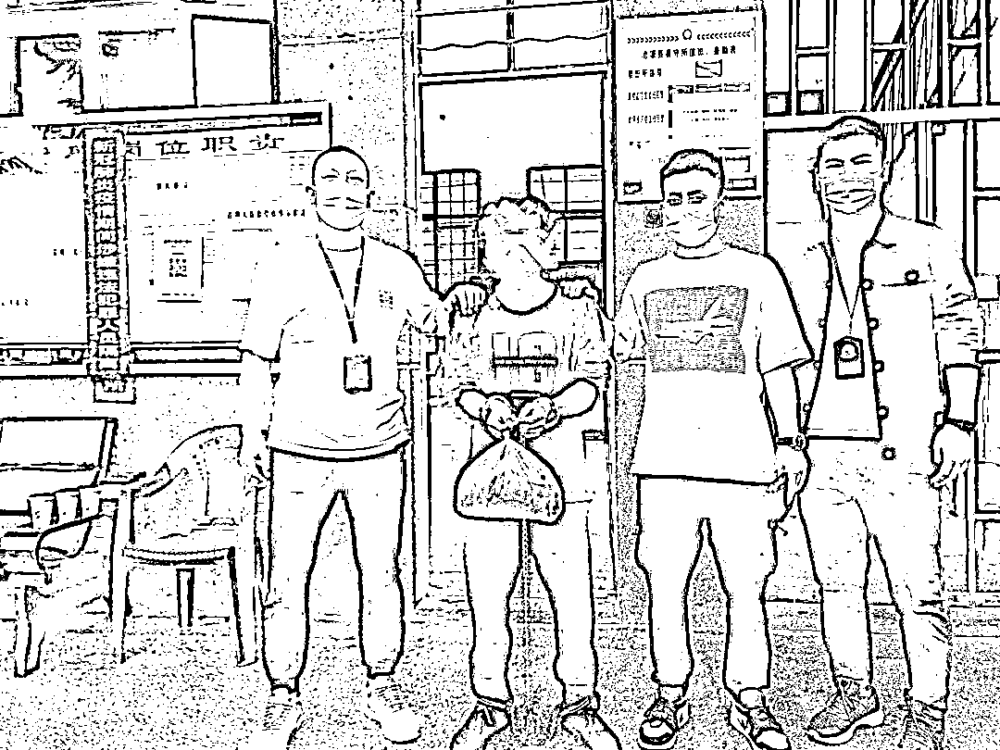

# 逃去缅甸可“捞金”？丽水一男子亲历：一场噩梦！骗不到钱会被转卖、关水牢……

> 原文：[`mp.weixin.qq.com/s?__biz=MzIyMDYwMTk0Mw==&mid=2247520031&idx=6&sn=1ebed1ff7f2360338a863707c5b85634&chksm=97cb4427a0bccd3167cc685db97e48dc033e5f41e0fc5a4f6f6ee490e8adc7a33671cff7ec69&scene=27#wechat_redirect`](http://mp.weixin.qq.com/s?__biz=MzIyMDYwMTk0Mw==&mid=2247520031&idx=6&sn=1ebed1ff7f2360338a863707c5b85634&chksm=97cb4427a0bccd3167cc685db97e48dc033e5f41e0fc5a4f6f6ee490e8adc7a33671cff7ec69&scene=27#wechat_redirect)

以为去国外打工，

轻轻松松月入过万，

甚至高达 10 万，

结果却是去做裸聊诈骗，

**没钱赎身还会被转卖**。

如果怠于工作，

**就会被关禁闭，**

**或被关水牢**，

**每天只提供饮食，**

**直到精神崩溃。**

**若出逃被抓回来，**

**很可能被打残丢在大街上……**

近日，

一名受骗者历尽千辛万苦从缅甸逃亡回国，

向民警讲述了他噩梦般的经历

以及诈骗团伙的内幕。 

2020 年 4 月，犯罪嫌疑人冷某某与同伴于丽水经济技术开发区聚众斗殴，案发后迅速逃离辖区。为逃避法律制裁，冷某某一行逃往云南。**听“朋友”说，去缅甸打工能赚大钱**，遂经“朋友”推荐，在深山中徒步十多个小时来到缅甸，**进入一个电信网络诈骗集团打工**。

冷某某介绍，当时和他一起偷渡到缅甸的有一百多人，他们被分到了不同的电信诈骗集团。**冷某某被分到的是专门做裸聊诈骗的小组**。**刚到的第一天，手机就被没收了。**他们给**冷某某看了一整夜的诈骗流程教案**，教新人们如何选人，如何诈骗。

据冷某某回忆，他所在的电信诈骗集团四周依山傍水，只有一条外出的公路，周边没有居民，**环境像极了监狱，四周围墙高耸，拉着铁丝网**。区域内有小超市，供给日常生活。楼外都有保安守着，一般不允许人员外出。他们居住环境恶劣，十多个男人住一间简陋的房间，办公区类似网吧，就在居住区的楼上。

冷某某做了几天都没有成功，便找老板协商。“如果想回来，就需要家里人赎身。老板会开一个价，把你每一天的吃住都算上，至少要五六万。”冷某某说，“因为我会建筑，所以老板同意让我盖房子。盖的房子也是提供给不同集团诈骗用的。”

“除了少数人给得起钱成功赎身，更多的人遭受了私刑。**如果不会做这类诈骗，便会被以三五万的价格卖去其他诈骗集团**。**如果怠于工作，就会被关禁闭，或被关水牢，每天只提供饮食，直到精神崩溃。若出逃被抓回来，很可能被打残丢在大街上**。”冷某某说。

很快一年时间过去了，冷某某逐渐获得了老板的信任。老板让他独自带一路小工盖房子。今年 7 月，他假装去工地，趁着老板没发现，将手机偷了出来，逃出后躲到了附近的深山里。

山外每天都有老板雇的人在四处找他，他提心吊胆地过了四天。面对挡在山前的河流，他再无退路。要想回国，过河是他唯一的选择。为了能与家里人保持联系，他找了几个塑料袋，里三层外三层将手机包裹严实绑在身上便跳进了河里。四十来米宽的河流，因为连日的暴雨变得特别湍急，饥饿多日的冷某某用尽全身力气才游过了河。

“**本想着逃出去了，可以躲避法律的制裁赚点钱重新生活，没想到进入了人间炼狱**。”逃亡回国后，冷某某连忙向警方投案自首，看到民警后，他激动地说。“一年了，我每天都在寻找机会逃出来。**直到看到你们，我终于可以安心了！**”

**冷某某用亲身经历告诉大家** 

**天上不会掉馅饼** 

**只会掉铁饼**

**若再遇到类似的“好事”**

**可千万要留个心眼**

来源：处州晚报，巴蜀反诈

← 向右滑动与灰产圈互动交流 →

