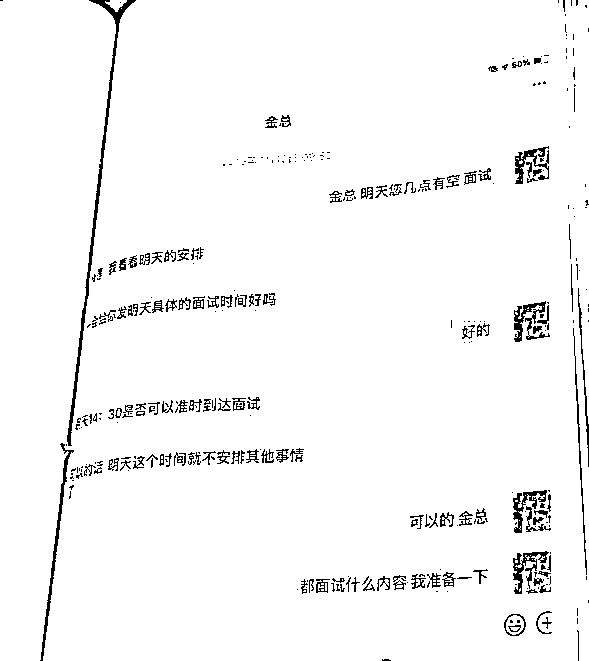
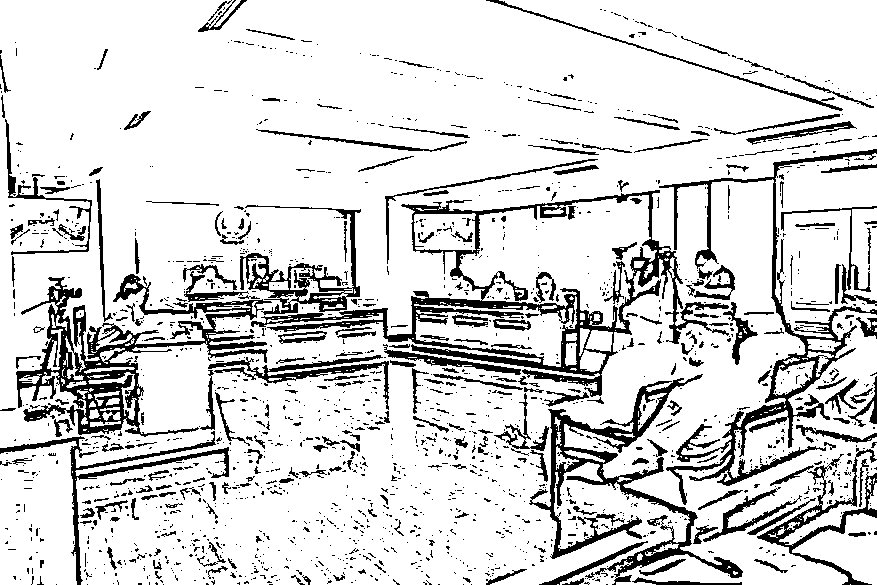
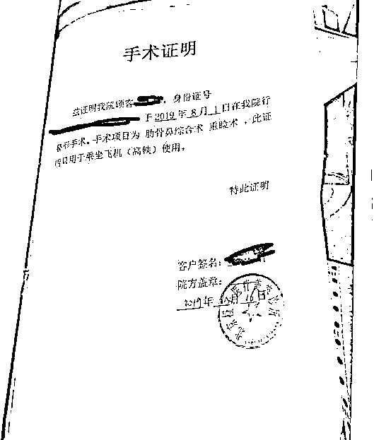

# 《扫黑风暴》中的“美丽贷”是怎么回事？

> 原文：[`mp.weixin.qq.com/s?__biz=MzIyMDYwMTk0Mw==&mid=2247520031&idx=7&sn=45c3f18e0d53b02cc2484d0de995a08e&chksm=97cb4427a0bccd31ecfcaf08cf7791483723beed69ea2ebea1c9aaecced408ae32de453705f9&scene=27#wechat_redirect`](http://mp.weixin.qq.com/s?__biz=MzIyMDYwMTk0Mw==&mid=2247520031&idx=7&sn=45c3f18e0d53b02cc2484d0de995a08e&chksm=97cb4427a0bccd31ecfcaf08cf7791483723beed69ea2ebea1c9aaecced408ae32de453705f9&scene=27#wechat_redirect)

近日，《扫黑风暴》持续热播。剧中“美丽贷”因涉嫌“套路贷”，被连窝端的情节给人留下深刻印象。现实生活中，类似的骗局也时刻威胁着一些消费者的人身和财产安全。

9 月 1 日上午，北京朝阳法院开庭审理一起与“美容贷”相关的诈骗案。被告人**以高薪招聘秘书、需要应聘者提升颜值气质为诱饵，**诈骗年轻女性。

**高薪招聘秘书，想入职先整容**

**多名女性求职者被诱导贷款**

****

****被害人娜娜在网上看到一家公司高薪招聘总经理秘书的信息，发送简历之后，中介公司的“金总”约她面试。****

********

****△ “金总”与应聘者约“面试”事宜**** 

****简单答疑后，“金总”表示将安排她与招聘者“王总”见面，如果应聘成功，**月薪可达 6 到 8 万。******

****两天后，“王总”带着司机“赵俊”来了。娜娜不知道的是，这个司机真名是许桂郡，整个“招工团队”都受他指挥。****

****庭审中，许桂郡回答公诉人讯问称，“**招聘职位一般是总裁、总经理助理或秘书。**见面后王琦把我介绍给求职者，我再跟求职者单独约时间，要求对方做整形，提升形象气质。如果同意，我就带她去医院。”****

********

****△ 法院开庭审理现场****

****于是，娜娜被带到“北京橙子医疗美容诊所”，“零首付、分期付款，轻松变美丽”的一套说辞在等着她。****

****“被告人在面试的时候对被害人的整形费用做出承诺，**比如承诺报销或者说工作将来可以获得高薪，**使得被害人相信自己有能力负担贷款费用。”公诉人练虹怡介绍道。****

****就这样，被告人以帮助应聘者在小额贷款公司等平台办理个人信用医疗美容贷款的方式，**由贷款公司将金额转入医院账户，**为应聘者实施整容手术。****

********

****△ 应聘者按约定贷款并做美容手术后，医美机构开的证明**** 

******贷款整容后被告知无法入职******

******求职者需自己偿还十多万贷款******

************

********娜娜在办理贷款、进行整容手术后，希望王总来看一下整形效果，并表示想尽快投入工作。然而等来的消息是**“王总出车祸了，公司不能聘用她”。********** 

********更坏的消息是，十多万的美容贷款需要她自己偿还。事实上，**被告人等已经与美容机构将娜娜的贷款瓜分完毕。**********

********被告人在回答审判长讯问时供述，**“出车祸”是他们惯用的话术，甚至会给被害人发一些伤者在急救中心治疗的视频，**目的是增加可信度。********

********北京朝阳区检察院查实，被告人诈骗 10 名女性应聘者办理“美容贷”，金额 40 多万元，被指控构成诈骗罪。鉴于两被告人认罪认罚，对被害人的损失做了部分赔偿。公诉人对两被告人分别提出**有期徒刑四年九个月和四年六个月并处罚金的量刑建议，法院择期宣判。**********

**********检察官：求职者找工作须警惕**********

**********贷款平台与医美机构莫成帮凶**********

********************

************近年来，“美容贷”在医疗美容机构比较盛行，“零首付、分期付款、利息不高”等所谓的优惠条件让很多有美容需求又缺乏消费能力的年轻女性动了心。************ 

************而不法分子提出的招聘条件——学历要求不高、工作轻松又高薪，**往往会吸引一些缺乏社会经验的求职者去应聘。**************

**********对此，北京朝阳检察院第一检察部副主任练虹怡提醒求职者，**“要选择正规的平台和渠道，在投递简历或面试前要谨慎核查招工用人单位的相关资质。**如果面试过程中存在异常情况，比如面试地点异常或者不切实际的高薪许诺，一定要提高警惕。”**********

**********同时检察官提示，求职平台、医疗美容机构、贷款平台都应该承担起社会责任，对于求职者、应聘者、整容者、经营者、消费者都负有谨慎的审核义务。**********

**************练虹怡：**对于求职平台来说，**对用人单位和求职人员的双向信息审查是有必要的。**医美贷款平台要合法合规地开展业务，对于用户的资质和相关能力要有较高的审查标准，不能放任中介人员等随意介绍客户进行整容和贷款。************

********来源：中央广电总台中国之声********

****************

********← 向右滑动与灰产圈互动交流 →********

****************