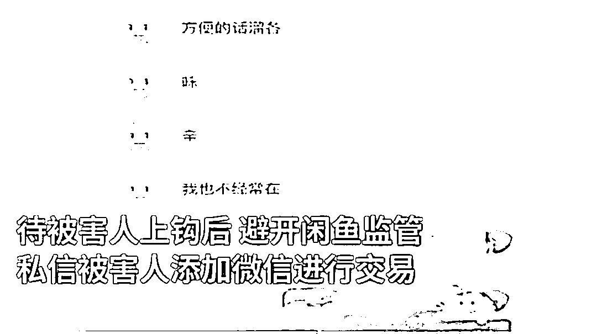
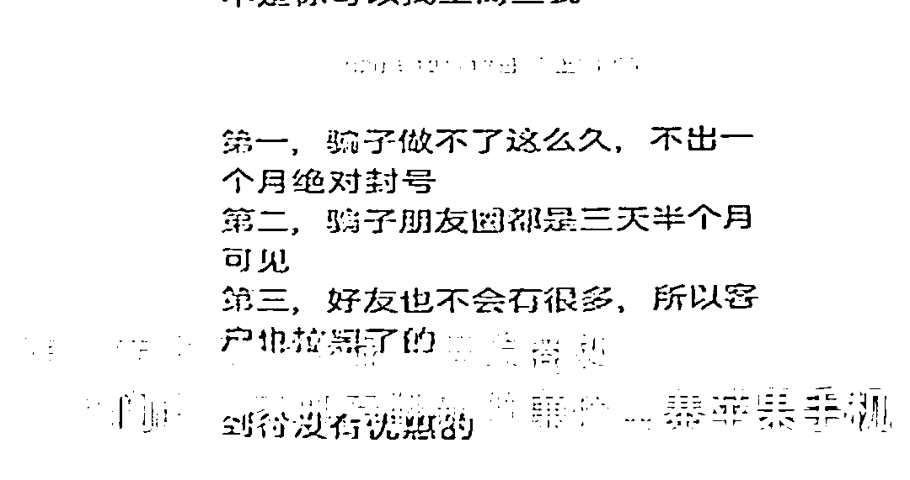

# 退款就拉黑！团伙闲鱼低价卖二手苹果机诈骗 141 万

> 原文：[`mp.weixin.qq.com/s?__biz=MzIyMDYwMTk0Mw==&mid=2247520031&idx=8&sn=80fd735ca02bbc55ec38656fe4850839&chksm=97cb4427a0bccd31592f064a1d127ceff8f8dc7b0b55f2f23a5382492dd1de564cf41fc47d57&scene=27#wechat_redirect`](http://mp.weixin.qq.com/s?__biz=MzIyMDYwMTk0Mw==&mid=2247520031&idx=8&sn=80fd735ca02bbc55ec38656fe4850839&chksm=97cb4427a0bccd31592f064a1d127ceff8f8dc7b0b55f2f23a5382492dd1de564cf41fc47d57&scene=27#wechat_redirect)

[`mp.weixin.qq.com/mp/readtemplate?t=pages/video_player_tmpl&action=mpvideo&auto=0&vid=wxv_2029203511518855171`](https://mp.weixin.qq.com/mp/readtemplate?t=pages/video_player_tmpl&action=mpvideo&auto=0&vid=wxv_2029203511518855171)

近日，江苏南通，通过“闲鱼”销售廉价二手苹果手机，19 人团伙诈骗 141 万元被公诉。

经查，该团伙用低价和其它正品苹果手机的外观视频和图片诱导，添加被害人微信私下交易，随后邮寄翻新、组装的廉价山寨苹果手机。该团伙虚构国产正品、无拆无修、成色新、无划痕等优点诱导被害人，并将事先准备好存于手机内的其他正品苹果手机的外观视频、图片发送给被害人，使其信以为真，愿意购买。

等被害人上钩后，卖家则避开闲鱼监管，私信被害人添加微信进行交易，随后转向深圳华强北供货商处，由他们向买家邮寄翻新的廉价山寨苹果手机。

如买家要求退货退款，团伙便发送虚假退货地址和物流单号拖延时间，最后将买家拉黑删除。据了解，该团伙实施诈骗总额达到 141 万余元，目前，案件正在进一步审理当中。

来源 ：荔枝新闻，潇湘晨报

← 向右滑动与灰产圈互动交流 →

