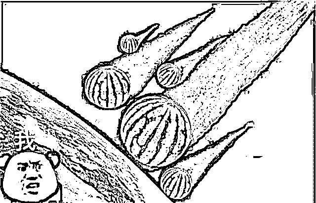
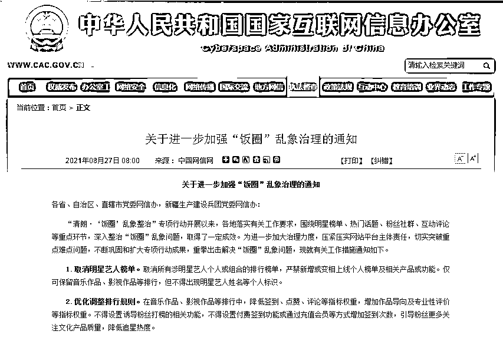
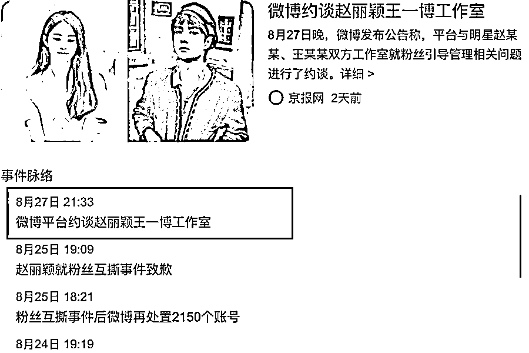
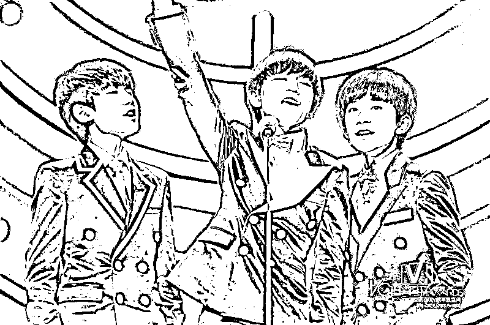
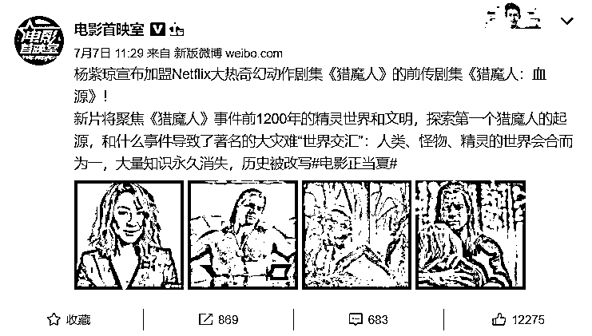
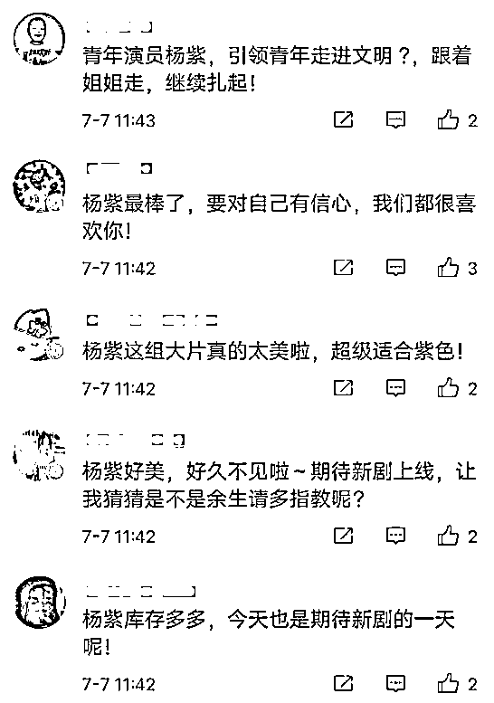
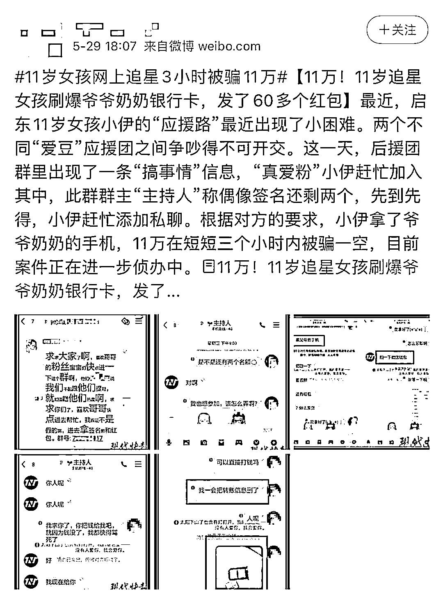
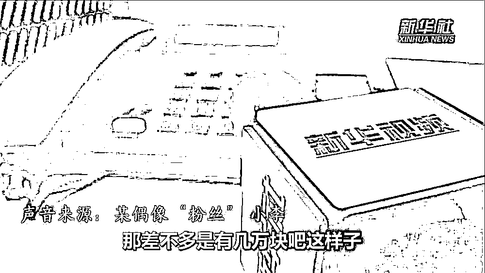
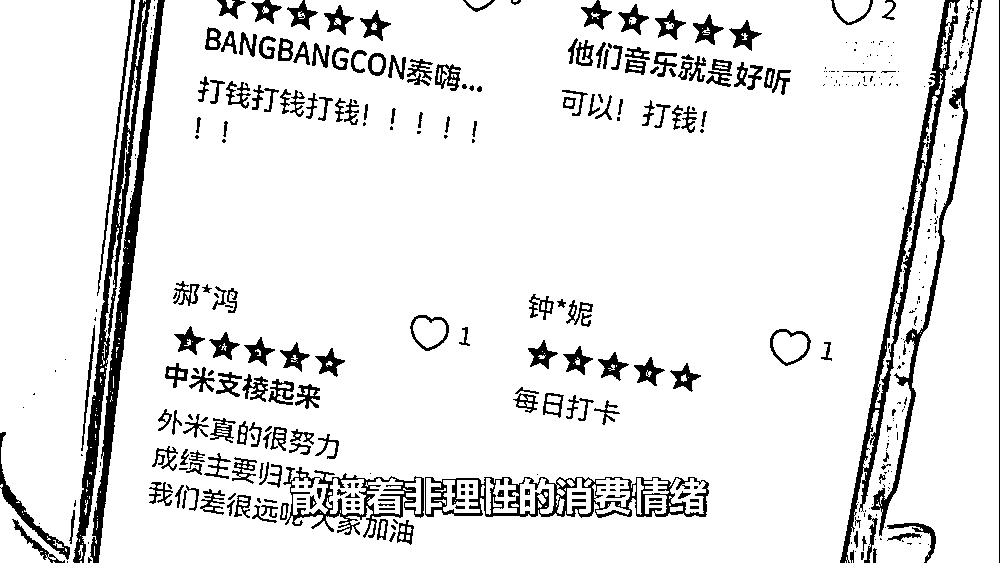
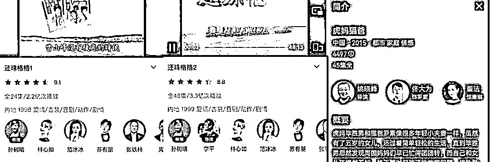

# "我，流量明星，打钱"？？？

> 原文：[`mp.weixin.qq.com/s?__biz=MzIyMDYwMTk0Mw==&mid=2247520106&idx=1&sn=b543a15f7f075fbc1e0e5471af59a546&chksm=97cb4452a0bccd440f8cf711ae4277875abb0fae2e4df8725db7e7cdc2abf6468cc028e90b67&scene=27#wechat_redirect`](http://mp.weixin.qq.com/s?__biz=MzIyMDYwMTk0Mw==&mid=2247520106&idx=1&sn=b543a15f7f075fbc1e0e5471af59a546&chksm=97cb4452a0bccd440f8cf711ae4277875abb0fae2e4df8725db7e7cdc2abf6468cc028e90b67&scene=27#wechat_redirect)

#xx 微博被禁言

#xx 超话被永久封禁

#xx 怎么了

* * *

**这几天，娱乐圈颇不平静。**

其实，纵观 2021 的娱乐圈，从开年开始就没消停过，**代孕、强奸、吸毒、逃税**......全是一些覆灭时刻。堪比**《扫黑风暴》内娱版**。

演员阵容包括：郑爽、吴亦凡、霍尊、张哲瀚、钱枫、赵薇等明星，核心情节有“偷税漏税”、“强奸灌醉”、“冷暴劈腿”等。

  

留下一众网友在瓜田里上蹿下跳。

与此同时。

网信办重拳出击，矫正畸形娱乐圈，《人民日报》《光明日报》等央媒也纷纷发表评论呼吁拨乱反正，一场以网信办为主导的娱乐圈“**清朗行动**”正在进行中。

**昔日耀眼的明星，如今正在“风暴中心”光芒尽丧。**

这场自上而下的“饭圈”整顿与劣迹艺人“扫黑行动”，正是国家助力行业自身破除“唯流量论”的最佳时机。

这一次的“大洗牌”，吃瓜群众们已经等待太久了。

01

**“清朗”行动力度空前、拳拳到肉**

**触及“饭圈”生态链各个环节**

仅 8 月 27 日一天，郑爽偷逃税案件结果公布、各平台下线明星榜等占据热搜。与此同时，“**清朗行动**”高居热搜榜前列。

这可能是大众第一次了解这四个字。

其实，早在今年 5 月，国家网信办部署开展 2021 年“清朗”系列专项行动，其中就包括“**清朗·整治网上文娱及热点排行乱象**”专项行动。（[5 月网络治理政策速览（下）| 2020"清朗"专项行动正式启动](http://mp.weixin.qq.com/s?__biz=MzU0OTEwNTQxNw==&mid=2247484834&idx=1&sn=55c7441ae1646584de3fafbf6f15175e&chksm=fbb5bfc4ccc236d21ad45af5e072f708a762cc206701398eff089c56980c2420fcd521737641&scene=21#wechat_redirect)）

**#整治力度进一步加大**

在中央网信办发布的**关于进一步加强“饭圈”乱象治理的通知**中，提出取消明星艺人榜单、优化调整排行规则、严管明星经纪公司等**十项措施**：（1）取消明星艺人榜单（2）优化调整排行规则（3）严管明星经纪公司（4）规范粉丝群体账号（5）严禁呈现互撕信息（6）清理违规群组版块（7）不得诱导粉丝消费（8）强化节目设置管理（9）严控未成年人参与（10）规范应援集资行为通知发出后，腾讯、微博、豆瓣等平台都纷纷发布公告响应。当天，**“赵丽颖王一博粉丝互撕事件”**成为首个严治对象。此事起因是网传赵丽颖与王一博将在新剧里合作的消息，赵丽颖的一些粉丝发布言论抵制，不希望两人再次搭档。在流量的裹挟下，不当言论频频出现，**“互黑”和“互撕”愈发严重**。而这次，平台对这个事件的处理，不仅仅是停留在对“互撕”的粉丝群体大规模禁言。平台还对赵丽颖工作室官方账号**采取禁言 15 天的处罚措施**，原因是其“**管理失位，造成发声引导不及时**”。可见，这个处理方式已经在释放很清楚的声音，**对于“饭圈”中间层面的打击已经升级**。**这次十条措施明确提出，对于粉丝群体、后援会的账户，工作室是有授权和认证责任的。**
十条措施之间，形成内部的有机衔接，比如取消明星艺人榜单之后，打榜与应援的连接点和支撑点消失了。大家失去了氪金打榜、攀比竞争的地方，有效抑制非理性的消费，从而让大家回归到关注作品本身价值、关注演员艺术表现力上面。相信这场整治行动也会使影视剧方至少在选角环节，将更倾向于演员的演技与实力，而非流量。

02

**冰山之上的“饭圈”乱象****冰山之下的黑灰产****如果说“饭圈文化”是表面的冰山，那么背后的网络黑色、灰色产业则是隐藏在海面下的庞然大物。**
**造谣攻击、网络暴力、互相拉踩、挑动对立、干扰舆论**……都是饭圈常见的操作。**#“饭圈”乱像的表现与成因**小珊总结了下，“饭圈”乱象主要有两个表现，**一是被当作枪使，二就是被骗钱**。被当作枪使的粉丝又可以分成**控评**和**恶意控评**两类。**正常控评**的就是刷刷好评和数据。有粉头自发控评，也有明星的经纪公司牵头来引导粉丝做一些控评，**对于艺人经纪公司来说，这就是不花钱的水军**。控评 1.0 时代，最早可以追溯到 2014 年。那年，由王俊凯、王源、易烊千玺组成的男团 TFBOYS 一举拿下多个奖项，正式走进公众视野。近期引起热议的一件控评典型是明星杨紫的水军走错片场。起因是**杨紫琼**的新剧《猎魔人：血缘》官宣，要照平时，这类新闻的评论数量不会特别多。没成想，这条微博却突然涌入了上百条评论。内容惊人相似：**「期待杨紫」「杨紫好美」「青年演员杨紫」**……**？？你没看错，是控评水军错把"杨紫琼"当做"杨紫"了。**而**恶意控评**的粉丝，他们经过**网络黑灰产、恶意营销号的刻意诱导**，负责**在网络上掀起骂战、刻意制造话题、编织谣言及矛盾、点燃网络舆情**。其实这些最终获利的都是网络黑灰产的利益链条，粉丝的热爱成为他们镰刀下收割的韭菜。（[疯狂的饭圈文化，该凉凉了](http://mp.weixin.qq.com/s?__biz=MzIyMDYwMTk0Mw==&mid=2247518778&idx=2&sn=b65c3e90f89bb849d93734d8d18bb9a1&chksm=97cb4102a0bcc81453f097ccbf1774e9905a6c41c716006c2b46f114e39660842be9022312d6&scene=21#wechat_redirect)）这些小珊之前有聊过。控评把粉丝变成了「**数据工人**」，把评论变成了一串又一串无意义的字符。只为源源不断地生产数字财富——流量。粉丝除了被骗去做「数据工人」外，更惨的是**被骗钱**。比如一些涉世未深、容易冲动消费的学生群体，成了**“追星”骗局**的主要受害者。另外，“饭圈”集资平台也没有对未成年人消费进行任何筛查或提醒，一些偶像话题里会附上链接，**引导粉丝至集资网站或 App**。就差把打钱写在公屏上了。**高额的“明星养成”链条上滋生了不少诱导性、非理性消费，有些粉丝甚至为偶像累计花费上百万元。**疯狂的饭圈文化，丝毫不是娱乐圈繁荣的象征，反而是畸形病态的表现；不少顶流明星，也不是靠实力品性取胜，而是靠资本运作上位。可以说，饭圈文化越荒诞，粉丝越疯狂，不良资本越得意。而很多并不知情的网友，不仅被裹挟进去，反而成了一拨拨等待收割的“韭菜”。资本和平台方获利，明星名利双收，徒留下一个乌烟瘴气的网络空间。******不破不立****引导行业秩序健康发展****总结一下。**“饭圈”主体不仅仅是粉丝，它其实是一个完整的行业链条，涉及平台、艺人、经纪公司、营销公司，甚至涉及网络的黑色、灰色产业。“饭圈”构成错综复杂，利用了粉丝群体对于明星的喜爱，进行一些游走在法律和道德边缘的事情，**而“清朗”行动的十条措施，则是对于利益链条的拆解，重击“饭圈”产业各个环节，回归本源关注艺术创作**。开头提到的“翻车”明星，**已被有关部门和平台以批评、禁言、罚款、封杀、入狱、下架作品等方式处罚**，这样的力度一方面确实堪称雷霆行为。▎《还珠格格》第一部和第二部删除了主演赵薇的名字另一方面，由他们主演或参演的影视作品被大量下架或禁播，也让一众播出或未播出的影视剧制作方、投资人等遭遇损失。**不破不立，破坏此前行业内不规范、不健康、不合理的选角、用角规则，方能建立起良好、健康的行业秩序。**当流量逐渐褪去光环，实力派演员的春天必将到来。而当从业者们逐渐破除与改变“唯流量论”的“陋习”后，行业则一定会迎来新的发展与辉煌。**文章最后，小珊其实想跟大家讨论与思考这样一个话题：**“当资本疯狂利用粉丝、艺人披着“流量明星”的外衣去赚钱的时候，粉丝自己不知道吗，他们为何心甘情愿为此买单？”当我们希望**#让这样的饭圈彻底翻篇#**的时候，也需要关注到本质。**“饭圈”的可怕不仅仅是一种潮流，而是形成了一种扭曲的文化，而中招的正是这个民族的未来——青少年。**所以小珊在这里不仅仅希望引导和影响更多的青少年理性追星、理性消费、理智讨论，同时，也真诚地希望他们树立积极向上的价值观，具备独立思考和判断的能力。

试想，如果越来越多的青少年任由自己被欺骗、被洗脑，把追星当作标榜自己的工具，这个民族的未来就可怕了。

← 向右滑动与灰产圈互动交流 →

