# 直播连上反诈民警，"西厂公公"懵了

> 原文：[`mp.weixin.qq.com/s?__biz=MzIyMDYwMTk0Mw==&mid=2247520106&idx=2&sn=046325429692403b118f96e740207401&chksm=97cb4452a0bccd444092f2e18807daf7f64d42c25ca1bd0944bb1a80c38a80edd2697860f56d&scene=27#wechat_redirect`](http://mp.weixin.qq.com/s?__biz=MzIyMDYwMTk0Mw==&mid=2247520106&idx=2&sn=046325429692403b118f96e740207401&chksm=97cb4452a0bccd444092f2e18807daf7f64d42c25ca1bd0944bb1a80c38a80edd2697860f56d&scene=27#wechat_redirect)

“我是反诈主播，请问您是什么主播？”“我是娱乐搞笑的，哥，我啥事没犯……”

昨天（2 日），多少网友被一则“反诈民警连麦西厂公公”的视频笑晕！河北秦皇岛反诈民警陈国平在直播宣传反诈时，意外和“西厂公公”“女装大佬”等主播连线，一身警服把对方瞬间吓懵，场面异常“抓马”。这些主播们随后也纷纷成为了反诈宣传的“编外人员”，向直播间网友宣传反诈 app。

火上热搜后，陈警官又在视频中表示，自己是在业余时间进行直播宣传反诈，直播间不开打赏，希望其他网红主播们和自己连上线以后不要因此拒绝，呼吁大家一起宣传反诈。

[`mp.weixin.qq.com/mp/readtemplate?t=pages/video_player_tmpl&action=mpvideo&auto=0&vid=wxv_2030822975964315653`](https://mp.weixin.qq.com/mp/readtemplate?t=pages/video_player_tmpl&action=mpvideo&auto=0&vid=wxv_2030822975964315653)

直播平台有一个环节叫“直播 pk”，两方主播随机或邀请连麦 pk，由双方粉丝投票决定输赢，输的一方要接受惩罚。结果，陈警官就连上了“西厂公公”。

看见屏幕上的男子穿着警服，“公公”嘴角的微笑突然凝固，整个懵了，还向前凑近了试图确认对方身份。

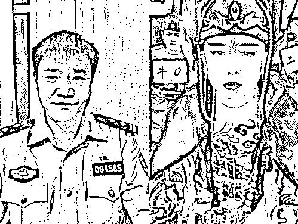

陈警官这边先开口：“你好，我是反诈主播，请问您是什么主播？”

“公公”瞬间慌了，赶忙自证清白：“我是娱乐搞笑的，哥。我啥事没犯，绝对是良民，哥。我都不要求要礼物，都是他们自己给我刷的，我从来没有骗他们。”“我直播间 3000 多人，要不行，哥，我把人给你甩过去也行，你看咋整吧。”

看“公公”有些紧张，陈警官还玩起梗来，“我看你这是个西厂啊，我还没你官大呢！”对面依旧是哆哆嗦嗦。

陈警官进入正题，向“公公”介绍起了国家反诈中心 app，还给“公公”交代了一个重要任务，让他在后续的直播连麦中向其他人继续宣传反诈，“国家反诈中心 app 大家没下载的记得下载一下，你待会儿和别人 pk 的时候也告诉他们一下，这个你能做到吗？”

接到“大任务”，“公公”立刻笔笔直敬了个礼以示尊敬，承诺自己将会完成这项任务，“警察叔叔你放心，你交代我的，这一晚上我啥活也不干了，你说啥我干啥，保证完成任务！”

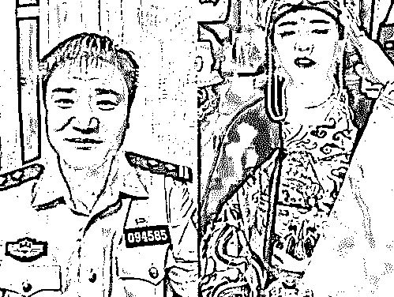

接到任务后，“西厂”还真开足了马力宣传反诈，“公公”此后跟谁连麦都喊人赶紧下载反诈 app。

“我乃西厂厂花雨化田，请问阁下下载国家反诈中心挨屁屁（app）了没？”

“玩归玩，闹归闹，现在有不法分子利用各种软件‘杀猪’，俗称为‘杀猪盘’，骗了好多人了，赶快去下载国家反诈中心挨屁屁。”

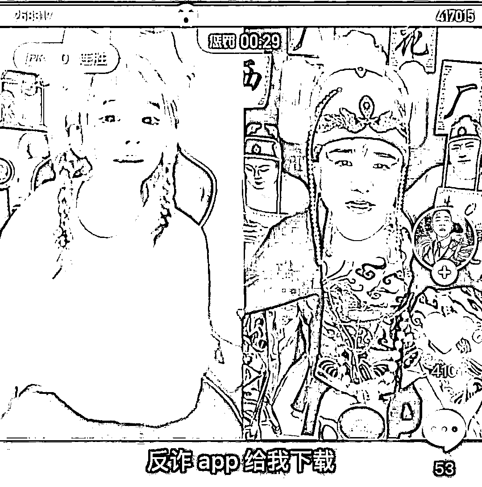

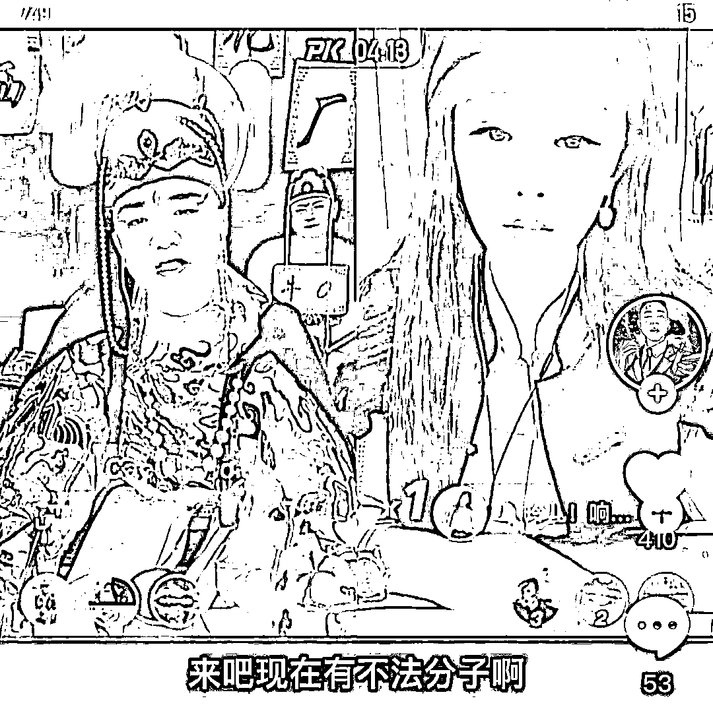

还有和他认识的主播被这一出整懵了，疑惑道“我记得你以前不是搞笑主播吗？咋变成这样式的了？”

“我现在是正规军。”“公公”得意洋洋地回道。

以前我没的选，但现在我想做个好人。

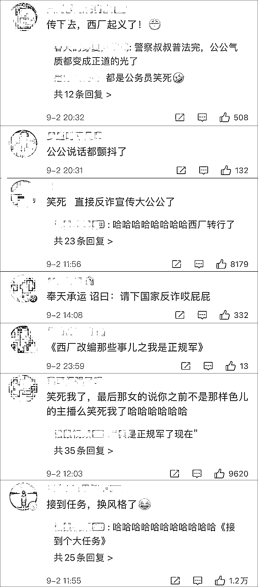

更天秀的是，陈警官还连麦到一位“女装大佬”，接下来发生的事情就戏剧化了起来。

[`mp.weixin.qq.com/mp/readtemplate?t=pages/video_player_tmpl&action=mpvideo&auto=0&vid=wxv_2030823827793903617`](https://mp.weixin.qq.com/mp/readtemplate?t=pages/video_player_tmpl&action=mpvideo&auto=0&vid=wxv_2030823827793903617)

“女主播”嗲嗲地问：哥哥，你是宣传什么的？

陈警官：我是宣传反新型网络违法犯罪的，告诉大家如何不被骗。

“女主播”再问：那一般在什么样的情况下会遇到诈骗？

陈警官有问必答：有很多男生和“美女”聊天被骗的案例，骗子可能是男的，冒充女生，运用虚假身份。

这下，“女主播”的甜美笑容逐渐消失，慌乱了起来。

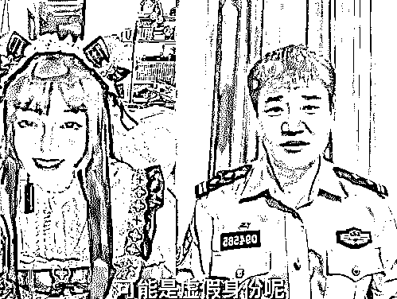

然后意想不到的一幕发生了：“她”推开椅子，拿下假发，原来他自己就是在男扮女装！

陈警官见此情景有点哭笑不得，严肃道：老实交代，你骗过多少人？赶紧老实说，主动自首！

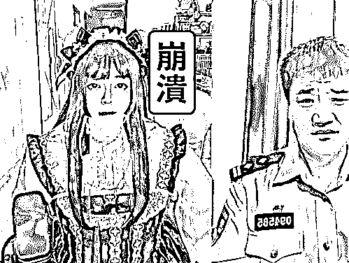

这名主播赶紧捏着耳朵蹲在了地上，向陈警官解释自己没有骗过人，穿女装只是为了逗粉丝开心。

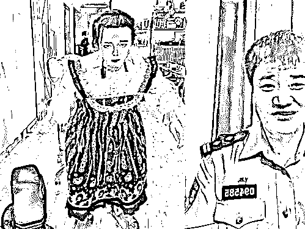

真是“对面啥也没做，自己就全交代了”。

兄弟，你这抱头蹲墙根的姿势实属有点“专业”了……

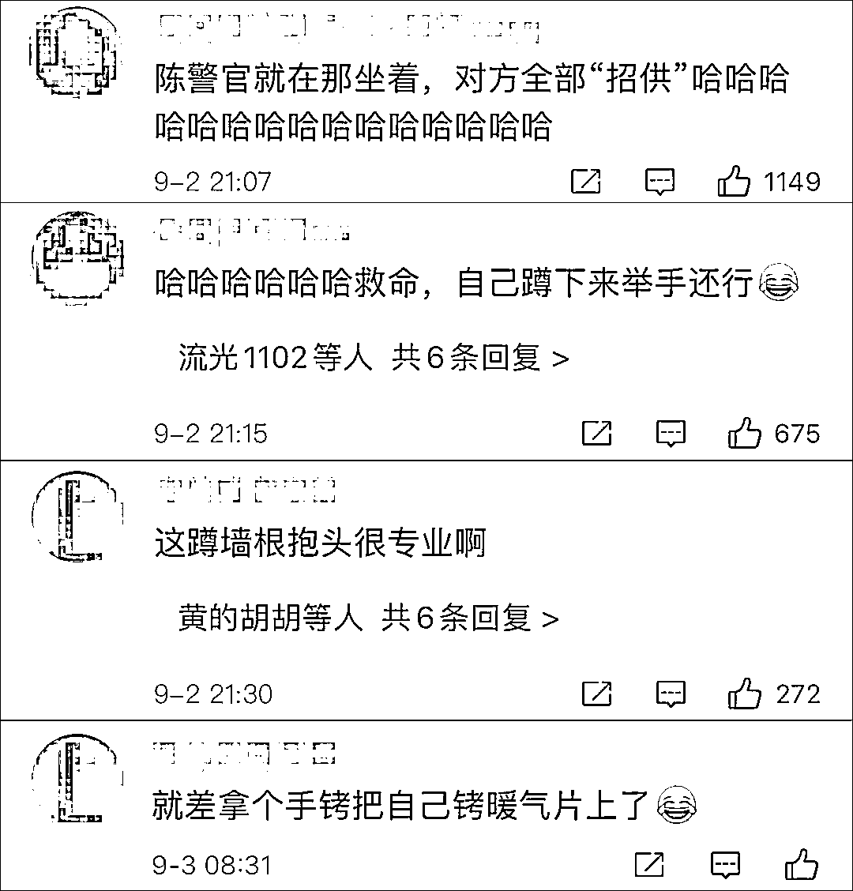

当晚，陈警官还连麦了很多主播，最后他们都变成了反诈宣传的“编外人员”，卖力地让粉丝们去下载国家反诈中心 app。

宣传反诈，出现“人传人”现象。

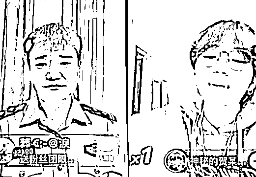

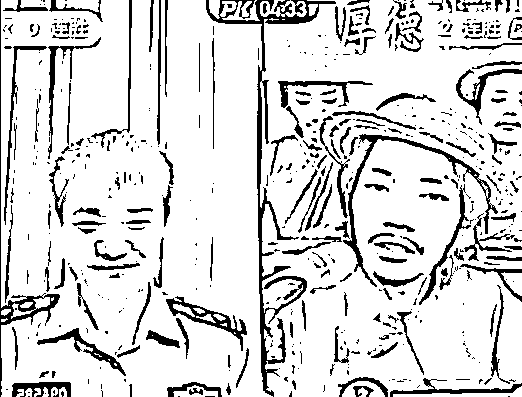

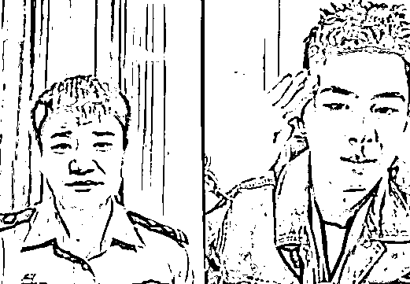

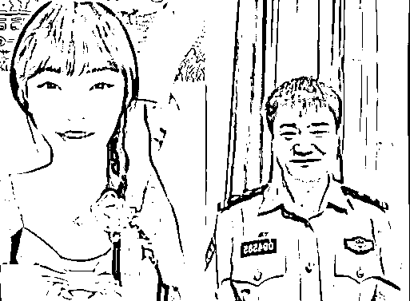

最后甚至形成了“闭环”，有主播连上线后突然掏出了一个国家反诈中心 app 的图片，把陈警官都逗笑了，连连说“对对对”。

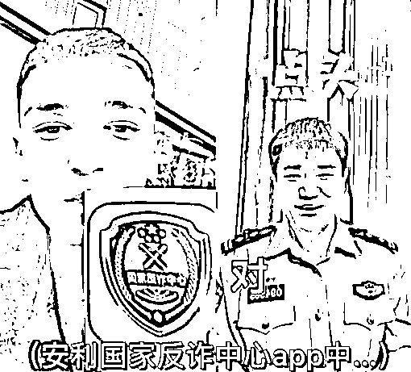

据@新京报我们视频 报道，这名在直播间宣传反诈的民警来自秦皇岛市海港区公安分局网络安全保卫大队，名叫陈国平。

陈警官介绍道，自己一般是在周五和双休日等业余时间直播，之所以选择与主播 pk 的方式，是因为无意间发现这种形式效果特别好。

“昨天（1 日）是第二场 pk 直播，对方感觉很奇怪，我说你不说你是正能量的主播吗？你要做公益，那我们一起来宣传，最简单的就是告诉大家下载国家反诈中心的 app。他很配合，我俩断麦后，他跟别的主播 pk 的时候就告诉人家。这个 pk 宣传范围广了，而且比较新颖。”

他还强调，新型网络犯罪案件中，其实真正保护财产安全的是防范。就算案子破了，钱也不一定能回来，所以警察不但要在破案上下功夫，在宣传上也要下功夫。

“我们原来在直播间是上课，比较枯燥无味，说白了可能只有受害者过来咨询听，没有受害的根本不想听，但是利用这种方式，让人们有了新鲜感，就会想要追着看，我要看看下一个能连到什么人，就把人越聚越多，宣传的力量就强了。”

陈警官也在最新视频中向广大主播喊话，他在直播中不开打赏，但希望主播们如果被连上了不要拒绝，大家一起宣传反诈，让更多的人懂得如何防范。

网友热议道：谁说娱乐不能和正能量相结合呢？警察蜀黍这波是把直播玩明白了，干得漂亮！

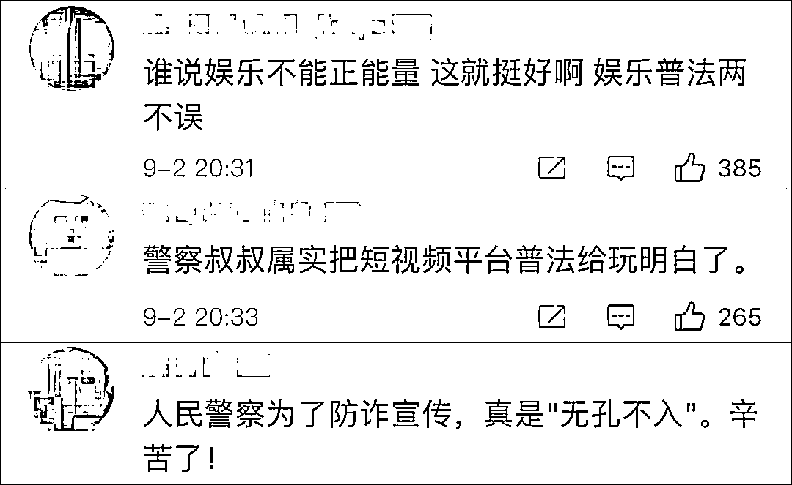

说了这么多，你还没有下载“国家反诈中心 app”吗？

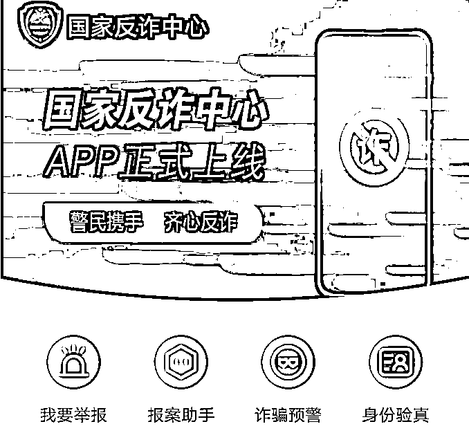

来源：观察者网

← 向右滑动与灰产圈互动交流 →

