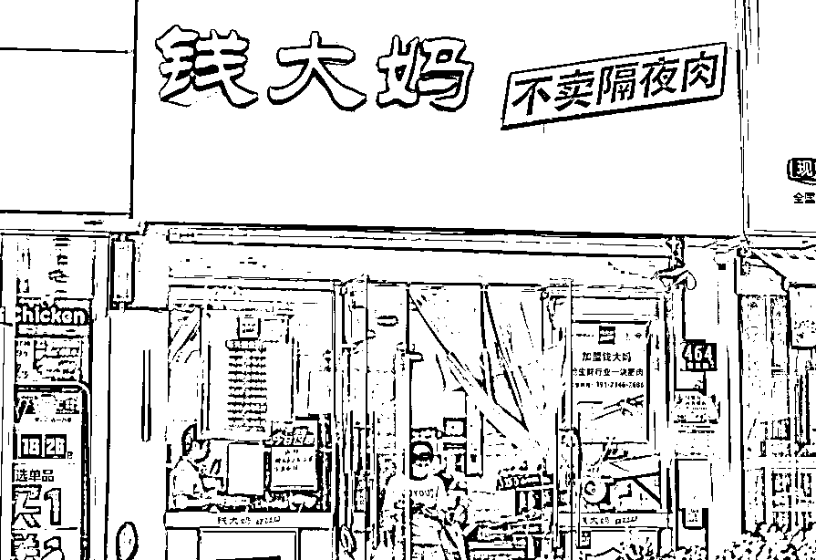
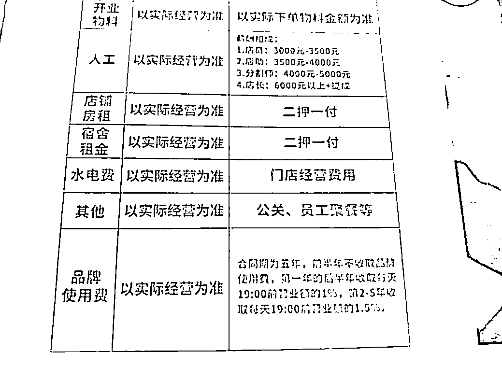
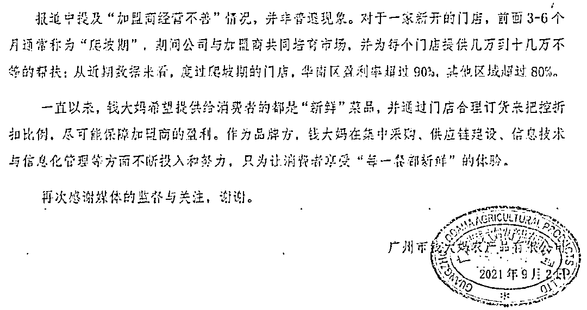
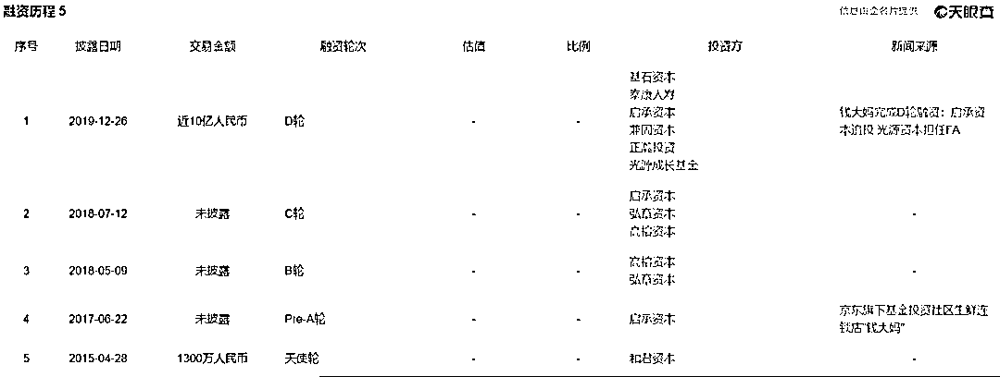

# 被央视点名的钱大妈：卖菜不赚钱，“割韭菜”赚钱？

> 原文：[`mp.weixin.qq.com/s?__biz=MzIyMDYwMTk0Mw==&mid=2247520106&idx=4&sn=c7cb9860097b57a3c9b9b39b4e5d6155&chksm=97cb4452a0bccd44a5916b6250bdb3b4d603afeefe6139a989ced9ac7c82aa87ab6a0823007e&scene=27#wechat_redirect`](http://mp.weixin.qq.com/s?__biz=MzIyMDYwMTk0Mw==&mid=2247520106&idx=4&sn=c7cb9860097b57a3c9b9b39b4e5d6155&chksm=97cb4452a0bccd44a5916b6250bdb3b4d603afeefe6139a989ced9ac7c82aa87ab6a0823007e&scene=27#wechat_redirect)

9 月 2 日凌晨，因加盟商亏损而被央视点名的钱大妈，在微博上回应称“加盟商经营不善”情况，并非普遍现象。

红星资本局注意到，钱大妈成立于 2012 年，发展至今在社区生鲜赛道上已有一席之地。靠打折策略收获客流的钱大妈，不仅扩张迅速，还收获了资本的青睐。

但在跑马圈地的过程中，钱大妈赚的到底是“卖菜”的钱，还是“割韭菜”的钱？

**门店 3000 家，钱大妈收入 9 亿？******

****公开资料显示，钱大妈成立于 1995 年，2012 年广州市钱大妈农产品有限公司成立，经营生鲜肉菜、果蔬以及烧腊制品等。****

****钱大妈抓住了广东消费者“追求食材新鲜”的心理，2012 年在东莞开出第一家猪肉专卖店时，就推出了“不卖隔夜肉”的经营理念。2013 年，钱大妈进军社区生鲜。****

****2018 年 9 月，钱大妈迎来了第一千家门店的隆重开业。从第一家门店，到第一千家门店，钱大妈用了 5 年多时间。****

****但从 1000 家店到 2000 家店，钱大妈用了不到两年；而到 3000 家门店，只用了半年。2021 年 2 月，钱大妈全国门店总数突破 3000 家。****

****但钱大妈加盟商门槛不低，创业最前线公开的钱大妈招商宣传册显示，依照钱大妈招商宣传册，加盟一家钱大妈标准店（60 平方米）的初始投资包括加盟费 3 万元、品牌保证金 2 万元、货款保证金 2 万元、门店装修费 8 万元、设备采购费用 20 万元、开业前广宣物料 2 万元，以及人工工资、房租、水电费等，如此一来，前期至少需要投入 40 万元。****

****其次，钱大妈还会向加盟商收取“品牌使用费”，即在 5 年合同期内，开业半年后，钱大妈将收取每天 19：00 前营业额的 1%，第 2-5 年收取每天 19：00 前营业额的 1.5%作为品牌使用费。****

********

****图片来源：创业最前线****

******如果去除装修等费用，按照一家门店约 30 万计算，3000 家门店能够为品牌方带来约 9 亿收入。******

****红星资本局注意到，钱大妈门店的快速扩张，或许与其加盟商宣传有关。****

****据创业最前线报道，钱大妈加盟商张亮（化名）2020 年 4 月和 5 月分别在长沙开设了两家钱大妈加盟店，**张亮表示，钱大妈招商人员最早跟他承诺门店利润在 20%-25%。******

******加盟商“流血”换来流量******************

******但事实上，有不少加盟商不仅赚不到钱，还在持续亏损。******

******张亮称，其门店销售额每天基本在 1 万元以上，最多可达到 3 万元，客流每天也在 500-600 人，但每个月门店都在亏损。两家店前期共计投入 120 万元，在经营了一年多后，张亮并未从这桩生意中赚到钱，反而又亏进去 50 万元。******

********营业额不低，亏损额不小，或是因为钱大妈“阶梯式的打折策略”。**为了在当天卖完全部菜品，钱大妈门店每天从 19：00 开始以九折价格清货，每过半小时价格便降低一折，直到 23：00 全场商品低至一折，23：30 后全场免费派送。******

****打折为钱大妈门店带来了客流，但也导致了部分门店的亏损。****

****据央视财经报道，钱大妈加盟商在大批关店，仅在一家发布本地转让信息的网站上，记者就发现钱大妈门店的转让信息就超过 10 条，大多标注“正常盈利中”，但事实上，很多急转的门店经营难以为继。****

****钱大妈生鲜超市的加盟商易先生表示，他们店的租约当天到期，虽然门店转让价已经远低于成本价，仍然无人问津，无奈之下只能选择关店。在开店的一年时间里，这种“激进”的打折方式，直接导致了易先生的亏损，多数消费者养成了特意等到打折时间来光顾的习惯，导致门店菜卖得越多，亏损就越大，一年的亏损就达五十多万元。****

****此外，易先生虽然是这家店的经营者，但进多少货、卖什么价并不由他控制，从经营的第一天开始，**钱大妈品牌方就规定了每天进货的最低限量，甚至对销售价格进行了严格限制，只允许售价下调，一旦加盟商不遵守价格管理，就会被罚款甚至停货。******

****此外，钱大妈的官方网站声称，“门店售价由所在地的消费力决定”。但据一位钱大妈品牌督导介绍，上海的门店售价是由门店的客流量决定的，而并非消费力。钱大妈的售价体系，按每个月平均非打折时段的客流量多少分四个档次，每档都有最高售价限制，售价的不同直接影响门店的盈亏。****

****以最高售价级别，A 级为例，非打折时段平均客单量到达 600 单才能提升到 A 类售价，只有做到最高级别才有可能不亏损。加盟商为了提升售价级别，不计成本地打折以吸引客流量，最终形成了一个“卖得越多，亏损越多”的怪圈。****

******钱大妈回应：门店经营不善不是普遍现象******************

******9 月 2 日凌晨，钱大妈在官方微博上发布声明，回应了加盟商亏损问题。******

******该声明称，**“加盟商经营不善”情况并非普遍现象，对于一家新开的门店，前面 3-6 个月通常称为“爬坡期”，期间公司与加盟商共同培育市场，并为每个门店提供几万到十几万不等的帮扶；从近期数据来看，度过爬坡期的门店，华南区盈利率超过 90%，其他区域超过 80%。********

****声明还表示，公司一方面须尽快做好发展过程中的自查优化，对加盟商给予更多切实的帮扶；另一方面也要在发展业务的同时，主动加强与媒体和公众的沟通交流，减少误解。****

********

****另据 21 世纪经济报道消息，**钱大妈公司总经理冯卫华表示，钱大妈公司真正收取加盟商的只有一笔 3 万元加盟金，加盟商交付的保证金到期后可退回，转让费是加盟商直接付给房东的，退出时也可收回。******

****冯卫华称，做加盟模式是希望将门店经营权私有化，从而更有效的提高门店管理效率，公司会在 3 个月爬坡期内投入几万到十几万不等的额度对门店进行帮扶，爬坡期过后依旧亏损的门店还是会受到公司的持续帮助。****

********

******曾备受资本青睐******

******多次传出上市传闻******

************

******早在 2021 年 3 月底，就有媒体报道称钱大妈最快于 2021 年在香港进行 IPO，拟集资 4 亿至 5 亿美元（约 31.2 亿至 39 亿港元）。在已启动的 Pro-IPO 轮中，钱大妈预计筹集 20 亿元资金，以便提升估值到 250 亿元。******

******虽然钱大妈相关负责人在接受采访时表示，“现阶段公司并未有上市计划，对于该传闻不予置评”，但钱大妈颇受资本青睐却是事实。******

********天眼查 APP 显示：********

****2015 年，钱大妈获得 1300 万的天使轮融资；****

****2017 年 6 月，钱大妈完成 A 轮融资，京东牵头发起的私募股权成长基金启承资本入局；****

****2018 年 5 月、7 月，钱大妈接连完成 B 轮和 C 轮融资，投资方包括弘章资本、高榕资本和启承资本；****

****2019 年 12 月，钱大妈完成近 10 亿元 D 轮融资，由基石资本领投，老股东启承资本追投，估值在 85 亿元至 100 亿元。****

********

****但虽有资本加持，钱大妈面前的挑战仍旧不少。****

****中国基金报称，有业内人士分析，从 1 家到 1700 家，钱大妈走了 8 年，而从 1700 家到 3400 家，翻番的门店数，钱大妈只花了 7 个月。**很明显，下半场扩张计划，完全是资本推动之下，为上市做准备。一旦加盟商和钱大妈的关系弄僵，门店数量下降，钱大妈的上市之路又将面临变数。******

****据蓝鲸财经报道，在香颂资本执行董事沈萌看来，折扣卖菜模式并不违反任何市场秩序的法律法规，加盟商也有加盟或解约的自由，如果加盟商不认同这样的方式可以选择不与对方合作，而如果看重其导流作用，那么就应该接受模式的要求。****

****对于钱大妈来说，折扣卖菜已经不可能获利，只有通过收取加盟费的方式实现收入增长。不过，将收益完全转嫁到加盟商会造成加盟商经营的巨大负担，而这样进行折扣的方式，也无法保证产业链上的各方都有共赢的机会，所以不可持续，不能用这样杀鸡取卵的方式。****

****来源：红星资本局****

********

****← 向右滑动与灰产圈互动交流 →****

********