# 网上交友 10 天被骗 150 万，聊天记录全是套路

> 原文：[`mp.weixin.qq.com/s?__biz=MzIyMDYwMTk0Mw==&mid=2247520229&idx=1&sn=24690489c060a442bbfb63c7da205766&chksm=97cb44dda0bccdcb8a6bd526b1830ef8fdab44d2d20abc2efe95fc9f9f46c697542750729229&scene=27#wechat_redirect`](http://mp.weixin.qq.com/s?__biz=MzIyMDYwMTk0Mw==&mid=2247520229&idx=1&sn=24690489c060a442bbfb63c7da205766&chksm=97cb44dda0bccdcb8a6bd526b1830ef8fdab44d2d20abc2efe95fc9f9f46c697542750729229&scene=27#wechat_redirect)

9 月 3 日，四川省反电信网络诈骗中心在官方微信平台发布一起“杀猪盘”典型案例，资阳一市民通过网络交友被诈骗 150 余万元。

四川公安征得受害人同意后，从受害者的角度一步一步复盘了整个案件，揭露了犯罪嫌疑人如何按照“寻找目标→取得信任→怂恿投资→追加投资→无法提现→销声匿迹 ”的套路，一步步从“喂猪”到“杀猪”。

8 月 5 日，资阳市居民冯某报案称，在 7 月至 8 月被人骗 150 余万元。经了解，系冯某在网络上结识一男性网友后，双方迅速发展为恋人关系，随后对方诱导冯某在一个名为“万数资本”的网站中进行虚拟币投资。在前期收益小额资金后，她不断加大投入，最终投入 150 余万元后发现资金不能提现且联系不上对方，遂发现被骗。

四川公安提醒，不要轻易相信网络上突如其来的爱情，任何以交友为借口，诱使投资、赌博的都是诈骗。

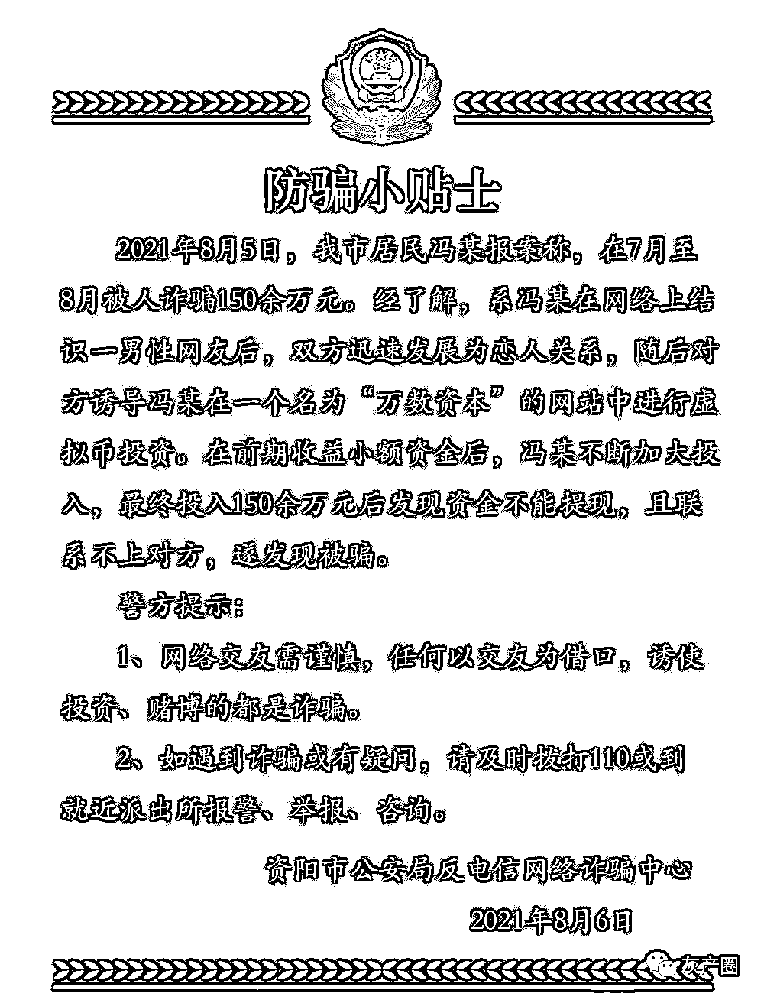

澎湃新闻从四川警方获悉，征得受害人同意后，警方根据受害人叙述将聊天记录编发。出于对受害人的保护，文中均使用化名。

**以下为全文**

我叫燕子，今年 40 岁，自从离婚以后，便一个人带着女儿过着平静而单调的生活。每天上班下班，买菜做饭，我以为今后的日子就一直这样不松不紧的过下去，不再去爱任何人，也泛不起一丝涟漪，直到遇见这个男人…… 

****7 月 26 日****

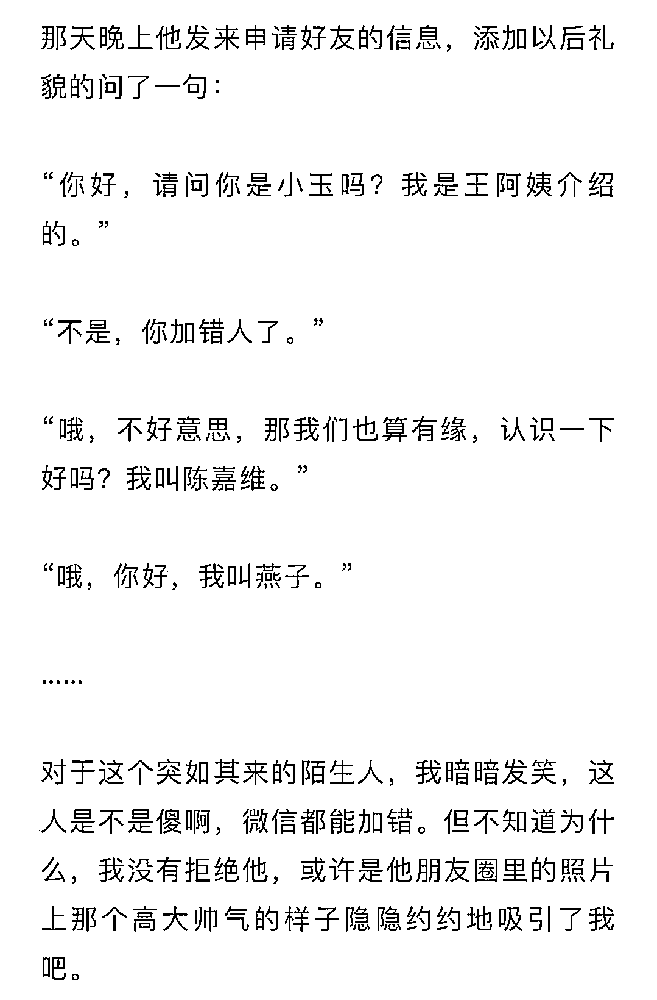

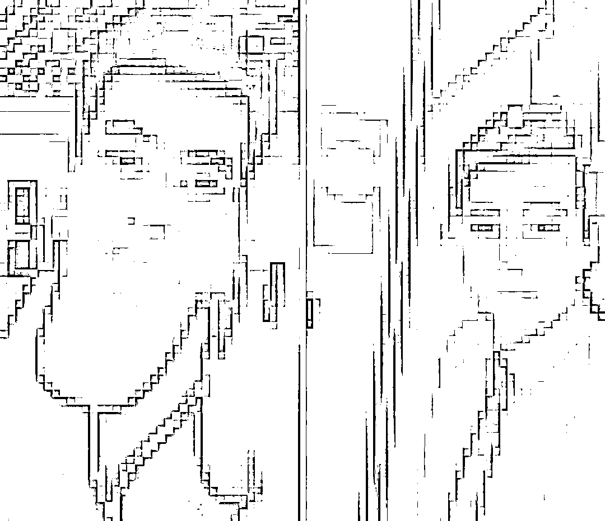

高大帅气的“陈嘉维”

****7 月 27 日****

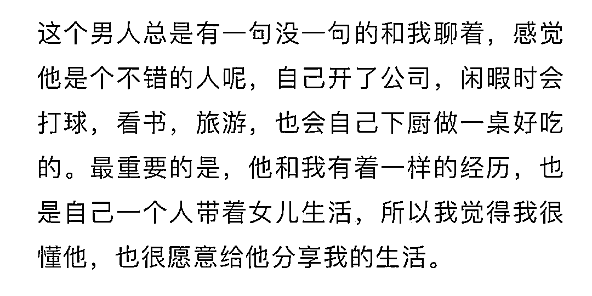

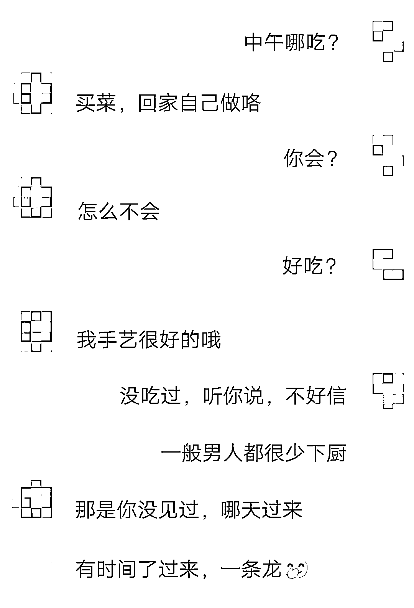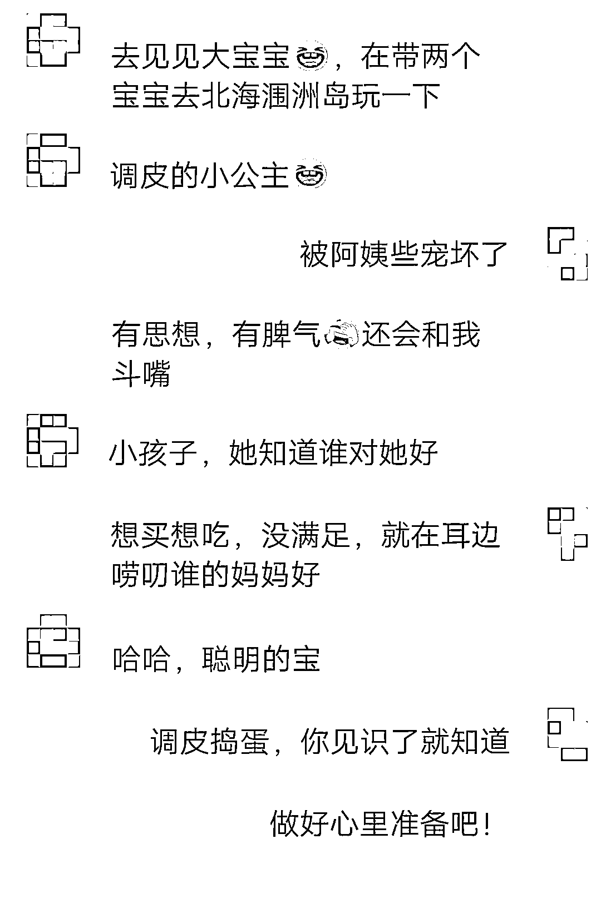

“陈嘉维”不仅会做饭，还懂生活

****7 月 28 日****

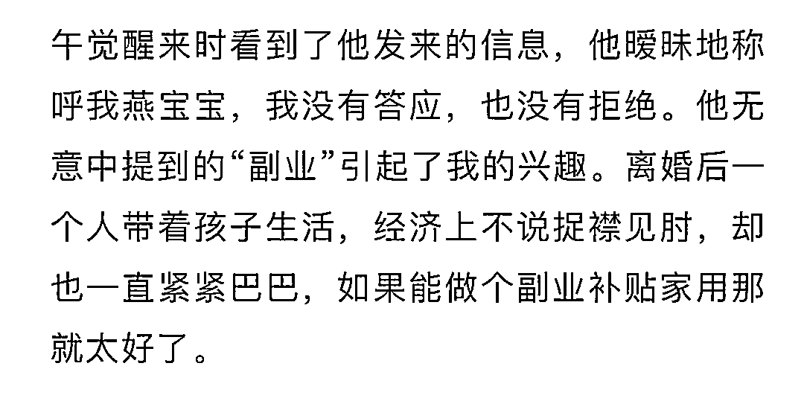

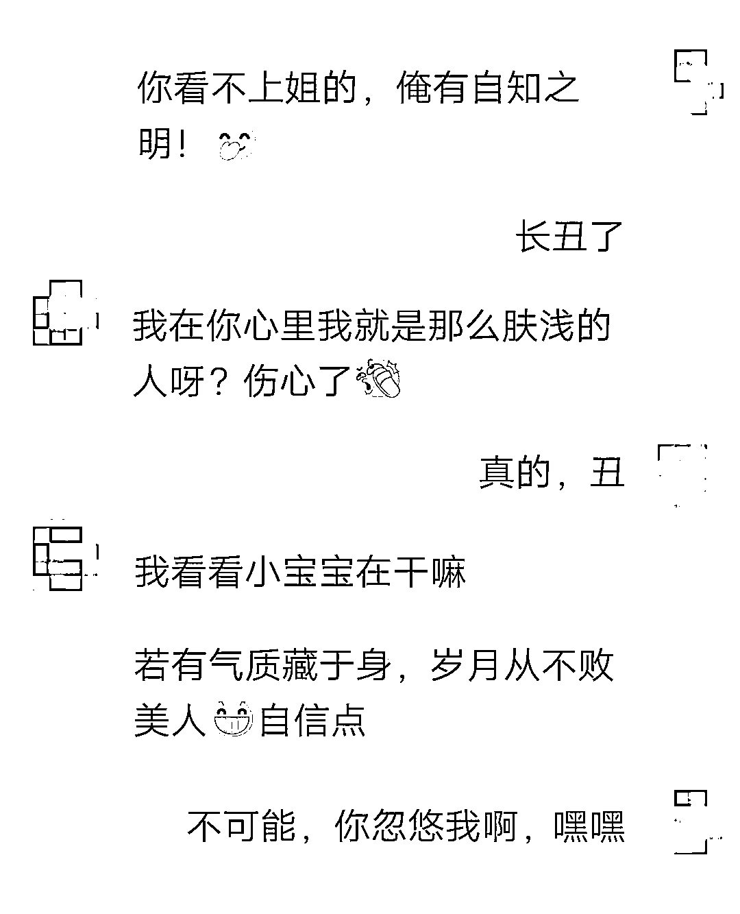

****7 月 29 日****

白天他好像挺忙的，没怎么回我信息，到了晚上我迫不及待地问了他那个副业的情况，他告诉我，是在一个叫做“万数资本”的网站里对虚拟货币买涨买跌，操作时间短，收益高，并且说如果我想做，他可以带我赚钱，并问了我的资金情况。

 “燕宝宝，你想做的话我教你啊，你现在有多少钱呢？”

 “我的钱都在股市里，卡里只有 2 万块钱，够做这个吗？”

 “没关系的，你第一次做，不要全部投进去，就先投 5000 吧。”

 “5000 就可以做了吗？”

 “做什么都有风险，这个也不是稳赚不赔，我带着你先试试，你要觉得不错的话再加大投入吧。”

 “好的，你真贴心。”

 “我当然要对我的燕宝宝好啦。”

 ……

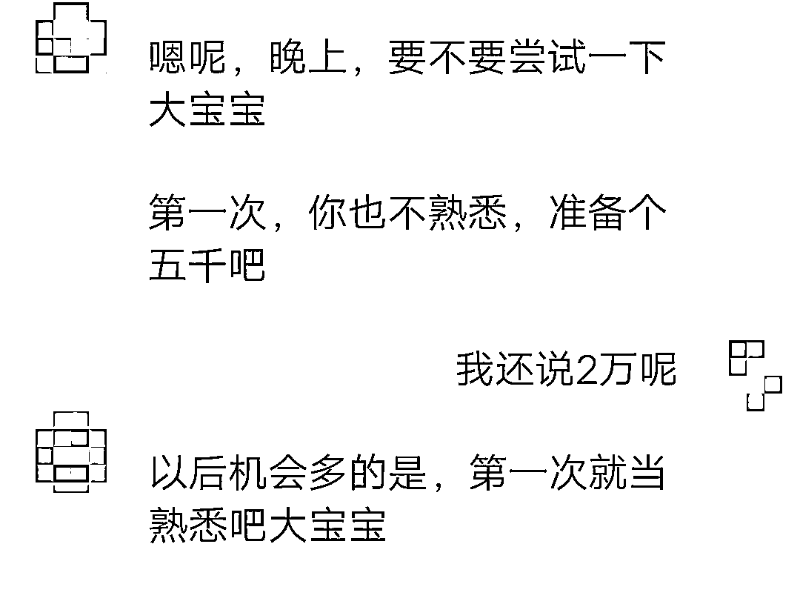

我心里又开心又紧张，随后他给我发来二维码，在他的指引下我注册了网站，接着他又给我发来一个陌生人的银行账户，让我把钱转进去以后就会自动充值到网站的余额里。

 尽管看到了聊天软件发来的防诈骗提示，但我还是按照他说的把 5000 块钱转了过去，因为他说“这银行卡是平台找的第三方，目的是为了避税”。

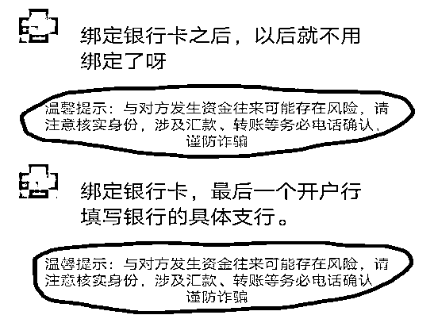

接下来，他让我在网站中买比特币这些东西，我也不懂，他让我怎么操作我就照着做，一番操作下来，短短几分钟，我投入的 5000 元便盈利了 500 元，并顺利提现。

 “为什么这个钱这么好赚啊？”

 “你之所以觉得赚钱快，是因为我提前做好了规划。”

 “那我们继续加大投入啊。”

 “我们每天赚本金的 10%就行了，不能贪心，要稳步前进，任何投资都有风险。”

 ……

 听他这样说，我放心了下来，越发觉得他是一个值得信赖的人。

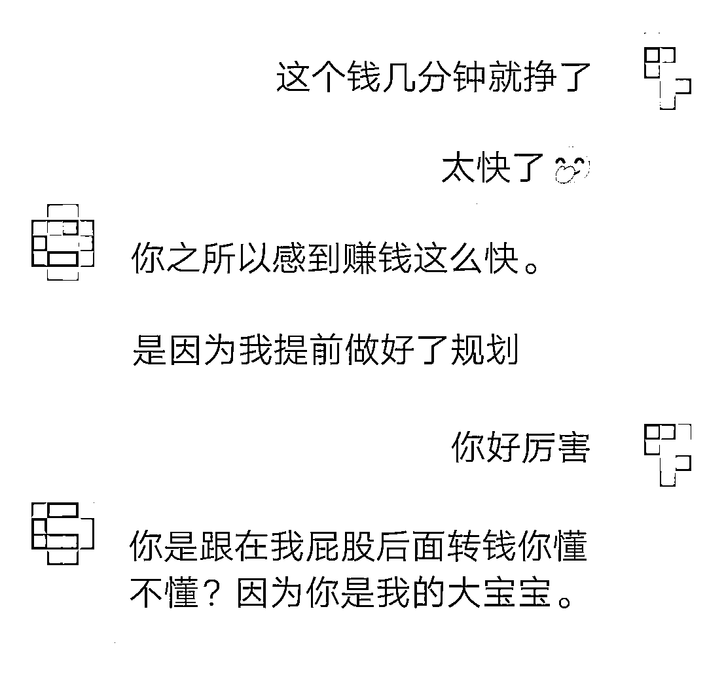

****7 月 30 日****

一大早我便早早醒来，打开手机没看到他的信息有点失落，于是我发了信息过去“懒猪，起床没有啊？随后我隔几分钟便拿起手机看一看，希望看到他的信息。终于，几个小时后他回了信息，我们互道了早安，我的心情也好了起来。聊了一些家常以后，他告诉我说那个网站有新人活动，让我去把新人奖励拿了。

“昨天忘了告诉你，网站有新人活动，充值到了一定数值有奖励。”

“都有什么奖励呢？”

“你还有多少钱？”

“还剩 1 万多了”

“那你就充 18888 吧，可以领 588 元的奖励。”

……

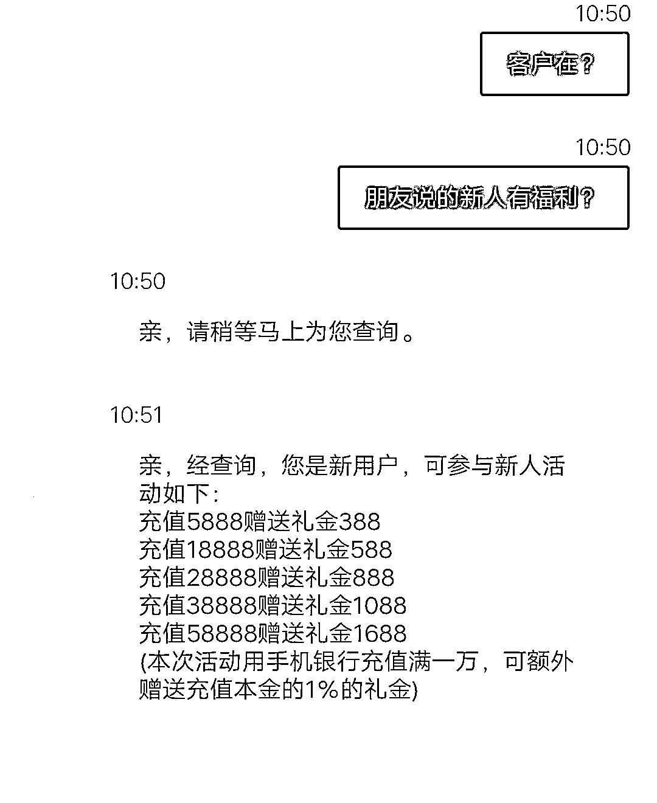

这 1 万多是我身上仅剩的现金，我感到了一丝不安。他似乎看出了我的犹豫，于是给我说了一大堆国际金融形势和微分密码计算这一堆云里雾里的东西，来证明他的分析是正确的。

这种感觉真的好奇怪，连我自己都不知道为什么会相信他，但是在充值了 18888 以后，他带着我在短短几分钟内又盈利了 2000 元，而这 2000 元我也顺利提了现。我觉得好开心，感觉上天真是眷顾我。

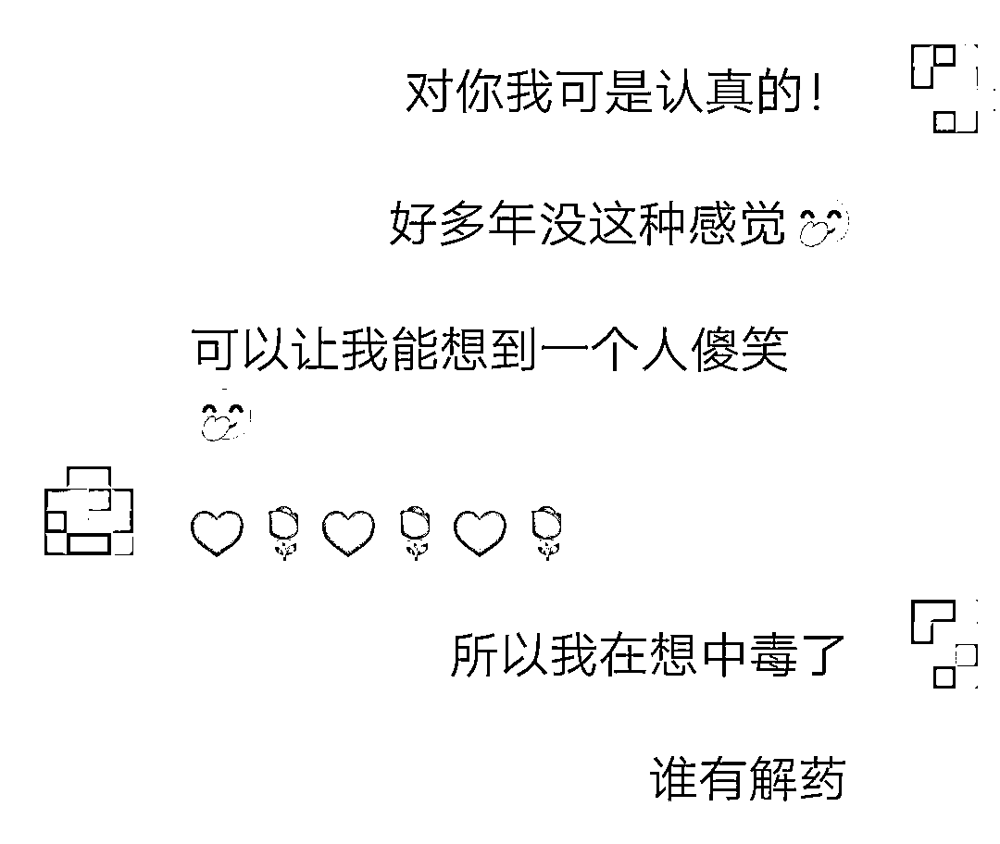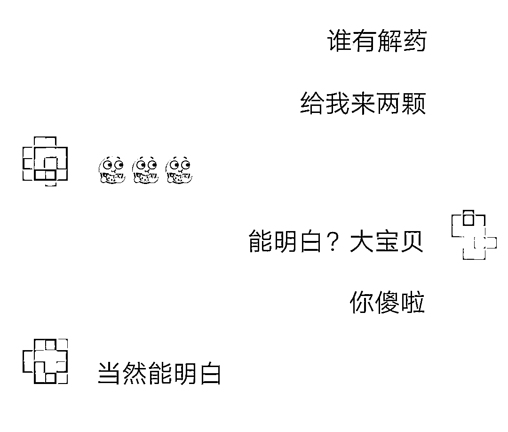

****7 月 31 日****

不知道为什么，我也开始称呼他为宝宝，尘封多年的心好像已经被他打开。

“今天要怎么操作啊？”

“你卡上不是没钱了吗？今天我们不操作。”

“我想好了，我把股市里的 50 万全部取出来做这个，你带我飞。”

“你可想好了，我本来想着让你赚一点就出来，不要贪心，我也不是把把都中的。”

“我想好了，等着你带给我美好的生活呢。”

“谢谢你相信我，宝宝。不，老婆，现在我就把备注改成宝贝老婆，老公一定会带给你美好的生活的。”

……

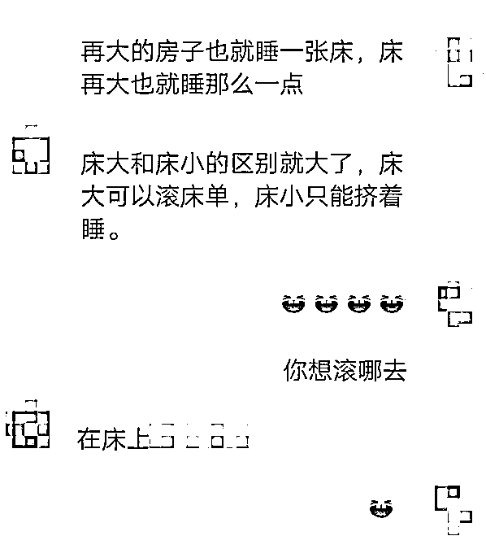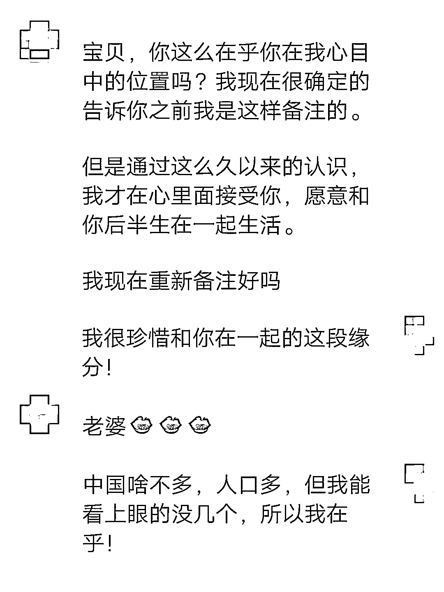

就这样，我们开始以老公老婆互相称呼，不但聊在网站的投资操作，还聊一些男女之间的事，我像着了魔一样被他带着互相“口嗨”，兴致高涨的时候经不住他的软磨硬泡，拍了我最私密的照片发给他，兴奋之情战胜了廉耻之心。

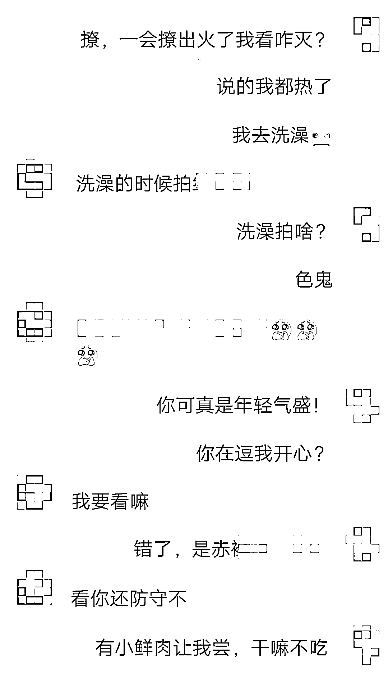

****8 月 1 日****

经过昨天文字上的缠绵，我对他愈发依赖。他说等这次赚够了钱，他就会来看我，还要给我买海边别墅、买游艇，一起去环游世界。而我不能只让他一个人冒险，我把股市里的 50 万全部套了现，然后联系了他。

“老公，我把股市里的钱全部取出来了，跟你干一票大的。”

“老婆，现在网站正在搞一个短期活动，连续投入三天，盈利就可以翻倍，三天以后就能全部提现了，要不要试试啊？”

“好啊，你带着我，我相信你。”

“今天是第一天，首次充值就要 80 万，然后第二天充值 30 万，第三天再充值 50 万，你有那么多吗？”

“首充就要这么多啊？我现在只有 50 万，那我去想想办法。”

……

我找从小一起长大的闺蜜借到了 20 万，加上自己套现的 50 万，还差 10 万元。这时候，他说剩下的 10 万他帮我充了，就当作是给老婆的红包了。他对我总是这么无微不至，真想早一点投入他的怀抱中。

就这样，我将 70 万元分几次转入了他发给我的几张不同的银行卡中。

****8 月 2 日****

为了完成第二天的充值额 30 万，我又找到一个结交了十多年的朋友，好不容易说服她借给我 20 万元，还差 10 万。

“亲爱的，能再帮我想想办法吗，还差 10 万呢。”

“宝贝，我这里也全部投入了接近 300 万呢，要不你试试信用卡套现呢。”

“我没有信用卡啊。”

“你可以借朋友的啊，你也可以到那些贷款 APP 里贷款啊。”

……

我听取了他的建议，又找到一个好朋友帮忙从他的信用卡里套现了 8 万元，再加上刚从某贷款 APP 里贷出的 2 万元，凑够了 30 万元转入了他提供的多张银行卡内。

“宝宝，我觉得有点害怕呢，这么多的钱，如果出问题了怎么办啊。”

“别害怕啊，天塌下来有我啊，再说了，赚钱的道路上一定要敢于前进，害怕是弱者的表现。”

……

看着又一番操作过后账面上 300 多万的余额，我在对他的胡思乱想以及对游艇、别墅的憧憬中，睡着了。

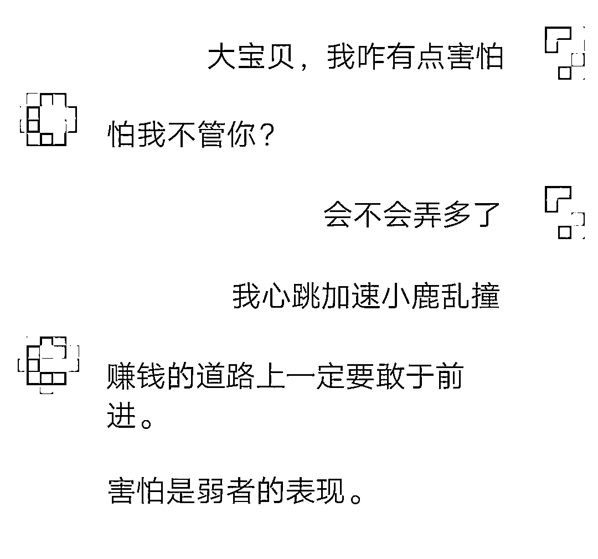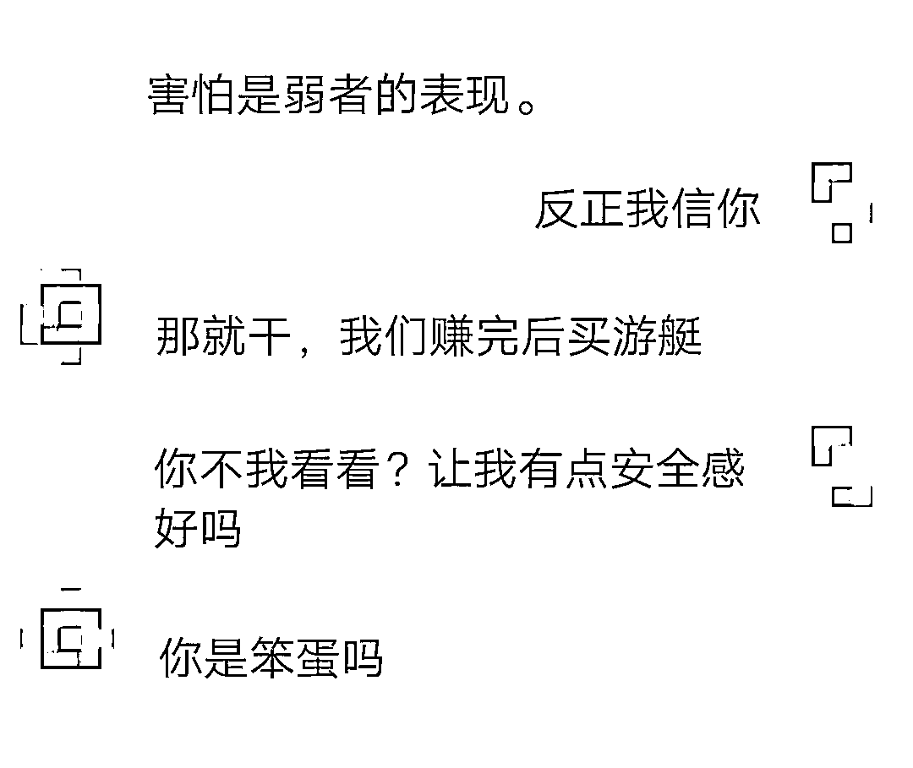

****8 月 3 日****

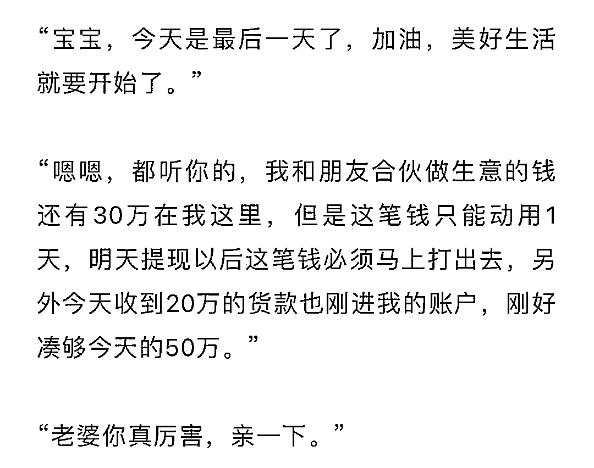

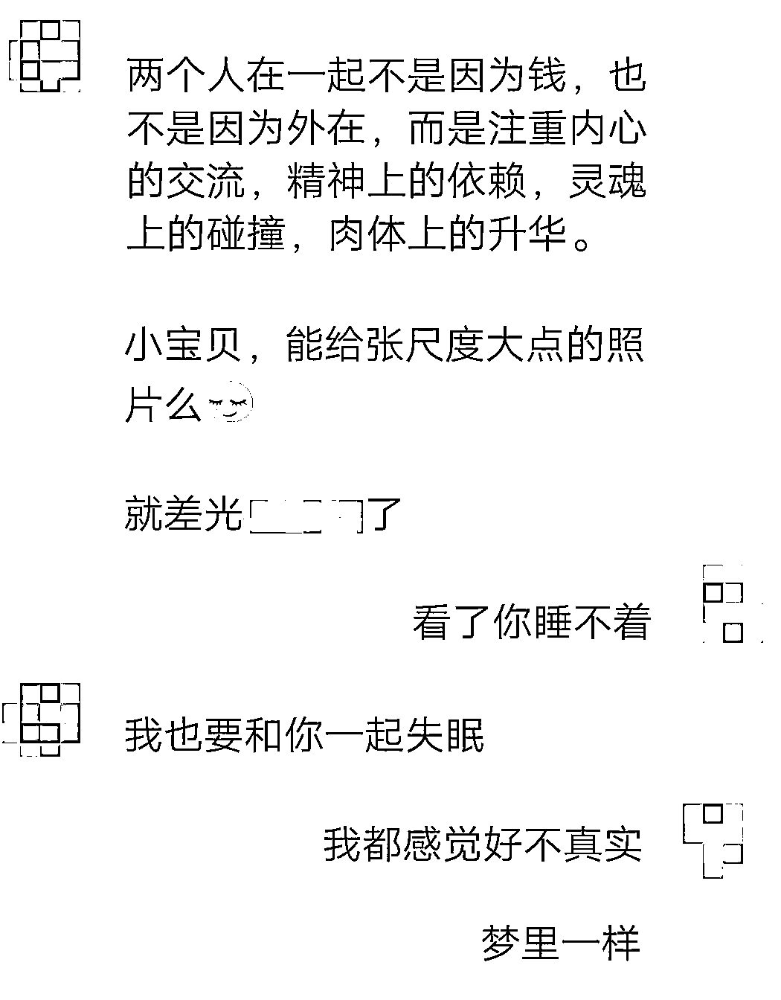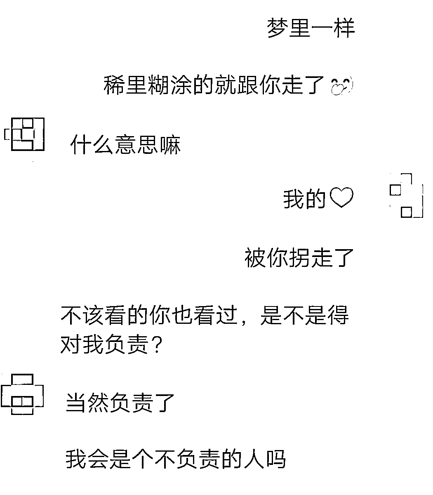

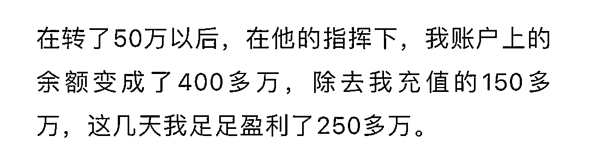

****8 月 4 日****

到了可以提现的时间，早早我就醒来，紧张地向网站发起了提现 400 万的申请，但是这一次不像前两次提现那样，钱迟迟没有到账，隐隐之中我感到一丝不安，慌忙联系了他。

“老公，为什么我提现的钱一直没有到账。”

“宝贝，别急，我这里也出现了问题，我提现一千多万也没有到账，刚才我问了客服，说是要交税。”

“啊？之前没有说过要交税啊，要交多少啊？”

“客服说因为是大额提现，需要交提现金额 10%的税，提现以后会退 80%的税款给我们。”

“天啊，那我就要交 40 万的税，我哪儿还有钱啊？”

“宝贝别急，你不用管了，税款的事我去想办法。”

……

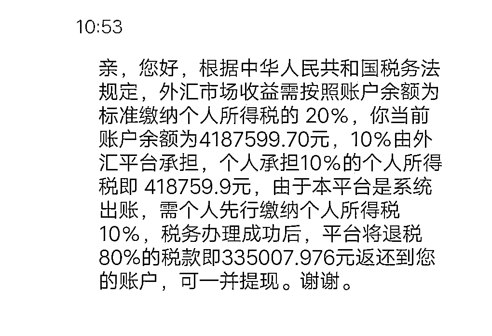

就这样，在焦虑中我等了一天，这一天都没怎么有他的消息。我想打个电话给他，却发现连电话都没有。我之前要过他的电话，他告诉我说他要到我身边以后，亲手把我的电话号码输到我的手机里。夜渐渐来临，无尽的黑暗向我涌来，我手足无措。

“钱解决了吗？”

“我朋友已经答应借我 20 万了，剩下的我还在想办法，宝宝别急，相信我，你乖乖睡觉。”

“可是我睡不着啊，你是不是在骗我啊？”

“你这么多疑虑干什么呢？难道我们的感情在金钱面前一击即破吗？”

“可是我现在才发现除了你的名字和你的照片，我对你一无所知啊，我连你的电话都没有，也没有听过你的声音。”

“想听我声音啊？那我给你唱首歌吧，唱完以后你就乖乖睡觉，不要胡思乱想。”

“那好吧。”

他发来了一段语音，唱的是周杰伦的《彩虹》，听着语音里那二十多岁的声线，我怎么也无法和照片中那个成熟男人关联起来。

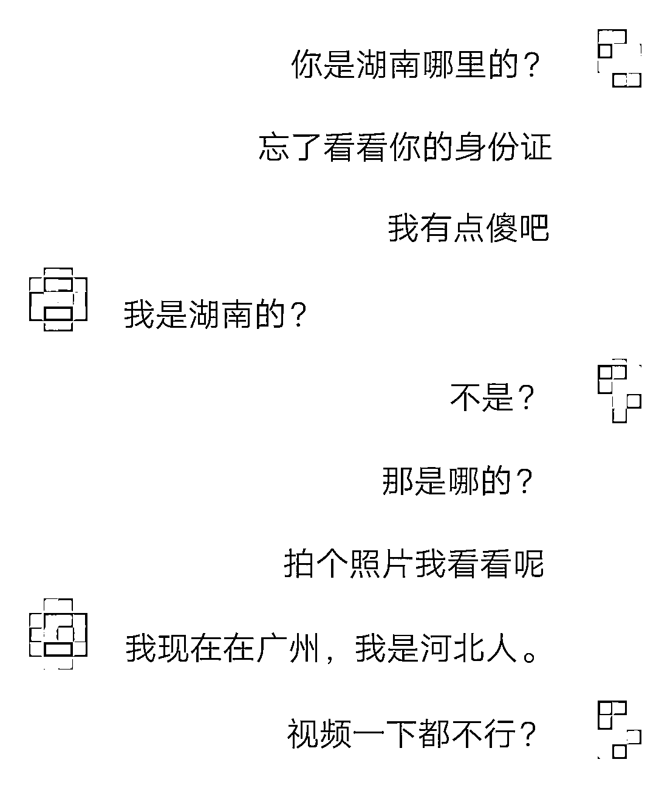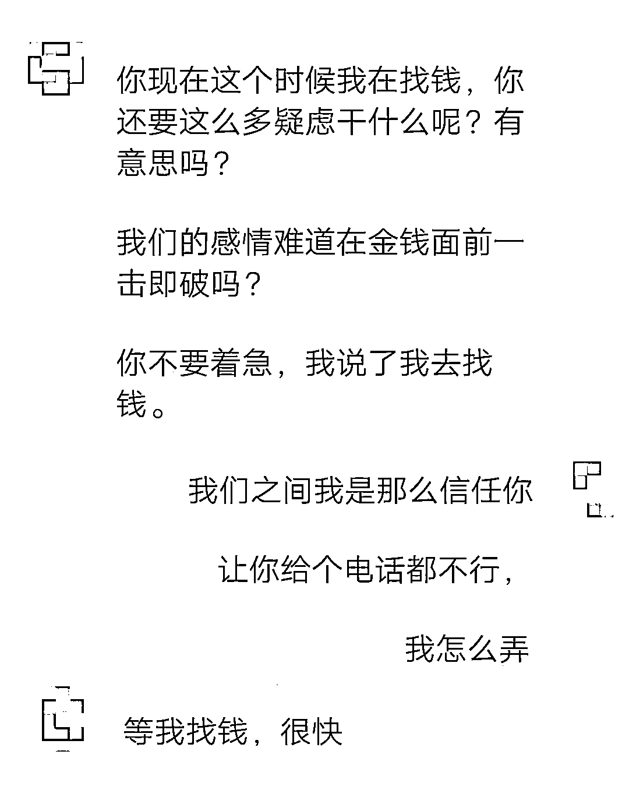

****8 月 5 日****

一大早，他便问我能不能想到办法凑齐另外的 20 万，我告诉他我真的是一分钱都借不到了，于是他扔下一句“对不起，我也想不到办法了，忘了我吧”，便没有了音信，这时我终于从美梦中彻底醒了过来，才知道自己被骗了。

“你全家都不得好死！！！”

这是我留给他的最后一句话，不过可能他根本没有看到，因为系统提示，他已经将我屏蔽掉了。

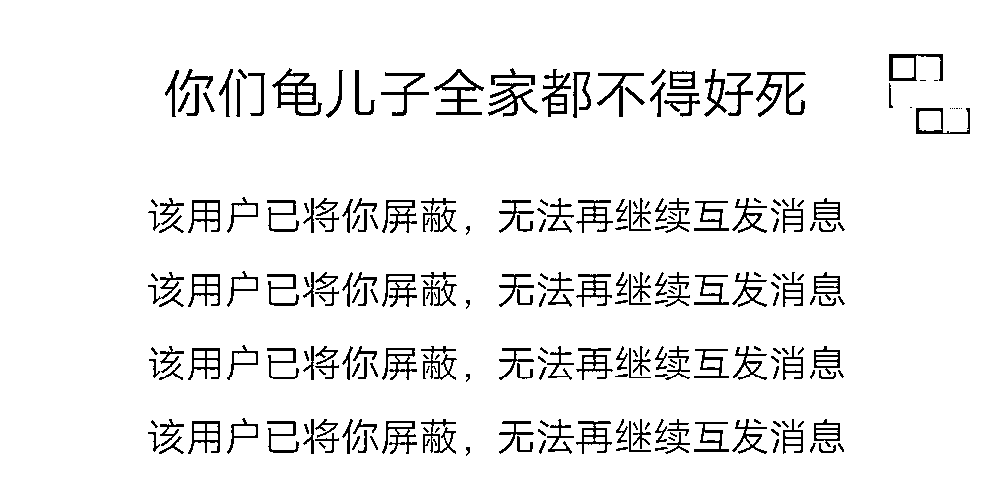

这就是我的故事，一个在短短十天内从美梦到噩梦的故事。我又回到了以前的生活，不同的是，我多了 100 多万的外债，失去了几十年的朋友，现在想一想，我太傻了，为什么要去相信本就不可能，却又突如其来的美梦呢？

来源：澎湃新闻

灰产圈在线客服

← 向右滑动与灰产圈互动交流 →

