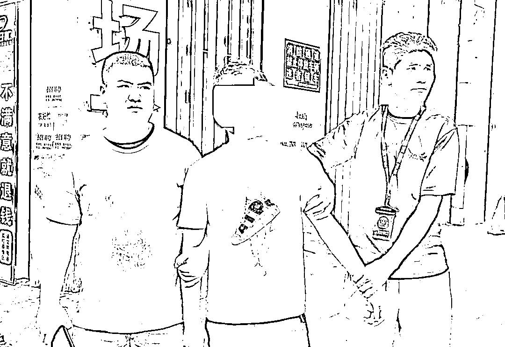
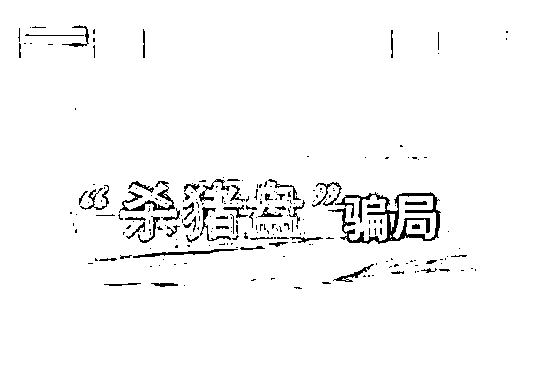

# 女老板花 1400 万元谈恋爱！警方：这些女性成为下手目标…

> 原文：[`mp.weixin.qq.com/s?__biz=MzIyMDYwMTk0Mw==&mid=2247520229&idx=3&sn=1675889abf3c2136c1d233c6de3d32a8&chksm=97cb44dda0bccdcb9eb35c7a483b13a0aacdb906e977249ac26189907ab422ef190c6dedad09&scene=27#wechat_redirect`](http://mp.weixin.qq.com/s?__biz=MzIyMDYwMTk0Mw==&mid=2247520229&idx=3&sn=1675889abf3c2136c1d233c6de3d32a8&chksm=97cb44dda0bccdcb9eb35c7a483b13a0aacdb906e977249ac26189907ab422ef190c6dedad09&scene=27#wechat_redirect)

据报道

抚州一家公司老总陈女士 

在婚恋网站找男友

结果被“男友”诈骗 1400 余万元

系江西省今年以来涉案金额最大的

一起电信网络诈骗案

▲抓获一名嫌疑人

原来

陈女士，今年 41 岁，是一家公司的老总

今年 3 月，她在某婚恋网站注册账号

4 月初，网站向其推荐了“合适对象”王某

双方加了微信好友，一来二去

感情迅速升温，发展成男女朋友关系

王某称自己从事 IT 行业

负责某赌博网站的维护

随着聊天的深入

王某透露该赌博网站有漏洞

只要下注一定赚钱

期间还叫陈女士登录他的账号操作

正如王某所说，陈女士登录他的账号

不管怎么下注，都赢钱

在王某的唆使下 

她在该赌博网站注册了账号

在短短的 3 天时间里

她分多次向王某指定的账户里累计

“充值”了 1400 余万元后发现被骗

**01******网恋要谨慎：小心王子变骗子****

**7 月初，沈女士在网上结识一陌生男子，双方颇为投缘，很快便确定为恋人关系。之后，该男子向其**推荐了一款名为“某货币交易中心”的投资平台**，在对方的指引下，沈女士开始进行炒外汇投资，第一笔投资 10000 元后，就挣回了 529.49 元并成功提现。尝到甜头的沈女士在对方的鼓动下**又陆续向平台内充值了 34 万余元**，欲再次提现时发现其账户已被冻结，对方也失去了联系，被骗 34 万余元。**

****

****诈骗手段：**扮演成功男士吸引单身女性注意**→**嘘寒问暖，骗取感情**→**暴富诱惑，引导投资**→**前期小盈利，巨额无法提现**→**卷款拉黑。**

****02********网购需警惕：骗子最爱披客服外衣****

**8 月 8 日，王女士接到一自称是网店客服的陌生电话，对方告知王女士**之前购买的奶粉存在质量问题，现要为其办理退款**，王女士同意后便收到了对方发来的一个二维码，打开之后显示的是某软件退款页面，提示输入银行卡账号、密码和身份证号之后提交并退出。此后，王女士手机接连收到扣款短信，共计损失 1.7 万余元。**

****

****诈骗手段：**非法获取受害人网购信息**→**打电话谎称受害人“网购商品存在质量问题”“快递损坏丢失”等**→**诱骗受害人到指定平台办理退款、理赔等业务实施诈骗。**

****03********求职必看：虚假高薪诱惑应舍弃****

**7 月下旬，张女士在一孕妇交流群中看到一则招募兼职刷单广告，随即联系对方询问刷单事宜，谈妥后，张女士小额**刷了几笔订单后，顺利收到返还的本金及佣金**。初尝甜头的张女士为了**赚取更高的佣金，便按照对方要求开始做“多单”任务，连续 9 次刷了 22.4 万余元，钱却一分也没有返还**。当她再次联系对方时，发现对方早已销声匿迹，被骗 22.4 万余元。**

****

****诈骗手段：**以“轻松高薪”做诱饵吸引受害人兼职**→**小额试单，引诱上钩**→**连环忽悠，任务未完成不返款，无限循环**→**拉黑消失。**

****04********收到“逮捕令”切勿惶恐****

**8 月 5 日，赵女士接到一陌生电话，**对方称是某公安局民警，告知赵女士涉嫌一起洗钱案件**，需要赵女士添加 QQ 做电子笔录，**在对方的一步步引导下，赵女士向其提供了个人信息及银行卡账号、密码和手机验证码**，并将自己支付宝、微信中的钱都转移到指定银行卡内，最后被诈骗 6 万余元。**

****

****诈骗手段：**冒充“公检法”工作人员谎称受害人涉案**→**震慑、恐吓要求受害人配合警方调查**→**远程操控转移资金实施诈骗。**

****警方提醒****

****1.网恋交友需谨慎。**凡是网上交友涉及金钱往来的一定要多提防、多查证。**

****2.陌生来电不轻信。**凡是接到自称客服“退款”“理赔”的来电，不要轻信。如有疑问，请直接拨打官方客服电话进行咨询核实。**

****3.天下不会掉馅饼。**永远不要相信那些投资小、回报高、收益高的字眼。**

****4.不惧恐吓别上当。**公检法等国家机关不会通过电话办案，更不会让公民转账汇款！**

******再次特别提醒******

******请赣州女人擦亮眼睛******

******没有那么多高富帅等着你******

******也没有那么多网络漏洞******

******你渴望的爱情******

******很可能是一场骗局******

******务必警惕！警醒！！******

**来源：赣州公安**

**灰产圈在线客服**

****

**← 向右滑动与灰产圈互动交流 →**

****