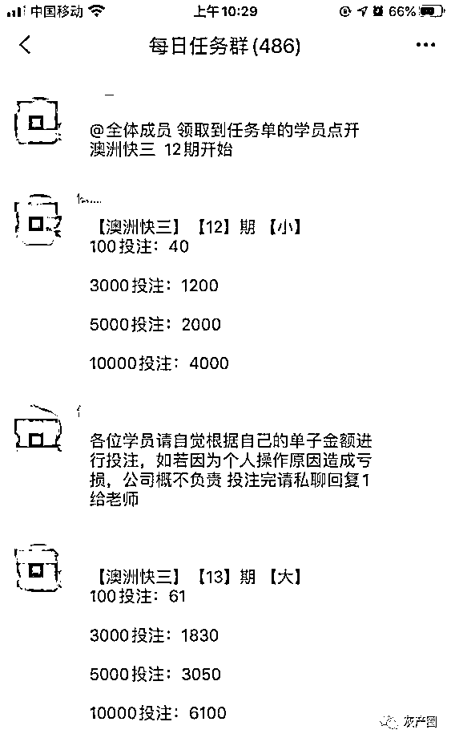
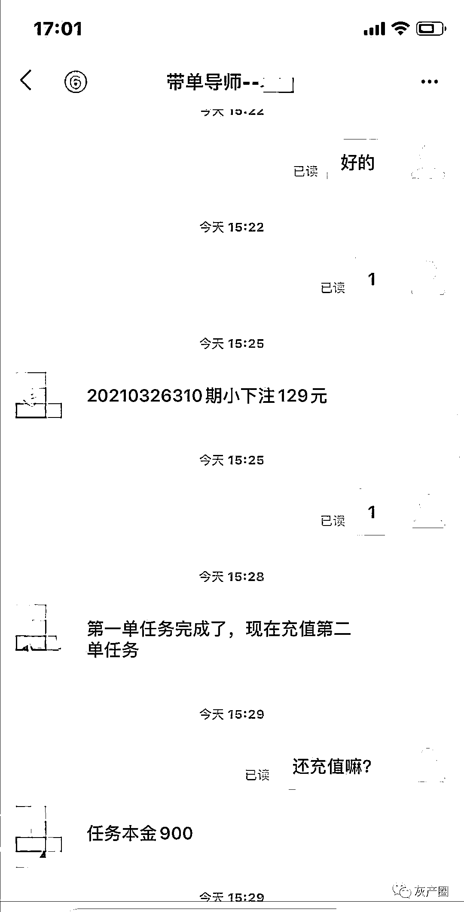

# 一天损失近 30 万！江苏一男子遭遇 “博彩刷单”诈骗

> 原文：[`mp.weixin.qq.com/s?__biz=MzIyMDYwMTk0Mw==&mid=2247520229&idx=5&sn=faee44158f12a88edac9fa300f0e5561&chksm=97cb44dda0bccdcb9a5deea9579e0701c89225367d1d05e232dbc0fbcfb2cd79c6c3202cc633&scene=27#wechat_redirect`](http://mp.weixin.qq.com/s?__biz=MzIyMDYwMTk0Mw==&mid=2247520229&idx=5&sn=faee44158f12a88edac9fa300f0e5561&chksm=97cb44dda0bccdcb9a5deea9579e0701c89225367d1d05e232dbc0fbcfb2cd79c6c3202cc633&scene=27#wechat_redirect)

目前，全省疫情已经得到了有效控制

生活逐渐恢复成原本的样子

不过经此一“疫”

很多人都感受到了生活的压力

支付宝催着还花呗

银行催着还贷款

房东催着交房租

……

生活还得继续

受疫情影响收入减少或失业的人

迫切地寻找着增加收入的法子

来缓解压力

不法分子抓住这个时机

通过网络传播各种虚假信息

继而实施诈骗

今天，就和大家分享两例

疫情期间遭遇“博彩刷单”诈骗的案例

2021 年 8 月 20 日晚上，张先生在家中浏览网站时，手机页面弹出一款名为“一夜激情”的软件安装界面，下载软件后，一名在线客服联系张先生，说可以通过这个软件参与博彩，并向其推荐了一名指导“老师”，“老师”告诉张先生买大买小，几次操作下来，张先生果然“赚”到了钱。

（图片来源于网络）

第二天晚上，张先生正准备继续在“老师”的指导下参与博彩时，对方这时却说张先生必须参与一次博彩刷单才行。已经尝到甜头的张先生没有过多怀疑，在对方的诱导下向其提供的银行账户中转入了 2000 元用作刷单。张先生转账完成后，对方称其在操作过程中存在失误，要求张先生再次转款 7000 元，并提供了一个新的银行账户。于是当天晚上，对方以各种借口诱导张先生先后汇款 6 次，汇款金额高达 29.9 万元，

多番转账之后，张先生仍然无法将钱款提现。

通过非正规网站弹出软件下载链接

只是骗子们传播虚假博彩软件的其中一种方式

打着“免费领风扇”等活动的噱头

借助熟人的朋友圈引流

这种手段更是让人防不胜防

8 月 14 日，徐女士在朋友圈里看见有同事分享了一个“免费领风扇”的活动，徐女士扫描活动海报上的二维码后，添加了网名叫“美的客服”的微信。对方通过好友申请后，将徐女士拉入某微信群聊，群聊里正“热火朝天”的讨论着博彩，并有很多“证明人”在群中分享着博彩盈利的收款短信截图。

连续两日，群聊里都有“群友”分享他们盈利截图，徐女士对此有些心动。8 月 16 日，徐女士主动添加了群聊管理员“笑笑”的微信，说明来意后对方发来一条陌生链接，让徐女士下载名为“宏图”的软件，并给其推荐了名叫“梦梦”的接待员。在“梦梦”的指导下，徐女士下注 10 元、20 元不等，果然这些钱都双倍赢了回来，且都能提现。之后，对方称需要先做一个 500 元的联单才能继续下注，徐女士按照指引，用手机银行向对方提供的银行账户中转入了 500 元。转账完成后，对方又说，联单要全部做完才能提现。就这样，徐女士先后转账 4 次，汇款 40500 元。

（图片来源于网络）

由于转账后的钱款迟迟不能提现，徐女士这才意识到自己可能遭遇了诈骗。

看完这些，不难发现

诈骗分子通常会以各种身份来接近目标

前期的小额放利

也只是为了取得受害者的信任

所谓的网络博彩

输赢皆由诈骗团伙控制

这也是受害人前期下注

每次都能赢钱的原因

提醒大家：

无论是刷单还是博彩，都是违法行为！务必要提高警惕，严守法律红线！

来源：盐城反诈骗

灰产圈在线客服

← 向右滑动与灰产圈互动交流 →

