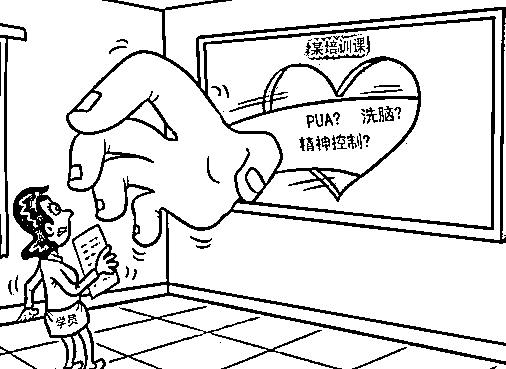

# 花 45000 元参加课程，找骂还要完成“感召”指标

> 原文：[`mp.weixin.qq.com/s?__biz=MzIyMDYwMTk0Mw==&mid=2247520229&idx=6&sn=4e7c64e0cc1b3b3dbd750e7febce7c80&chksm=97cb44dda0bccdcbf2e44808e96b8c4546886a9ce8357a66ac4fa5b7b8301cbc941615a9b67d&scene=27#wechat_redirect`](http://mp.weixin.qq.com/s?__biz=MzIyMDYwMTk0Mw==&mid=2247520229&idx=6&sn=4e7c64e0cc1b3b3dbd750e7febce7c80&chksm=97cb44dda0bccdcbf2e44808e96b8c4546886a9ce8357a66ac4fa5b7b8301cbc941615a9b67d&scene=27#wechat_redirect)

最近，国内出现一些包含控制情绪、辱骂学员等环节的所谓培训课程。据了解，这类课程实际是应用所谓的“教练技术”，名义上是帮助学员获得自我突破，实际却是通过环环相扣的设计，对参与者进行心理操控。通常这类课程还会设置“感召”的环节，也就是需要拉更多人入伙。 

近年来，各地公安机关已经打掉了多个以“教练技术”之名、行传销之实的非法组织。但记者了解到，目前这类培训课程正改头换面，针对不同用户群体有针对性地传播。这些“教练技术”课程背后，隐藏着怎样的套路？

男子花 45000 元参加“教练技术课程”

又被要求完成“感召”指标

广东的李先生曾在朋友推荐下，花费 45000 元报名参加专为企业家开办的“教练技术课程”，然而经过两个阶段的洗脑课程之后，他又被要求参加名为“感召”的第三个阶段。

李先生表示，感召有三十几个人，几乎都是自己的朋友、供应商、亲戚、员工。“会给每个人一个指标必须要完成，没有完成的还会通过各种方式给我们压力。”

据了解，这些以“教练技术”为名的课程，会在第一阶段、第二阶段运用精神控制类的技巧对学员的心理进行突破，长时间封闭式对学员进行灌输式学习，进而达到第三阶段“感召”更多学员加入的目的。

图片来源于网络  

一位不愿透露姓名的业内人士告诉记者，在第一阶段课程中，会涉及到类似“辱骂学员”的环节，不停冲击学员的心理底线，在“伤口上撒盐”，使其心理破防，为后续的灌输做铺垫。

“如果突然去到了一个陌生的环境，对外界是有警惕性的，但是课上通过一系列的手段，从前期让大家先把情绪发泄出来，从倾诉到后期的辱骂，其实都是在破防，这些内容都是环环相扣的。”

运用洗脑、催眠等手法对学员打压

最后让学员完成超越常规任务

近日被曝出课程存在“辱骂环节”的北京“LEGACY 飞跃力工作坊”目前已暂停营业，其官网简介上写着“您将挑战您信以为真的种种自我限制”“需要五个整天百分百的参与。”在广州市番禺区一处商场内的“教练技术”培训场所，外部被木头封得严严实实，无法看到内部场景。

业内人士介绍，全封闭、长时间、高压式，是这类“教练技术”课程的一大特点，培训老师的第一课就是运用洗脑、催眠等手法对学员进行打压、否定。而在示范之后，这些不具备心理学专业技能的学员们还会被分成 6 人左右的小组，进行多对一的“辱骂”。

“做这种培训一定是全封闭式的，而且在饮食和生活上都有严格控制，晚上绝对不会让你早睡，通过包括疲劳轰炸等多种手段完成洗脑，然后他还会告诉你，如果扛得住就说明你成长了。随着老师的指令，学员情绪都特别亢奋，特别激动，觉得自己的人生怎么着了。”

反教练技术公益组织的刘先生，也曾进入这类课程学习，在了解到“教练技术”的“精神传销”本质后，他选择退出，并试图阻止更多的人掉进教练技术陷阱。据刘先生介绍，这类精神传销更为可怕之处在于，学员都对理论深信不疑，主动发展更多学员。

“表面上对外人宣传的东西，都是很理智的，包括感恩等。实际上在运营当中，尽是激发他们对家人和亲友的不满。肯定是要拉人的，拉一个学员让他交费 10 万块钱，就能获得一万五，一般是 15%的比例。”

业内人士介绍，这类课程的最后阶段，往往会以“突破自我”为由头，让学员完成一些超越常规的任务。

“课程到了最后的阶段，会安排任务，比如在马路上我不给你一分钱，你身上也没有各种通讯设备，然后要求你必须借到钱，这是感召的第一部分，再往后面才是让你在大马路上拉人、感召，这已经是比找亲人入伙还要可怕的事情。”

培训团队并无心理学资质

专家提醒要警惕“教练技术”渗透

近年来，多地警方曾破获以教练技术为名，通过非法有害培训实施精神控制的新型传销案。据犯罪嫌疑人查某透露，培训团队并无心理学资质，培训课程教材也都是从电商平台购买。

记者在电商平台搜索看到，目前仍有大量“教练技术”类培训课程包以几十元的价格售卖。而这些没有取得开班授课资格的组织，也都改头换面，注册为“商务咨询公司”或“成人培训平台”。

广东警察学院犯罪学教研室副教授彭琨提醒，要警惕“教练技术”在各类成人培训行业甚至是对青少年群体的渗透。

“利用人的自卑，通过一种先破后立的方法，就是打破你的认知层面，重新确立一种认知的模式。通过辱骂和攻击你个人，让你对自己产生一种深深的无力感，然后利用这个无助感传播一些有问题的价值观念，从而让个体去深深地相信他们营造出来的价值观念。”

来源：澎湃新闻

灰产圈在线客服

← 向右滑动与灰产圈互动交流 →

