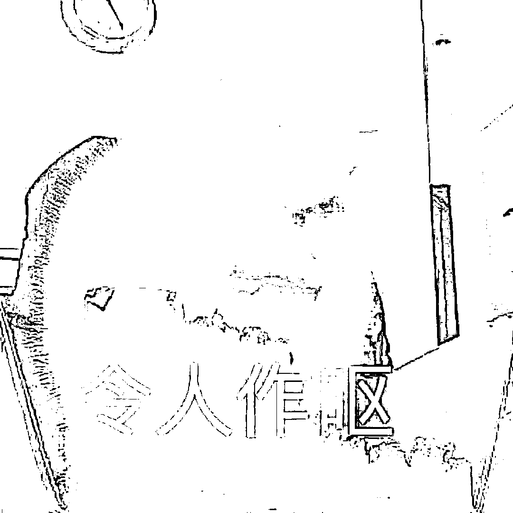
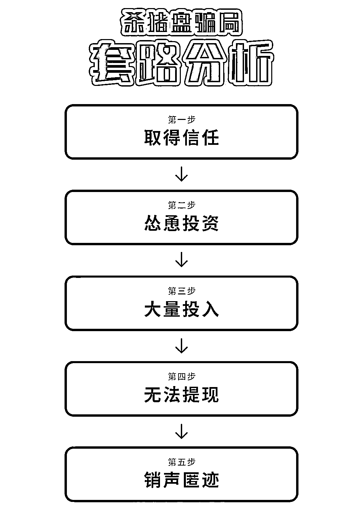
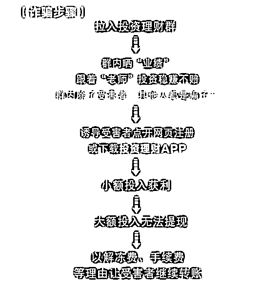
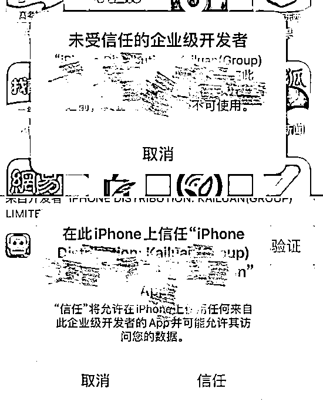

# 警惕“高回报”的网络投资诈骗，莫把陷阱当馅饼！

> 原文：[`mp.weixin.qq.com/s?__biz=MzIyMDYwMTk0Mw==&mid=2247520229&idx=7&sn=c9c11222702d3a2662b35e5ab70ed635&chksm=97cb44dda0bccdcb9901e4f1b47c14986d3aceeadc19c2da20380d0edad3f4c389c847c5d3c2&scene=27#wechat_redirect`](http://mp.weixin.qq.com/s?__biz=MzIyMDYwMTk0Mw==&mid=2247520229&idx=7&sn=c9c11222702d3a2662b35e5ab70ed635&chksm=97cb44dda0bccdcb9901e4f1b47c14986d3aceeadc19c2da20380d0edad3f4c389c847c5d3c2&scene=27#wechat_redirect)

如果您准备投资或者正在投资 

**请一定要认真阅读以下预警内容**

**切勿上当受骗****一、网恋交友诈骗**

“自从认识你后牙就经常疼

（因为和你在一起太甜了）”

“我教你游泳好不好

（这样我就可以和你坠入爱河）”

......

这些节选自“杀猪盘”诈骗“培训话术”

披着爱情的外衣 

用虚假故事甜言蜜语

骗得无数人

负债累累痛不欲生

......

**套路解析****民警提醒**1.网恋不要过度投入感情，尤其是没见过面的网友，不要被花言巧语和表面行为所迷惑。2.不要轻信“婚恋对象”口中的“投资”，切莫被对方“日进斗金”的说法所迷惑，天上不会掉馅饼，眼见不一定为实，**只要对方开始谈钱，就要提高警惕。**3.不要抱有侥幸心理，发现疑似骗局的苗头，立即止损，一旦被骗，及时拨打 110 报警！**二、投资理财诈骗**不同于网恋交友的“杀猪盘”诈骗，投资理财诈骗更为直接，不和你谈情说爱，直接拉你进各种各样的投资群聊，**用直播教程进行洗脑，让你看见群里其他人每天都在赚钱**。**真实案例**

钱某 8 月初接到一个电话，对方自称从事证券交易，之后钱某被**拉入一个炒股群中**，群里每天都会发送一些股票上涨的照片，一开始钱某并不太在意，过了一个礼拜，微信群里的管理员说有新股上线，**鼓动大家去购买**，钱某于是就按照对方的指示，下载了一款名为华鑫证券机构自营的 APP，之后的半个月时间，钱某在这款 APP 中**不断投入几十万元**，并且不断盈利。直到钱某想要提现时，**发现提现失败**，随即 APP 直接无法打开，这才报警。

**套路解析****第一步：广撒网，诱上钩**；嫌疑人往往会制作一个类似上述案件中的假 APP 平台，然后通过大量发送二维码，链接来寻找目标。**第二步：做剧本，博信任**；进去 APP 平台后，很多页面上会突出一些吸引眼球的字眼来获取被害人的认可，比如腾讯出品，或者某某证券公司赞助等。而且会有人添加被害人的微信告知有内幕消息。**第三步：摆阵势，爆内幕**；被害人进入的可以获取内幕的微信群一般都会有数十人至上百人，而且会有大量的消息声称赚钱，盈利的，其实被害人不知道的是除她以外，其余群里的人全是托。导师也会提出根据盈利的数额分红等要求。起初第一，二笔投注都会让被害人顺利提现，可之后就只能看见平台的金额在涨，无法提现！这也是后台操作的结果。**第四步：速收网，销平台**；当被害人想提现的时候就会发现平台显示资金冻结等情况。一般到这时就会轮到客服出场了，客服会以维护，流水不够，提现额度较小等理由要求被害人继续投注。可当试过各种方法后被害人依然无法提现，才会意识被骗。等到再想登录时平台已关闭。群聊也解散了。**识别虚假 APP**一般投资理财类虚假 APP，由于无法在手机应用市场上架，诈骗团伙只能通过点击网址链接或扫描二维码的方式让用户下载虚假 App。**因此非官方应用市场下载的，都是黑平台，都是虚假 APP。**

**（请勿安装）**

另外，购买正规理财产品，需要签订协议，资金将自动扣划。中国银监局严令禁止账户转账，更别提转账到个人账户。**要求转账到个人账户或对公账户与平台名称不符的，都是诈骗平台。****民警提醒**1.投资，理财会有专业的途径，在进行理财之前一定选择银行，证券公司等专业机构进行确认！2.网络上发布的投资，赌博，理财信息万不可信！3.**一切让你先打钱，或者天上掉馅饼的赚钱方式，全部都是诈骗**，陌生链接不要点，陌生二维码不要扫，躺着是没办法赚钱的！

来源：太原市反诈骗中心

灰产圈在线客服

← 向右滑动与灰产圈互动交流 →

