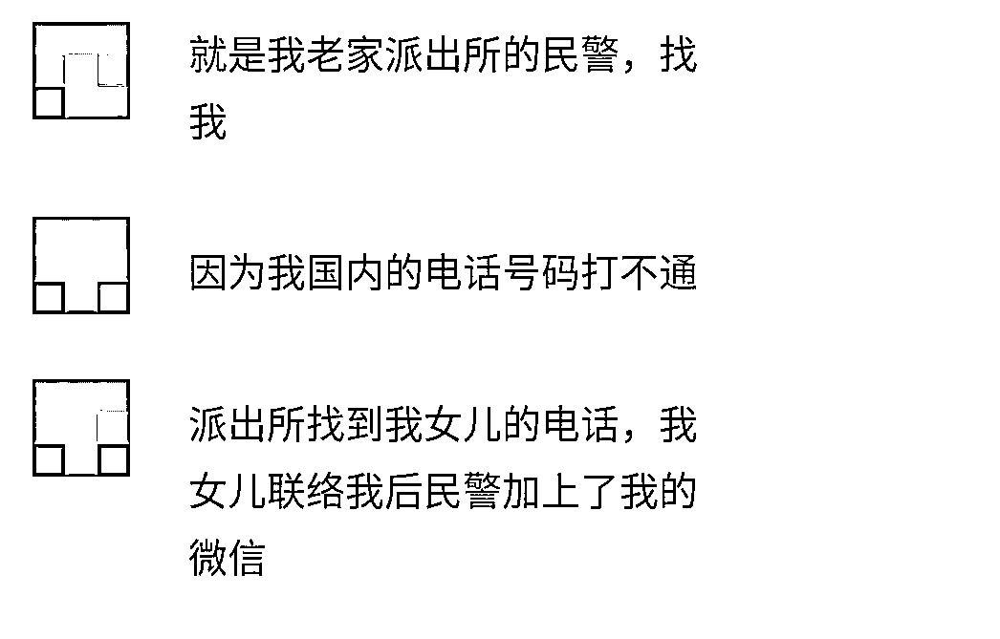

# 在柬埔寨，时常接到老家派出所的电话

> 原文：[`mp.weixin.qq.com/s?__biz=MzIyMDYwMTk0Mw==&mid=2247520276&idx=3&sn=ae22cfaf9014cca85bce464dc03d1716&chksm=97cb5b2ca0bcd23ae33a38d31c75b2b2ca67acd6cb9d4c9e65ca12e82068ea8a77eff2a7c485&scene=27#wechat_redirect`](http://mp.weixin.qq.com/s?__biz=MzIyMDYwMTk0Mw==&mid=2247520276&idx=3&sn=ae22cfaf9014cca85bce464dc03d1716&chksm=97cb5b2ca0bcd23ae33a38d31c75b2b2ca67acd6cb9d4c9e65ca12e82068ea8a77eff2a7c485&scene=27#wechat_redirect)

在柬埔寨做快递业务 

 曾 4 次接到老家派出所的电话 

**一名在柬埔寨从事快递业务的网友向柬埔寨头条表示，他近日又接到了国内派出所的“问候”，而这已经第 4 次了。**

**据了解，去年 12 月，这名网友第一次接到老家派出所民警的电话，当时很紧张。**但他是正规合法出境的，把事情说清楚就好了。**当时民警主要问他，他是以什么方式出境的，有没有机票和护照，拍照给他们看。**第二次接到民警的电话是在今年 2 月份，问他过年要回去吗？

**第三次接到电话是今年 3 月份，问他是做什么工作的，有没有护照，然后还要签承诺书，承诺不参加网络赌博，还让他微信发了在柬埔寨的定位。**

第四次接到电话是今年 7 月份，问这名网友具体从事什么工作，并要求他发营业执照。但他是摆那种小摊的，很少有人去办理营业执照，此外，民警还问他什么时候回国。

**这名网友表示，他之前也在柬埔寨头条看到过有网友接到国内警察的电话。所以他接到老家派出所民警电话的时候，还是有点心理准备的。****他只是担心跟缅甸一样，有没有正规工作都要求回国。**当时还把机票价格发给民警，怕民警让他马上回国。7 月份机票五六万，要存大半年工资才能买一张票。

这名网友表示他现在也想回去，但是机票太贵了。所以买了明年二月份的机票，但还是害怕航班取消。**他很配合国内的警察，在工作不忙的时候好好配合，可以省掉不少环节，而且警察也不容易，这是他们的工作。**

**  在工厂上班接到民警电话  **

**  被质疑涉嫌电信诈骗  **

**9 月 3 日，一名网友也接到了国内老家派出所民警的电话。**因为他国内的电话号码打不通，派出所民警就找到他女儿的电话，他女儿联络后民警加上了他的微信。

**这名网友告诉柬埔寨头条，刚开始打电话的时候民警语气很凶，就像是审犯人一样，说他们涉嫌电信诈骗，上了电信诈骗人员名单。**民警还问他的护照号码，签证有效期，并让他拍照给民警看。不仅如此，民警还要他提供工厂的照片，工作环境的照片，还问他们的工资是如何发放的？是现金、银行卡，还是微信。

当他把资料都提供后，民警的语气总算恢复正常。这名网友表示，他理解民警的工作。**最后民警还提醒他出门在外要注意安全！**

**这名网友表示，派出所问什么，如实回答就可以了，做正规合法工作的不要怕。**他刚接到电话的时候忐忑不安，还怀疑遇到诈骗。但民警发了老家派出所的视频，证明他们警察的身份，加上之前在网上看过，他也知道了老家派出所在打电话核查。他做的是正规工作所以他就放下心了。

在酒店上班

接到国内警察视频电话

**还有一位网友也向柬埔寨头条透露，他在 9 月 3 日也接到了国内老家派出所警察的视频电话。**民警问他在柬埔寨做什么工作，打算什么时候回国，他的联系方式是多少，之前是跟多少个人一起来到柬埔寨等等。然后还要提供具体的工作地址以及在工作场所工作的照片，他都如实回答并提供了。

这位网友表示，他理解民警的工作，但是心里会感觉有点不舒服。他没有做违法的事情，出去工作还要被盘问，感觉跟做贼一样。他现在更关心机票什么时候可以降下来，然后早日回国。

**近几年，网络诈骗、青年误入网赌公司这类事件频发，有很多年轻人因为被所谓的“高薪”骗到柬埔寨，然后被卖进网赌公司，有些甚至还失去了生命。**

而且柬埔寨一直是电信诈骗的高发区，此前不少人借着当地法律等条件的宽松，藏匿在当地从事非法活动，专门针对国内人民实施诈骗，涉案数额往往高达几千万甚至上亿，导致不少家庭遭受损失，甚至因此家破人亡，影响十分恶劣。

**因此，中柬两国政府进行中柬联合执法行动，共同打击以电信诈骗为主的违法犯罪行为。此外，加强对出境人员的审核和排查，严格打击电信诈骗及网络赌博等违法犯罪行为。**

在柬埔寨从事正当工作的人不必慌，积极配合派出所的工作即可。

来源：柬埔寨头条

← 向右滑动与灰产圈互动交流 →

