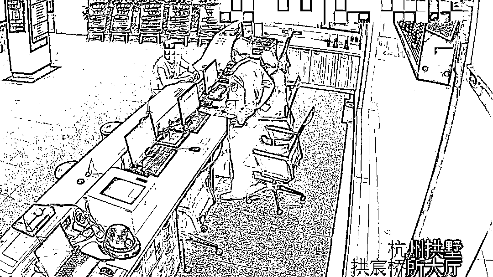

# 只要我不裸，就要挟不了我？警察都拉不住！

> 原文：[`mp.weixin.qq.com/s?__biz=MzIyMDYwMTk0Mw==&mid=2247520276&idx=4&sn=a5455afc44198d1ed7dcf2f5faf03df9&chksm=97cb5b2ca0bcd23a48cf7cbdda11eb1146b2f8ec918e477a81c520954d2c9712e1afea6f8ec5&scene=27#wechat_redirect`](http://mp.weixin.qq.com/s?__biz=MzIyMDYwMTk0Mw==&mid=2247520276&idx=4&sn=a5455afc44198d1ed7dcf2f5faf03df9&chksm=97cb5b2ca0bcd23a48cf7cbdda11eb1146b2f8ec918e477a81c520954d2c9712e1afea6f8ec5&scene=27#wechat_redirect)

近日，辖区接连两名群众明知可能遇到了裸聊骗局，还是一头扎进了对方布好的陷阱里......

**举报、拉黑、删除，一气呵成****奈何“美女”穷追不舍**

受害人小林（化名）称，8 月 9 日凌晨，他在上网时，QQ 上突然有个陌生美女申请添加他为好友。点击同意后，对方便发来一神秘链接，邀请小林点开链接观看直播。接受过反诈宣传的小林立即意识到不对劲，**自己多半是遇到“裸聊骗子”****了，于是****条件反射般地将对方 QQ 号举报、拉黑、删除，一气呵成。**

▎小林与“裸聊骗子”的聊天记录

但对面的“美女”很是敬业，对小林紧追不舍，换了个 QQ 号继续加好友联系小林。**小林终究还是没经受住诱惑，出于好奇点开了对方发来的链接，下载并安装了链接中的“直播”软件。小林心想，只要我自己不裸，骗子怎么也要挟不到我。**

**只要我不裸，你就要挟不了我？****小伙太天真**

随后，“美女”再次向小林发来消息时，却是一改之前的态度，威胁称，已经用小林的照片制作成不雅视频，让小林给他打钱，不然就把这段视频发给小林手机通讯录里的所有人，让他身败名裂。之后，他还把小林手机上的通讯录和不雅视频发给了小林。

▎犯罪分子以不雅视频要挟小林转账

**迫于威胁，小林只得屈服，陆续向对方指定账户转账 7 万余元。**但对方并没有善罢甘休，继续威胁小林，让小林通过各个贷款软件借贷。直到凌晨四点，见对方还是不依不饶索要钱财，已无力再为自己好奇心买单的小林最终选择前往上塘派出所报警。

▎小林前后被要挟转账 6 次，累计损失 7.1 万元

报警后，小林仍非常疑惑自己明明没有进入该软件，只是在注册登陆界面输入了一个不存在的手机号码，怎么就被窃取个人隐私了？

**警察拉都拉不住****明确告知是诈骗，还是没忍住！**

无独有偶，拱宸桥派出所也接到了类似警情。小陈（化名）认识了一名女网友，在其甜言蜜语的攻势下，小陈接受了对方的视频请求。心想："只要不裸聊，就不会有事的。"

**但是在短暂的视频过后，对方却发来了一段有着小陈头像的不雅视频，小陈后悔极了，觉得不该自作聪明以为只露个脸没事的。**于是，立刻赶到拱宸桥派出所报警求助，**值班民警卢欣望再三强调这是裸聊诈骗，不要转账，将对方拉黑。**

在民警的劝说下，小陈也确实将对方拉黑了。然而，回到家后，他却越想越觉得不甘心，一想到自己的视频还在对方手上就气不打一处来。

于是，**为了拿回视频，他又主动将对方加了回来，**提出见面约会的要求，想要用这种方式当面把视频要回来。**骗子随后让其转 1800 元的路费才能见面，小陈同意了，可骗子收了钱后，立马拉黑，小陈意识到自己又被骗了，而这次钱也真的被骗走了。** 

**木马病毒、AI 换脸****套路一套又一套**

明明没有进入软件，明明输入的是不存在的手机号码，明明只露个脸，怎么还是被窃取了隐私，被制作成了视频呢？

**骗子很可能是将木马病毒隐藏在了二维码里或者一些链接里。当受害者打开这些链接的时候，手机系统里就被安装了木马程序，从而利用木马程序获取其手机通讯录、相册、短信等，再通过 AI 换脸合成技术制作视频，以此威胁受害者。**

▎所谓的“裸聊”APP，就是为了窃取隐私

**警方提醒：**

“裸聊诈骗”套路多，千万不要为一时的激情而落入骗子设置的陷阱。网上交友要提高警惕，不随意点开陌生链接，不随意透露个人身份信息，不听信、不转账！

来源：平安拱墅、杭州防诈骗、反诈骗先锋

← 向右滑动与灰产圈互动交流 →

