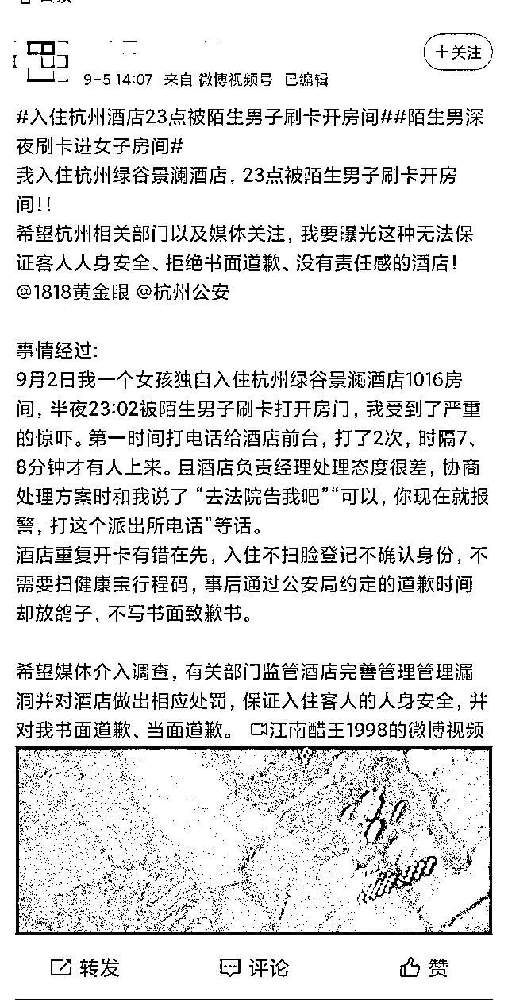
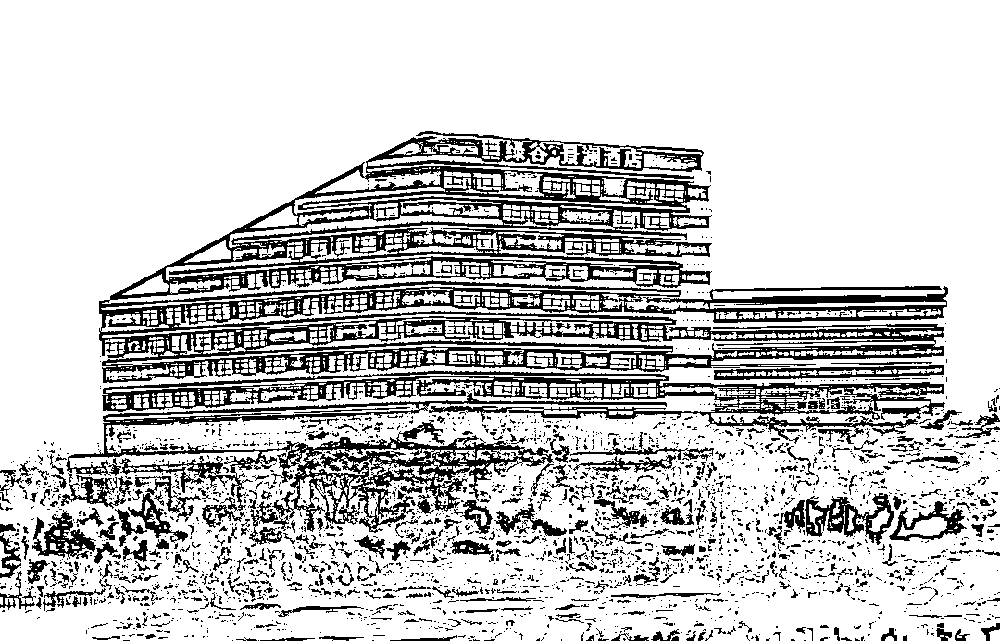
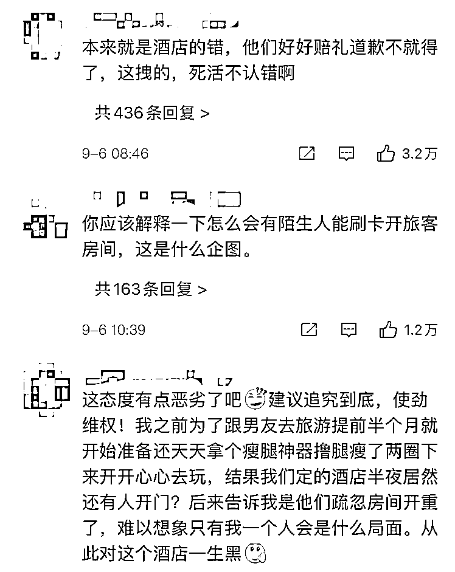
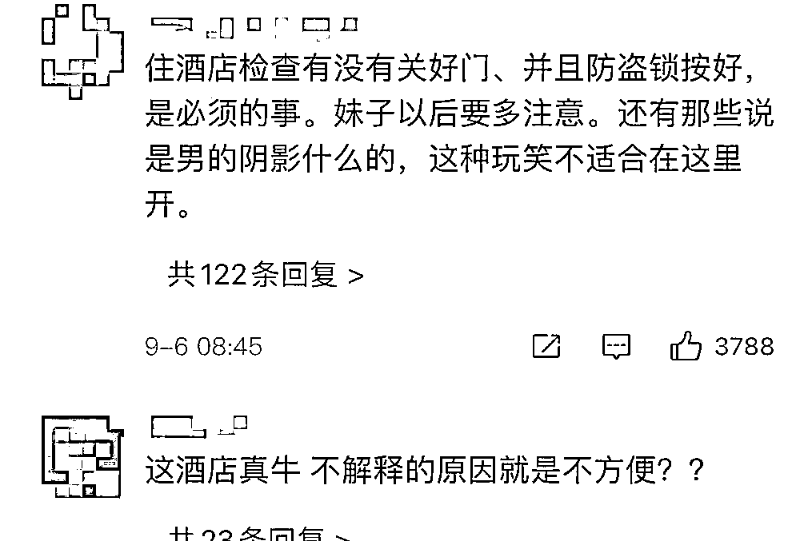

# 女子入住酒店深夜遭陌生男刷卡进入

> 原文：[`mp.weixin.qq.com/s?__biz=MzIyMDYwMTk0Mw==&mid=2247520351&idx=4&sn=6be4470bb37d553605a6f9803024a784&chksm=97cb5b67a0bcd271267fb4ccd15b42ddf9ec7585f732a3efcf688e7105ed718415ebdaa7bf43&scene=27#wechat_redirect`](http://mp.weixin.qq.com/s?__biz=MzIyMDYwMTk0Mw==&mid=2247520351&idx=4&sn=6be4470bb37d553605a6f9803024a784&chksm=97cb5b67a0bcd271267fb4ccd15b42ddf9ec7585f732a3efcf688e7105ed718415ebdaa7bf43&scene=27#wechat_redirect)

[`v.qq.com/iframe/preview.html?width=500&height=375&auto=0&vid=q3273gp4pi2`](https://v.qq.com/iframe/preview.html?width=500&height=375&auto=0&vid=q3273gp4pi2)

近日，一名女子在微博表示其 9 月 2 日独自一人入住杭州绿谷景澜酒店。**当晚 23 点左右，她的房间被一名陌生男子刷卡打开。**

**（图源：该女子微博截图）**

“我受到了严重的惊吓，第一时间打电话给酒店前台，打了 2 次，时隔 7、8 分钟才有人上来。且酒店负责经理处理态度很差，**协商处理方案时和我说了‘去法院告我吧’‘可以，你现在就报警，打这个派出所电话’等话。”**

事发后，该女子表示第一时间联系了酒店工作人员，并于 3 日凌晨向当地九堡派出所报警处理。

对于男子可以用房卡打开房门的原因，酒店方给她的解释为，**给男子的房卡是****前台实习生所开**，前一天 1016 室房间的房客退房时把房卡带走，第二天又拿着房卡说要续住，酒店激活了房卡，便发生了“深夜刷卡进入房间”事件。

**杭州绿谷景澜酒店。**

当事人还称，她入住酒店开卡时，并没有进行人脸识别，酒店方管理有漏洞。在发生此事后工作人员多次推脱，让当事人“得饶人处且饶人”，在去派出所调解时缺席，并且拒绝书面道歉。

据沸点视频报道，9 月 6 日上午，酒店方回应该事件，表示不方便解释，已交由公安处理。

截至今天上午 10 点，据东方网·纵相新闻报道，该女子与酒店方就此事进行调解。

不少网友认为，酒店方在出现问题后，解决问题的态度有问题。也有不少网友表示遇到过类似的事情。

对于这样的事情，

你怎么看呢？

来源：潇湘晨报综合东方网·纵相新闻、武汉晨报、网友评论等

灰产圈在线客服

← 向右滑动与灰产圈互动交流 →

