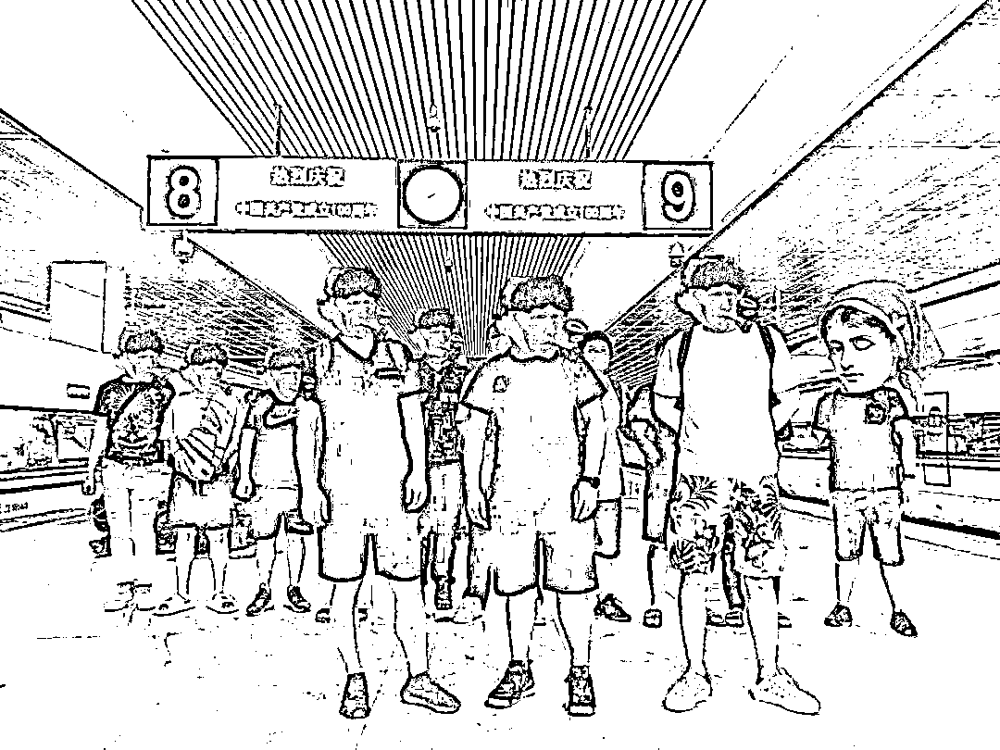
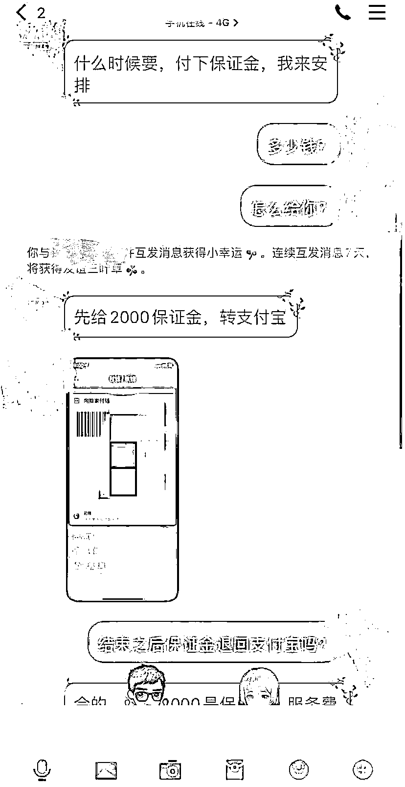
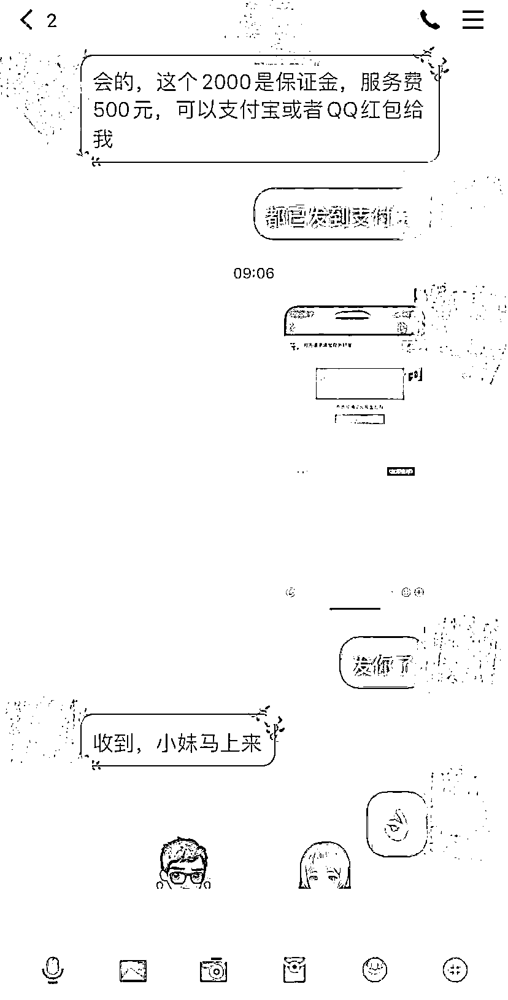
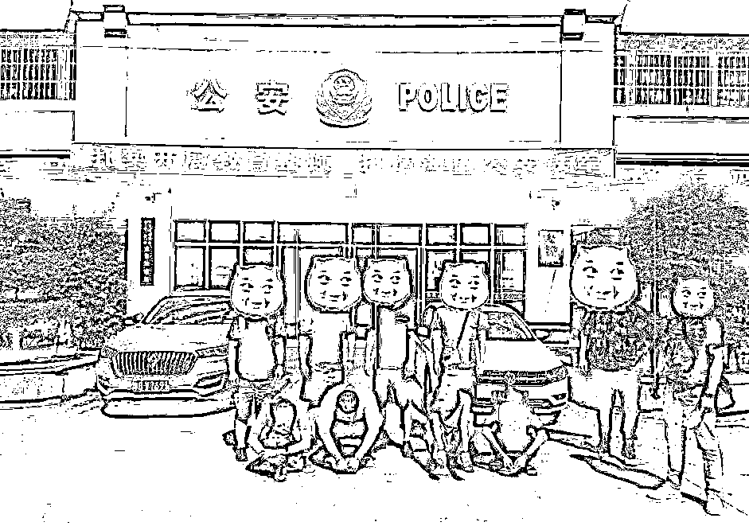

# 局中局，案中案，招嫖诈骗案背后还隐藏着“洗钱团伙”！

> 原文：[`mp.weixin.qq.com/s?__biz=MzIyMDYwMTk0Mw==&mid=2247520393&idx=3&sn=315aa7ab828f33380e2e5dc828375c92&chksm=97cb5bb1a0bcd2a760038c21116d56dc73e211edb140e1559cdde8cc6e0a27b4de178468271e&scene=27#wechat_redirect`](http://mp.weixin.qq.com/s?__biz=MzIyMDYwMTk0Mw==&mid=2247520393&idx=3&sn=315aa7ab828f33380e2e5dc828375c92&chksm=97cb5bb1a0bcd2a760038c21116d56dc73e211edb140e1559cdde8cc6e0a27b4de178468271e&scene=27#wechat_redirect)

众所周知， 

**卖淫嫖娼**属于违法行为，

可是有人偏偏鬼迷心窍，

竟然相信**网上色情小广告**，

结果悲剧了……

你也这样就结束了？

这其实是个**局中局**，案中案，

招嫖诈骗案背后还隐藏着**“洗钱团伙”**

日前，常州警方破获一起电信网络诈骗**“案中案”**，成功捣毁以符某为首的帮助诈骗集团**“洗钱”**的犯罪团伙，抓获犯罪嫌疑人**5**人，涉案金额达**30 余万元**。

案件回顾

今年 6 月，常州警方接到群众赵某报案称，自己在网上招嫖被人骗了**1 万余元**。对方以介绍**“小姐”**为由，向赵某收取服务费，后赵某决定放弃服务要求退款时，对方则以需要交保证金为由多次让其转账，直到赵某发现异常时，已被诈骗共计**15000 余元**。

民警迅速对涉案人员进行分析研判、顺线追踪，确定了一支**有领导、有分工**的“洗钱”犯罪团伙，并通过进一步侦查，逐渐查清了这个团伙的活动轨迹、组织结构和成员身份信息，随后组织警力辗转多地，通过连续多日伏击守候，于 7 月 20 日抓获犯罪嫌疑人之一唐某。经过依法审讯，民警获得了其他涉案人员关键线索，迅速将案件另外 4 名犯罪嫌疑人抓捕到案。

经审讯，**5 名犯罪嫌疑人**以符某为首，通过**接单转账**的形式，参与洗钱的犯罪事实供认不讳。目前已**串案 3 起**，涉案价值**30 余万元**。

据犯罪嫌疑人符某交代，其组建了多个社交群。唐某是他的**“下级”**，负责拉其他**“操作手”**进群接单转移资金，扣除自己的**“佣金”**后再次通过多种形式，将涉案**资金汇聚转账**给**“上级”**符某。

提醒

首先**网上招嫖行为**本身就是**违法**，一定要洁身自好。

其次在向**陌生人转账汇款**时，一定要多思考，多警惕，以防上当受骗。

来源：常州网警、江苏网警

← 向右滑动与灰产圈互动交流 →

