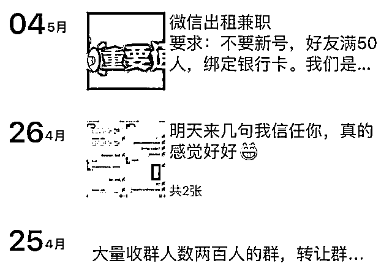
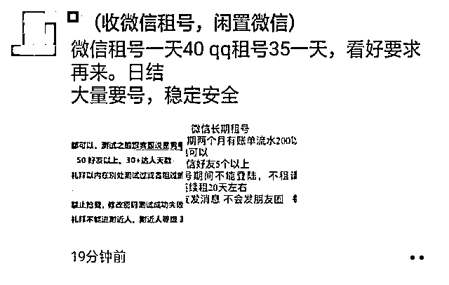
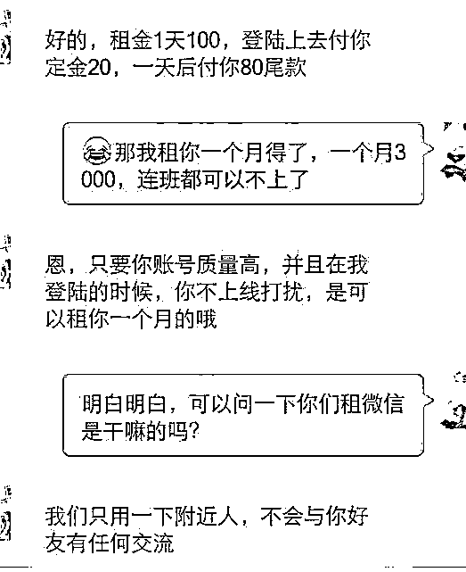
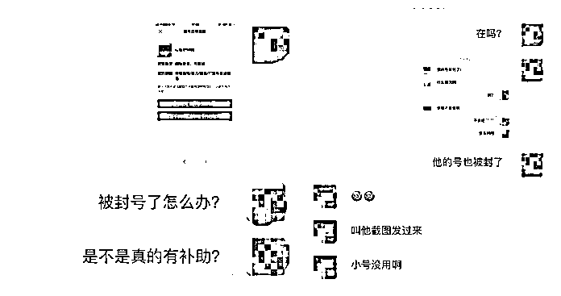

# 出租、出售 QQ、微信等个人社交账号，在校学生摊上事了……

> 原文：[`mp.weixin.qq.com/s?__biz=MzIyMDYwMTk0Mw==&mid=2247520393&idx=4&sn=46cb46021e41e40a6d48a2d28b868f00&chksm=97cb5bb1a0bcd2a7dc222bf711f59d512973007fb02aa867290ee3caf9f45d9043ffa7983325&scene=27#wechat_redirect`](http://mp.weixin.qq.com/s?__biz=MzIyMDYwMTk0Mw==&mid=2247520393&idx=4&sn=46cb46021e41e40a6d48a2d28b868f00&chksm=97cb5bb1a0bcd2a7dc222bf711f59d512973007fb02aa867290ee3caf9f45d9043ffa7983325&scene=27#wechat_redirect)

同学们

你是否曾经在微博、朋友圈

短视频网站等等地方见过以下信息？

  收号人承诺：租用的微信账号只用于点赞、投票，不会发消息、朋友圈，不会与好友产生任何交流，对账号无任何副作用。想想这个月游戏“氪金”导致生活费有点紧张、心仪的衣服还差点钱才能买……你是不是也动过出租自己闲置 QQ、微信号的念头？

但其实，出租、出售自己的微信号、支付宝账号、QQ 号，本身就是个陷阱，既然每个人都可以用自己的身份开户，这些人却千方百计地想租（买）到你的实名账号，怎么可能只是用来投票、点赞那么简单，下面我们通过真实案例了解一下这背后的真相……**案例**近期，桂林网安部门在工作中发现一批涉及网络电信诈骗的 QQ、微信号，其中多名涉案人员为未成年在校学生。8 月 17 日，桂林市公安局象山分局办案民警将涉案人员黄某抓获归案。经审讯，黄某如实供述了自己出租微信号给他人用于实施电信诈骗违法犯罪活动的犯罪事实。其表示，虽然知道出租微信号是违法行为，严重的可能会涉嫌犯罪，但抱着“以为不要紧又能赚点钱”的侥幸心理，为了每天 120 元的好处费，还是将其本人实名注册的微信号出租给他人使用。目前，16 岁的黄某因涉嫌帮助信息犯罪活动罪已被象山警方取保候审。除将自己的 QQ、微信号码租借给他人，赚取租借费用外，一些同学还收集或介绍他人出租微信号，从中赚取差价获利。资源籍学生小刘以每天 110 元的价格在网上出租微信号赚钱，同学小崔与其聊天得知后，以每天 30 元的价格将自己实名注册的微信号租给小刘，获利 90 元。见果真可以赚到钱，小崔萌生了自己单干的想法，遂让小刘将其拉入到租用微信号的 QQ 群内，并在该群内认识了租号人“aa”。出租微信号一段时间后，为获得更大利润，小崔收集其同学、朋友等十余人的微信号，在“aa”的介绍下在多个 QQ 群内进行出租，连同自己的微信号一共非法获利 11840 元，其行为触犯了《中华人民共和国刑法》第二百八十七条之规定，涉嫌帮助信息网络犯罪活动罪。 **危害性** 学生买卖 QQ、微信号等个人社交账号的行为为何日益泛滥？原因在于很多人抱着“放着也是放着，手头紧，不如赚点零花”的想法，以及对出售账号所引发法的律风险意识淡薄，甚至有人明知将账号出租、售卖给不法分子用于违法犯罪，仍然认为只要自己没有直接参与就与己无关。这种侥幸心理往往会引发一系列未知的风险。**1****、违法违规，影响个人前途。**出售个人账户涉及违法犯罪行为，公安机关将依法追究其刑事、行政责任，个人违法信息也将会被公安机关记入违法犯罪嫌疑人信息库和个人征信平台，影响到考学、征兵、考公务员等个人前途。 **2、****隐私泄露。**一旦同意对方登录你的帐号，个人隐私信息由此泄露，一些敏感内容甚至会被大幅传播或放在线上黑市出售。**3****、****仿冒欺诈、资产损失。**帐号出租后骗子会冒用你的身份，向好友借钱，造成你的好友被骗。   **4****、****骚扰好友，导致名誉受损。**租号人用租来、买来的帐号完成垃圾营销、招嫖和散播不良信息等恶意行为，直接损害你和你朋友的切身利益，导致自己名誉受损，同时也危害网络环境。**法律依据**

在校学生出租、出售个人社交账号主要可能涉及以下罪名：

1、**收购、转卖账号，涉嫌侵犯公民个人信息罪。**社交账号为实名注册，且绑定了手机号、银行卡等各类个人信息。收购、转卖含有可能影响账号注册人人身、财产安全信息的个人社交账号达到一定数量将触犯法律，涉嫌侵犯公民个人信息罪。根据《刑法修正案（九）》第 17 条规定：“违反国家有关规定，向他人出售或者提供公民个人信息，情节严重的，处三年以下有期徒刑或者拘役，并处或者单处罚金”。 

**2、出租社交账号沦为电信诈骗等违法活动的帮凶，涉嫌帮助信息网络犯罪活动罪。**《刑法修正案(九)》增设帮助信息网络犯罪活动罪，针对明知他人利用信息网络实施犯罪，为其犯罪提供互联网接入、服务器托管、网络存储、通讯传输等技术支持，或者提供广告推广、支付结算等帮助的行为独立入罪。

 

有“租号”需求的不是违法犯罪团伙，就是想打“擦边球”的灰产组织。他们在网上发布虚假广告，美其名曰是“短期租借”，其实就是变相盗号，哄骗用户自己交出账号、密码，再理所当然地将这些账号挪作他用。而向这些人开放账号使用权的结果就是，账号后期可能会被冻结、盗用，直接损害自身及亲友的切身利益，或在不知情的情况下参与到网络黑灰产的运作中。

广大在校学生要加强防范意识，妥善保管好自己的微信号、支付宝账号、QQ 号等社交软件账号信息。切勿因为贪图小利，赔上原本精彩的人生！

**法条链接**《刑法修正案（九）》增设帮助信息网络犯罪活动罪，针对明知他人利用信息网络实施犯罪，为其犯罪提供互联网接入、服务器托管、网络存储、通讯传输等技术支持，或者提供广告推广、支付结算等帮助的行为独立入罪。第二百八十七条之二第一款规定，明知他人利用信息网络实施犯罪，为其犯罪提供互联网接入、服务器托管、网络存储、通讯传输等技术支持，或者提供广告推广、支付结算等帮助，情节严重的，处三年以下有期徒刑或者拘役，并处或者单处罚金。

来源：桂林警讯、北京反诈

← 向右滑动与灰产圈互动交流 →

