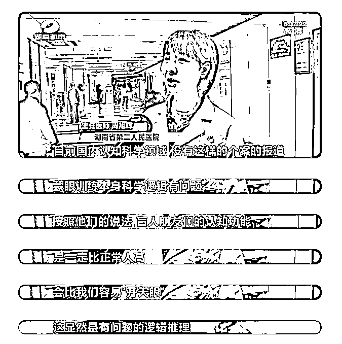

# 荒唐！女子花 5 万学魔法、招鬼、动物通灵？监管部门发声了

> 原文：[`mp.weixin.qq.com/s?__biz=MzIyMDYwMTk0Mw==&mid=2247520439&idx=1&sn=6fc6c33d74ae1e511f3e089fe2910447&chksm=97cb5b8fa0bcd29903aaab3c3a45b0502f4c29f24e5251859243d9d698b5d2dd06ddefe47c21&scene=27#wechat_redirect`](http://mp.weixin.qq.com/s?__biz=MzIyMDYwMTk0Mw==&mid=2247520439&idx=1&sn=6fc6c33d74ae1e511f3e089fe2910447&chksm=97cb5b8fa0bcd29903aaab3c3a45b0502f4c29f24e5251859243d9d698b5d2dd06ddefe47c21&scene=27#wechat_redirect)

魔法、通灵、召唤鬼魂……这类词语经常出现在科幻作品或者游戏中。但现实中如果有人告诉你可以提供相关培训，你会相信吗？ 

最近，就有一家名为“魔力秘境”的培训机构被媒体曝光。

能和动物对话，课程内容曝光

据报道，江苏刘小姐平时对占卜、魔法这类东西比较感兴趣。今年年初，她在网上搜索到了一个名叫"魔力秘境"的微信公众号。

“我从里面就了解到，他们有非常多的课程。”刘小姐告诉记者，**这些课程包括魔法、通灵、萨满、风水等等。**

培训视频显示，"魔力秘境"的负责人之一周某宣称，可以通过魔法召唤鬼魂。

“第一种是来到星光界，就是你在镜子里才能看到它。第二种鬼能给你站到板子上来，它能站上来。”周某表示，能不能做到这一点，就要看学生的“造化”。

此外，**"魔力秘境"还邀请了所谓的境外专家，在线给学员传授动物通灵术**。

所谓动物沟通，就是上课时通过动物的照片，体验动物的信息——高不高兴，居住在什么环境，血液里有什么东西等等。

这些课程的价格都不便宜，此外，"魔力秘境"的网店还销售各类魔法道具，**一小瓶圣水的标价，最高就要 498 元**。

刘小姐说，**学习了 8 个月，她在课程和道具上花费了 5 万多元**，“比如像动物沟通的课程，四个小时收费就是三千元。”

事实上，“魔力秘境”培训课程背后的公司，叫做南京圣五芒星文化传播公司，其微信公众号的运营主体则是南京梦哲客珠宝公司，这两家公司**在工商登记的联系方式不是关机就是空号，而且并没有在注册地址实际办公。**

9 月 3 日下午，根据刘小姐提供的线索，记者终于在南京市长江路找到了"魔力秘境"的实际办公点。面对刘小姐质疑魔法课程的诉求，工作人员称有没有效果因人而异。

当记者提出所谓的魔法、通灵根本无法证实时，工作人员如此答复：“比如通去世的家人，有时候我们去通，可以直接通到去世家人之前的信息。这个是切切实实存在的。”这名工作人员还特意强调：“**你没有办法证伪。**”

培训内容并未备案

市场部门将移交公安处理

对于“魔力秘境”所谓的魔法通灵课程，行政部门有没有什么说法呢？9 月 3 日上午，记者来到南京市玄武区人社局了解情况。

工作人员查询后表示，“魔力秘境”背后的圣五芒星公司开展培训业务，并未在人社部门备案，其培训的内容也不可能通过备案。

这名工作人员表示，由于没有备案，因此这家公司不在他们的监管范围内，应当由市场监管部门负责监管。

南京玄武区市场监管局工作人员告诉记者，他们 8 月底已经接到了刘小姐关于"魔力秘境"虚假宣传的投诉。

市场监管局工作人员表示，经过初步调查他们认为，**“魔力秘境”属于搞封建迷信，涉嫌刑事犯罪，**超出了市场监管部门的管辖范围，“我们正在把这个投诉单子，按照正常的手续向公安机关移交。”

同时，刘小姐也已经向南京警方报案，并通过网信部门举报了"魔灵秘境"。

网上兜售通灵课程并非个例

律师表示可能涉嫌诈骗

其实，在网上兜售所谓的魔法通灵课程及道具并非个例。在网上购物平台输入“通灵术”等关键词，可以搜索到大量相关商品，除了打擦边球的冥想、占卜，很多网店直接宣称自己的魔法通灵课程可以读心、跟动物沟通、开第三眼等等。

对此律师表示：

这些商品和服务都是我国法律所不允许的，如果消费者不慎购买了此类商品，完全可以解除合同并要求退费；

**经营所谓的魔法通灵课程还可能涉嫌诈骗犯罪，因为经营者的行为本质上是通过虚构事实获取消费者的信任，并借此骗取钱财。**

还有很多奇葩课程

其实除了这种魔法通灵课程，也有很多奇葩的课程令人大跌眼镜。比如岳阳一家“培训机构”自称通过培训能够给孩子“开天眼”，这门“天赋课程”要价两万四，机构推广会现场上，一名 7 岁的女孩被蒙上眼睛后，主持人让台下的家长在白纸上写上文字，递给台上的女孩，女孩首先拿到白纸，在被蒙住的眼睛前晃了晃，然后贴近鼻子，闻了闻，就瞬间说出了白纸上内容。

湖南省脑科医院主任医师却立马“打脸”。

当然也有些不神神叨叨，但写满了“智商税”的奇葩课程，比如高端名媛培训学校，两天的体验课 8800 元。在这里你能找到“速成名媛”的方法，两天的体验课中，戴着礼帽吃下午茶的学员，在学习完餐桌礼仪后，被带到人均 500 多元的法餐厅就餐。一盘盘精致的食物摆上餐桌，学员大眼瞪小眼，偷瞄着老师如何拿起刀叉，吃完后刀叉该摆成什么角度，妄想在三五天时间内，便将自己“打扮”成品貌俱佳、气质高雅的名媛女神。

央视网：在交智商税

而关于这些千奇百怪的课程，央视网也做了评论： 

“黑盐减肥魔咒”“萨满恋爱脑测试”左眼“看见鬼”……这些骇人听闻的魔法“通灵”培训，明眼人一看就知道是披着“洋外衣”的迷信活动。**花钱学这个，就是在交智商税。**

一些商家以“怪力乱神”为噱头，还请来所谓的境外专家线上站台背书，课程收费动辄成千上万元，利用消费者的迷信心理牟取暴利。**说白了，这就是在诈骗。**

然而，迷信之所以有市场，就是“傻子”遇到骗子的结果：人们对科学认知的短板，让利用科学做法的新神秘主义泛滥。我们能够理解那些深信不疑的人想通过迷信活动获得心灵的慰藉，但坚决反对传播任何非科学理念。消费者应当少些盲从盲信，与其靠“通灵”达成目的，不如依靠人的主观能动性。

如果你对所购买的商品有质疑，或发现存在封建迷信虚假宣传等违法行为，可拨打 12345 投诉举报。

要是觉得事情已经邪乎到一定地步，不仅钱财受损，身心也受伤，请直接报警。

**你不信我不信，没有买卖没伤害！**

对于靠迷信来赚钱的行为，文明社会必须零容忍！

来源：中国经营报综合自江苏广电、江苏新闻、央视网、荔枝新闻、中国青年报、河南商报、中国新闻网等

← 向右滑动与灰产圈互动交流 →

