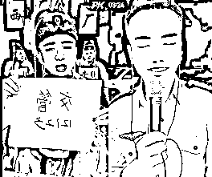

# 交警小哥也来宣传 APP，"西厂公公"忙坏了

> 原文：[`mp.weixin.qq.com/s?__biz=MzIyMDYwMTk0Mw==&mid=2247520439&idx=2&sn=23ab5b73fc4ac3f3335c5a3783cc1ef8&chksm=97cb5b8fa0bcd299cad251179fde3a2cddb67f659492e010a6306e3b72238c2ccd1fbb7f9be2&scene=27#wechat_redirect`](http://mp.weixin.qq.com/s?__biz=MzIyMDYwMTk0Mw==&mid=2247520439&idx=2&sn=23ab5b73fc4ac3f3335c5a3783cc1ef8&chksm=97cb5b8fa0bcd299cad251179fde3a2cddb67f659492e010a6306e3b72238c2ccd1fbb7f9be2&scene=27#wechat_redirect)

梅开二度，来“新活”了。

刚忙活完宣传反诈 APP 的“西厂公公”昨天（6 日）又连上交警小哥了，开始了新一轮交管 APP 的宣传，“我是西厂正规军，喝车不开酒，开酒不喝车（口误），请下载交管 12123！”

最近，接到反诈民警老陈的委托，“西厂厂公雨化田”一直都在为反诈骗做宣传。昨天他照旧在直播平台连麦，还高高兴兴地晃来晃去，继续忙活着宣传反诈 APP 的事。

一开始连上麦的时候，“公公”又是瞬间笑容凝固：咋又是一个警察呢？

但是他很快驾轻就熟地向 j 警察敬了个礼，好家伙，这程序我熟啊。

“警官，我现在向你汇报一下工作，这两天正在紧锣密鼓地宣传反诈 APP，他们不用再担心爸爸妈妈们了，他们的手机已经被保护起来了。”

但对面其实是个在西藏驻守边防的交警小哥，**“在宣传反诈 APP 时，同样也要宣传交管 APP，我是一名交通警察。”**原来交警小哥也是看了反诈民警老陈的视频找来的。

这可把公公逗笑了，“又接活啦？”然后马上掏出手机开始做功课，“你等会儿啊，我现在马上下载！”“好了，这回大家来新活了，那个活（宣传反诈 APP）终于可以开始歇会儿了。”

反诈民警老陈：你只是短暂地爱了我一下吗？

“公公”还挺贴心，多问了一句，“我来宣传这个没事吧？”交警小张连连摆手，“没事没事，我们都报备过了。”

这下公公开心坏了，笑得合不拢嘴，“太好了兄弟们，我终于接到了组织上给我发的任务了。”

他赶紧让助理满房间找纸，现做广告宣传板，嗓门都高亢起来，“报告领导，请放心，交管 12123，必须完成任务，西厂保证完成任务！”

这头刚断开，“公公”马上就连上下一位主播“开工”了。

一开场就是喜剧人模式，对面主播问：“听说你最近在弄那个反诈 APP 呀？”

公公坐直了，一本正经：“刚受到组织的委派，那个活儿暂时先歇一歇，现在，新活！”

歘一下，他掏出那张自制宣传板，“交管 12123，可以下载。”一激动还把交警小张交代的宣传语说错了，说成了“喝车不开酒，开酒不喝车”。

据网友不完全统计，**“公公”后来一共直播了 5.5 个小时，向 90 位左右的主播宣传了交管 APP。**

编外人员被反复“收编”，“公公”如此尽忠职守逗笑众多网友，大家调侃道：国家欠你一个“公务员”！

与此同时，和“公公”原来同属一个“反诈骗宣传小组”的“编外人员”也在不断扩大，到后面已经演变成了“饱和式”宣传。

大家确认过眼神，掏出来的都是同一个图标——国家反诈中心 APP！

但最好笑的，还是反诈民警老陈的两个得力“干将”，“女装大佬”和“西厂公公”在随机直播 PK 里碰上了！

“女装大佬”可别提多激动，难得有人来比拼一下业务水平。只见他先柔声说“我这有个事”，然后一把变声器关了，声如洪钟举着反诈二维码喊道“请下载反诈 app！！警惕男扮女装诈骗杀猪盘诈骗！！”

这架势，“西厂公公”都得服气！

不光把活分摊给了各个主播，民警老陈这两天也还坚守在直播平台继续宣传反诈 APP。最近他和艺人黄圣依杨子夫妇连上麦，再借用明星效应继续加大宣传也成为了热议话题。

陈警官的短视频平台粉丝暴涨至 360 万。截止发稿前，**在 iOS 系统的 app store 上免费 app 下载排行榜上，“国家反诈中心 APP”已经位列第一。值得一提的是，“交管 12123”也紧随其后。**

但陈警官表示，这是全国干警努力的成绩，在人们看不到的地方，各地还有很多反诈民警们顶着烈日走街串巷宣传反诈 APP。希望网友们不要过多关注他本人，更多关注反诈事业，有空多宣传反诈事业，一起实现“天下无诈”。

来源：观察者网

← 向右滑动与灰产圈互动交流 →

